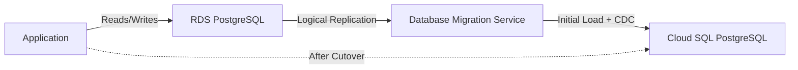

# How to Migrate Amazon RDS PostgreSQL to Cloud SQL Using Database Migration Service

Author: [nawazdhandala](https://www.github.com/nawazdhandala)

Tags: GCP, Cloud SQL, PostgreSQL, Database Migration, AWS RDS

Description: Migrate your Amazon RDS PostgreSQL databases to Google Cloud SQL using the Database Migration Service for continuous replication and minimal downtime.

---

Database migrations are nerve-wracking. Your data is your most valuable asset, and any mistake during migration means potential data loss or extended downtime. Google Cloud's Database Migration Service (DMS) makes this process significantly safer by providing continuous replication from RDS PostgreSQL to Cloud SQL, allowing you to cut over when you are ready.

In this post, I will walk through the entire migration process from preparation to cutover, including the gotchas that documentation does not always cover.

## How Database Migration Service Works

DMS uses PostgreSQL logical replication under the hood. It creates a replication slot on your RDS source, performs an initial full data dump, and then continuously streams changes (CDC - Change Data Capture) until you perform the cutover.



## Prerequisites on the RDS Side

Before starting, you need to configure your RDS instance for logical replication:

```sql
-- Check current setting (needs to be 'logical')
SHOW wal_level;

-- Check that max_replication_slots is sufficient
SHOW max_replication_slots;

-- Check max_wal_senders
SHOW max_wal_senders;
```

If wal_level is not set to logical, update the RDS parameter group:

```hcl
# rds-params.tf
# Update RDS parameter group for logical replication

resource "aws_db_parameter_group" "migration_ready" {
  family = "postgres15"
  name   = "migration-ready-postgres15"

  parameter {
    name         = "rds.logical_replication"
    value        = "1"
    apply_method = "pending-reboot"
  }

  parameter {
    name         = "max_replication_slots"
    value        = "10"
    apply_method = "pending-reboot"
  }

  parameter {
    name         = "max_wal_senders"
    value        = "10"
    apply_method = "pending-reboot"
  }

  parameter {
    name         = "wal_sender_timeout"
    value        = "0"
    apply_method = "pending-reboot"
  }
}
```

After applying the parameter group, you need to reboot the RDS instance. Plan this during a maintenance window.

## Setting Up Network Connectivity

DMS needs network access from Google Cloud to your RDS instance. You have several options:

**Option 1: VPN between AWS and GCP (recommended for production)**

```hcl
# vpn-connectivity.tf
# VPN tunnel between GCP and AWS for database migration

resource "google_compute_vpn_gateway" "migration_vpn" {
  name    = "migration-vpn-gateway"
  network = google_compute_network.vpc.id
  project = var.project_id
  region  = var.region
}

resource "google_compute_vpn_tunnel" "to_aws" {
  name                    = "vpn-to-aws"
  peer_ip                 = var.aws_vpn_gateway_ip
  shared_secret           = var.vpn_shared_secret
  target_vpn_gateway      = google_compute_vpn_gateway.migration_vpn.id
  local_traffic_selector  = ["10.0.0.0/8"]
  remote_traffic_selector = ["172.16.0.0/12"]
  project                 = var.project_id
  region                  = var.region
}
```

**Option 2: Public IP with SSL (simpler but less secure)**

Make sure your RDS security group allows connections from the DMS IP range.

## Creating the Cloud SQL Destination

Set up the destination Cloud SQL instance:

```hcl
# cloud-sql.tf
# Destination Cloud SQL PostgreSQL instance

resource "google_sql_database_instance" "destination" {
  name             = "production-postgres-migrated"
  database_version = "POSTGRES_15"
  region           = var.region
  project          = var.project_id

  settings {
    # Match or exceed your RDS instance size
    tier = "db-custom-4-16384"  # 4 vCPU, 16 GB RAM

    disk_size     = 100
    disk_type     = "PD_SSD"
    disk_autoresize = true

    # Enable high availability
    availability_type = "REGIONAL"

    backup_configuration {
      enabled                        = true
      point_in_time_recovery_enabled = true
      start_time                     = "03:00"
      transaction_log_retention_days = 7

      backup_retention_settings {
        retained_backups = 30
      }
    }

    ip_configuration {
      # Use private IP for production
      ipv4_enabled    = false
      private_network = google_compute_network.vpc.id
      require_ssl     = true
    }

    database_flags {
      name  = "max_connections"
      value = "200"
    }

    database_flags {
      name  = "shared_buffers"
      value = "4096"  # In 8KB pages = 32GB
    }

    maintenance_window {
      day          = 7  # Sunday
      hour         = 3
      update_track = "stable"
    }
  }

  deletion_protection = true
}
```

## Creating the Migration Job

Now create the DMS migration job using gcloud:

```bash
# Create a connection profile for the RDS source
gcloud database-migration connection-profiles create \
  rds-source-profile \
  --region=us-central1 \
  --display-name="RDS PostgreSQL Source" \
  --provider=RDS \
  --host=mydb.cluster-abc123.us-east-1.rds.amazonaws.com \
  --port=5432 \
  --username=migration_user \
  --password="$(gcloud secrets versions access latest --secret=rds-password)" \
  --database=mydb \
  --ssl-type=SERVER_ONLY

# Create a connection profile for Cloud SQL destination
gcloud database-migration connection-profiles create \
  cloudsql-destination-profile \
  --region=us-central1 \
  --display-name="Cloud SQL PostgreSQL Destination" \
  --provider=CLOUDSQL \
  --cloudsql-instance=production-postgres-migrated

# Create the migration job
gcloud database-migration migration-jobs create \
  rds-to-cloudsql-migration \
  --region=us-central1 \
  --display-name="Production PostgreSQL Migration" \
  --source=rds-source-profile \
  --destination=cloudsql-destination-profile \
  --type=CONTINUOUS \
  --dump-type=LOGICAL
```

## Monitoring the Migration

Track the migration progress and replication lag:

```python
# monitor_migration.py
# Monitors DMS migration job progress and replication lag
from google.cloud import clouddms_v1
import time

def monitor_migration(project_id, region, job_name):
    """Monitor the database migration job progress."""
    client = clouddms_v1.DataMigrationServiceClient()
    name = (
        f"projects/{project_id}/locations/{region}"
        f"/migrationJobs/{job_name}"
    )

    while True:
        job = client.get_migration_job(request={"name": name})

        print(f"Job: {job.display_name}")
        print(f"Phase: {job.phase}")
        print(f"State: {job.state}")

        if job.duration:
            print(f"Duration: {job.duration}")

        # Check for errors
        if job.error:
            print(f"ERROR: {job.error.message}")

        # Show replication lag if in CDC phase
        if job.phase == clouddms_v1.MigrationJob.Phase.CDC:
            print(f"Replication lag: monitoring...")

        print("---")

        if job.state in (
            clouddms_v1.MigrationJob.State.COMPLETED,
            clouddms_v1.MigrationJob.State.FAILED,
        ):
            break

        time.sleep(30)


if __name__ == "__main__":
    monitor_migration(
        "my-gcp-project",
        "us-central1",
        "rds-to-cloudsql-migration"
    )
```

## Pre-Cutover Validation

Before cutting over, validate the data:

```sql
-- Run on both RDS and Cloud SQL, compare results

-- Check row counts for all tables
SELECT schemaname, relname, n_live_tup
FROM pg_stat_user_tables
ORDER BY n_live_tup DESC;

-- Check sequence values
SELECT sequence_name, last_value
FROM information_schema.sequences s
JOIN pg_sequences ps ON s.sequence_name = ps.sequencename
ORDER BY sequence_name;

-- Verify schema objects
SELECT table_name, table_type
FROM information_schema.tables
WHERE table_schema = 'public'
ORDER BY table_name;

-- Check indexes
SELECT indexname, indexdef
FROM pg_indexes
WHERE schemaname = 'public'
ORDER BY indexname;

-- Check constraints
SELECT conname, contype, conrelid::regclass
FROM pg_constraint
WHERE connamespace = 'public'::regnamespace
ORDER BY conname;
```

Run a Python script to automate the comparison:

```python
# validate_migration.py
# Compares source and destination databases for consistency
import psycopg2
import json

def compare_databases(source_config, dest_config):
    """Compare source RDS and destination Cloud SQL databases."""
    source_conn = psycopg2.connect(**source_config)
    dest_conn = psycopg2.connect(**dest_config)

    results = {}

    # Compare table row counts
    query = """
        SELECT schemaname || '.' || relname AS table_name,
               n_live_tup AS row_count
        FROM pg_stat_user_tables
        ORDER BY table_name
    """

    source_counts = execute_query(source_conn, query)
    dest_counts = execute_query(dest_conn, query)

    mismatches = []
    for table, count in source_counts.items():
        dest_count = dest_counts.get(table, 0)
        if count != dest_count:
            mismatches.append({
                "table": table,
                "source": count,
                "destination": dest_count,
                "difference": count - dest_count,
            })

    results["row_count_mismatches"] = mismatches
    results["tables_checked"] = len(source_counts)
    results["all_match"] = len(mismatches) == 0

    source_conn.close()
    dest_conn.close()

    return results


def execute_query(conn, query):
    """Execute query and return dict of results."""
    cursor = conn.cursor()
    cursor.execute(query)
    return {row[0]: row[1] for row in cursor.fetchall()}
```

## Performing the Cutover

When you are ready to cut over:

```bash
# Step 1: Put the application in maintenance mode
# (stop writes to the source database)

# Step 2: Wait for replication lag to reach zero
gcloud database-migration migration-jobs describe \
  rds-to-cloudsql-migration \
  --region=us-central1

# Step 3: Promote the migration job (stops replication)
gcloud database-migration migration-jobs promote \
  rds-to-cloudsql-migration \
  --region=us-central1

# Step 4: Update application connection strings to point to Cloud SQL

# Step 5: Bring the application out of maintenance mode
```

## Post-Migration Tasks

After cutover, do not forget these steps:

```sql
-- Update statistics on Cloud SQL
ANALYZE;

-- Verify all sequences are correct
-- (DMS sometimes does not sync sequence values perfectly)
SELECT setval('users_id_seq', (SELECT MAX(id) FROM users));

-- Re-create any custom extensions if needed
CREATE EXTENSION IF NOT EXISTS pg_trgm;
CREATE EXTENSION IF NOT EXISTS postgis;
```

## Wrapping Up

Migrating RDS PostgreSQL to Cloud SQL with DMS is the lowest-risk approach available. The continuous replication means your Cloud SQL instance stays in sync with RDS until you are ready to cut over, and if anything goes wrong during cutover, you can fall back to RDS quickly. The key steps are getting logical replication configured on RDS, ensuring network connectivity, running thorough validation before cutover, and having a clear rollback plan. Take the time to do a practice run with a staging database before attempting the production migration.
