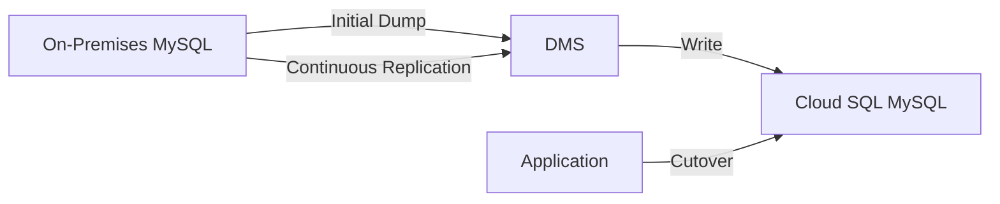

# How to Migrate an On-Premises MySQL Database to Cloud SQL Using Database Migration Service

Author: [nawazdhandala](https://www.github.com/nawazdhandala)

Tags: GCP, Cloud SQL, MySQL, Database Migration Service, DMS, Migration

Description: Step-by-step guide to migrating an on-premises MySQL database to Cloud SQL using Google's Database Migration Service for minimal downtime migrations.

---

Migrating a production MySQL database from on-premises to Cloud SQL is one of those projects that looks simple on paper but has plenty of hidden complexity. Google's Database Migration Service (DMS) makes it significantly easier by handling the heavy lifting of continuous replication, letting you do a cutover with minimal downtime. This guide walks through the entire process.

## Database Migration Service Overview

DMS is a managed service that migrates databases to Cloud SQL using continuous replication. The basic flow is:

1. Set up a source connection profile pointing to your on-premises MySQL
2. Create a destination Cloud SQL instance (or let DMS create one)
3. DMS performs an initial full dump of your source database
4. DMS continuously replicates changes from source to destination
5. When you are ready, cut over to the Cloud SQL instance



The continuous replication phase uses MySQL binary log (binlog) replication, so your source database needs binlog enabled.

## Prerequisites

### On the Source MySQL Server

Your source MySQL needs to meet these requirements:

```sql
-- Check current binlog configuration
SHOW VARIABLES LIKE 'log_bin';          -- Must be ON
SHOW VARIABLES LIKE 'binlog_format';    -- Must be ROW
SHOW VARIABLES LIKE 'binlog_row_image'; -- Should be FULL
SHOW VARIABLES LIKE 'server_id';       -- Must be non-zero
SHOW VARIABLES LIKE 'gtid_mode';       -- Recommended: ON
```

If binlog is not configured, update your `my.cnf`:

```ini
# my.cnf - Required settings for DMS migration
[mysqld]
log_bin = mysql-bin
binlog_format = ROW
binlog_row_image = FULL
server_id = 1
gtid_mode = ON
enforce_gtid_consistency = ON
expire_logs_days = 7
```

Restart MySQL after making these changes.

### Create a Migration User

Create a dedicated user for DMS with the required privileges:

```sql
-- Create a replication user for DMS
CREATE USER 'dms_user'@'%' IDENTIFIED BY 'strong-password';

-- Grant required privileges
GRANT REPLICATION SLAVE, REPLICATION CLIENT ON *.* TO 'dms_user'@'%';
GRANT SELECT ON *.* TO 'dms_user'@'%';
GRANT RELOAD ON *.* TO 'dms_user'@'%';
GRANT SHOW DATABASES ON *.* TO 'dms_user'@'%';

FLUSH PRIVILEGES;
```

### Network Connectivity

DMS needs to reach your on-premises MySQL from Google Cloud. Options include:

- **Cloud VPN** - IPsec VPN tunnel between your network and GCP
- **Cloud Interconnect** - Dedicated physical connection for high bandwidth
- **Public IP** - Direct connection over the internet (use SSL)
- **Reverse SSH tunnel** - For testing or when VPN is not an option

For production migrations, VPN or Interconnect is strongly recommended.

## Step 1: Enable the Required APIs

```bash
# Enable Database Migration Service and related APIs
gcloud services enable datamigration.googleapis.com
gcloud services enable sqladmin.googleapis.com
gcloud services enable servicenetworking.googleapis.com
```

## Step 2: Create a Source Connection Profile

The connection profile tells DMS how to connect to your source database:

```bash
# Create a source connection profile for on-premises MySQL
gcloud database-migration connection-profiles create mysql-source \
    --region=us-central1 \
    --display-name="On-Premises MySQL" \
    --provider=MYSQL \
    --host=your-mysql-server-ip \
    --port=3306 \
    --username=dms_user \
    --password=strong-password
```

If you are using SSL, add the certificate parameters:

```bash
# Create a source connection profile with SSL
gcloud database-migration connection-profiles create mysql-source \
    --region=us-central1 \
    --display-name="On-Premises MySQL (SSL)" \
    --provider=MYSQL \
    --host=your-mysql-server-ip \
    --port=3306 \
    --username=dms_user \
    --password=strong-password \
    --ssl-ca-certificate=server-ca.pem \
    --ssl-client-certificate=client-cert.pem \
    --ssl-client-key=client-key.pem
```

## Step 3: Create a Destination Connection Profile

You can either create a Cloud SQL instance first and reference it, or let DMS create one as part of the migration job.

To use an existing instance:

```bash
# Create a destination connection profile pointing to an existing Cloud SQL instance
gcloud database-migration connection-profiles create cloudsql-dest \
    --region=us-central1 \
    --display-name="Cloud SQL Destination" \
    --provider=CLOUDSQL \
    --cloudsql-instance=my-cloudsql-instance
```

## Step 4: Create the Migration Job

```bash
# Create a continuous migration job
gcloud database-migration migration-jobs create mysql-migration \
    --region=us-central1 \
    --display-name="MySQL to Cloud SQL Migration" \
    --type=CONTINUOUS \
    --source=mysql-source \
    --destination=cloudsql-dest \
    --peer-vpc=projects/my-project/global/networks/my-vpc
```

The `--type=CONTINUOUS` setting means DMS will keep replicating changes after the initial dump until you manually trigger the cutover.

## Step 5: Test and Start the Migration

Before starting, test the connection:

```bash
# Test the migration job configuration
gcloud database-migration migration-jobs verify mysql-migration \
    --region=us-central1
```

This checks connectivity, permissions, and compatibility. Fix any reported issues before proceeding.

Start the migration:

```bash
# Start the migration job
gcloud database-migration migration-jobs start mysql-migration \
    --region=us-central1
```

## Step 6: Monitor the Migration

Watch the migration progress:

```bash
# Check migration job status
gcloud database-migration migration-jobs describe mysql-migration \
    --region=us-central1 \
    --format="json(state, phase, error)"
```

The migration goes through several phases:

1. **DUMP** - Initial full dump of the source database
2. **CDC** (Change Data Capture) - Continuous replication of changes
3. **PROMOTE_IN_PROGRESS** - When you trigger the cutover
4. **COMPLETED** - Migration is done

During the CDC phase, monitor replication lag:

```bash
# Check replication lag
gcloud database-migration migration-jobs describe mysql-migration \
    --region=us-central1 \
    --format="json(dumpStatus, cdcStatus)"
```

## Step 7: Perform the Cutover

When replication lag is near zero and you are ready to switch:

1. Stop writes to the source database (put your application in maintenance mode)
2. Wait for replication lag to reach zero
3. Promote the Cloud SQL instance

```bash
# Promote the migration - this makes Cloud SQL the primary
gcloud database-migration migration-jobs promote mysql-migration \
    --region=us-central1
```

4. Update your application connection strings to point to Cloud SQL
5. Bring the application back online

## Handling Common Migration Issues

### Large Databases and Initial Dump Time

For databases over 100 GB, the initial dump can take hours. To speed it up:

- Schedule the migration during low-traffic hours
- Ensure sufficient network bandwidth (VPN or Interconnect)
- Consider using a larger Cloud SQL instance temporarily for faster writes

### Binary Log Retention

Your source must retain binary logs long enough for DMS to read them. If logs expire before DMS processes them, the migration fails:

```sql
-- Check current binlog retention
SHOW VARIABLES LIKE 'expire_logs_days';

-- Increase retention to 7 days during migration
SET GLOBAL expire_logs_days = 7;
```

### Incompatible Features

Some MySQL features do not translate directly to Cloud SQL:

- SUPER privilege operations are not available
- Some storage engines besides InnoDB may not be supported
- Events and scheduled jobs need to be recreated separately
- Custom plugins are not available in Cloud SQL

### Character Set Mismatches

Verify character sets match between source and destination:

```sql
-- Check character set on source
SELECT DEFAULT_CHARACTER_SET_NAME, DEFAULT_COLLATION_NAME
FROM INFORMATION_SCHEMA.SCHEMATA
WHERE SCHEMA_NAME = 'mydb';
```

Set the same character set on the Cloud SQL instance using database flags.

## Rollback Plan

Always have a rollback plan:

1. **Before cutover**: Simply stop the migration job. The source database is unaffected.
2. **After cutover**: You need to reverse the process - set up replication from Cloud SQL back to on-premises. This is more complex, so test your cutover thoroughly before committing.

Keep the source database running for at least a week after cutover. If issues emerge, you can redirect traffic back to the source while you investigate.

## Post-Migration Checklist

After a successful cutover:

```bash
# Verify the Cloud SQL instance is healthy
gcloud sql instances describe my-cloudsql-instance \
    --format="json(state, settings.availabilityType)"
```

- Verify row counts match between source and destination
- Run application smoke tests against Cloud SQL
- Check that automated backups are configured
- Confirm monitoring and alerting are in place
- Update DNS records if using DNS-based failover
- Clean up the DMS migration job and connection profiles

```bash
# Clean up DMS resources after successful migration
gcloud database-migration migration-jobs delete mysql-migration --region=us-central1
gcloud database-migration connection-profiles delete mysql-source --region=us-central1
gcloud database-migration connection-profiles delete cloudsql-dest --region=us-central1
```

## Summary

Database Migration Service simplifies MySQL migration to Cloud SQL by handling the initial dump and continuous replication. The key to a smooth migration is preparation: configure binlog correctly, establish network connectivity, test the migration thoroughly, and have a clear cutover plan. DMS handles the data movement, but the operational planning around cutover and rollback is on you. Take the time to rehearse the cutover in a staging environment before doing it in production.
