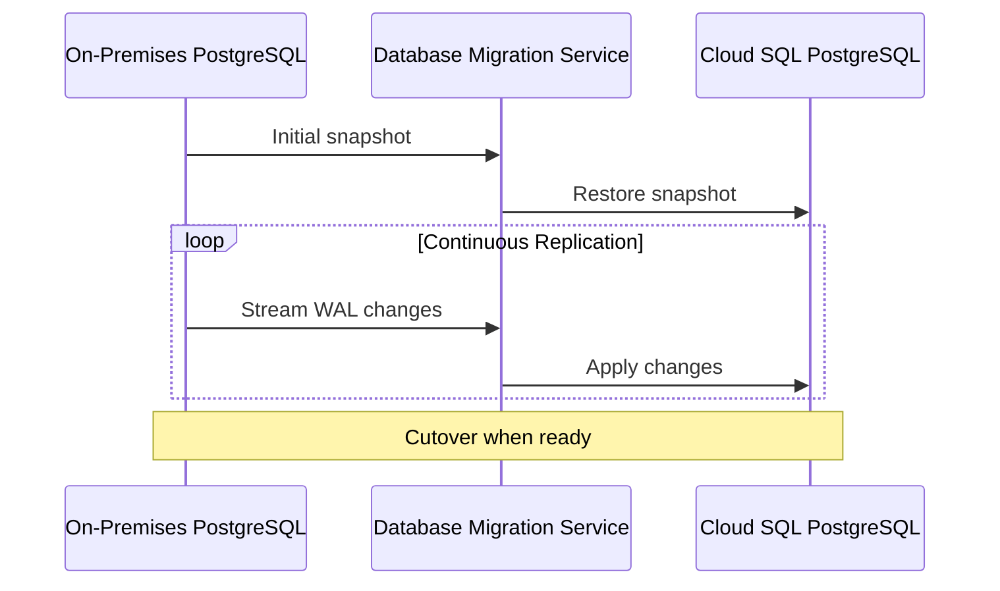

# How to Migrate an On-Premises PostgreSQL Database to Cloud SQL Using DMS

Author: [nawazdhandala](https://www.github.com/nawazdhandala)

Tags: GCP, Cloud SQL, PostgreSQL, Database Migration Service, DMS, Migration

Description: A complete walkthrough of migrating an on-premises PostgreSQL database to Cloud SQL using Google Database Migration Service with minimal downtime.

---

Migrating PostgreSQL from on-premises to Cloud SQL does not have to mean a lengthy maintenance window. Google's Database Migration Service (DMS) supports continuous replication for PostgreSQL, allowing you to keep your source and destination in sync until you are ready for a quick cutover. This guide covers the entire process from source preparation through post-migration validation.

## How DMS Works for PostgreSQL

DMS uses PostgreSQL's logical replication mechanism (pglogical extension or native logical replication) to stream changes from your source to Cloud SQL. The process:

1. Creates a snapshot of your source database
2. Restores it to the Cloud SQL destination
3. Starts logical replication to capture ongoing changes
4. Maintains near-zero lag until you trigger the cutover



## Prerequisites

### Source Database Requirements

Your source PostgreSQL needs to be version 9.6 or later. DMS uses the `pglogical` extension for older versions and native logical replication for PostgreSQL 10+.

Check your PostgreSQL version:

```sql
-- Check PostgreSQL version
SELECT version();
```

Configure the source for logical replication:

```ini
# postgresql.conf - Required settings for DMS migration
wal_level = logical
max_replication_slots = 10
max_wal_senders = 10
max_worker_processes = 10
```

Restart PostgreSQL after making these changes.

### Install pglogical (for PostgreSQL 9.6)

If running PostgreSQL 9.6, install the pglogical extension:

```bash
# Install pglogical on Debian/Ubuntu
sudo apt-get install postgresql-9.6-pglogical

# Or on RHEL/CentOS
sudo yum install pglogical_96
```

Then enable it in your database:

```sql
-- Add pglogical to shared_preload_libraries in postgresql.conf
-- After restart, create the extension in each database being migrated
CREATE EXTENSION pglogical;
```

For PostgreSQL 10+, native logical replication is used and no extension installation is needed.

### Create a Migration User

```sql
-- Create a replication user for DMS
CREATE USER dms_user WITH REPLICATION LOGIN PASSWORD 'strong-password';

-- Grant required permissions
GRANT USAGE ON SCHEMA public TO dms_user;
GRANT SELECT ON ALL TABLES IN SCHEMA public TO dms_user;
ALTER DEFAULT PRIVILEGES IN SCHEMA public GRANT SELECT ON TABLES TO dms_user;

-- For pglogical-based migration, also need:
GRANT USAGE ON SCHEMA pglogical TO dms_user;
GRANT SELECT ON ALL TABLES IN SCHEMA pglogical TO dms_user;
```

### Update pg_hba.conf

Allow the DMS connection from Google Cloud:

```
# pg_hba.conf - Allow DMS to connect
# Replace the IP range with your VPN or GCP IP range
hostssl  all  dms_user  10.128.0.0/20  md5
hostssl  replication  dms_user  10.128.0.0/20  md5
```

Reload the configuration:

```bash
# Reload PostgreSQL configuration without restart
sudo systemctl reload postgresql
```

### Network Connectivity

Just like MySQL migration, you need network connectivity between Google Cloud and your source database. Use Cloud VPN or Interconnect for production. DMS connects to your source over this path.

## Step 1: Enable APIs

```bash
# Enable required APIs
gcloud services enable datamigration.googleapis.com
gcloud services enable sqladmin.googleapis.com
```

## Step 2: Create Source Connection Profile

```bash
# Create a source connection profile for on-premises PostgreSQL
gcloud database-migration connection-profiles create pg-source \
    --region=us-central1 \
    --display-name="On-Premises PostgreSQL" \
    --provider=POSTGRESQL \
    --host=your-pg-server-ip \
    --port=5432 \
    --username=dms_user \
    --password=strong-password
```

With SSL:

```bash
# Source connection profile with SSL certificates
gcloud database-migration connection-profiles create pg-source \
    --region=us-central1 \
    --display-name="On-Premises PostgreSQL (SSL)" \
    --provider=POSTGRESQL \
    --host=your-pg-server-ip \
    --port=5432 \
    --username=dms_user \
    --password=strong-password \
    --ssl-ca-certificate=server-ca.pem
```

## Step 3: Create Destination Profile

```bash
# Create or reference a Cloud SQL destination
gcloud database-migration connection-profiles create cloudsql-pg-dest \
    --region=us-central1 \
    --display-name="Cloud SQL PostgreSQL Destination" \
    --provider=CLOUDSQL \
    --cloudsql-instance=my-pg-cloudsql
```

## Step 4: Create the Migration Job

```bash
# Create a continuous migration job for PostgreSQL
gcloud database-migration migration-jobs create pg-migration \
    --region=us-central1 \
    --display-name="PostgreSQL to Cloud SQL Migration" \
    --type=CONTINUOUS \
    --source=pg-source \
    --destination=cloudsql-pg-dest \
    --peer-vpc=projects/my-project/global/networks/my-vpc
```

## Step 5: Verify and Start

Test the configuration first:

```bash
# Verify the migration job configuration
gcloud database-migration migration-jobs verify pg-migration \
    --region=us-central1
```

DMS checks:

- Network connectivity to the source
- User privileges
- Logical replication configuration
- Version compatibility
- Extension availability on Cloud SQL

Fix any issues reported, then start:

```bash
# Start the migration
gcloud database-migration migration-jobs start pg-migration \
    --region=us-central1
```

## Step 6: Monitor Progress

```bash
# Check migration status
gcloud database-migration migration-jobs describe pg-migration \
    --region=us-central1
```

Monitor in the Cloud Console for a visual view of progress. You can see:

- Initial dump progress (percentage complete)
- Replication lag during CDC phase
- Error messages if something goes wrong

## Handling PostgreSQL-Specific Challenges

### Extensions

Not all PostgreSQL extensions are available in Cloud SQL. Check compatibility before migrating:

```sql
-- List extensions used in your source database
SELECT extname, extversion FROM pg_extension ORDER BY extname;
```

Compare against Cloud SQL's supported extensions. If you use an unsupported extension, you will need to find an alternative or modify your application.

### Sequences

Logical replication does not replicate sequence values. After the initial dump, sequences are set, but DMS handles this during the snapshot phase. However, verify sequence values after cutover:

```sql
-- Check sequence values on the destination
SELECT
    sequencename,
    last_value
FROM pg_sequences
WHERE schemaname = 'public';
```

### Large Objects

PostgreSQL large objects (LOBs) stored with `lo_*` functions are not supported by logical replication. If you use them, you will need to handle them separately - either by migrating them before cutover or converting them to `bytea` columns.

### Custom Types and Domains

Custom data types and domains replicate during the initial snapshot but changes to them during the CDC phase may cause issues. Avoid altering custom types during the migration.

### Foreign Tables

Foreign data wrappers and foreign tables are not migrated by DMS. You will need to recreate them on the Cloud SQL instance after migration.

## Step 7: Cutover

When replication lag is near zero:

1. Put your application in read-only or maintenance mode
2. Wait for replication lag to reach zero
3. Verify data consistency by comparing row counts on key tables

```sql
-- Run on source
SELECT schemaname, relname, n_live_tup
FROM pg_stat_user_tables
ORDER BY n_live_tup DESC
LIMIT 20;

-- Run on destination and compare
```

4. Promote the Cloud SQL instance:

```bash
# Promote the destination to become the primary
gcloud database-migration migration-jobs promote pg-migration \
    --region=us-central1
```

5. Update application connection strings
6. Bring the application back online

## Post-Migration Tasks

### Verify Extensions

```sql
-- Recreate any extensions that were not automatically migrated
CREATE EXTENSION IF NOT EXISTS pg_trgm;
CREATE EXTENSION IF NOT EXISTS uuid-ossp;
```

### Run ANALYZE

After migration, statistics may be stale. Run ANALYZE to update them:

```sql
-- Update statistics for the query planner
ANALYZE;
```

### Configure Cloud SQL Settings

Apply your production database flags:

```bash
# Apply production flags to the new Cloud SQL instance
gcloud sql instances patch my-pg-cloudsql \
    --database-flags=\
max_connections=200,\
work_mem=67108864,\
shared_preload_libraries=pg_stat_statements,\
log_min_duration_statement=1000,\
random_page_cost=1.1
```

### Set Up Monitoring

```bash
# Verify backups are configured
gcloud sql instances describe my-pg-cloudsql \
    --format="json(settings.backupConfiguration)"
```

Set up Cloud Monitoring alerts for key metrics: CPU, memory, connections, disk utilization, and replication lag (if using read replicas).

### Update DNS

If your application uses DNS to locate the database:

```bash
# Update DNS to point to the new Cloud SQL instance
gcloud dns record-sets update db.internal. \
    --zone=my-zone \
    --type=A \
    --ttl=60 \
    --rrdatas=NEW_CLOUD_SQL_IP
```

## Rollback Strategy

If issues arise after cutover:

- **Within minutes**: Redirect traffic back to the source database. No data loss since the source was the primary until cutover.
- **Within hours**: Set up reverse replication from Cloud SQL to on-premises, then fail back.
- **After days**: You will need to do a fresh migration in the reverse direction.

Keep the source database running and accessible for at least one to two weeks after cutover.

## Summary

DMS for PostgreSQL handles the complexity of logical replication setup and provides a managed migration path with minimal downtime. The key preparation steps are configuring logical replication on the source, ensuring network connectivity, and checking extension compatibility. Test the migration with a non-production database first to identify any issues with extensions, custom types, or application-specific features. The cutover itself should take minutes if you have done the preparation right.
