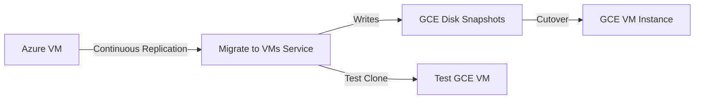

# How to Migrate Azure Virtual Machines to Google Compute Engine Using Migrate to Virtual Machines

Author: [nawazdhandala](https://www.github.com/nawazdhandala)

Tags: GCP, Google Compute Engine, Azure Virtual Machines, Migrate to Virtual Machines, VM Migration, Cloud Migration

Description: A step-by-step guide to migrating Azure Virtual Machines to Google Compute Engine using Google's Migrate to Virtual Machines service for minimal downtime migrations.

---

Google's Migrate to Virtual Machines (formerly Migrate for Compute Engine, and before that, Velostrata) is a managed service that handles VM migrations from other cloud providers to Google Compute Engine. It supports continuous replication, which means you can migrate VMs with minimal downtime - the data replicates in the background while your source VM keeps running.

This is the recommended approach for migrating Azure VMs to GCE, especially when you have many VMs to move or need to minimize downtime.

## How Migrate to Virtual Machines Works

The service works by:

1. Connecting to your Azure environment through a source connector
2. Creating a replication stream that continuously copies VM disk data to GCP
3. Running test clones to validate the migration before cutover
4. Performing the final cutover with a brief downtime window



## Step 1: Prerequisites and Planning

Before starting, make sure you have the required access and your environment is ready.

```bash
# Enable the required GCP APIs
gcloud services enable vmmigration.googleapis.com
gcloud services enable compute.googleapis.com
gcloud services enable servicemanagement.googleapis.com

# Create a VPC network for migrated VMs (if you do not already have one)
gcloud compute networks create migration-vpc \
  --subnet-mode=custom

gcloud compute networks subnets create migration-subnet \
  --network=migration-vpc \
  --region=us-central1 \
  --range=10.0.1.0/24
```

On the Azure side, you need:
- An Azure service principal with read access to the VMs you are migrating
- Network connectivity between Azure and GCP (or public internet access for the replication stream)

```bash
# Create an Azure service principal for the migration
az ad sp create-for-rbac \
  --name "gcp-migrate-sp" \
  --role "Reader" \
  --scopes /subscriptions/YOUR_SUBSCRIPTION_ID

# Also grant Disk Snapshot Contributor for disk access
az role assignment create \
  --assignee APP_ID \
  --role "Disk Snapshot Contributor" \
  --scope /subscriptions/YOUR_SUBSCRIPTION_ID
```

## Step 2: Create the Source Connection

Set up the connection between Migrate to Virtual Machines and your Azure environment.

```bash
# Create a source (Azure) in the Migrate to VMs service
gcloud migration vms sources create azure-source \
  --location=us-central1 \
  --azure \
  --azure-tenant-id=YOUR_TENANT_ID \
  --azure-subscription-id=YOUR_SUBSCRIPTION_ID \
  --azure-client-id=YOUR_CLIENT_ID \
  --azure-client-secret=YOUR_CLIENT_SECRET \
  --azure-resource-group=my-azure-rg
```

Verify the source connection:

```bash
# List configured sources
gcloud migration vms sources list --location=us-central1

# Get source details
gcloud migration vms sources describe azure-source --location=us-central1
```

## Step 3: Inventory Azure VMs

List the VMs available for migration through the source connection.

```bash
# List Azure VMs available for migration
gcloud migration vms sources migrating-vms list \
  --source=azure-source \
  --location=us-central1

# On the Azure side, document your VMs
az vm list \
  --resource-group my-azure-rg \
  --query '[*].{
    Name:name,
    Size:hardwareProfile.vmSize,
    OS:storageProfile.osDisk.osType,
    Disks:storageProfile.dataDisks | length(@),
    Location:location
  }' \
  --output table
```

Map Azure VM sizes to GCE machine types:

| Azure VM Size | GCE Machine Type |
|--------------|-----------------|
| Standard_B2s | e2-small |
| Standard_D2s_v3 | e2-standard-2 |
| Standard_D4s_v3 | e2-standard-4 |
| Standard_D8s_v3 | e2-standard-8 |
| Standard_E4s_v3 | e2-highmem-4 |
| Standard_F4s_v2 | c2-standard-4 |

## Step 4: Start Replication

Create migrating VMs to begin continuous replication.

```bash
# Start replication for a specific VM
gcloud migration vms migrating-vms create my-web-server \
  --source=azure-source \
  --location=us-central1 \
  --azure-source-vm-id=/subscriptions/SUB_ID/resourceGroups/my-rg/providers/Microsoft.Compute/virtualMachines/my-web-server \
  --target-project=my-gcp-project \
  --target-zone=us-central1-a \
  --target-machine-type=e2-standard-4 \
  --target-network=migration-vpc \
  --target-subnet=migration-subnet

# Monitor replication progress
gcloud migration vms migrating-vms describe my-web-server \
  --source=azure-source \
  --location=us-central1
```

The initial replication takes time depending on disk size and network bandwidth. Subsequent replication cycles only transfer changed blocks.

## Step 5: Create a Test Clone

Before the actual cutover, create a test clone to validate the VM works correctly on GCE.

```bash
# Create a test clone of the migrating VM
gcloud migration vms migrating-vms clone-jobs create \
  --migrating-vm=my-web-server \
  --source=azure-source \
  --location=us-central1

# List clone jobs
gcloud migration vms migrating-vms clone-jobs list \
  --migrating-vm=my-web-server \
  --source=azure-source \
  --location=us-central1
```

Once the test clone is created, verify it:

```bash
# Check the test clone VM
gcloud compute instances list --filter="name~test-clone"

# SSH into the test clone to verify
gcloud compute ssh test-clone-my-web-server \
  --zone=us-central1-a

# Inside the VM, check:
# - OS boots correctly
# - Services start properly
# - Network connectivity works
# - Application responds to requests
```

Test everything thoroughly:

```bash
# Check that services are running
sudo systemctl status nginx
sudo systemctl status my-app

# Test network connectivity
curl -I http://localhost:8080/health

# Check disk mounts
df -h
lsblk

# Verify hostname and network config
hostname
ip addr show
```

## Step 6: Prepare for Cutover

Before the final cutover, prepare your DNS, load balancers, and monitoring.

```bash
# Reserve a static external IP for the migrated VM
gcloud compute addresses create my-web-server-ip \
  --region=us-central1

# Set up a health check for the load balancer
gcloud compute health-checks create http my-web-server-health \
  --port=8080 \
  --request-path=/health

# Reduce DNS TTL before cutover (do this days in advance)
# Update your DNS zone TTL to 60 seconds
gcloud dns record-sets update my-server.example.com \
  --type=A \
  --zone=my-dns-zone \
  --ttl=60 \
  --rrdatas=current-azure-ip
```

## Step 7: Perform the Cutover

When you are ready for the final migration:

```bash
# Perform the cutover (this stops the Azure VM and does a final sync)
gcloud migration vms migrating-vms cutover-jobs create \
  --migrating-vm=my-web-server \
  --source=azure-source \
  --location=us-central1

# Monitor cutover progress
gcloud migration vms migrating-vms cutover-jobs list \
  --migrating-vm=my-web-server \
  --source=azure-source \
  --location=us-central1
```

After the cutover completes:

```bash
# Get the new GCE VM's external IP
gcloud compute instances describe my-web-server \
  --zone=us-central1-a \
  --format='value(networkInterfaces[0].accessConfigs[0].natIP)'

# Update DNS to point to the new IP
gcloud dns record-sets update my-server.example.com \
  --type=A \
  --zone=my-dns-zone \
  --ttl=300 \
  --rrdatas=NEW_GCE_IP

# Assign the reserved static IP
gcloud compute instances delete-access-config my-web-server \
  --zone=us-central1-a \
  --access-config-name="External NAT"

gcloud compute instances add-access-config my-web-server \
  --zone=us-central1-a \
  --address=my-web-server-ip
```

## Step 8: Post-Migration Tasks

After the cutover, finalize the migration.

```bash
# Install the Google Cloud guest agent (if not already installed)
gcloud compute instances add-metadata my-web-server \
  --zone=us-central1-a \
  --metadata=enable-guest-attributes=TRUE

# Set up OS Login for SSH access
gcloud compute instances add-metadata my-web-server \
  --zone=us-central1-a \
  --metadata=enable-oslogin=TRUE

# Configure backups
gcloud compute resource-policies create snapshot-schedule daily-backup \
  --region=us-central1 \
  --max-retention-days=14 \
  --daily-schedule \
  --start-time=02:00

gcloud compute disks add-resource-policies my-web-server \
  --zone=us-central1-a \
  --resource-policies=daily-backup

# Set up monitoring
gcloud compute instances add-metadata my-web-server \
  --zone=us-central1-a \
  --metadata=google-monitoring-enable=1
```

Remove Azure-specific agents and install GCP equivalents:

```bash
# SSH into the migrated VM
gcloud compute ssh my-web-server --zone=us-central1-a

# Remove Azure agents
sudo apt-get remove walinuxagent  # Ubuntu/Debian
# or
sudo yum remove WALinuxAgent  # RHEL/CentOS

# The Google guest agent should be installed automatically
# Verify it is running
sudo systemctl status google-guest-agent
```

## Batch Migration

For migrating multiple VMs, script the process:

```bash
# Batch start replication for multiple VMs
VMS=("web-server-1" "web-server-2" "api-server-1" "db-server-1")

for vm in "${VMS[@]}"; do
  echo "Starting replication for $vm..."
  gcloud migration vms migrating-vms create "$vm" \
    --source=azure-source \
    --location=us-central1 \
    --azure-source-vm-id="/subscriptions/SUB_ID/resourceGroups/my-rg/providers/Microsoft.Compute/virtualMachines/$vm" \
    --target-project=my-gcp-project \
    --target-zone=us-central1-a \
    --target-machine-type=e2-standard-4 \
    --target-network=migration-vpc \
    --target-subnet=migration-subnet
done
```

## Summary

Migrate to Virtual Machines is the most efficient way to move Azure VMs to GCE. The continuous replication minimizes downtime - your VMs keep running while data replicates in the background, and the final cutover only takes minutes. The key steps are setting up the Azure source connection, starting replication, testing with clone VMs, and performing the cutover during a maintenance window. After migration, clean up Azure-specific agents and configure GCP-native monitoring and backup. Always test clone VMs thoroughly before committing to the cutover.
