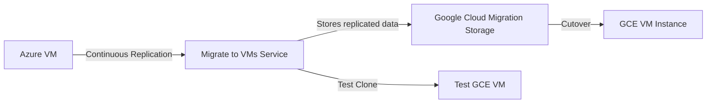

# How to Migrate Azure Virtual Machines to Google Compute Engine

Author: [nawazdhandala](https://www.github.com/nawazdhandala)

Tags: GCP, Google Compute Engine, Azure Virtual Machines, Migrate to Virtual Machines, VM Migration, Cloud Migration

Description: A step-by-step guide to migrating Azure Virtual Machines to Google Compute Engine using Google's Migrate to Virtual Machines service for minimal downtime migrations.

---

Google's Migrate to Virtual Machines (formerly Migrate for Compute Engine, and before that, Velostrata) is a managed service that handles VM migrations from other cloud providers to Google Compute Engine. It supports continuous replication, which means you can migrate VMs with minimal downtime - the data replicates in the background while your source VM keeps running.

This is the recommended approach for migrating Azure VMs to GCE, especially when you have many VMs to move or need to minimize downtime.

## How Migrate to Virtual Machines Works

The service works by:

1. Connecting to your Azure environment through an Azure source configured with an app registration and service principal permissions
2. Creating a replication stream that continuously copies VM disk data to GCP
3. Running test clones to validate the migration before cutover
4. Performing the final cutover with a brief downtime window


```mermaid
graph LR
    A[Azure VM] -->|Continuous Replication| B[Migrate to VMs Service]
    B -->|Stores replicated data| C[Google Cloud Migration Storage]
    C -->|Cutover| D[GCE VM Instance]
    B -->|Test Clone| E[Test GCE VM]
```

## Step 1: Prerequisites and Planning

Before starting, make sure you have the required access and your environment is ready.

```bash
# Enable the required GCP APIs

gcloud services enable vmmigration.googleapis.com
gcloud services enable compute.googleapis.com
gcloud services enable servicemanagement.googleapis.com
gcloud services enable servicecontrol.googleapis.com
gcloud services enable iam.googleapis.com
gcloud services enable cloudresourcemanager.googleapis.com

# Create a VPC network for migrated VMs (if you do not already have one)
gcloud compute networks create migration-vpc \
  --subnet-mode=custom

gcloud compute networks subnets create migration-subnet \
  --network=migration-vpc \
  --region=us-central1 \
  --range=10.0.1.0/24
```

On the Azure side, you need:
- An Azure app registration with a client secret
- A custom Azure role with the permissions required by Migrate to Virtual Machines
- Network connectivity between Azure and GCP (or public internet access for the replication stream)

```bash
# Create an Azure service principal for the migration
az ad sp create-for-rbac \
  --name "gcp-migrate-sp"

# Create the custom role definition that Migrate to Virtual Machines requires
cat > m2vm-role.json <<'EOF'
{
  "Name": "Minimum M2VM permissions role",
  "IsCustom": true,
  "Description": "Minimum Azure IAM permissions for Migrate to Virtual Machines",
  "Actions": [
    "Microsoft.Resources/subscriptions/resourceGroups/write",
    "Microsoft.Resources/subscriptions/resourceGroups/read",
    "Microsoft.Resources/subscriptions/resourceGroups/delete",
    "Microsoft.Compute/virtualMachines/read",
    "Microsoft.Compute/virtualMachines/write",
    "Microsoft.Compute/virtualMachines/deallocate/action",
    "Microsoft.Compute/disks/read",
    "Microsoft.Compute/snapshots/delete",
    "Microsoft.Compute/snapshots/write",
    "Microsoft.Compute/snapshots/beginGetAccess/action",
    "Microsoft.Compute/snapshots/read",
    "Microsoft.Compute/snapshots/endGetAccess/action"
  ],
  "NotActions": [],
  "AssignableScopes": [
    "/subscriptions/YOUR_SUBSCRIPTION_ID"
  ]
}
EOF

az role definition create --role-definition m2vm-role.json

# Assign the custom role to the service principal
az role assignment create \
  --assignee APP_ID \
  --role "Minimum M2VM permissions role" \
  --scope /subscriptions/YOUR_SUBSCRIPTION_ID
```

## Step 2: Create the Source Connection

Set up the connection between Migrate to Virtual Machines and your Azure environment.

In the Google Cloud console, open Migrate to Virtual Machines, select Sources, and choose Add Azure source. Enter the source name, Google Cloud region, Azure location, subscription ID, tenant ID, client ID, and client secret from the Azure app registration.

Verify the source connection:

Wait until the source status is Active. The inventory for that source shows Azure VMs from the Azure location you selected.

## Step 3: Inventory Azure VMs

List the VMs available for migration through the source connection.

```bash
# On the Azure side, document your VMs
az vm list \
  --resource-group my-azure-rg \
  --query '[*].{
    Name:name,
    Size:hardwareProfile.vmSize,
    OS:storageProfile.osDisk.osType,
    Disks:storageProfile.dataDisks | length(@),
    Location:location
  }' \
  --output table
```

Map Azure VM sizes to GCE machine types:

| Azure VM Size | GCE Machine Type |
|--------------|-----------------|
| Standard_B2s | e2-small |
| Standard_D2s_v3 | e2-standard-2 |
| Standard_D4s_v3 | e2-standard-4 |
| Standard_D8s_v3 | e2-standard-8 |
| Standard_E4s_v3 | e2-highmem-4 |
| Standard_F4s_v2 | c2-standard-4 |

## Step 4: Start Replication

Create a migration and begin continuous replication. In the Migrate to Virtual Machines console, select the Azure source, select the VM, and choose Add Migrations > VM Migration. After the VM appears on the Migrations tab with a Ready status, choose Migration > Start Replication.

Configure the target details for the migrated VM, including the target project, zone, machine type, VPC network, and subnet. Migrate to Virtual Machines uses those target details when it creates test-clone and cut-over instances.

The initial replication takes time depending on disk size and network bandwidth. Subsequent replication cycles only transfer changed blocks.

## Step 5: Create a Test Clone

Before the actual cutover, create a test clone to validate the VM works correctly on GCE.

In the Migrate to Virtual Machines console, select the migration after the first replication cycle completes, then choose Cut-Over and Test-Clone > Test-Clone. Wait until the Test-Clone/Cut-Over status shows that the test clone succeeded.

Once the test clone is created, verify it:

```bash
# Check the test clone VM
gcloud compute instances list --filter="name~test-clone"

# SSH into the test clone to verify
gcloud compute ssh test-clone-my-web-server \
  --zone=us-central1-a

# Inside the VM, check:
# - OS boots correctly
# - Services start properly
# - Network connectivity works
# - Application responds to requests
```

Test everything thoroughly:

```bash
# Check that services are running
sudo systemctl status nginx
sudo systemctl status my-app

# Test network connectivity
curl -I http://localhost:8080/health

# Check disk mounts
df -h
lsblk

# Verify hostname and network config
hostname
ip addr show
```

## Step 6: Prepare for Cutover

Before the final cutover, prepare your DNS, load balancers, and monitoring.

```bash
# Reserve a static external IP for the migrated VM
gcloud compute addresses create my-web-server-ip \
  --region=us-central1

# Set up a health check for the load balancer
gcloud compute health-checks create http my-web-server-health \
  --port=8080 \
  --request-path=/health

# Reduce DNS TTL before cutover (do this days in advance)
# Update your DNS zone TTL to 60 seconds
gcloud dns record-sets update my-server.example.com \
  --type=A \
  --zone=my-dns-zone \
  --ttl=60 \
  --rrdatas=current-azure-ip
```

## Step 7: Perform the Cutover

When you are ready for the final migration:

In the Migrate to Virtual Machines console, select the VM and choose Cut-Over and Test-Clone > Cut-Over. Cutover shuts down the Azure VM, performs a final data replication, creates the Compute Engine instance from the final replicated data, and stops replication. Wait until the Test-Clone/Cut-Over status shows that the cutover completed.

After the cutover completes:

```bash
# Get the new GCE VM's external IP
gcloud compute instances describe my-web-server \
  --zone=us-central1-a \
  --format='value(networkInterfaces[0].accessConfigs[0].natIP)'

# Update DNS to point to the new IP
gcloud dns record-sets update my-server.example.com \
  --type=A \
  --zone=my-dns-zone \
  --ttl=300 \
  --rrdatas=NEW_GCE_IP

# Assign the reserved static IP
gcloud compute instances delete-access-config my-web-server \
  --zone=us-central1-a \
  --access-config-name="External NAT"

gcloud compute instances add-access-config my-web-server \
  --zone=us-central1-a \
  --address=my-web-server-ip
```

## Step 8: Post-Migration Tasks

After the cutover, finalize the migration.

```bash
# Enable Cloud Logging and Cloud Monitoring APIs before installing the Ops Agent
gcloud services enable logging.googleapis.com monitoring.googleapis.com

# Set up OS Login for SSH access
gcloud compute instances add-metadata my-web-server \
  --zone=us-central1-a \
  --metadata=enable-oslogin=TRUE

# Configure backups
gcloud compute resource-policies create snapshot-schedule daily-backup \
  --region=us-central1 \
  --max-retention-days=14 \
  --daily-schedule \
  --start-time=02:00

gcloud compute disks add-resource-policies my-web-server \
  --zone=us-central1-a \
  --resource-policies=daily-backup
```

Finalize the migration in the Migrate to Virtual Machines console after you no longer need the retained replication data. Finalizing deletes the replication data and other storage resources associated with the migration.

Remove Azure-specific agents and install GCP equivalents:

```bash
# SSH into the migrated VM
gcloud compute ssh my-web-server --zone=us-central1-a

# Remove Azure agents
sudo apt-get remove walinuxagent  # Ubuntu/Debian
# or
sudo yum remove WALinuxAgent  # RHEL/CentOS

# Verify that the Google guest agent is running
sudo systemctl status google-guest-agent

# Install the Ops Agent for Cloud Monitoring and Cloud Logging
curl -sSO https://dl.google.com/cloudagents/add-google-cloud-ops-agent-repo.sh
sudo bash add-google-cloud-ops-agent-repo.sh --also-install

# Verify that the Ops Agent is running
sudo systemctl status google-cloud-ops-agent
```

## Batch Migration

For migrating multiple VMs, select multiple source VMs in the Migrate to Virtual Machines console and add them as migrations. You can also organize related VMs into migration groups, configure their target details, start replication, create test clones, and cut over the group during the same maintenance window.

## Summary

Migrate to Virtual Machines is the most efficient way to move Azure VMs to GCE. The continuous replication minimizes downtime - your VMs keep running while data replicates in the background, and the final cutover only takes minutes. The key steps are setting up the Azure source connection, starting replication, testing with clone VMs, and performing the cutover during a maintenance window. After migration, clean up Azure-specific agents and configure GCP-native monitoring and backup. Always test clone VMs thoroughly before committing to the cutover.
