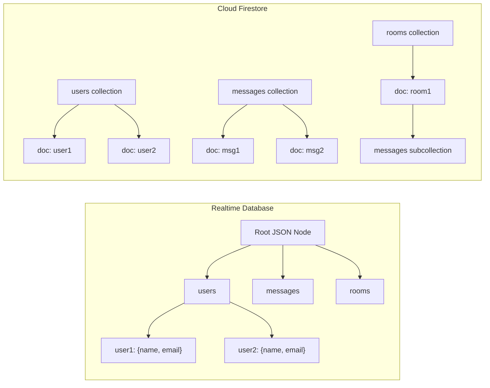

# How to Migrate Data from Firebase Realtime Database to Cloud Firestore

Author: [nawazdhandala](https://www.github.com/nawazdhandala)

Tags: GCP, Firestore, Firebase, Realtime Database, Migration

Description: A practical walkthrough for migrating your data from Firebase Realtime Database to Cloud Firestore, covering schema redesign, data transfer, and cutover strategies.

---

Firebase Realtime Database served us well for years, but Cloud Firestore brings serious improvements - better querying, automatic scaling, offline support, and a more intuitive data model. If you are running an app on Realtime Database and want to move to Firestore, this guide covers everything from planning the migration to executing the cutover.

I have done this migration on a few projects now, and the biggest lesson is that it is not just a data copy - it is an opportunity to redesign your data model. Firestore thinks about data differently than Realtime Database, and taking advantage of that is where the real win comes from.

## Understanding the Differences

Before migrating, you need to understand what is different between the two databases.

Realtime Database stores everything as one giant JSON tree. Firestore uses collections and documents. Realtime Database queries can only filter or sort on a single property. Firestore supports compound queries with multiple where clauses. Realtime Database scales by sharding across multiple database instances. Firestore scales automatically.



## Step 1: Plan Your New Schema

This is the most important step. Do not just mirror your Realtime Database structure in Firestore. Instead, design the Firestore schema based on how your app reads data.

Here is a common Realtime Database structure for a chat app:

```json
// Realtime Database structure - deeply nested JSON tree
{
  "rooms": {
    "room1": {
      "name": "General",
      "members": {
        "user1": true,
        "user2": true
      }
    }
  },
  "messages": {
    "room1": {
      "msg1": {
        "text": "Hello",
        "sender": "user1",
        "timestamp": 1708000000
      }
    }
  },
  "users": {
    "user1": {
      "name": "Alice",
      "email": "alice@example.com"
    }
  }
}
```

And here is how you would restructure it for Firestore:

```
// Firestore structure - collections and subcollections
// rooms (collection)
//   room1 (document)
//     name: "General"
//     members: ["user1", "user2"]
//     messages (subcollection)
//       msg1 (document)
//         text: "Hello"
//         sender: "user1"
//         timestamp: Timestamp
//
// users (collection)
//   user1 (document)
//     name: "Alice"
//     email: "alice@example.com"
```

Notice how messages become a subcollection of rooms. This lets you query messages within a room efficiently, and you can also use collection group queries to search across all messages in all rooms.

## Step 2: Export Data from Realtime Database

You can export data using the Firebase CLI or the REST API. For large datasets, the REST API with shallow reads is more manageable.

```javascript
// Export script using the Firebase Admin SDK
// Run this on a server or in a Cloud Function, not in the browser
const admin = require('firebase-admin');
const fs = require('fs');

admin.initializeApp({
  databaseURL: 'https://your-project.firebaseio.com'
});

const rtdb = admin.database();

async function exportData() {
  // Export each top-level node separately to avoid memory issues
  const nodes = ['users', 'rooms', 'messages'];

  for (const node of nodes) {
    console.log(`Exporting ${node}...`);
    const snapshot = await rtdb.ref(node).once('value');
    const data = snapshot.val();

    // Write to a JSON file
    fs.writeFileSync(
      `export-${node}.json`,
      JSON.stringify(data, null, 2)
    );
    console.log(`Exported ${Object.keys(data || {}).length} ${node}`);
  }
}

exportData().catch(console.error);
```

For very large datasets (millions of records), export in chunks:

```javascript
// Export large datasets in chunks using orderByKey and pagination
// This prevents memory issues when dealing with millions of records
async function exportLargeNode(nodeName, batchSize = 10000) {
  let lastKey = null;
  let totalExported = 0;
  let batchNum = 0;

  while (true) {
    let query = rtdb.ref(nodeName).orderByKey().limitToFirst(batchSize);

    if (lastKey) {
      query = query.startAfter(lastKey);
    }

    const snapshot = await query.once('value');
    const data = snapshot.val();

    if (!data) break;

    const keys = Object.keys(data);
    lastKey = keys[keys.length - 1];
    totalExported += keys.length;

    fs.writeFileSync(
      `export-${nodeName}-${batchNum}.json`,
      JSON.stringify(data, null, 2)
    );

    console.log(`Batch ${batchNum}: exported ${keys.length} records (total: ${totalExported})`);
    batchNum++;

    if (keys.length < batchSize) break;
  }
}
```

## Step 3: Transform and Import into Firestore

Now you need to read the exported data, transform it to match your new Firestore schema, and write it to Firestore using batch writes.

```javascript
// Import script that transforms RTDB data and writes to Firestore
// Uses batch writes for efficiency (max 500 operations per batch)
const admin = require('firebase-admin');
const fs = require('fs');

admin.initializeApp({
  credential: admin.credential.applicationDefault()
});

const firestore = admin.firestore();

async function importUsers() {
  const data = JSON.parse(fs.readFileSync('export-users.json', 'utf8'));
  const userIds = Object.keys(data);
  const BATCH_SIZE = 500;

  for (let i = 0; i < userIds.length; i += BATCH_SIZE) {
    const batch = firestore.batch();
    const chunk = userIds.slice(i, i + BATCH_SIZE);

    for (const userId of chunk) {
      const userData = data[userId];
      const docRef = firestore.collection('users').doc(userId);

      // Transform the data during import
      batch.set(docRef, {
        name: userData.name || '',
        email: userData.email || '',
        createdAt: admin.firestore.Timestamp.fromMillis(userData.createdAt || Date.now()),
        migratedFromRTDB: true
      });
    }

    await batch.commit();
    console.log(`Imported users ${i} to ${i + chunk.length}`);
  }
}

async function importMessages() {
  const rooms = JSON.parse(fs.readFileSync('export-rooms.json', 'utf8'));
  const messages = JSON.parse(fs.readFileSync('export-messages.json', 'utf8'));

  // Import rooms first
  for (const [roomId, roomData] of Object.entries(rooms)) {
    await firestore.collection('rooms').doc(roomId).set({
      name: roomData.name,
      members: Object.keys(roomData.members || {}),
      createdAt: admin.firestore.FieldValue.serverTimestamp()
    });

    // Import messages as a subcollection of each room
    const roomMessages = messages[roomId] || {};
    const msgIds = Object.keys(roomMessages);
    const BATCH_SIZE = 500;

    for (let i = 0; i < msgIds.length; i += BATCH_SIZE) {
      const batch = firestore.batch();
      const chunk = msgIds.slice(i, i + BATCH_SIZE);

      for (const msgId of chunk) {
        const msg = roomMessages[msgId];
        const msgRef = firestore
          .collection('rooms').doc(roomId)
          .collection('messages').doc(msgId);

        batch.set(msgRef, {
          text: msg.text,
          sender: msg.sender,
          timestamp: admin.firestore.Timestamp.fromMillis(msg.timestamp)
        });
      }

      await batch.commit();
    }

    console.log(`Imported ${msgIds.length} messages for room ${roomId}`);
  }
}

async function runMigration() {
  await importUsers();
  await importMessages();
  console.log('Migration complete');
}

runMigration().catch(console.error);
```

## Step 4: Update Your Application Code

Once the data is in Firestore, you need to update your application code. Replace Realtime Database references with Firestore references.

```javascript
// Before: Realtime Database read
// const userRef = firebase.database().ref('users/' + userId);
// userRef.on('value', (snapshot) => { ... });

// After: Firestore read
import { doc, onSnapshot } from 'firebase/firestore';

const userRef = doc(db, 'users', userId);
onSnapshot(userRef, (snapshot) => {
  const userData = snapshot.data();
  // Update UI
});
```

## Step 5: Run Both Databases in Parallel

For a safe migration, run both databases simultaneously during a transition period. Write to both, read from Firestore, and have a fallback to Realtime Database if needed.

```javascript
// Dual-write function during the transition period
// Writes to both databases to keep them in sync
async function dualWrite(collectionPath, docId, data) {
  const rtdbPath = collectionPath.replace(/\//g, '/') + '/' + docId;

  await Promise.all([
    // Write to Firestore (new)
    firestore.collection(collectionPath).doc(docId).set(data, { merge: true }),
    // Write to RTDB (old) - keep in sync during transition
    rtdb.ref(rtdbPath).update(data)
  ]);
}
```

Once you are confident that Firestore is working correctly and all data is migrated, you can remove the Realtime Database writes and eventually decommission the old database.

## Common Gotchas

A few things that caught me during migrations. Timestamps work differently - Realtime Database uses Unix milliseconds, while Firestore uses its own Timestamp type. Always convert during import. Array handling is also different - Realtime Database often stores arrays as objects with numeric keys, while Firestore has native array support. Watch for data that exceeds Firestore's 1 MB document size limit - if you have large JSON blobs in Realtime Database, you may need to split them across multiple Firestore documents.

## Wrapping Up

Migrating from Firebase Realtime Database to Cloud Firestore is a worthwhile investment. The improved query capabilities, automatic scaling, and better data model will make your app easier to build and maintain. Take the time to plan your new schema properly, test the migration with a subset of data first, and use the dual-write pattern for a safe cutover. The effort pays off quickly once you start taking advantage of Firestore's features.
