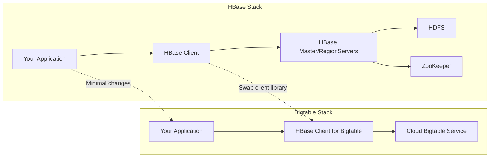

# How to Migrate from Apache HBase to Cloud Bigtable

Author: [nawazdhandala](https://www.github.com/nawazdhandala)

Tags: GCP, Cloud Bigtable, HBase, Migration, Big Data

Description: A complete guide to migrating your Apache HBase workloads to Cloud Bigtable, covering compatibility, data migration strategies, and application code changes.

---

If you are running Apache HBase on-premises or on cloud VMs, you know the operational burden. Managing ZooKeeper, HDFS, RegionServers, compaction tuning, cluster upgrades - it all takes significant engineering effort. Cloud Bigtable offers the same wide-column data model and HBase-compatible API but as a fully managed service. You get automatic scaling, built-in replication, and zero operational overhead.

The good news is that Bigtable was designed to be HBase-compatible. Google actually published the Bigtable paper before HBase existed, and HBase was modeled after it. The migration path is well-trodden, and most HBase applications work with Bigtable with minimal code changes. Let me walk through the entire process.

## Compatibility Overview

Bigtable supports most of the HBase API through the HBase client for Bigtable. Your existing HBase code can often work with Bigtable by changing just the connection configuration. However, there are some differences to be aware of.

What works the same:
- Tables, column families, column qualifiers, timestamps, and versions
- Put, Get, Scan, Delete operations
- Filters (SingleColumnValueFilter, PrefixFilter, etc.)
- Batch operations

What is different:
- No HBase shell (use `cbt` instead)
- No coprocessors (use Cloud Functions instead)
- No namespace support (use separate instances)
- Table creation and admin operations use a different API
- Some advanced filters behave slightly differently



## Step 1: Assess Your HBase Usage

Before migrating, audit your HBase usage to identify potential incompatibilities.

```bash
# Check your HBase tables and schemas
hbase shell << 'EOF'
list
describe 'your_table'
status 'detailed'
EOF
```

Document the following for each table:
- Table name and column families
- Garbage collection policies (versions, TTL)
- Compression settings (Bigtable handles this automatically)
- Coprocessors in use (need to be reimplemented)
- Any custom filters

```python
# Script to audit HBase tables and generate a migration checklist
import happybase

connection = happybase.Connection('hbase-master-host')

for table_name in connection.tables():
    table_name = table_name.decode('utf-8')
    table = connection.table(table_name)
    families = table.families()

    print(f"\nTable: {table_name}")
    for family_name, settings in families.items():
        family_name = family_name.decode('utf-8')
        print(f"  Column Family: {family_name}")
        print(f"    Max Versions: {settings.get('max_versions', 'default')}")
        print(f"    TTL: {settings.get('time_to_live', 'forever')}")
        print(f"    Compression: {settings.get('compression', 'none')}")
```

## Step 2: Set Up the Bigtable Instance

Create a Bigtable instance that matches your HBase cluster's capacity.

```bash
# Create a production Bigtable instance
# Size based on your HBase cluster capacity
gcloud bigtable instances create hbase-migration \
  --display-name="Migrated from HBase" \
  --cluster-config=id=primary-cluster,zone=us-central1-a,nodes=3 \
  --instance-type=PRODUCTION \
  --project=your-project-id
```

A rough sizing guide: each Bigtable node provides roughly the same throughput as one HBase RegionServer with a good configuration. Start with the same node count as your HBase RegionServers and adjust from there.

## Step 3: Create Tables and Column Families

Recreate your HBase table schema in Bigtable.

```bash
# Create tables matching your HBase schema
cbt createtable user_events
cbt createfamily user_events data
cbt createfamily user_events meta

# Set GC policies matching your HBase settings
# If HBase has VERSIONS => 3
cbt setgcpolicy user_events data maxversions=3

# If HBase has TTL => 2592000 (30 days in seconds)
cbt setgcpolicy user_events meta maxage=720h
```

For programmatic setup with many tables:

```python
# Script to recreate HBase schemas in Bigtable
from google.cloud import bigtable
from google.cloud.bigtable import column_family
import datetime

client = bigtable.Client(project='your-project-id', admin=True)
instance = client.instance('hbase-migration')

# Define your schemas (extracted from HBase audit)
schemas = {
    'user_events': {
        'data': {'max_versions': 3},
        'meta': {'max_versions': 1, 'ttl_days': 30}
    },
    'sensor_readings': {
        'raw': {'max_versions': 1, 'ttl_days': 90},
        'stats': {'max_versions': 1}
    }
}

for table_name, families in schemas.items():
    table = instance.table(table_name)

    # Build column family definitions
    cf_defs = {}
    for family_name, settings in families.items():
        rules = []
        if 'max_versions' in settings:
            rules.append(column_family.MaxVersionsGCRule(settings['max_versions']))
        if 'ttl_days' in settings:
            rules.append(column_family.MaxAgeGCRule(
                datetime.timedelta(days=settings['ttl_days'])
            ))

        if len(rules) > 1:
            gc_rule = column_family.GCRuleUnion(rules)
        elif rules:
            gc_rule = rules[0]
        else:
            gc_rule = None

        cf_defs[family_name] = column_family.ColumnFamily(family_name, table, gc_rule)

    # Create the table with column families
    table.create(column_families=cf_defs)
    print(f"Created table: {table_name}")
```

## Step 4: Migrate the Data

There are several approaches to moving data from HBase to Bigtable.

**Option A: HBase snapshots with Dataflow**

This is the recommended approach for large datasets. Export HBase data as snapshots, then use Dataflow to read the snapshots and write to Bigtable.

```bash
# Export HBase table as a snapshot
hbase snapshot export -snapshot user_events_snapshot -copy-to gs://your-bucket/hbase-snapshots/

# Use Dataflow to import into Bigtable
# Google provides a pre-built template for this
gcloud dataflow jobs run hbase-to-bigtable \
  --gcs-location gs://dataflow-templates/latest/HBase_To_Bigtable \
  --parameters \
    hbaseRootDir=gs://your-bucket/hbase-snapshots,\
    hbaseSnapshotName=user_events_snapshot,\
    bigtableProjectId=your-project-id,\
    bigtableInstanceId=hbase-migration,\
    bigtableTableId=user_events \
  --project=your-project-id
```

**Option B: Direct copy with a migration script**

For smaller datasets or when you need transformation during migration.

```java
// Java migration script: read from HBase, write to Bigtable
// Uses the HBase API for both source and destination
import org.apache.hadoop.hbase.client.*;
import org.apache.hadoop.hbase.*;
import com.google.cloud.bigtable.hbase.BigtableConfiguration;

public class HBaseToBigtable {
    public static void main(String[] args) throws Exception {
        // Connect to source HBase
        Configuration hbaseConfig = HBaseConfiguration.create();
        hbaseConfig.set("hbase.zookeeper.quorum", "zk-host1,zk-host2");
        Connection hbaseConn = ConnectionFactory.createConnection(hbaseConfig);

        // Connect to destination Bigtable using the HBase compatibility layer
        Connection bigtableConn = BigtableConfiguration.connect(
            "your-project-id", "hbase-migration");

        Table sourceTable = hbaseConn.getTable(TableName.valueOf("user_events"));
        Table destTable = bigtableConn.getTable(TableName.valueOf("user_events"));

        // Scan the source table and write to Bigtable in batches
        Scan scan = new Scan();
        scan.setCaching(1000);  // Read 1000 rows at a time
        ResultScanner scanner = sourceTable.getScanner(scan);

        int count = 0;
        List<Put> batch = new ArrayList<>();

        for (Result result : scanner) {
            // Convert the HBase Result to a Put for Bigtable
            Put put = new Put(result.getRow());
            for (Cell cell : result.rawCells()) {
                put.addColumn(
                    CellUtil.cloneFamily(cell),
                    CellUtil.cloneQualifier(cell),
                    cell.getTimestamp(),
                    CellUtil.cloneValue(cell)
                );
            }
            batch.add(put);
            count++;

            if (batch.size() >= 1000) {
                destTable.put(batch);
                batch.clear();
                System.out.println("Migrated " + count + " rows");
            }
        }

        // Write remaining rows
        if (!batch.isEmpty()) {
            destTable.put(batch);
        }

        System.out.println("Migration complete: " + count + " rows");
        scanner.close();
        sourceTable.close();
        destTable.close();
    }
}
```

## Step 5: Update Your Application Code

The biggest change is swapping the HBase connection configuration to use the Bigtable HBase client.

```xml
<!-- Add the Bigtable HBase client to your Maven pom.xml -->
<dependency>
    <groupId>com.google.cloud.bigtable</groupId>
    <artifactId>bigtable-hbase-2.x-hadoop</artifactId>
    <version>2.14.1</version>
</dependency>
```

```java
// Before: HBase connection
// Configuration config = HBaseConfiguration.create();
// config.set("hbase.zookeeper.quorum", "zk1,zk2,zk3");
// Connection conn = ConnectionFactory.createConnection(config);

// After: Bigtable connection using the HBase compatibility layer
// Same API, different connection setup
import com.google.cloud.bigtable.hbase.BigtableConfiguration;

Connection conn = BigtableConfiguration.connect("your-project-id", "hbase-migration");

// Everything else stays the same!
Table table = conn.getTable(TableName.valueOf("user_events"));
Get get = new Get(Bytes.toBytes("row-key"));
Result result = table.get(get);
```

## Step 6: Validate the Migration

After migrating, verify that the data in Bigtable matches your HBase source.

```python
# Validation script: compare row counts and spot-check data
from google.cloud import bigtable

client = bigtable.Client(project='your-project-id')
instance = client.instance('hbase-migration')
table = instance.table('user_events')

# Count rows in Bigtable
bt_count = 0
for row in table.read_rows():
    bt_count += 1

print(f"Bigtable row count: {bt_count}")
# Compare with HBase row count from: hbase shell> count 'user_events'

# Spot check specific rows
test_keys = [b'user#12345', b'user#67890', b'user#11111']
for key in test_keys:
    row = table.read_row(key)
    if row:
        print(f"Row {key}: {len(row.cells)} column families")
    else:
        print(f"Row {key}: NOT FOUND - check migration")
```

## Handling Coprocessors

HBase coprocessors do not have a direct equivalent in Bigtable. You need to replace them with Cloud Functions or application-side logic.

Common coprocessor patterns and their Bigtable equivalents:
- **Observer coprocessors** (triggers): Use Bigtable Change Streams or write application-side logic
- **Endpoint coprocessors** (server-side computation): Move computation to your application or use Dataflow
- **Custom filters**: Most can be translated to Bigtable's built-in filter API

## Wrapping Up

Migrating from HBase to Bigtable eliminates the operational burden of managing a distributed database while preserving your data model and most of your application code. The HBase compatibility layer means you do not have to rewrite your data access layer. Focus your effort on the areas that differ: replace coprocessors with Cloud Functions, adjust your monitoring to use Cloud Monitoring instead of HBase metrics, and take advantage of Bigtable-specific features like automatic replication and managed backups. Plan for a parallel running period where both systems are active, and cut over when you are confident in the migration's completeness.
