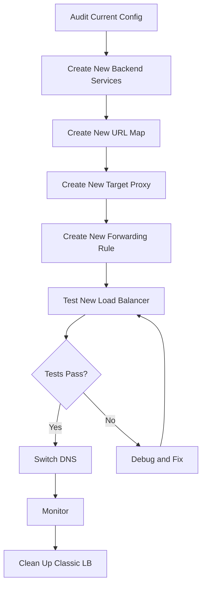

# How to Migrate from Classic to Global External Application Load Balancer in GCP

Author: [nawazdhandala](https://www.github.com/nawazdhandala)

Tags: GCP, Load Balancer, Migration, Classic LB, Google Cloud

Description: A step-by-step guide to migrating from the classic external HTTP(S) load balancer to the global external application load balancer in GCP with minimal downtime.

---

Google has been evolving its load balancer lineup, and the classic external HTTP(S) load balancer is now considered the previous generation. The newer global external application load balancer offers advanced traffic management features, better security integration, and support for newer features like traffic splitting and header-based routing. If you are running the classic version, migrating is straightforward but requires careful planning to avoid downtime.

This post walks through the migration process, explains what changes, and covers the gotchas you need to watch out for.

## Classic vs Global External Application Load Balancer

Before migrating, understand what is changing:

| Feature | Classic | Global External Application |
|---------|---------|----------------------------|
| Load balancing scheme | EXTERNAL | EXTERNAL_MANAGED |
| Traffic management | Basic path/host routing | Advanced routing, traffic splitting, header matching |
| Cloud Armor | Supported | Supported with more features |
| Cloud CDN | Supported | Supported |
| Envoy-based | No (GFE-based) | Yes |
| URL rewrites | Limited | Full support |
| Custom headers | Response only | Request and response |
| Traffic splitting | Not supported | Supported |
| Fault injection | Not supported | Supported |

The key difference under the hood is that the global external application load balancer uses Envoy as its data plane, which enables all the advanced traffic management features.

## Migration Strategy Options

There are two approaches:

**Approach 1: Side-by-side migration** - Create a new load balancer alongside the classic one, test it, then switch DNS. This is the safest approach.

**Approach 2: In-place update** - Update the existing load balancer's components to use the new scheme. This is faster but riskier.

I recommend Approach 1 for production workloads.

## Approach 1: Side-by-Side Migration

### Step 1: Audit Your Current Configuration

First, document your existing setup:

```bash
# Export current forwarding rules
gcloud compute forwarding-rules describe my-https-rule \
    --global \
    --format=yaml > current-forwarding-rule.yaml

# Export current target proxy
gcloud compute target-https-proxies describe my-https-proxy \
    --global \
    --format=yaml > current-proxy.yaml

# Export current URL map
gcloud compute url-maps describe my-url-map \
    --global \
    --format=yaml > current-url-map.yaml

# Export current backend services
gcloud compute backend-services describe my-backend \
    --global \
    --format=yaml > current-backend.yaml

# Export current SSL certificates
gcloud compute ssl-certificates list --global
```

### Step 2: Create New Backend Services

Create new backend services with the `EXTERNAL_MANAGED` load balancing scheme:

```bash
# Create a new backend service with the EXTERNAL_MANAGED scheme
gcloud compute backend-services create my-backend-v2 \
    --protocol=HTTP \
    --health-checks=my-health-check \
    --load-balancing-scheme=EXTERNAL_MANAGED \
    --global
```

Add the same backends (instance groups) to the new service:

```bash
# Add instance groups to the new backend service
gcloud compute backend-services add-backend my-backend-v2 \
    --instance-group=my-instance-group \
    --instance-group-zone=us-central1-a \
    --global
```

If you have multiple backend services, repeat for each one:

```bash
# Repeat for each backend service
gcloud compute backend-services create api-backend-v2 \
    --protocol=HTTP \
    --health-checks=api-health-check \
    --load-balancing-scheme=EXTERNAL_MANAGED \
    --global

gcloud compute backend-services add-backend api-backend-v2 \
    --instance-group=api-group \
    --instance-group-zone=us-central1-a \
    --global
```

### Step 3: Create a New URL Map

Recreate your URL map pointing to the new backend services:

```bash
# Create a new URL map with the new backend services
gcloud compute url-maps create my-url-map-v2 \
    --default-service=my-backend-v2 \
    --global
```

If you have path-based or host-based routing, recreate those rules:

```bash
# Add path matchers to the new URL map
gcloud compute url-maps add-path-matcher my-url-map-v2 \
    --path-matcher-name=my-paths \
    --default-service=my-backend-v2 \
    --path-rules="/api/*=api-backend-v2" \
    --global
```

### Step 4: Create a New Target HTTPS Proxy

You can reuse your existing SSL certificates:

```bash
# Create a new target HTTPS proxy with the new URL map
gcloud compute target-https-proxies create my-https-proxy-v2 \
    --url-map=my-url-map-v2 \
    --ssl-certificates=my-ssl-cert
```

### Step 5: Reserve a New IP and Create Forwarding Rule

```bash
# Reserve a new global IP for testing
gcloud compute addresses create lb-ip-v2 \
    --ip-version=IPV4 --global

# Get the new IP
gcloud compute addresses describe lb-ip-v2 \
    --global --format="get(address)"

# Create the new forwarding rule
gcloud compute forwarding-rules create my-https-rule-v2 \
    --address=lb-ip-v2 \
    --global \
    --target-https-proxy=my-https-proxy-v2 \
    --ports=443
```

### Step 6: Test the New Load Balancer

Test the new load balancer using the new IP address directly:

```bash
# Test using the new IP address (bypass DNS)
curl -H "Host: app.example.com" https://NEW_IP_ADDRESS/ --resolve app.example.com:443:NEW_IP_ADDRESS

# Verify health of backends
gcloud compute backend-services get-health my-backend-v2 --global
```

Run your full test suite against the new IP. Compare response headers, latency, and behavior with the classic load balancer.

### Step 7: Switch DNS

Once you are confident the new load balancer works correctly, update your DNS to point to the new IP:

```bash
# If using Cloud DNS, update the record set
gcloud dns record-sets update app.example.com \
    --rrdatas=NEW_IP_ADDRESS \
    --type=A \
    --ttl=300 \
    --zone=my-zone
```

Use a short TTL (300 seconds) during the switchover so you can roll back quickly if needed.

### Step 8: Clean Up the Classic Load Balancer

After DNS has fully propagated and you have monitored the new load balancer for a few days:

```bash
# Delete the old forwarding rule
gcloud compute forwarding-rules delete my-https-rule --global

# Delete the old target proxy
gcloud compute target-https-proxies delete my-https-proxy --global

# Delete the old URL map
gcloud compute url-maps delete my-url-map --global

# Delete the old backend services
gcloud compute backend-services delete my-backend --global

# Release the old IP
gcloud compute addresses delete lb-ip --global
```

## Approach 2: In-Place Update Using Same IP

If you need to keep the same IP address and cannot do a DNS switch, you can do an in-place migration. This requires a brief period where the load balancer is reconfigured:

```bash
# Step 1: Create new backend services (EXTERNAL_MANAGED)
gcloud compute backend-services create my-backend-new \
    --protocol=HTTP \
    --health-checks=my-health-check \
    --load-balancing-scheme=EXTERNAL_MANAGED \
    --global

gcloud compute backend-services add-backend my-backend-new \
    --instance-group=my-instance-group \
    --instance-group-zone=us-central1-a \
    --global

# Step 2: Create new URL map
gcloud compute url-maps create my-url-map-new \
    --default-service=my-backend-new --global

# Step 3: Delete old forwarding rule (brief downtime starts)
gcloud compute forwarding-rules delete my-https-rule --global

# Step 4: Delete old proxy
gcloud compute target-https-proxies delete my-https-proxy --global

# Step 5: Create new proxy
gcloud compute target-https-proxies create my-https-proxy \
    --url-map=my-url-map-new \
    --ssl-certificates=my-ssl-cert

# Step 6: Create new forwarding rule with same IP (downtime ends)
gcloud compute forwarding-rules create my-https-rule \
    --address=lb-ip \
    --global \
    --target-https-proxy=my-https-proxy \
    --ports=443
```

The downtime window is typically just a few seconds between deleting the old forwarding rule and creating the new one.

## Migration Flow



## Things to Watch Out For

**Health check behavior**: The EXTERNAL_MANAGED scheme may behave slightly differently with health checks. Verify that all backends show healthy after migration.

**Cloud Armor policies**: If you have Cloud Armor security policies, they need to be reattached to the new backend services. Policies themselves do not need to be recreated.

**Logging format**: The log format for EXTERNAL_MANAGED load balancers is slightly different. Update any log-based alerting or dashboards.

**Backend service settings**: Some settings like connection draining timeout, session affinity, and circuit breakers may behave differently. Test thoroughly.

**Timeout defaults**: The default backend timeout may differ. Explicitly set it to match your current configuration.

```bash
# Explicitly set timeout to match your current config
gcloud compute backend-services update my-backend-v2 \
    --timeout=30s \
    --global
```

## Wrapping Up

Migrating from the classic to the global external application load balancer is mostly a matter of creating parallel resources with the `EXTERNAL_MANAGED` scheme and switching traffic over. The side-by-side approach gives you a safe testing window, while the in-place approach is faster but involves a brief interruption. Either way, plan the migration during a maintenance window, have your rollback plan ready, and monitor closely for the first 24 hours after the switch.
