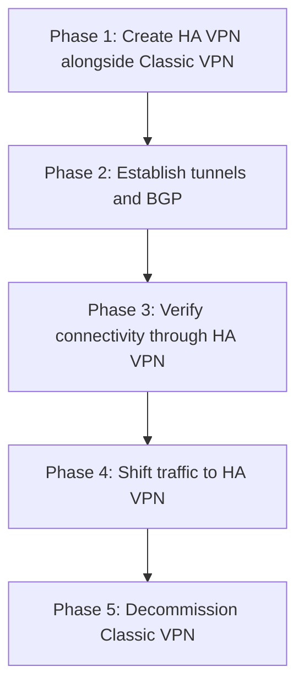

# How to Migrate from Classic VPN to HA VPN in GCP

Author: [nawazdhandala](https://www.github.com/nawazdhandala)

Tags: GCP, HA VPN, Classic VPN, Migration, Networking

Description: Plan and execute a migration from Classic VPN to HA VPN in GCP with minimal downtime, including tunnel setup, BGP configuration, and traffic cutover strategies.

---

Classic VPN in GCP is functional but lacks the redundancy and SLA guarantees of HA VPN. Classic VPN uses a single interface with one external IP, offers no built-in redundancy, and Google has been encouraging migration to HA VPN for years. If you are still running Classic VPN tunnels, migrating to HA VPN gives you a 99.99% SLA, dual interfaces for redundancy, and BGP support for dynamic routing.

The tricky part is doing the migration without significant downtime. This guide provides a practical migration strategy.

## Why Migrate?

Here is what you gain by moving from Classic to HA VPN:

| Feature | Classic VPN | HA VPN |
|---------|------------|--------|
| SLA | No SLA | 99.99% (with 2 tunnels) |
| Interfaces | 1 | 2 |
| Redundancy | None built-in | Active/active by default |
| Routing | Static or BGP | BGP (recommended) |
| IPv6 support | No | Yes |
| External IPs | You provide | Auto-assigned |

## Migration Strategy: Parallel Setup

The safest migration approach is to run HA VPN in parallel with Classic VPN, verify everything works, then decommission the Classic VPN. This avoids downtime because you never tear down the old VPN until the new one is fully operational.



## Phase 1: Inventory Your Classic VPN

First, document your current Classic VPN configuration:

```bash
# List existing Classic VPN gateways
gcloud compute target-vpn-gateways list \
  --project=your-project-id

# List existing VPN tunnels
gcloud compute vpn-tunnels list \
  --project=your-project-id \
  --format="table(name, region, peerIp, status, ikeVersion)"

# List static routes used by Classic VPN
gcloud compute routes list \
  --filter="nextHopVpnTunnel:*" \
  --format="table(name, destRange, nextHopVpnTunnel, priority)" \
  --project=your-project-id
```

Document:
- Peer gateway IP addresses
- Pre-shared keys
- IKE version
- Static routes (destination ranges)
- The VPC network and region

## Phase 2: Create the HA VPN Gateway

Create the HA VPN gateway on the same VPC network:

```bash
# Create a Cloud Router (if not already using one)
gcloud compute routers create ha-vpn-router \
  --network=your-vpc \
  --region=us-central1 \
  --asn=65001 \
  --project=your-project-id

# Create the HA VPN gateway
gcloud compute vpn-gateways create ha-vpn-gateway \
  --network=your-vpc \
  --region=us-central1 \
  --project=your-project-id

# Note the two external IPs assigned
gcloud compute vpn-gateways describe ha-vpn-gateway \
  --region=us-central1 \
  --format="yaml(vpnInterfaces)" \
  --project=your-project-id
```

## Phase 3: Configure the Peer Side

On your on-premises router, add the new HA VPN gateway IPs as additional peer tunnels. Do not remove the Classic VPN tunnel configuration yet.

```bash
# Register the peer gateway in GCP
gcloud compute external-vpn-gateways create on-prem-peer \
  --interfaces="0=203.0.113.1" \
  --project=your-project-id
```

## Phase 4: Create HA VPN Tunnels

Create tunnels from both HA VPN interfaces:

```bash
# Tunnel from interface 0
gcloud compute vpn-tunnels create ha-tunnel-0 \
  --vpn-gateway=ha-vpn-gateway \
  --peer-external-gateway=on-prem-peer \
  --peer-external-gateway-interface=0 \
  --interface=0 \
  --ike-version=2 \
  --shared-secret="new-shared-secret" \
  --router=ha-vpn-router \
  --region=us-central1 \
  --project=your-project-id

# Tunnel from interface 1
gcloud compute vpn-tunnels create ha-tunnel-1 \
  --vpn-gateway=ha-vpn-gateway \
  --peer-external-gateway=on-prem-peer \
  --peer-external-gateway-interface=0 \
  --interface=1 \
  --ike-version=2 \
  --shared-secret="new-shared-secret" \
  --router=ha-vpn-router \
  --region=us-central1 \
  --project=your-project-id
```

## Phase 5: Configure BGP Sessions

Set up BGP on the Cloud Router. This is a major improvement over static routes because routes will be dynamically managed:

```bash
# BGP interface and peer for tunnel 0
gcloud compute routers add-interface ha-vpn-router \
  --interface-name=ha-bgp-0 \
  --vpn-tunnel=ha-tunnel-0 \
  --ip-address=169.254.10.1 \
  --mask-length=30 \
  --region=us-central1

gcloud compute routers add-bgp-peer ha-vpn-router \
  --peer-name=on-prem-peer-0 \
  --interface=ha-bgp-0 \
  --peer-ip-address=169.254.10.2 \
  --peer-asn=65002 \
  --region=us-central1

# BGP interface and peer for tunnel 1
gcloud compute routers add-interface ha-vpn-router \
  --interface-name=ha-bgp-1 \
  --vpn-tunnel=ha-tunnel-1 \
  --ip-address=169.254.11.1 \
  --mask-length=30 \
  --region=us-central1

gcloud compute routers add-bgp-peer ha-vpn-router \
  --peer-name=on-prem-peer-1 \
  --interface=ha-bgp-1 \
  --peer-ip-address=169.254.11.2 \
  --peer-asn=65002 \
  --region=us-central1
```

Configure matching BGP sessions on your on-premises router.

## Phase 6: Verify HA VPN Is Working

Wait for tunnels to come up and BGP sessions to establish:

```bash
# Check tunnel status
gcloud compute vpn-tunnels list \
  --filter="name:ha-tunnel" \
  --format="table(name, status, peerIp)" \
  --project=your-project-id

# Check BGP session status
gcloud compute routers get-status ha-vpn-router \
  --region=us-central1 \
  --format="yaml(result.bgpPeerStatus)" \
  --project=your-project-id

# Verify routes are being learned via BGP
gcloud compute routers get-status ha-vpn-router \
  --region=us-central1 \
  --format="yaml(result.bestRoutesForRouter)" \
  --project=your-project-id
```

At this point, both Classic VPN and HA VPN are active. Traffic might flow through either, depending on route priorities.

## Phase 7: Test Traffic Through HA VPN

To verify traffic flows through the HA VPN, you can check the tunnel metrics:

```bash
# Check bytes sent through HA VPN tunnels
gcloud logging read \
  'resource.type="vpn_gateway" AND resource.labels.gateway_name="ha-vpn-gateway"' \
  --project=your-project-id \
  --freshness=30m \
  --limit=10
```

Run connectivity tests from GCP to on-premises:

```bash
# Test connectivity
gcloud compute ssh your-vm \
  --zone=us-central1-a \
  --command="ping -c 10 192.168.1.1 && traceroute 192.168.1.1" \
  --project=your-project-id
```

## Phase 8: Shift Traffic to HA VPN

If your Classic VPN uses static routes, you need to manage route priorities. BGP routes from HA VPN should take priority over static routes:

```bash
# Lower the priority of Classic VPN static routes (higher number = lower priority)
gcloud compute routes update classic-vpn-route-1 \
  --priority=2000 \
  --project=your-project-id
```

BGP routes from the HA VPN Cloud Router typically have a default priority of 100, which is higher priority than static routes with priority 1000+. This means traffic should automatically prefer the HA VPN path.

Monitor to confirm traffic has shifted:

```bash
# Check Classic VPN tunnel is now idle
gcloud compute vpn-tunnels describe classic-tunnel \
  --region=us-central1 \
  --format="yaml(status)" \
  --project=your-project-id
```

## Phase 9: Decommission Classic VPN

Once you have confirmed that all traffic is flowing through HA VPN and everything has been stable for at least a few days:

```bash
# Delete the Classic VPN tunnel
gcloud compute vpn-tunnels delete classic-tunnel \
  --region=us-central1 \
  --project=your-project-id

# Delete the static routes (no longer needed with BGP)
gcloud compute routes delete classic-vpn-route-1 \
  --project=your-project-id

# Delete the Classic VPN gateway forwarding rules
gcloud compute forwarding-rules delete classic-vpn-fr \
  --region=us-central1 \
  --project=your-project-id

# Delete the Classic VPN target gateway
gcloud compute target-vpn-gateways delete classic-vpn-gw \
  --region=us-central1 \
  --project=your-project-id

# Release the static IP used by Classic VPN
gcloud compute addresses delete classic-vpn-ip \
  --region=us-central1 \
  --project=your-project-id
```

Also clean up the corresponding tunnel configuration on your on-premises router.

## Rollback Plan

If something goes wrong during migration:

1. The Classic VPN is still active, so traffic can fall back to it
2. If BGP routes are causing issues, remove the HA VPN BGP peers
3. If HA VPN tunnels are unstable, delete them - Classic VPN takes over immediately
4. You can always recreate the HA VPN configuration and try again

The parallel approach means you always have a working VPN connection.

## Post-Migration Cleanup

After decommissioning Classic VPN:

- Remove the old on-premises tunnel configurations
- Update any documentation referencing the old VPN IPs
- Update monitoring and alerting to point to the HA VPN resources
- Verify that the HA VPN 99.99% SLA is met by checking both tunnels are active

## Wrapping Up

Migrating from Classic VPN to HA VPN is a one-time effort that significantly improves your VPN reliability. The parallel migration strategy ensures zero downtime by keeping the Classic VPN running until HA VPN is fully verified. The biggest improvement is moving from static routes to BGP, which eliminates the manual route management that is error-prone and slow to respond to failures. Once you complete the migration, you get automatic failover, dynamic routing, and a 99.99% SLA that Classic VPN simply cannot provide.
