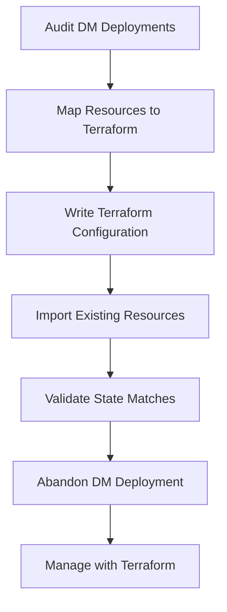

# How to Migrate from Deployment Manager to Terraform for GCP Infrastructure Management

Author: [nawazdhandala](https://www.github.com/nawazdhandala)

Tags: GCP, Deployment Manager, Terraform, Infrastructure as Code, Migration

Description: A practical guide to migrating your Google Cloud infrastructure management from Deployment Manager to Terraform with strategies for incremental migration and state management.

---

Deployment Manager served its purpose, but there are real reasons teams migrate to Terraform. Multi-cloud support, a richer module ecosystem, better state management, and a larger community are the most common motivators. Google itself has signaled that Terraform is the recommended path forward for infrastructure as code on GCP. But migrating is not as simple as rewriting your YAML in HCL - you need a strategy for handling existing resources without recreating them.

This guide walks through the migration process from planning through execution, including how to import existing resources into Terraform state.

## Why Migrate

Before diving into the how, let me be clear about the why. You should migrate if:

- You manage resources across multiple cloud providers
- You need advanced features like workspaces, remote backends, and policy-as-code
- Your team is growing and needs better collaboration tools
- You want access to the Terraform module registry
- You are hitting limitations with Deployment Manager's templating

If you are purely on GCP with simple deployments, Deployment Manager still works fine. Do not migrate for migration's sake.

## Migration Strategy

There are two approaches:

1. **Greenfield** - New resources go in Terraform. Old resources stay in Deployment Manager until they are replaced.
2. **Import** - Import existing resources into Terraform state and manage them going forward with Terraform.

Most teams use a combination: import critical long-lived resources (networks, clusters) and let transient resources (VMs in autoscaling groups) get recreated naturally.



## Step 1: Audit Your Deployment Manager Resources

Start by cataloging everything Deployment Manager manages.

```bash
# List all deployments
gcloud deployment-manager deployments list --project=YOUR_PROJECT_ID

# For each deployment, list its resources
gcloud deployment-manager deployments describe DEPLOYMENT_NAME \
    --project=YOUR_PROJECT_ID \
    --format="table(resources.name, resources.type, resources.id)"
```

Create a spreadsheet or document that maps each resource with:

- Deployment Manager resource name
- Resource type (e.g., `compute.v1.instance`)
- The corresponding Terraform resource type (e.g., `google_compute_instance`)
- The resource ID needed for Terraform import

## Step 2: Set Up the Terraform Project

Create a new Terraform project structure.

```bash
# Create the project directory
mkdir -p terraform-gcp/{modules,environments}
```

Set up the provider configuration.

```hcl
# terraform-gcp/main.tf
# Provider configuration for Google Cloud

terraform {
  required_version = ">= 1.5.0"

  required_providers {
    google = {
      source  = "hashicorp/google"
      version = "~> 5.0"
    }
  }

  # Configure remote state storage
  backend "gcs" {
    bucket = "YOUR_PROJECT_ID-terraform-state"
    prefix = "infrastructure"
  }
}

provider "google" {
  project = var.project_id
  region  = var.region
}

variable "project_id" {
  description = "The GCP project ID"
  type        = string
}

variable "region" {
  description = "The default GCP region"
  type        = string
  default     = "us-central1"
}
```

Create the state bucket.

```bash
# Create a GCS bucket for Terraform state
gsutil mb -l US gs://YOUR_PROJECT_ID-terraform-state
gsutil versioning set on gs://YOUR_PROJECT_ID-terraform-state
```

Initialize the Terraform project.

```bash
cd terraform-gcp
terraform init
```

## Step 3: Map Deployment Manager Types to Terraform Resources

Here is a mapping of common Deployment Manager types to their Terraform equivalents.

| Deployment Manager Type | Terraform Resource |
|------------------------|--------------------|
| `compute.v1.instance` | `google_compute_instance` |
| `compute.v1.network` | `google_compute_network` |
| `compute.v1.subnetwork` | `google_compute_subnetwork` |
| `compute.v1.firewall` | `google_compute_firewall` |
| `compute.v1.address` | `google_compute_address` |
| `storage.v1.bucket` | `google_storage_bucket` |
| `sqladmin.v1beta4.instance` | `google_sql_database_instance` |
| `container.v1.cluster` | `google_container_cluster` |
| `pubsub.v1.topic` | `google_pubsub_topic` |
| `iam.v1.serviceAccount` | `google_service_account` |

## Step 4: Write Terraform Configuration for Existing Resources

For each resource you want to import, write the Terraform configuration that matches its current state.

### Example: VPC Network

If your Deployment Manager configuration has this.

```yaml
# DM config
resources:
- name: prod-vpc
  type: compute.v1.network
  properties:
    autoCreateSubnetworks: false
    routingConfig:
      routingMode: REGIONAL
```

Write the equivalent Terraform configuration.

```hcl
# network.tf
# VPC Network - migrated from Deployment Manager

resource "google_compute_network" "prod_vpc" {
  name                    = "prod-vpc"
  auto_create_subnetworks = false
  routing_mode            = "REGIONAL"
}
```

### Example: Compute Instance

Deployment Manager.

```yaml
resources:
- name: web-server
  type: compute.v1.instance
  properties:
    zone: us-central1-a
    machineType: zones/us-central1-a/machineTypes/e2-medium
    disks:
    - deviceName: boot
      type: PERSISTENT
      boot: true
      autoDelete: true
      initializeParams:
        sourceImage: projects/debian-cloud/global/images/family/debian-12
        diskSizeGb: 50
    networkInterfaces:
    - network: global/networks/prod-vpc
      subnetwork: regions/us-central1/subnetworks/web-subnet
    tags:
      items:
      - http-server
```

Terraform equivalent.

```hcl
# instances.tf
# Web server - migrated from Deployment Manager

resource "google_compute_instance" "web_server" {
  name         = "web-server"
  machine_type = "e2-medium"
  zone         = "us-central1-a"

  boot_disk {
    auto_delete = true
    initialize_params {
      image = "debian-cloud/debian-12"
      size  = 50
    }
  }

  network_interface {
    network    = google_compute_network.prod_vpc.self_link
    subnetwork = google_compute_subnetwork.web_subnet.self_link
  }

  tags = ["http-server"]
}
```

### Example: Firewall Rules

```hcl
# firewall.tf
# Firewall rules - migrated from Deployment Manager

resource "google_compute_firewall" "allow_http" {
  name    = "allow-http"
  network = google_compute_network.prod_vpc.name

  allow {
    protocol = "tcp"
    ports    = ["80", "443"]
  }

  source_ranges = ["0.0.0.0/0"]
  target_tags   = ["http-server"]
}

resource "google_compute_firewall" "allow_ssh" {
  name    = "allow-ssh"
  network = google_compute_network.prod_vpc.name

  allow {
    protocol = "tcp"
    ports    = ["22"]
  }

  source_ranges = ["0.0.0.0/0"]
  target_tags   = ["ssh-server"]
}
```

## Step 5: Import Existing Resources

This is the critical step. Import tells Terraform to adopt existing resources into its state without recreating them.

```bash
# Import the VPC network
terraform import google_compute_network.prod_vpc projects/YOUR_PROJECT_ID/global/networks/prod-vpc

# Import the subnet
terraform import google_compute_subnetwork.web_subnet projects/YOUR_PROJECT_ID/regions/us-central1/subnetworks/web-subnet

# Import the compute instance
terraform import google_compute_instance.web_server YOUR_PROJECT_ID/us-central1-a/web-server

# Import the firewall rules
terraform import google_compute_firewall.allow_http YOUR_PROJECT_ID/allow-http
terraform import google_compute_firewall.allow_ssh YOUR_PROJECT_ID/allow-ssh
```

Each resource type has its own import ID format. Check the Terraform Google provider documentation for the exact format.

## Step 6: Validate the Import

After importing, run a plan to check for differences.

```bash
# Run terraform plan to see if the config matches the actual state
terraform plan
```

If the plan shows no changes, your Terraform configuration perfectly matches the existing resources. If it shows changes, you need to adjust your Terraform configuration to match the actual resource state.

Common differences you will see:

- **Default values** - Deployment Manager might not set values that Terraform expects explicitly
- **Computed fields** - Some fields are set by GCP and need to be included in your config or ignored with lifecycle rules
- **Naming differences** - Self-links vs names vs IDs

Fix any differences until `terraform plan` shows no changes.

```hcl
# Sometimes you need lifecycle rules to ignore computed fields
resource "google_compute_instance" "web_server" {
  # ... configuration ...

  lifecycle {
    ignore_changes = [
      metadata["ssh-keys"],
      boot_disk[0].initialize_params[0].image,
    ]
  }
}
```

## Step 7: Abandon the Deployment Manager Deployment

Once Terraform is managing the resources, remove them from Deployment Manager without deleting the actual resources.

```bash
# Abandon the deployment - removes DM management but keeps resources
gcloud deployment-manager deployments delete DEPLOYMENT_NAME \
    --delete-policy=ABANDON \
    --project=YOUR_PROJECT_ID
```

The `--delete-policy=ABANDON` flag is critical. Without it, Deployment Manager would delete the actual cloud resources.

## Step 8: Convert Templates to Terraform Modules

If you had Jinja or Python templates in Deployment Manager, convert them to Terraform modules.

### Deployment Manager Jinja Template

```jinja
{# vm-template.jinja #}
resources:
- name: {{ env["name"] }}
  type: compute.v1.instance
  properties:
    zone: {{ properties["zone"] }}
    machineType: zones/{{ properties["zone"] }}/machineTypes/{{ properties["machineType"] }}
```

### Equivalent Terraform Module

```hcl
# modules/vm-instance/main.tf
# Reusable VM instance module

variable "name" {
  type = string
}

variable "zone" {
  type = string
}

variable "machine_type" {
  type    = string
  default = "e2-small"
}

variable "image" {
  type    = string
  default = "debian-cloud/debian-12"
}

variable "network" {
  type = string
}

variable "tags" {
  type    = list(string)
  default = []
}

resource "google_compute_instance" "instance" {
  name         = var.name
  machine_type = var.machine_type
  zone         = var.zone

  boot_disk {
    initialize_params {
      image = var.image
    }
  }

  network_interface {
    network = var.network
  }

  tags = var.tags
}

output "instance_ip" {
  value = google_compute_instance.instance.network_interface[0].network_ip
}

output "self_link" {
  value = google_compute_instance.instance.self_link
}
```

Use the module.

```hcl
# main.tf
# Using the VM module for multiple instances

module "web_server_1" {
  source       = "./modules/vm-instance"
  name         = "web-1"
  zone         = "us-central1-a"
  machine_type = "e2-medium"
  network      = google_compute_network.prod_vpc.name
  tags         = ["http-server"]
}

module "web_server_2" {
  source       = "./modules/vm-instance"
  name         = "web-2"
  zone         = "us-central1-b"
  machine_type = "e2-medium"
  network      = google_compute_network.prod_vpc.name
  tags         = ["http-server"]
}
```

## Migration Tips from Experience

**Migrate one deployment at a time.** Do not try to migrate everything at once. Start with a low-risk deployment, get comfortable with the process, then move to critical infrastructure.

**Use terraform plan religiously.** After every import, run a plan. Any differences between your config and the actual state mean the import is not complete. Fix every difference before proceeding.

**Keep Deployment Manager running during migration.** Do not delete DM deployments until Terraform is confirmed working. The abandon policy lets you hand off management without deleting resources.

**Watch for dependencies.** If Deployment Manager resource A references resource B, import them in the right order. Import the dependency first.

**Automate the import process.** For large deployments with many resources, write a script that generates the import commands from the DM deployment manifest.

```bash
#!/bin/bash
# generate-imports.sh
# Generates terraform import commands from a DM deployment

DEPLOYMENT=$1
PROJECT=$2

gcloud deployment-manager deployments describe $DEPLOYMENT \
    --project=$PROJECT \
    --format=json | python3 -c "
import json, sys
data = json.load(sys.stdin)
for resource in data.get('resources', []):
    rtype = resource['type']
    name = resource['name']
    rid = resource.get('id', '')
    # Map DM types to terraform import commands
    # Extend this mapping as needed
    if rtype == 'compute.v1.instance':
        print(f'terraform import google_compute_instance.{name} {PROJECT}/{rid}')
    elif rtype == 'compute.v1.network':
        print(f'terraform import google_compute_network.{name} projects/{PROJECT}/global/networks/{name}')
"
```

The migration from Deployment Manager to Terraform is a one-time investment that pays off in better tooling, broader ecosystem support, and a path to multi-cloud management. Take it step by step, validate thoroughly at each stage, and you will have a smooth transition.
