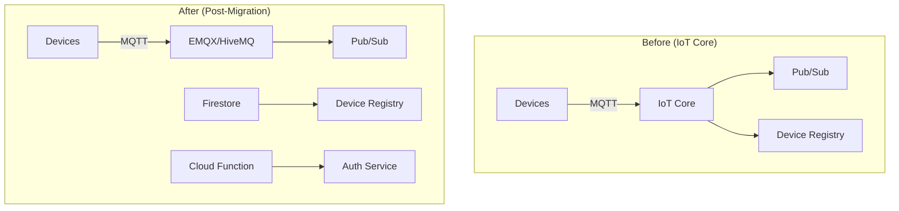

# How to Migrate from Google Cloud IoT Core to a Pub/Sub-Based Device Messaging Architecture

Author: [nawazdhandala](https://www.github.com/nawazdhandala)

Tags: GCP, IoT Core, Migration, Pub/Sub, MQTT

Description: Step-by-step guide to migrating your IoT workloads from the retired Google Cloud IoT Core to a Pub/Sub-based architecture with third-party MQTT brokers.

---

Google Cloud IoT Core was retired on August 16, 2023. If you are still running on it or planning a migration, you need to move to an alternative architecture. The good news is that the downstream components of most IoT Core setups (Pub/Sub, Dataflow, BigQuery) remain unchanged. The migration primarily involves replacing IoT Core's device connectivity and authentication layer.

This guide covers the full migration path, including device re-registration, protocol changes, authentication updates, and testing strategies.

## What IoT Core Provided

IoT Core handled four things:

1. **Device registry** - a database of registered devices with their public keys
2. **MQTT/HTTP bridge** - protocol endpoints for device communication
3. **Authentication** - JWT-based device authentication using per-device keys
4. **Device state and config** - cloud-to-device configuration and device-to-cloud state reporting

You need to replace each of these capabilities.

## Migration Architecture



## Prerequisites

- Existing IoT Core setup with devices connected
- GCP project with Pub/Sub, Firestore, Cloud Functions, and Compute Engine APIs enabled
- Ability to update firmware on your devices (or at least their configuration)

## Step 1: Export Your Device Registry

Before IoT Core goes away completely, export your device registry:

```python
# export_registry.py - Exports all devices from IoT Core to Firestore

from google.cloud import iot_v1
from google.cloud import firestore
import json

# Initialize clients
iot_client = iot_v1.DeviceManagerClient()
db = firestore.Client()

PROJECT_ID = "your-project"
REGION = "us-central1"
REGISTRY_ID = "your-registry"

def export_devices():
    """Exports all devices from IoT Core registry to Firestore.
    Preserves device IDs, credentials, and metadata."""

    parent = f"projects/{PROJECT_ID}/locations/{REGION}/registries/{REGISTRY_ID}"

    # List all devices in the registry
    devices = iot_client.list_devices(request={"parent": parent})

    count = 0
    for device in devices:
        # Get full device details including credentials
        device_path = f"{parent}/devices/{device.id}"
        full_device = iot_client.get_device(request={"name": device_path})

        # Extract credentials (public keys)
        credentials = []
        for cred in full_device.credentials:
            credentials.append({
                "public_key": cred.public_key.key,
                "format": cred.public_key.format.name,
                "expiration": cred.expiration_time.isoformat()
                if cred.expiration_time else None,
            })

        # Store in Firestore
        device_doc = {
            "device_id": device.id,
            "numeric_id": device.num_id,
            "credentials": credentials,
            "metadata": dict(full_device.metadata) if full_device.metadata else {},
            "blocked": full_device.blocked,
            "last_event_time": full_device.last_event_time.isoformat()
                if full_device.last_event_time else None,
            "last_state_time": full_device.last_state_time.isoformat()
                if full_device.last_state_time else None,
            "migrated": False,
            "migration_date": None,
        }

        db.collection("device_registry").document(device.id).set(device_doc)
        count += 1

    print(f"Exported {count} devices to Firestore")

export_devices()
```

## Step 2: Deploy the MQTT Broker

Choose an MQTT broker that supports your scale requirements. For this guide, I will use EMQX, but HiveMQ, Mosquitto, and VerneMQ are also solid options.

```bash
# Create a GKE cluster for the MQTT broker (for production)
gcloud container clusters create mqtt-cluster \
  --zone=us-central1-a \
  --num-nodes=3 \
  --machine-type=e2-standard-4

# Or for a simpler setup, use a single Compute Engine instance
gcloud compute instances create mqtt-broker \
  --zone=us-central1-a \
  --machine-type=e2-standard-4 \
  --image-family=ubuntu-2204-lts \
  --image-project=ubuntu-os-cloud \
  --boot-disk-size=100GB \
  --tags=mqtt-broker
```

Install and configure EMQX with Pub/Sub integration:

```bash
# SSH into the instance and install EMQX
sudo apt-get update
curl -s https://assets.emqx.com/scripts/install-emqx-deb.sh | sudo bash
sudo apt-get install -y emqx

# Configure TLS (reuse IoT Core root CA if your devices trust it)
sudo mkdir -p /etc/emqx/certs
# Copy your TLS certificates to /etc/emqx/certs/

sudo systemctl start emqx
sudo systemctl enable emqx
```

## Step 3: Build the Authentication Bridge

IoT Core used JWTs signed with device private keys for authentication. You can preserve this pattern:

```python
# auth_bridge/main.py - Authenticates devices using the migrated registry

import json
import jwt
from google.cloud import firestore
import functions_framework

db = firestore.Client()

@functions_framework.http
def authenticate(request):
    """HTTP endpoint called by the MQTT broker's auth webhook.
    Validates device JWTs against the migrated device registry."""

    body = request.get_json()
    username = body.get("username", "")  # Device ID
    password = body.get("password", "")  # JWT token

    if not username or not password:
        return json.dumps({"result": "deny"}), 200

    # Look up the device in our Firestore registry
    doc = db.collection("device_registry").document(username).get()
    if not doc.exists:
        return json.dumps({"result": "deny", "reason": "unknown device"}), 200

    device = doc.to_dict()

    # Check if the device is blocked
    if device.get("blocked", False):
        return json.dumps({"result": "deny", "reason": "device blocked"}), 200

    # Verify the JWT against the device's registered public key
    for cred in device.get("credentials", []):
        try:
            public_key = cred["public_key"]

            # IoT Core supported RS256 and ES256
            algorithms = ["RS256", "ES256"]

            decoded = jwt.decode(
                password,
                public_key,
                algorithms=algorithms,
                options={"verify_aud": False},
            )

            # JWT is valid - update last seen timestamp
            db.collection("device_registry").document(username).update({
                "last_authenticated": firestore.SERVER_TIMESTAMP,
                "migrated": True,
            })

            return json.dumps({"result": "allow"}), 200

        except jwt.InvalidTokenError:
            continue

    return json.dumps({"result": "deny", "reason": "invalid credentials"}), 200
```

Configure EMQX to use this authentication webhook:

```yaml
# EMQX auth webhook configuration
# Add to /etc/emqx/emqx.conf
authentication = [
  {
    mechanism = password_based
    backend = http
    method = post
    url = "https://us-central1-YOUR_PROJECT.cloudfunctions.net/authenticate"
    headers {
      content-type = "application/json"
    }
    body {
      username = "${username}"
      password = "${password}"
    }
  }
]
```

## Step 4: Map IoT Core Topics to MQTT Topics

IoT Core used a specific topic structure. Map those to your new MQTT broker:

| IoT Core Topic | New MQTT Topic | Direction |
|---------------|----------------|-----------|
| `/devices/{id}/events` | `devices/{id}/telemetry` | Device to Cloud |
| `/devices/{id}/state` | `devices/{id}/state` | Device to Cloud |
| `/devices/{id}/config` | `devices/{id}/config` | Cloud to Device |
| `/devices/{id}/commands/#` | `devices/{id}/commands/#` | Cloud to Device |

Configure the EMQX rule engine to forward to Pub/Sub:

```sql
-- Rule to forward telemetry to Pub/Sub
-- This maps all device telemetry messages to the Pub/Sub topic
SELECT
  payload,
  clientid as device_id,
  topic
FROM
  "devices/+/telemetry"
```

## Step 5: Update Device Firmware

The device-side changes are minimal. The main differences are:

1. MQTT endpoint changes from `mqtt.googleapis.com` to your broker address
2. The username field now holds the device ID (IoT Core used a specific format)
3. The JWT audience field changes

Here is a before/after comparison:

```python
# BEFORE - IoT Core connection
# Device connected to Google's managed MQTT endpoint
client.connect("mqtt.googleapis.com", 8883)
client.username_pw_set(
    username="unused",  # IoT Core ignored the username
    password=create_jwt(project_id, private_key)
)
client.publish(f"/devices/{device_id}/events", payload)

# AFTER - Direct MQTT broker connection
# Device connects to your self-managed MQTT broker
client.connect("mqtt-broker.your-domain.com", 8883)
client.username_pw_set(
    username=device_id,  # Used for looking up the device in the registry
    password=create_jwt(project_id, private_key)
)
client.publish(f"devices/{device_id}/telemetry", payload)
```

## Step 6: Migrate in Phases

Do not migrate all devices at once. Use a phased approach:

```python
# migration_tracker.py - Tracks migration progress

from google.cloud import firestore

db = firestore.Client()

def get_migration_status():
    """Reports on the migration progress of the device fleet."""

    total = 0
    migrated = 0
    blocked = 0

    devices = db.collection("device_registry").stream()
    for device in devices:
        data = device.to_dict()
        total += 1
        if data.get("migrated"):
            migrated += 1
        if data.get("blocked"):
            blocked += 1

    print(f"Total devices: {total}")
    print(f"Migrated: {migrated}")
    print(f"Remaining: {total - migrated - blocked}")
    print(f"Blocked: {blocked}")
    print(f"Progress: {migrated / total * 100:.1f}%")

get_migration_status()
```

## Step 7: Validate the Migration

After migrating a batch of devices, verify data is flowing correctly:

```bash
# Compare message counts between old and new pipelines
# Check the old IoT Core Pub/Sub subscription
gcloud pubsub subscriptions pull old-telemetry-sub --auto-ack --limit=1

# Check the new pipeline subscription
gcloud pubsub subscriptions pull new-telemetry-sub --auto-ack --limit=1

# Compare message formats
bq query --use_legacy_sql=false '
SELECT
  source_pipeline,
  COUNT(*) as message_count,
  COUNT(DISTINCT device_id) as unique_devices
FROM iot_data.sensor_readings
WHERE timestamp > TIMESTAMP_SUB(CURRENT_TIMESTAMP(), INTERVAL 1 HOUR)
GROUP BY source_pipeline
'
```

## Common Migration Issues

1. **Clock skew**: IoT Core was lenient about JWT timestamps. Your custom auth might be stricter. Add a 5-minute tolerance.
2. **Topic format**: IoT Core topics started with `/devices/`. New topics typically drop the leading slash.
3. **QoS levels**: IoT Core only supported QoS 0 and 1. Your new broker likely supports QoS 2 as well, but existing devices will not use it.
4. **Connection limits**: Size your broker to handle your peak concurrent connections, plus headroom for reconnection storms.

## Wrapping Up

Migrating from IoT Core is primarily a device connectivity change. Your downstream pipeline (Pub/Sub, Dataflow, BigQuery) stays exactly the same. The main work is deploying and operating an MQTT broker, building an authentication layer, and updating device firmware. The migration gives you more control and flexibility - features like MQTT 5.0 support, retained messages, and shared subscriptions that IoT Core never offered.
