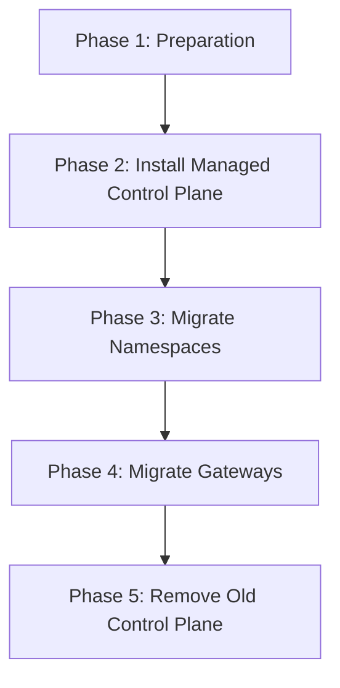

# How to Migrate from Istio Open Source to Google Cloud Managed Service Mesh

Author: [nawazdhandala](https://www.github.com/nawazdhandala)

Tags: GCP, Cloud Service Mesh, Istio, Migration, GKE

Description: A practical migration guide for moving from self-managed Istio open source to Google Cloud Managed Service Mesh without downtime or service disruption.

---

Running self-managed Istio in production is a serious operational commitment. You handle version upgrades, control plane scaling, security patches, and debugging when things go wrong. Google Cloud Managed Service Mesh takes all of that off your plate while keeping the same Istio API surface. The migration is not trivial, but it is doable with zero downtime if you plan it correctly.

This guide walks through the complete migration process from a self-managed Istio installation to Google Cloud Managed Service Mesh on GKE.

## Migration Strategy Overview

The migration uses a revision-based approach. You install the managed control plane alongside your existing Istio control plane, migrate workloads namespace by namespace, and then remove the old control plane. At no point do you have a gap in mesh coverage.



## Prerequisites

Before starting, verify these requirements:

- GKE cluster running version 1.25 or later
- Workload Identity enabled on the cluster
- VPC-native networking (alias IP ranges)
- Cluster registered with a GKE Fleet
- Current Istio version is 1.17 or later (for API compatibility)

```bash
# Check current Istio version
istioctl version

# Check cluster configuration
gcloud container clusters describe YOUR_CLUSTER \
    --zone=YOUR_ZONE \
    --project=YOUR_PROJECT \
    --format="yaml(workloadIdentityConfig, ipAllocationPolicy, releaseChannel)"
```

## Phase 1: Preparation

### Audit Your Current Configuration

First, catalog everything you have in your current Istio installation.

```bash
# List all Istio custom resources across the cluster
for crd in $(kubectl get crd | grep istio.io | awk '{print $1}'); do
    echo "=== $crd ==="
    kubectl get $(echo $crd | sed 's/.istio.io//') --all-namespaces 2>/dev/null
done
```

This gives you an inventory of:
- VirtualServices
- DestinationRules
- Gateways
- PeerAuthentication policies
- AuthorizationPolicies
- ServiceEntries
- EnvoyFilters

Document each resource and note any custom EnvoyFilters, as these are the most likely to have compatibility issues.

### Check for Unsupported Features

Cloud Managed Service Mesh supports the standard Istio API, but some advanced configurations may need adjustment.

```bash
# Check for EnvoyFilters that might need modification
kubectl get envoyfilter --all-namespaces -o yaml

# Check for custom Istio operator configurations
kubectl get istiooperator --all-namespaces -o yaml
```

EnvoyFilters that reference specific Envoy filter versions or internal configuration structures may need updates for the managed mesh version.

### Enable Required APIs

```bash
# Enable APIs needed for managed mesh
gcloud services enable \
    mesh.googleapis.com \
    gkehub.googleapis.com \
    monitoring.googleapis.com \
    logging.googleapis.com \
    cloudtrace.googleapis.com \
    meshca.googleapis.com \
    meshconfig.googleapis.com \
    --project=YOUR_PROJECT_ID
```

### Register the Cluster with Fleet

If your cluster is not already registered with a Fleet.

```bash
# Register the cluster
gcloud container fleet memberships register YOUR_CLUSTER \
    --gke-cluster=YOUR_ZONE/YOUR_CLUSTER \
    --enable-workload-identity \
    --project=YOUR_PROJECT_ID
```

## Phase 2: Install the Managed Control Plane

Enable the Service Mesh feature and apply the managed control plane.

```bash
# Enable the mesh feature
gcloud container fleet mesh enable --project=YOUR_PROJECT_ID

# Apply the managed control plane
gcloud container fleet mesh update \
    --management=automatic \
    --memberships=YOUR_CLUSTER \
    --project=YOUR_PROJECT_ID
```

Wait for the managed control plane to become active.

```bash
# Monitor the provisioning status
gcloud container fleet mesh describe --project=YOUR_PROJECT_ID
```

Verify that the managed revision is installed alongside your existing Istio revision.

```bash
# List all control plane revisions
kubectl get controlplanerevision -n istio-system

# You should see both your old revision and the new asm-managed revision
kubectl get mutatingwebhookconfiguration | grep istio
```

At this point, you have two control planes running side by side. Your existing workloads continue to use the old Istio control plane.

## Phase 3: Migrate Namespaces

Migrate workloads one namespace at a time. This is the critical phase - take it slow and verify each namespace before moving to the next.

### Step 1: Migrate a Test Namespace First

Pick a low-risk namespace for the first migration.

```bash
# Check the current injection label
kubectl get namespace test-ns --show-labels

# Remove the old injection label and add the managed one
kubectl label namespace test-ns istio-injection- --overwrite
kubectl label namespace test-ns istio.io/rev=asm-managed --overwrite
```

### Step 2: Restart Pods to Pick Up the New Control Plane

```bash
# Restart all deployments in the namespace
kubectl rollout restart deployment -n test-ns

# Wait for pods to be ready
kubectl get pods -n test-ns -w
```

### Step 3: Verify the Migration

Check that pods are connected to the managed control plane.

```bash
# Check proxy status - pods should show the asm-managed revision
istioctl proxy-status | grep test-ns

# Verify the sidecar version matches the managed version
kubectl get pods -n test-ns -o jsonpath='{range .items[*]}{.metadata.name}{"\t"}{range .spec.containers[?(@.name=="istio-proxy")]}{.image}{end}{"\n"}{end}'
```

Test that service-to-service communication still works.

```bash
# Run a connectivity test from a pod in the migrated namespace
kubectl exec -it deploy/test-app -n test-ns -c test-app -- \
    curl -s http://another-service.test-ns:8080/health
```

### Step 4: Migrate Remaining Namespaces

Once the test namespace is confirmed working, migrate the remaining namespaces one by one.

```bash
# Migration script for all namespaces
NAMESPACES="namespace-1 namespace-2 namespace-3"

for ns in $NAMESPACES; do
    echo "Migrating $ns..."

    # Update labels
    kubectl label namespace $ns istio-injection- --overwrite 2>/dev/null
    kubectl label namespace $ns istio.io/rev=asm-managed --overwrite

    # Restart deployments
    kubectl rollout restart deployment -n $ns

    # Wait for rollout to complete
    kubectl rollout status deployment --all -n $ns --timeout=300s

    echo "$ns migration complete"
    echo "---"
done
```

Verify each namespace after migration. Do not rush this step.

## Phase 4: Migrate Gateways

Ingress and egress gateways need special attention because they handle external traffic.

### Deploy New Gateway Pods

Create new gateway deployments that use the managed control plane injection.

```yaml
# managed-gateway.yaml
# Ingress gateway using the managed control plane
apiVersion: apps/v1
kind: Deployment
metadata:
  name: istio-ingressgateway-managed
  namespace: istio-system
spec:
  replicas: 2
  selector:
    matchLabels:
      app: istio-ingressgateway-managed
      istio: ingressgateway
  template:
    metadata:
      annotations:
        inject.istio.io/templates: gateway
      labels:
        app: istio-ingressgateway-managed
        istio: ingressgateway
    spec:
      containers:
      - name: istio-proxy
        image: auto
        resources:
          requests:
            cpu: 200m
            memory: 256Mi
```

### Shift Traffic to the New Gateway

Update the gateway Service to point to the new deployment.

```bash
# Update the gateway service selector to include the new deployment
kubectl patch service istio-ingressgateway -n istio-system \
    --type='json' \
    -p='[{"op": "replace", "path": "/spec/selector/app", "value": "istio-ingressgateway-managed"}]'
```

Verify that traffic is flowing through the new gateway.

```bash
# Check the new gateway pods are receiving traffic
kubectl logs -l app=istio-ingressgateway-managed -n istio-system -f
```

### Remove the Old Gateway

Once you confirm the new gateway is handling all traffic.

```bash
# Delete the old gateway deployment
kubectl delete deployment istio-ingressgateway-old -n istio-system
```

## Phase 5: Remove the Old Control Plane

After all namespaces and gateways are migrated to the managed control plane, remove the old self-managed Istio installation.

### Verify Everything Is Migrated

```bash
# Check that no pods are still using the old control plane
istioctl proxy-status | grep -v "asm-managed"

# If this shows any pods, they still need to be migrated
```

### Remove Old Istio

```bash
# If you installed with istioctl
istioctl uninstall --revision YOUR_OLD_REVISION

# If you installed with Helm
helm uninstall istio-base -n istio-system
helm uninstall istiod -n istio-system

# Clean up any remaining resources
kubectl delete istiooperator --all -n istio-system
```

### Clean Up

```bash
# Remove old webhook configurations
kubectl delete mutatingwebhookconfiguration istio-sidecar-injector-YOUR_OLD_REVISION 2>/dev/null

# Remove old validation webhook
kubectl delete validatingwebhookconfiguration istio-validator-YOUR_OLD_REVISION 2>/dev/null

# Remove any orphaned Istio resources
kubectl delete configmap istio-YOUR_OLD_REVISION -n istio-system 2>/dev/null
```

## Post-Migration Verification

Run a comprehensive verification to confirm the migration is complete.

```bash
# Check all proxy statuses
istioctl proxy-status

# Run istioctl analyze for configuration issues
istioctl analyze --all-namespaces

# Check the mesh dashboard in Cloud Console
echo "Visit: https://console.cloud.google.com/anthos/services"

# Verify telemetry is flowing to Cloud Monitoring
gcloud monitoring dashboards list --project=YOUR_PROJECT_ID | grep -i mesh
```

## Rollback Plan

If something goes wrong during migration, you can roll back individual namespaces.

```bash
# Roll back a namespace to the old control plane
kubectl label namespace problem-ns istio.io/rev- --overwrite
kubectl label namespace problem-ns istio-injection=enabled --overwrite
kubectl rollout restart deployment -n problem-ns
```

Keep the old control plane running until you have verified all namespaces are working correctly on the managed mesh. Only remove it once you are confident.

## Things I Learned from This Migration

**Migrate during low-traffic periods.** The pod restarts during namespace migration cause brief connection drops. Schedule for your lowest-traffic window.

**Watch for certificate issues.** The managed mesh uses a different CA (Mesh CA) than your self-managed Istio. During the transition, pods on different control planes may have certificates from different CAs. Permissive mTLS mode handles this, but strict mode can cause issues.

**EnvoyFilters are the biggest risk.** Custom EnvoyFilters that work with one Envoy version may not work with the managed mesh's Envoy version. Test these thoroughly.

**Keep the old control plane running longer than you think you need.** It is much easier to roll back a single namespace than to reinstall the entire old control plane. Give yourself at least a week of overlap.

The migration from self-managed Istio to Cloud Managed Service Mesh is a significant operational improvement. You trade the complexity of managing the control plane for the simplicity of Google handling it, while keeping the same API surface and configuration your team already knows.
