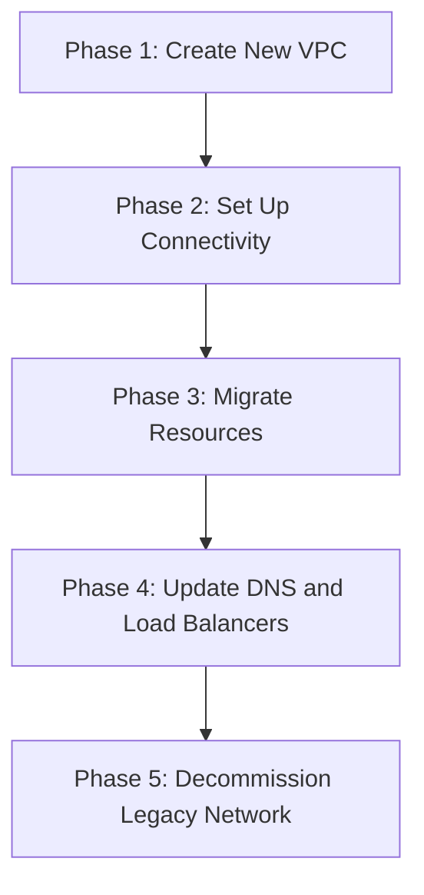

# How to Migrate from Legacy Networks to Custom Mode VPC in GCP

Author: [nawazdhandala](https://www.github.com/nawazdhandala)

Tags: GCP, VPC, Legacy Network, Migration, Networking

Description: A practical guide to migrating from GCP legacy networks to modern custom mode VPC networks, including planning, resource migration, and minimizing downtime during the transition.

---

If you have been running workloads in GCP for a long time, you might still have resources on a legacy network. Legacy networks are the old-style GCP networks that predate VPC - they have a single global IP range, no subnets, and lack many features that modern VPC networks provide. Google has been pushing users to migrate off legacy networks for years, and with good reason. Legacy networks do not support features like VPC peering, Private Google Access, alias IP ranges, Shared VPC, or VPC Flow Logs.

In this post, I will walk through the migration process from a legacy network to a custom mode VPC, including how to plan the transition, move resources, and minimize downtime.

## What Makes Legacy Networks Different

Legacy networks have these characteristics:

- **No subnets**: VMs get IPs from a single flat address space. There are no regional subnets.
- **IP ranges assigned per VM**: Each VM specifies its own IP range at creation time.
- **No secondary IP ranges**: Cannot be used with GKE VPC-native clusters.
- **Missing features**: No VPC peering, no Private Google Access, no Shared VPC, no VPC Flow Logs, no alias IPs.
- **Cannot be converted in place**: Unlike auto mode VPCs that can be converted to custom mode, legacy networks cannot be converted. You must create a new VPC and migrate resources.

Check if you have a legacy network:

```bash
# List all networks and their types
gcloud compute networks list \
  --format="table(name, subnet_mode, autoCreateSubnetworks, IPv4Range)"
```

Legacy networks show `LEGACY` as the subnet mode and have an `IPv4Range` field (modern VPCs do not).

## Planning the Migration

Since you cannot convert a legacy network in place, the migration involves creating a new VPC, moving resources over, and decommissioning the old network. Here is the high-level plan:



### Phase 1: Create the New Custom Mode VPC

```bash
# Create a new custom mode VPC to replace the legacy network
gcloud compute networks create modern-vpc \
  --subnet-mode=custom \
  --bgp-routing-mode=global \
  --description="Replacement for legacy network"
```

Create subnets in every region where you have VMs on the legacy network:

```bash
# Find which regions have VMs on the legacy network
gcloud compute instances list \
  --filter="networkInterfaces[].network:legacy-network" \
  --format="table(name, zone, networkInterfaces[0].networkIP)" \
  --sort-by=zone
```

```bash
# Create subnets in those regions with appropriate IP ranges
gcloud compute networks subnets create modern-us-central1 \
  --network=modern-vpc \
  --region=us-central1 \
  --range=10.10.0.0/20 \
  --enable-private-ip-google-access \
  --enable-flow-logs

gcloud compute networks subnets create modern-us-east1 \
  --network=modern-vpc \
  --region=us-east1 \
  --range=10.20.0.0/20 \
  --enable-private-ip-google-access \
  --enable-flow-logs
```

### Phase 2: Set Up Temporary Connectivity

During migration, you need VMs on both networks to communicate. Since legacy networks do not support VPC peering, you have limited options:

**Option A: Dual-NIC VM as a bridge**

```bash
# Create a VM with interfaces in both networks
gcloud compute instances create bridge-vm \
  --zone=us-central1-a \
  --machine-type=e2-medium \
  --network-interface=network=legacy-network \
  --network-interface=network=modern-vpc,subnet=modern-us-central1 \
  --can-ip-forward \
  --image-family=debian-12 \
  --image-project=debian-cloud
```

Configure the bridge VM to forward traffic:

```bash
# On the bridge VM, enable IP forwarding
sudo sysctl -w net.ipv4.ip_forward=1
echo "net.ipv4.ip_forward=1" | sudo tee -a /etc/sysctl.conf

# Set up routing between the two interfaces
sudo iptables -A FORWARD -i eth0 -o eth1 -j ACCEPT
sudo iptables -A FORWARD -i eth1 -o eth0 -j ACCEPT
sudo iptables -t nat -A POSTROUTING -o eth0 -j MASQUERADE
sudo iptables -t nat -A POSTROUTING -o eth1 -j MASQUERADE
```

**Option B: External IPs (temporary)**

For short migrations, give VMs external IPs and communicate over the internet. This is simpler but less secure and slower.

### Phase 3: Migrate Resources

This is the main phase. For each resource type, the approach differs.

#### Migrating VM Instances

VMs cannot be moved between networks while running. You need to stop them, snapshot the disks, create new VMs on the new network, and attach the disks:

```bash
# Step 1: Create a snapshot of the VM's boot disk
gcloud compute disks snapshot legacy-vm-disk \
  --zone=us-central1-a \
  --snapshot-names=legacy-vm-snapshot

# Step 2: Create a new disk from the snapshot
gcloud compute disks create modern-vm-disk \
  --zone=us-central1-a \
  --source-snapshot=legacy-vm-snapshot

# Step 3: Create the new VM on the modern VPC using the disk
gcloud compute instances create modern-vm \
  --zone=us-central1-a \
  --machine-type=e2-medium \
  --subnet=modern-us-central1 \
  --disk=name=modern-vm-disk,boot=yes \
  --no-address
```

For VMs with additional data disks:

```bash
# Snapshot all disks
gcloud compute disks snapshot data-disk-1 \
  --zone=us-central1-a \
  --snapshot-names=data-disk-1-snapshot

# Create new disks from snapshots
gcloud compute disks create modern-data-disk-1 \
  --zone=us-central1-a \
  --source-snapshot=data-disk-1-snapshot

# Attach data disks to the new VM
gcloud compute instances attach-disk modern-vm \
  --zone=us-central1-a \
  --disk=modern-data-disk-1
```

#### Migrating Static External IPs

If your VMs have static external IPs, you can reassign them to the new VMs:

```bash
# First, remove the IP from the old VM
gcloud compute instances delete-access-config legacy-vm \
  --zone=us-central1-a \
  --access-config-name="External NAT"

# Then assign it to the new VM
gcloud compute instances add-access-config modern-vm \
  --zone=us-central1-a \
  --address=203.0.113.10
```

#### Migrating Firewall Rules

Legacy network firewall rules need to be recreated on the new VPC:

```bash
# List all firewall rules on the legacy network
gcloud compute firewall-rules list \
  --filter="network=legacy-network" \
  --format="table(name, direction, action, sourceRanges, allowed, targetTags)"
```

Recreate each rule on the new network:

```bash
# Example: recreate an HTTP allow rule
gcloud compute firewall-rules create modern-vpc-allow-http \
  --network=modern-vpc \
  --direction=INGRESS \
  --action=ALLOW \
  --rules=tcp:80,tcp:443 \
  --source-ranges=0.0.0.0/0 \
  --target-tags=http-server
```

#### Migrating Load Balancers

External HTTP(S) load balancers are not tied to a specific network (they use NEGs or instance groups), so they mostly just need their backends updated. Internal load balancers need to be recreated on the new network.

### Phase 4: Update DNS and Client Configurations

After migrating VMs, update any DNS records pointing to old internal IPs:

```bash
# Update internal DNS records
gcloud dns record-sets update app.internal.mycompany.com. \
  --zone=internal-zone \
  --type=A \
  --rrdatas=10.10.0.5 \
  --ttl=300
```

Update application configurations that reference IP addresses or network names.

### Phase 5: Decommission the Legacy Network

Once all resources are migrated and verified:

```bash
# Delete all remaining resources on the legacy network
# (firewall rules, VMs, etc.)
gcloud compute firewall-rules list \
  --filter="network=legacy-network" \
  --format="value(name)" | while read rule; do
    gcloud compute firewall-rules delete "$rule" --quiet
done

# Delete the legacy network
gcloud compute networks delete legacy-network --quiet
```

## Minimizing Downtime

For production workloads, here are strategies to reduce downtime:

1. **Blue-green migration**: Create duplicate services on the new VPC, test them, then switch traffic via DNS or load balancer backends.

2. **Rolling migration**: Move VMs one at a time, updating the load balancer backend after each move.

3. **Database migration**: Use database replication. Set up a replica on the new VPC, let it sync, then promote it and switch the application connection string.

4. **Pre-warm DNS**: Lower DNS TTLs days before the migration so changes propagate quickly.

## Post-Migration Checklist

After migration, take advantage of features that were unavailable on the legacy network:

```bash
# Enable VPC Flow Logs on all subnets
gcloud compute networks subnets update modern-us-central1 \
  --region=us-central1 \
  --enable-flow-logs

# Set up VPC peering with partner networks
gcloud compute networks peerings create peer-to-partner \
  --network=modern-vpc \
  --peer-network=partner-vpc \
  --peer-project=partner-project

# Configure Private Google Access
gcloud compute networks subnets update modern-us-central1 \
  --region=us-central1 \
  --enable-private-ip-google-access
```

## Wrapping Up

Migrating from a legacy network to a custom mode VPC is a significant effort, but it unlocks the full set of GCP networking features. The key is thorough planning - inventory all resources on the legacy network, plan your new IP allocation, and test connectivity at each phase. Use snapshots for VM migration, preserve static IPs where needed, and take advantage of the bridge VM pattern for temporary cross-network connectivity. Once the migration is complete, you will have a modern VPC with proper subnets, flow logs, private access, and peering capabilities that make your infrastructure significantly more capable and secure.
