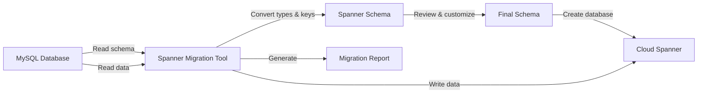

# How to Migrate from MySQL to Cloud Spanner Using the Spanner Migration Tool

Author: [nawazdhandala](https://www.github.com/nawazdhandala)

Tags: GCP, Cloud Spanner, MySQL, Migration, Database

Description: A step-by-step guide to migrating your MySQL database to Cloud Spanner using the Spanner Migration Tool with schema conversion and data transfer.

---

Migrating from MySQL to Cloud Spanner is a significant undertaking. The databases have different data models, different type systems, and very different approaches to primary keys and schema design. The Spanner Migration Tool (previously known as Harbourbridge) helps bridge this gap by automating schema conversion and data transfer. In this post, I will walk through the full migration process from a running MySQL database to Cloud Spanner.

## What the Spanner Migration Tool Does

The Spanner Migration Tool is an open-source tool that:

1. Connects to your source MySQL database
2. Reads the schema and converts it to Spanner DDL
3. Lets you review and customize the converted schema
4. Migrates the data from MySQL to Spanner
5. Generates a report on the migration

It handles the type conversions, primary key adjustments, and index translations automatically, though you will likely want to review and tweak the results.

## Installing the Tool

The Spanner Migration Tool is available as a standalone binary:

```bash
# Download the latest release of the Spanner Migration Tool
git clone https://github.com/GoogleCloudPlatform/spanner-migration-tool.git
cd spanner-migration-tool

# Build the tool from source
go build -o spanner-migration-tool
```

Alternatively, you can run it through the Google Cloud Console, which provides a web-based UI for the migration workflow.

## Preparing Your MySQL Database

Before starting the migration, prepare your source database:

```bash
# Check the size of your MySQL database
mysql -u root -p -e "
SELECT table_schema AS 'Database',
       ROUND(SUM(data_length + index_length) / 1024 / 1024, 2) AS 'Size (MB)'
FROM information_schema.tables
WHERE table_schema = 'my_app_db'
GROUP BY table_schema;"
```

Make sure the MySQL user you will use for migration has read access to all tables:

```sql
-- Grant read access for the migration user
GRANT SELECT ON my_app_db.* TO 'migration_user'@'%';
FLUSH PRIVILEGES;
```

## Running the Schema Conversion

Start the migration tool in schema-only mode first to review the conversion before moving any data:

```bash
# Connect to MySQL and generate the Spanner schema
./spanner-migration-tool schema \
    --source=mysql \
    --source-profile="host=localhost,port=3306,user=migration_user,dbName=my_app_db" \
    --target=spanner \
    --target-profile="project=my-project,instance=my-spanner-instance"
```

The tool will generate a Spanner schema and show you the conversions it made. Common conversions include:

| MySQL Type | Spanner Type |
|-----------|-------------|
| INT / BIGINT | INT64 |
| VARCHAR(n) | STRING(n) |
| TEXT | STRING(MAX) |
| DATETIME / TIMESTAMP | TIMESTAMP |
| DECIMAL | NUMERIC |
| FLOAT / DOUBLE | FLOAT64 |
| BOOLEAN | BOOL |
| BLOB | BYTES(MAX) |

## Key Schema Differences to Review

### Auto-Increment Primary Keys

MySQL commonly uses auto-increment integers as primary keys. In Spanner, auto-increment keys cause hotspots. The migration tool converts these to INT64 columns, but you should consider changing them to STRING(36) with UUID values:

```sql
-- MySQL original
CREATE TABLE users (
    id INT AUTO_INCREMENT PRIMARY KEY,
    email VARCHAR(256) NOT NULL,
    name VARCHAR(128)
);

-- Spanner converted (tool output)
CREATE TABLE users (
    id INT64 NOT NULL,
    email STRING(256) NOT NULL,
    name STRING(128)
) PRIMARY KEY (id);

-- Spanner recommended (manually adjusted to avoid hotspots)
CREATE TABLE users (
    id STRING(36) NOT NULL,
    email STRING(256) NOT NULL,
    name STRING(128)
) PRIMARY KEY (id);
```

If you change the primary key type, you will need to generate UUIDs for existing rows during data migration.

### Foreign Keys vs Interleaving

MySQL uses foreign keys for parent-child relationships. The migration tool converts these to Spanner foreign keys by default, but you may want to use interleaved tables instead for better performance:

```sql
-- MySQL original with foreign key
CREATE TABLE orders (
    order_id INT AUTO_INCREMENT PRIMARY KEY,
    user_id INT NOT NULL,
    total DECIMAL(10,2),
    FOREIGN KEY (user_id) REFERENCES users(id)
);

-- Consider converting to interleaved table in Spanner
CREATE TABLE orders (
    user_id STRING(36) NOT NULL,
    order_id STRING(36) NOT NULL,
    total NUMERIC
) PRIMARY KEY (user_id, order_id),
  INTERLEAVE IN PARENT users ON DELETE CASCADE;
```

### Indexes

MySQL indexes are converted to Spanner secondary indexes. Review them to ensure they match your query patterns in the new system:

```sql
-- MySQL index
CREATE INDEX idx_users_email ON users(email);

-- Spanner equivalent (auto-generated by migration tool)
CREATE INDEX idx_users_email ON users(email);
```

## Customizing the Schema

The migration tool provides a web interface for reviewing and modifying the schema before data migration. You can also export the schema to a file and edit it manually:

```bash
# Export the converted schema to a file for manual editing
./spanner-migration-tool schema \
    --source=mysql \
    --source-profile="host=localhost,port=3306,user=migration_user,dbName=my_app_db" \
    --target=spanner \
    --target-profile="project=my-project,instance=my-spanner-instance" \
    --schema-output=schema.sql
```

Edit the schema file to add interleaving, change key types, or adjust column types. Then apply the custom schema:

```bash
# Create the database with your customized schema
gcloud spanner databases create my-app-db \
    --instance=my-spanner-instance \
    --ddl-file=schema.sql
```

## Running the Data Migration

Once you are happy with the schema, migrate the data:

```bash
# Run the full data migration from MySQL to Spanner
./spanner-migration-tool data \
    --source=mysql \
    --source-profile="host=localhost,port=3306,user=migration_user,dbName=my_app_db" \
    --target=spanner \
    --target-profile="project=my-project,instance=my-spanner-instance,dbName=my-app-db"
```

For large databases, the migration can take hours. The tool shows progress as it works through each table.

## Migration Architecture

Here is how the migration process flows:



## Handling Data Transformations

If you changed primary key types (for example, INT to UUID), you need to handle the transformation during data migration. The migration tool can apply transformations, or you can use a custom migration script:

```python
import uuid
import mysql.connector
from google.cloud import spanner

# Map old integer IDs to new UUID values
id_mapping = {}

def migrate_users():
    """Migrate users from MySQL to Spanner with UUID key conversion."""

    # Connect to MySQL
    mysql_conn = mysql.connector.connect(
        host="localhost", user="migration_user",
        password="password", database="my_app_db"
    )
    cursor = mysql_conn.cursor()
    cursor.execute("SELECT id, email, name FROM users")

    # Connect to Spanner
    spanner_client = spanner.Client()
    instance = spanner_client.instance("my-spanner-instance")
    database = instance.database("my-app-db")

    # Migrate in batches of 1000 rows
    batch_size = 1000
    rows = cursor.fetchmany(batch_size)

    while rows:
        mutations = []
        for row in rows:
            old_id, email, name = row
            # Generate a UUID and store the mapping
            new_id = str(uuid.uuid4())
            id_mapping[old_id] = new_id
            mutations.append(
                spanner.Mutation.insert(
                    "users",
                    columns=["id", "email", "name"],
                    values=[[new_id, email, name]]
                )
            )

        # Write the batch to Spanner
        with database.batch() as batch:
            for m in mutations:
                batch.insert("users", columns=["id", "email", "name"],
                           values=[[m.values[0], m.values[1], m.values[2]]])

        rows = cursor.fetchmany(batch_size)

    cursor.close()
    mysql_conn.close()
```

## Validating the Migration

After migration, validate the data:

```bash
# Compare row counts between MySQL and Spanner
mysql -u root -p -e "SELECT COUNT(*) FROM my_app_db.users;"

gcloud spanner databases execute-sql my-app-db \
    --instance=my-spanner-instance \
    --sql="SELECT COUNT(*) FROM users"
```

Run checksums on key tables to verify data integrity:

```bash
# Spot-check specific records
gcloud spanner databases execute-sql my-app-db \
    --instance=my-spanner-instance \
    --sql="SELECT * FROM users LIMIT 10"
```

## Post-Migration Steps

After validating the data, you need to:

1. Update your application code to use the Spanner client library instead of MySQL drivers
2. Adjust queries for Spanner SQL syntax differences
3. Update connection strings and configuration
4. Run your application test suite against the Spanner database
5. Plan the cutover from MySQL to Spanner

## Wrapping Up

Migrating from MySQL to Cloud Spanner is more than a simple data copy. The differences in primary key design, schema modeling, and query patterns mean you need to thoughtfully adapt your schema for Spanner's distributed architecture. The Spanner Migration Tool automates the mechanical work of type conversion and data transfer, but the important decisions - like whether to use interleaved tables and how to design primary keys - require your judgment. Start with a schema-only migration, review the output carefully, test with a subset of data, and only do the full migration once you are confident the schema is right.
