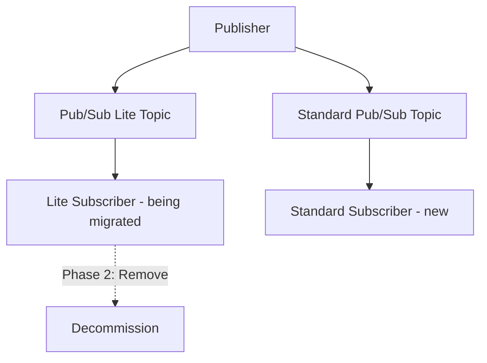

# How to Migrate from Pub/Sub Lite to Standard Pub/Sub

Author: [nawazdhandala](https://www.github.com/nawazdhandala)

Tags: GCP, Pub/Sub, Pub/Sub Lite, Migration, Messaging

Description: A practical guide to migrating from Google Cloud Pub/Sub Lite to standard Pub/Sub, covering the key differences, migration strategies, and step-by-step implementation.

---

Pub/Sub Lite was Google's lower-cost alternative to standard Pub/Sub, offering reduced pricing in exchange for zonal availability and capacity-based provisioning. Google has announced that Pub/Sub Lite is being deprecated, which means teams running on Pub/Sub Lite need to migrate to standard Pub/Sub.

The good news is that the concepts are similar enough that the migration is straightforward. The harder part is understanding the behavioral differences so your application works correctly after the switch. This guide covers the key differences, migration strategies, and practical steps to make the transition.

## Key Differences Between Pub/Sub Lite and Standard Pub/Sub

Before migrating, understand what changes:

| Feature | Pub/Sub Lite | Standard Pub/Sub |
|---------|-------------|-----------------|
| Availability | Zonal | Global |
| Capacity | Pre-provisioned | Auto-scaled |
| Pricing | Capacity-based | Usage-based |
| Message ordering | By partition | By ordering key |
| Partitioning | Explicit partitions | No user-visible partitions |
| Throughput control | Partition count and capacity | Automatic |
| Reservation model | Throughput reservation | None needed |

The biggest conceptual shift is from explicit partitions to Pub/Sub's serverless model. In Pub/Sub Lite, you manage partitions and throughput capacity. In standard Pub/Sub, the system handles scaling automatically.

## Planning the Migration

There are two main migration strategies:

### Strategy 1: Dual-Write Migration

Publish to both Pub/Sub Lite and standard Pub/Sub simultaneously, migrate subscribers one at a time, then decommission Pub/Sub Lite.

This is the safest approach because you can validate each subscriber independently and roll back if needed.



### Strategy 2: Direct Cutover

Stop the publisher, switch topics, and restart. This is simpler but riskier. Suitable for non-critical workloads or when you can tolerate brief downtime.

I recommend Strategy 1 for production systems.

## Step 1: Create Standard Pub/Sub Resources

Create the equivalent standard Pub/Sub topic and subscriptions:

```hcl
# Standard Pub/Sub topic to replace Pub/Sub Lite
resource "google_pubsub_topic" "events" {
  name = "events-standard"

  message_retention_duration = "604800s"  # 7 days

  labels = {
    migrated_from = "pubsub-lite"
    environment   = "production"
  }
}

# Create subscriptions that mirror your Lite subscriptions
resource "google_pubsub_subscription" "processor" {
  name  = "event-processor-standard"
  topic = google_pubsub_topic.events.id

  ack_deadline_seconds = 60

  # If you used Lite ordering, enable ordering keys
  enable_message_ordering = true

  retry_policy {
    minimum_backoff = "10s"
    maximum_backoff = "600s"
  }

  dead_letter_policy {
    dead_letter_topic     = google_pubsub_topic.events_dlq.id
    max_delivery_attempts = 10
  }

  expiration_policy {
    ttl = ""
  }
}
```

## Step 2: Update the Publisher for Dual-Write

Modify your publisher to send messages to both systems:

```python
# Dual-write publisher that sends to both Pub/Sub Lite and Standard Pub/Sub
from google.cloud import pubsub_v1
from google.cloud.pubsub_v1.types import PublisherOptions
import json
import logging

logger = logging.getLogger(__name__)

# Standard Pub/Sub publisher with ordering support
standard_publisher = pubsub_v1.PublisherClient(
    publisher_options=PublisherOptions(enable_message_ordering=True)
)
standard_topic = standard_publisher.topic_path("my-project", "events-standard")

# Your existing Pub/Sub Lite publisher
# lite_publisher = ... (keep existing code)

def publish_event(event_data, ordering_key=None):
    """Publish to both Pub/Sub Lite and Standard Pub/Sub."""

    data_bytes = json.dumps(event_data).encode("utf-8")

    # Publish to standard Pub/Sub
    try:
        kwargs = {"data": data_bytes}
        if ordering_key:
            kwargs["ordering_key"] = ordering_key

        standard_future = standard_publisher.publish(standard_topic, **kwargs)
        standard_id = standard_future.result(timeout=30)
        logger.info(f"Published to standard Pub/Sub: {standard_id}")
    except Exception as e:
        logger.error(f"Failed to publish to standard Pub/Sub: {e}")
        # Decide: should this be fatal or just logged?
        # During migration, you might want to continue on failure

    # Publish to Pub/Sub Lite (existing code)
    try:
        # lite_publisher.publish(lite_topic, data_bytes, ...)
        pass  # Keep your existing Lite publish logic
    except Exception as e:
        logger.error(f"Failed to publish to Pub/Sub Lite: {e}")
```

## Step 3: Mapping Partitions to Ordering Keys

In Pub/Sub Lite, you assign messages to partitions. In standard Pub/Sub, you use ordering keys for message ordering. The migration mapping is:

```python
# Convert Pub/Sub Lite partition key to standard Pub/Sub ordering key
def get_ordering_key(event_data):
    """Generate an ordering key that replaces partition assignment.

    In Pub/Sub Lite, you might have used a partition key function.
    In standard Pub/Sub, the ordering key serves a similar purpose.
    """
    # If you were partitioning by entity ID, use that as the ordering key
    entity_id = event_data.get('entity_id') or event_data.get('user_id')

    if entity_id:
        return str(entity_id)

    # If you were using round-robin partitioning for load balancing,
    # you do not need an ordering key in standard Pub/Sub
    return None
```

Important distinction: In Pub/Sub Lite, all messages in a partition are ordered. In standard Pub/Sub, only messages with the same ordering key are ordered. If you were relying on partition-level ordering for messages with different keys, you need to rethink your ordering strategy.

## Step 4: Migrate Subscribers

Update your subscriber code from the Pub/Sub Lite client to the standard Pub/Sub client:

```python
# Before: Pub/Sub Lite subscriber
# from google.cloud.pubsublite.cloudpubsub import SubscriberClient as LiteSubscriber
# subscriber = LiteSubscriber()
# subscription_path = SubscriptionPath(project_number, zone, lite_subscription_id)

# After: Standard Pub/Sub subscriber
from google.cloud import pubsub_v1

subscriber = pubsub_v1.SubscriberClient()
subscription_path = subscriber.subscription_path("my-project", "event-processor-standard")

def process_message(message):
    """Process messages - business logic stays the same."""
    data = json.loads(message.data.decode('utf-8'))

    # Your existing processing logic - no changes needed here
    handle_event(data)

    message.ack()

# Flow control replaces Lite's partition-based flow control
flow_control = pubsub_v1.types.FlowControl(
    max_messages=100,
    max_bytes=10 * 1024 * 1024,  # 10 MB
)

streaming_pull = subscriber.subscribe(
    subscription_path,
    callback=process_message,
    flow_control=flow_control,
)

streaming_pull.result()
```

## Step 5: Validate the Migration

Before decommissioning Pub/Sub Lite, verify that the standard Pub/Sub path is working correctly:

```python
# Validation script to compare processing between Lite and Standard
import time
from google.cloud import monitoring_v3
from google.protobuf.timestamp_pb2 import Timestamp

def compare_metrics(project_id, lite_sub, standard_sub):
    """Compare message processing metrics between Lite and Standard."""
    client = monitoring_v3.MetricServiceClient()

    now = time.time()
    interval = monitoring_v3.TimeInterval(
        end_time=Timestamp(seconds=int(now)),
        start_time=Timestamp(seconds=int(now - 3600)),  # Last hour
    )

    for sub_id in [standard_sub]:
        results = client.list_time_series(
            request={
                "name": f"projects/{project_id}",
                "filter": (
                    f'metric.type = "pubsub.googleapis.com/subscription/num_undelivered_messages"'
                    f' AND resource.labels.subscription_id = "{sub_id}"'
                ),
                "interval": interval,
                "view": monitoring_v3.ListTimeSeriesRequest.TimeSeriesView.FULL,
            }
        )

        for series in results:
            latest = series.points[0].value.int64_value if series.points else 0
            print(f"{sub_id}: backlog = {latest}")

compare_metrics("my-project", "event-processor-lite", "event-processor-standard")
```

Check these things during validation:

1. **Message counts match**: The same number of messages should be processed by both paths.
2. **Backlog is stable**: The standard Pub/Sub subscription should not have a growing backlog.
3. **No processing errors**: Check application logs for errors in the standard subscriber.
4. **Latency is acceptable**: Standard Pub/Sub may have slightly different latency characteristics.

## Step 6: Decommission Pub/Sub Lite

Once you have confirmed the standard Pub/Sub path is stable (run dual-write for at least a few days in production):

1. Remove the Pub/Sub Lite publish call from the dual-write publisher
2. Wait for the Pub/Sub Lite subscription backlog to drain
3. Delete the Pub/Sub Lite subscription
4. Delete the Pub/Sub Lite topic
5. Delete the Pub/Sub Lite reservation (if applicable)
6. Remove the Pub/Sub Lite client library from your dependencies

## Cost Implications

Standard Pub/Sub uses usage-based pricing while Pub/Sub Lite used capacity-based pricing. Depending on your usage pattern, costs may go up or down:

- **Steady high throughput**: Standard Pub/Sub may cost more since you pay per message and per byte.
- **Variable throughput**: Standard Pub/Sub may cost less since you do not pay for idle capacity.
- **Low throughput**: Standard Pub/Sub is likely cheaper since Pub/Sub Lite had minimum capacity requirements.

Run a cost estimate before migrating by analyzing your current message volume and comparing with standard Pub/Sub pricing.

## Common Migration Issues

1. **Partition affinity**: If your subscriber logic depends on partition assignment (like maintaining per-partition state), you need to rearchitect using ordering keys and per-key state.

2. **Throughput provisioning**: Standard Pub/Sub scales automatically, but there are per-project quotas. Check your quotas before migrating high-throughput workloads.

3. **Regional vs zonal**: Pub/Sub Lite was zonal. Standard Pub/Sub is regional/global. This is an availability improvement, but it means slightly different latency characteristics.

4. **Client library differences**: The Pub/Sub Lite client library is different from the standard one. Update all imports and API calls.

## Wrapping Up

Migrating from Pub/Sub Lite to standard Pub/Sub is a necessary step given the deprecation. The dual-write approach gives you a safe migration path with the ability to validate and roll back. The main changes are moving from partition-based to ordering-key-based message ordering and switching from provisioned capacity to auto-scaling. Plan your migration early, run dual-write for a validation period, and decommission Pub/Sub Lite once you have confirmed everything works correctly on the standard path.
