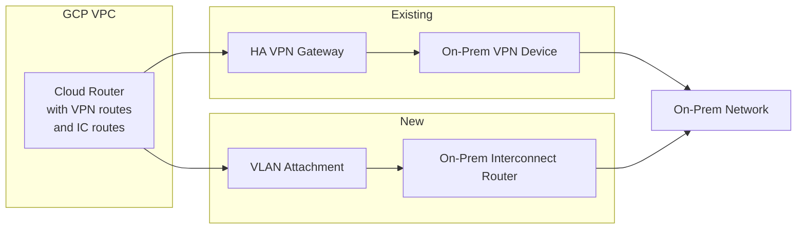

# How to Migrate from VPN to Cloud Interconnect Without Downtime in GCP

Author: [nawazdhandala](https://www.github.com/nawazdhandala)

Tags: GCP, Cloud Interconnect, Cloud VPN, Migration, Networking, Hybrid Cloud

Description: A step-by-step guide to migrating from GCP Cloud VPN to Cloud Interconnect without downtime by running both connections in parallel during the transition.

---

Your Cloud VPN setup worked fine when you started, but now you are hitting bandwidth limits or need more consistent latency. Cloud Interconnect is the natural upgrade path, but migrating without disrupting production traffic is the tricky part. The good news is that GCP supports running VPN and Interconnect in parallel, making a zero-downtime migration very achievable.

In this post, I will walk through the process of moving from Cloud VPN to Cloud Interconnect without any service interruption.

## The Migration Strategy

The approach is straightforward in concept:

1. Set up Cloud Interconnect alongside your existing VPN
2. Run both in parallel
3. Gradually shift traffic from VPN to Interconnect
4. Verify everything works on the new path
5. Decommission the VPN

The key enabler is BGP. Since both Cloud VPN (HA VPN) and Cloud Interconnect use Cloud Router with BGP, you can control traffic flow using route priorities and BGP attributes.



## Phase 1: Set Up Cloud Interconnect

First, provision Cloud Interconnect while your VPN continues to carry all traffic. This takes the longest but has zero impact on existing connectivity.

### Order and Provision the Interconnect

For Dedicated Interconnect:

```bash
# Create interconnects in two Edge Availability Domains
gcloud compute interconnects create ic-primary \
    --interconnect-type=DEDICATED \
    --link-type=LINK_TYPE_ETHERNET_10G_LR \
    --requested-link-count=1 \
    --location=iad-zone1-1 \
    --admin-enabled

gcloud compute interconnects create ic-secondary \
    --interconnect-type=DEDICATED \
    --link-type=LINK_TYPE_ETHERNET_10G_LR \
    --requested-link-count=1 \
    --location=iad-zone2-1 \
    --admin-enabled
```

Wait for the physical provisioning to complete (this can take 2-4 weeks for Dedicated Interconnect).

### Create VLAN Attachments

You can use the same Cloud Router that your VPN tunnels use, or create a new one. I recommend using the same Cloud Router so routes from both connections are managed in one place:

```bash
# Create VLAN attachments on the existing Cloud Router
gcloud compute interconnects attachments dedicated create ic-attachment-1 \
    --interconnect=ic-primary \
    --router=existing-cloud-router \
    --region=us-central1 \
    --bandwidth=BPS_5G \
    --vlan=100

gcloud compute interconnects attachments dedicated create ic-attachment-2 \
    --interconnect=ic-secondary \
    --router=existing-cloud-router \
    --region=us-central1 \
    --bandwidth=BPS_5G \
    --vlan=100
```

### Configure BGP for the Interconnect

```bash
# Add interfaces and peers for both attachments
gcloud compute routers add-interface existing-cloud-router \
    --interface-name=ic-if-1 \
    --interconnect-attachment=ic-attachment-1 \
    --region=us-central1

gcloud compute routers add-bgp-peer existing-cloud-router \
    --peer-name=ic-peer-1 \
    --interface=ic-if-1 \
    --peer-ip-address=169.254.70.2 \
    --peer-asn=65001 \
    --region=us-central1

gcloud compute routers add-interface existing-cloud-router \
    --interface-name=ic-if-2 \
    --interconnect-attachment=ic-attachment-2 \
    --region=us-central1

gcloud compute routers add-bgp-peer existing-cloud-router \
    --peer-name=ic-peer-2 \
    --interface=ic-if-2 \
    --peer-ip-address=169.254.71.2 \
    --peer-asn=65001 \
    --region=us-central1
```

## Phase 2: Configure On-Premises Routing

On your on-premises routers, configure BGP sessions for the Interconnect. At this point, make the Interconnect routes less preferred than VPN so traffic stays on VPN:

```text
! On-prem router - make routes learned from Interconnect less preferred
! Use higher MED values for Interconnect-advertised routes
route-map IC-TO-GCP permit 10
  set metric 200

route-map VPN-TO-GCP permit 10
  set metric 100

! Apply to BGP peers
router bgp 65001
  ! Existing VPN peer
  neighbor 169.254.0.1 route-map VPN-TO-GCP out

  ! New Interconnect peer
  neighbor 169.254.70.1 route-map IC-TO-GCP out
```

With this configuration, both VPN and Interconnect are active, but VPN is preferred. Traffic still flows over VPN.

## Phase 3: Verify Interconnect Connectivity

Before shifting any traffic, verify the Interconnect is working:

```bash
# Check all BGP sessions are up
gcloud compute routers get-status existing-cloud-router \
    --region=us-central1 \
    --format="table(result.bgpPeerStatus[].name, result.bgpPeerStatus[].status, result.bgpPeerStatus[].numLearnedRoutes)"
```

Test connectivity through the Interconnect by sending specific test traffic:

```bash
# From a GCP VM, trace the path to on-premises
traceroute -n 192.168.1.10

# The traceroute should show the VPN path (since it is preferred)
# To test the IC path specifically, you can use source-based routing on-prem
```

A more reliable test approach is to temporarily make one specific route prefer the Interconnect:

```text
! On-prem: advertise a test subnet with lower MED on Interconnect
ip prefix-list TEST-SUBNET permit 192.168.99.0/24

route-map IC-TO-GCP permit 5
  match ip address prefix-list TEST-SUBNET
  set metric 50
route-map IC-TO-GCP permit 10
  set metric 200
```

Now traffic to `192.168.99.0/24` flows over the Interconnect while everything else stays on VPN. Test thoroughly.

## Phase 4: Shift Traffic to Interconnect

Once you are confident the Interconnect works, start shifting traffic. There are two approaches:

### Approach A: Gradual (Subnet by Subnet)

Shift traffic for specific subnets first:

```text
! On-prem: Lower MED for Interconnect for specific subnets
ip prefix-list BATCH-1 permit 192.168.1.0/24
ip prefix-list BATCH-1 permit 192.168.2.0/24

route-map IC-TO-GCP permit 5
  match ip address prefix-list BATCH-1
  set metric 50
route-map IC-TO-GCP permit 10
  set metric 200
```

Monitor each batch before moving the next one.

### Approach B: All at Once

If testing went well, flip everything:

```text
! On-prem: Make Interconnect preferred for all routes
route-map IC-TO-GCP permit 10
  set metric 50

route-map VPN-TO-GCP permit 10
  set metric 200
```

After this change, all traffic flows over the Interconnect and the VPN becomes the backup path.

## Phase 5: Monitor the New Path

After shifting traffic, monitor closely for at least a week:

```bash
# Check Interconnect bandwidth utilization
gcloud monitoring time-series list \
    --filter='metric.type="compute.googleapis.com/interconnect/attachment/transmitted_bytes_count"' \
    --interval-start-time=$(date -u -v-1H +%Y-%m-%dT%H:%M:%SZ) \
    --format="table(points[].value.int64Value)"

# Check VPN tunnels should show minimal traffic now
gcloud compute vpn-tunnels describe tunnel-name \
    --region=us-central1 \
    --format="yaml(status, detailedStatus)"
```

Things to watch for:

- Latency improvements (Interconnect should be lower and more consistent than VPN)
- No packet loss
- Application performance matches or exceeds previous levels
- BGP routes are stable and not flapping

## Phase 6: Decommission the VPN

Once you are confident everything is stable on the Interconnect, remove the VPN:

```bash
# First, remove the BGP peers for VPN tunnels
gcloud compute routers remove-bgp-peer existing-cloud-router \
    --peer-name=vpn-peer-0 \
    --region=us-central1

gcloud compute routers remove-bgp-peer existing-cloud-router \
    --peer-name=vpn-peer-1 \
    --region=us-central1

# Remove the router interfaces
gcloud compute routers remove-interface existing-cloud-router \
    --interface-name=vpn-if-0 \
    --region=us-central1

gcloud compute routers remove-interface existing-cloud-router \
    --interface-name=vpn-if-1 \
    --region=us-central1

# Delete the VPN tunnels
gcloud compute vpn-tunnels delete tunnel-0 --region=us-central1
gcloud compute vpn-tunnels delete tunnel-1 --region=us-central1

# Delete the VPN gateway
gcloud compute vpn-gateways delete ha-vpn-gw --region=us-central1
```

Also remove the VPN configuration on your on-premises device.

## Keeping VPN as Backup

Alternatively, you can keep the VPN as a backup path. This gives you a failover option if the Interconnect ever has issues:

```text
! On-prem: VPN as backup with much higher MED
route-map VPN-TO-GCP permit 10
  set metric 500

route-map IC-TO-GCP permit 10
  set metric 100
```

Traffic normally flows over the Interconnect, but if the Interconnect BGP sessions drop, Cloud Router automatically fails over to VPN routes. The VPN has much less bandwidth, but it keeps you connected.

## Rollback Plan

If something goes wrong during migration, rolling back is just changing the route preferences back:

```text
! Emergency rollback: Make VPN preferred again
route-map VPN-TO-GCP permit 10
  set metric 50

route-map IC-TO-GCP permit 10
  set metric 500
```

This shift happens within seconds as BGP reconverges. No infrastructure changes needed.

## Wrapping Up

Migrating from VPN to Cloud Interconnect is a well-understood process. The key is running both in parallel and using BGP route preferences to control which path carries traffic. Start with the Interconnect as a backup, test thoroughly, shift traffic gradually, and keep the VPN as a safety net until you are fully confident. The whole process can be done without a single second of downtime if you plan your BGP policies carefully.
