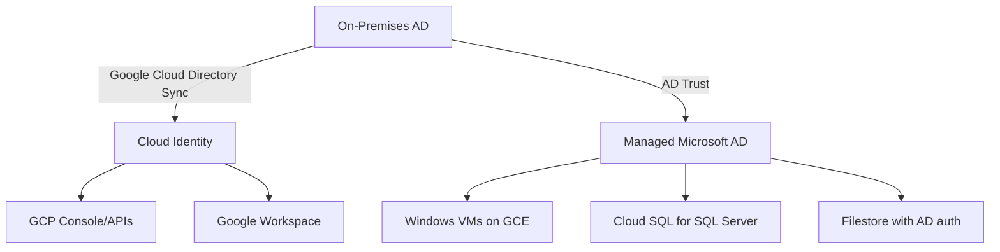

# How to Migrate On-Premises Active Directory to Google Cloud Identity and Managed Microsoft AD

Author: [nawazdhandala](https://www.github.com/nawazdhandala)

Tags: GCP, Active Directory, Cloud Identity, Identity Management, Migration

Description: A practical guide to migrating on-premises Active Directory to Google Cloud Identity and Managed Microsoft AD on GCP.

---

Active Directory is deeply embedded in most enterprise environments. It handles user authentication, group policies, DNS, and access control for Windows workloads. When migrating to Google Cloud, you need a strategy for your AD infrastructure. Google offers two complementary services: Cloud Identity for managing user identities and access to GCP resources, and Managed Microsoft AD for workloads that depend on traditional Active Directory features like domain join, Group Policy, and LDAP. Here is how to approach the migration.

## Understanding the Two Services

### Cloud Identity

Cloud Identity is Google's identity platform. It manages user accounts, groups, and authentication for Google Cloud services. When a user logs into the GCP Console, uses gcloud CLI, or accesses any Google Workspace service, Cloud Identity handles the authentication.

Cloud Identity is not a replacement for Active Directory in the traditional sense. It does not provide domain join, Group Policy Objects (GPOs), LDAP, or Kerberos authentication. It is the identity layer for GCP and Google services.

### Managed Microsoft AD

Managed Microsoft AD is a fully managed Active Directory Domain Services deployment running on GCP. It provides real AD domain controllers, LDAP, Kerberos, Group Policy, and domain join capabilities. Windows VMs on GCP can join this domain just like they would join an on-premises AD domain.

## Migration Architecture

Most organizations end up with a combination of both services:



## Step 1 - Set Up Cloud Identity

Cloud Identity syncs user accounts from your on-premises AD to Google's identity platform. This does not replace AD - it creates corresponding Google accounts that can access GCP resources.

First, set up Google Cloud Directory Sync (GCDS):

```bash
# Download and install GCDS on a server that can reach your AD domain controller
# GCDS runs on Windows or Linux

# The configuration is done through the GCDS Configuration Manager GUI
# Key settings:
# - LDAP connection to your AD domain controller
# - Google domain and OAuth credentials
# - User and group sync rules
# - Attribute mapping (AD attributes to Google attributes)
```

Configure the LDAP search rules for user sync:

```xml
<!-- GCDS user sync configuration example -->
<!-- Search base for users -->
<searchBase>OU=Users,DC=mycompany,DC=com</searchBase>

<!-- LDAP filter to select which users to sync -->
<userSearchFilter>
  (&amp;(objectCategory=person)(objectClass=user)(!(userAccountControl:1.2.840.113556.1.4.803:=2)))
</userSearchFilter>

<!-- Attribute mapping -->
<attributeMap>
  <googleAttribute>primaryEmail</googleAttribute>
  <adAttribute>mail</adAttribute>
</attributeMap>
<attributeMap>
  <googleAttribute>name.givenName</googleAttribute>
  <adAttribute>givenName</adAttribute>
</attributeMap>
<attributeMap>
  <googleAttribute>name.familyName</googleAttribute>
  <adAttribute>sn</adAttribute>
</attributeMap>
```

For single sign-on, configure SAML federation so users authenticate with their existing AD credentials:

```bash
# Option 1: Use AD FS (Active Directory Federation Services)
# Configure AD FS as a SAML IdP for Cloud Identity
# In the Google Admin Console:
# Security > Authentication > SSO with third-party IdP
# Enter your AD FS metadata URL and certificate

# Option 2: Use Azure AD / Entra ID as an intermediary
# If you already sync AD to Azure AD, configure Azure AD as the SAML IdP
# This avoids running AD FS on-premises
```

## Step 2 - Deploy Managed Microsoft AD

For workloads that need traditional AD features, deploy Managed Microsoft AD:

```bash
# Create a Managed Microsoft AD domain
gcloud active-directory domains create mycompany.cloud \
  --reserved-ip-range 10.0.0.0/24 \
  --region us-central1 \
  --authorized-networks projects/my-project/global/networks/my-vpc \
  --admin-name setupadmin

# Check the domain status
gcloud active-directory domains describe mycompany.cloud

# The admin password is shown during creation - save it securely
```

Once the domain is created, you can join Windows VMs to it:

```powershell
# On a Windows VM in GCP, join the Managed AD domain
# First, ensure DNS is pointing to the Managed AD domain controllers
# The domain controllers' IPs are shown in the domain description

# Join the domain using PowerShell
Add-Computer -DomainName "mycompany.cloud" -Credential (Get-Credential) -Restart

# After reboot, verify domain membership
Get-WmiObject -Class Win32_ComputerSystem | Select-Object Domain
```

## Step 3 - Establish AD Trust

If you need your on-premises AD and Managed Microsoft AD to work together (users from on-premises can access GCP resources and vice versa), create a trust relationship:

```bash
# Create a one-way or two-way trust between on-premises AD and Managed AD
gcloud active-directory domains trusts create mycompany.cloud \
  --target-domain-name corp.mycompany.com \
  --target-dns-ip-addresses 10.1.0.5,10.1.0.6 \
  --trust-direction BIDIRECTIONAL \
  --trust-type FOREST \
  --trust-handshake-secret "shared-secret"
```

On the on-premises side, create the corresponding trust:

```powershell
# On the on-premises AD domain controller
# Create the forest trust to the Managed AD domain
$trustPassword = ConvertTo-SecureString "shared-secret" -AsPlainText -Force

New-ADTrust -Name "mycompany.cloud" `
  -TrustType Forest `
  -TrustDirection Bidirectional `
  -RemoteDnsAddress "10.0.0.2","10.0.0.3" `
  -TrustPassword $trustPassword

# Configure conditional DNS forwarding for the Managed AD domain
Add-DnsServerConditionalForwarderZone `
  -Name "mycompany.cloud" `
  -MasterServers 10.0.0.2,10.0.0.3
```

## Step 4 - Migrate Group Policies

Group Policies from on-premises do not automatically transfer to Managed Microsoft AD. You need to export and import them:

```powershell
# On the on-premises domain controller, export GPOs
# Export all GPOs to a backup folder
Backup-GPO -All -Path "C:\GPO-Backups"

# On a VM joined to the Managed AD domain, import GPOs
# Note: some GPOs may reference on-premises resources and need updating
Import-GPO -BackupGpoName "Workstation Security Policy" `
  -Path "C:\GPO-Backups" `
  -TargetName "Workstation Security Policy" `
  -CreateIfNeeded

# Link the imported GPO to an OU
New-GPLink -Name "Workstation Security Policy" `
  -Target "OU=Workstations,DC=mycompany,DC=cloud"
```

Review each GPO before importing. Many on-premises GPOs reference local file shares, print servers, or other resources that do not exist in GCP. These need to be updated or removed.

## Step 5 - Migrate Service Accounts and Applications

Applications that use AD for LDAP authentication or Kerberos need to be reconfigured:

```bash
# For applications using LDAP, update the LDAP server address
# Old: ldap://dc01.corp.mycompany.com:389
# New: ldap://mycompany.cloud:389

# For Kerberos-based applications, update the KDC address
# The Managed AD domain controllers serve as the KDC
```

Service accounts in AD should be recreated in Managed Microsoft AD:

```powershell
# Create service accounts in Managed AD
# Connect to the Managed AD domain using RSAT tools
New-ADUser -Name "svc_webapp" `
  -SamAccountName "svc_webapp" `
  -UserPrincipalName "svc_webapp@mycompany.cloud" `
  -Path "OU=ServiceAccounts,OU=Cloud,DC=mycompany,DC=cloud" `
  -AccountPassword (ConvertTo-SecureString "StrongPassword" -AsPlainText -Force) `
  -Enabled $true `
  -PasswordNeverExpires $true
```

## Phased Migration Approach

Do not try to migrate everything at once. A phased approach reduces risk:

**Phase 1 - Identity sync.** Set up GCDS and SSO so users can access GCP with their existing credentials. This does not change anything on-premises.

**Phase 2 - Managed AD deployment.** Deploy Managed Microsoft AD and establish trust with on-premises. New Windows workloads on GCP join the Managed AD domain.

**Phase 3 - Application migration.** Move applications one at a time, updating their AD configuration to point to Managed AD. Test thoroughly before moving the next application.

**Phase 4 - Decommission on-premises AD.** Only after all workloads have been migrated and the trust relationship is no longer needed. This phase may never happen if you maintain hybrid operations.

## Common Challenges

- **DNS configuration** is the number one source of issues. Managed AD requires specific DNS forwarding rules, and incorrect DNS can break domain join and authentication.
- **OU structure differences** between on-premises and Managed AD can complicate GPO migration. Plan your OU structure in Managed AD before migrating.
- **Managed AD limitations.** You do not get Domain Admin access to Managed AD. Google manages the domain controllers. If you need full control, you might need to run self-managed AD on GCE VMs instead.
- **Schema extensions** from on-premises AD may not be supported in Managed AD. If your applications depend on custom AD schema attributes, verify support before migrating.

The migration from on-premises AD to Google Cloud is not a single step but a journey. Start with identity sync, add Managed AD for Windows workloads, and migrate applications incrementally. The trust relationship between on-premises and Managed AD lets both environments coexist during the transition.
