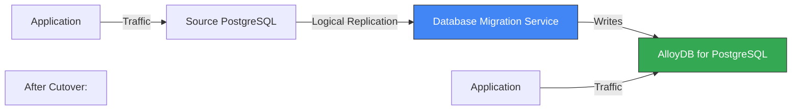

# How to Migrate PostgreSQL Databases to AlloyDB Using Database Migration Service

Author: [nawazdhandala](https://www.github.com/nawazdhandala)

Tags: GCP, Database Migration Service, PostgreSQL, AlloyDB, Migration

Description: Learn how to use GCP Database Migration Service to migrate PostgreSQL databases to AlloyDB with continuous replication and minimal downtime.

---

AlloyDB is Google's PostgreSQL-compatible database that promises significantly better performance than standard PostgreSQL for transactional and analytical workloads. If you are running PostgreSQL on-premises, on another cloud, or even on Cloud SQL and want to move to AlloyDB, Database Migration Service (DMS) handles the migration with continuous replication.

The migration uses PostgreSQL's native logical replication, streaming changes from your source database to AlloyDB until you are ready to cut over. In this post, I will cover the full migration process from a standard PostgreSQL instance to AlloyDB.

## How It Works

DMS sets up logical replication between your source PostgreSQL and the target AlloyDB instance:



The phases are:

1. **Initial snapshot**: Full dump of the source database
2. **CDC streaming**: Continuous replication of changes via logical replication
3. **Promotion**: Cutover to AlloyDB as the primary

## Prerequisites

- Source PostgreSQL 10, 11, 12, 13, 14, or 15
- Logical replication enabled on the source (`wal_level = logical`)
- A replication user with appropriate privileges
- Network connectivity between source and GCP
- DMS and AlloyDB APIs enabled

```bash
# Enable required APIs
gcloud services enable \
  datamigration.googleapis.com \
  alloydb.googleapis.com \
  --project=PROJECT_ID
```

## Step 1: Prepare the Source PostgreSQL

Configure PostgreSQL for logical replication. Update `postgresql.conf`:

```ini
# Enable logical replication
wal_level = logical

# Allow enough replication slots (at least 1 per migration)
max_replication_slots = 10

# Allow enough WAL senders
max_wal_senders = 10

# Keep WAL segments long enough for replication
wal_keep_size = 1024  # PostgreSQL 13+
# For older versions: wal_keep_segments = 64
```

Restart PostgreSQL after configuration changes.

Create a replication user and grant necessary permissions:

```sql
-- Create a dedicated replication user
CREATE USER dms_user WITH REPLICATION LOGIN PASSWORD 'strong_password';

-- Grant connect on the database
GRANT CONNECT ON DATABASE mydb TO dms_user;

-- Grant usage on schemas
GRANT USAGE ON SCHEMA public TO dms_user;

-- Grant select on all tables (needed for initial snapshot)
GRANT SELECT ON ALL TABLES IN SCHEMA public TO dms_user;

-- Grant select on sequences
GRANT SELECT ON ALL SEQUENCES IN SCHEMA public TO dms_user;

-- For future tables
ALTER DEFAULT PRIVILEGES IN SCHEMA public GRANT SELECT ON TABLES TO dms_user;

-- If using pglogical extension (alternative to native logical replication)
-- CREATE EXTENSION pglogical;
```

Update `pg_hba.conf` to allow connections from GCP:

```
# Allow DMS to connect for replication
host    replication    dms_user    0.0.0.0/0    md5
host    mydb           dms_user    0.0.0.0/0    md5
```

## Step 2: Create the AlloyDB Cluster and Instance

Set up the target AlloyDB cluster:

```bash
# Create an AlloyDB cluster
gcloud alloydb clusters create migration-cluster \
  --region=us-central1 \
  --password=your_alloydb_password \
  --network=projects/PROJECT_ID/global/networks/default \
  --project=PROJECT_ID

# Create a primary instance in the cluster
gcloud alloydb instances create migration-primary \
  --cluster=migration-cluster \
  --region=us-central1 \
  --instance-type=PRIMARY \
  --cpu-count=4 \
  --project=PROJECT_ID
```

Wait for the instance to be ready:

```bash
# Check instance status
gcloud alloydb instances describe migration-primary \
  --cluster=migration-cluster \
  --region=us-central1 \
  --project=PROJECT_ID \
  --format="get(state)"
```

## Step 3: Create Connection Profiles

Create connection profiles for both source and destination:

```bash
# Source connection profile
gcloud database-migration connection-profiles create pg-source \
  --region=us-central1 \
  --display-name="Source PostgreSQL" \
  --provider=POSTGRESQL \
  --postgresql-host=203.0.113.50 \
  --postgresql-port=5432 \
  --postgresql-username=dms_user \
  --postgresql-password=strong_password \
  --postgresql-database=mydb \
  --project=PROJECT_ID
```

For an AWS RDS PostgreSQL source:

```bash
# AWS RDS PostgreSQL source
gcloud database-migration connection-profiles create rds-pg-source \
  --region=us-central1 \
  --display-name="AWS RDS PostgreSQL Source" \
  --provider=POSTGRESQL \
  --postgresql-host=mydb.cluster-abc.us-east-1.rds.amazonaws.com \
  --postgresql-port=5432 \
  --postgresql-username=dms_user \
  --postgresql-password=strong_password \
  --postgresql-database=mydb \
  --project=PROJECT_ID
```

Create the destination connection profile for AlloyDB:

```bash
# AlloyDB destination connection profile
gcloud database-migration connection-profiles create alloydb-dest \
  --region=us-central1 \
  --display-name="AlloyDB Destination" \
  --provider=ALLOYDB \
  --alloydb-cluster=migration-cluster \
  --project=PROJECT_ID
```

## Step 4: Create and Start the Migration Job

```bash
# Create a continuous migration job
gcloud database-migration migration-jobs create pg-to-alloydb \
  --region=us-central1 \
  --display-name="PostgreSQL to AlloyDB Migration" \
  --type=CONTINUOUS \
  --source=pg-source \
  --destination=alloydb-dest \
  --project=PROJECT_ID
```

Verify and start:

```bash
# Verify the migration configuration
gcloud database-migration migration-jobs verify pg-to-alloydb \
  --region=us-central1 \
  --project=PROJECT_ID

# Start the migration
gcloud database-migration migration-jobs start pg-to-alloydb \
  --region=us-central1 \
  --project=PROJECT_ID
```

The verify step checks:

- Connectivity to both source and destination
- Source database configuration (wal_level, replication slots)
- Schema compatibility
- Permissions

## Step 5: Monitor Migration Progress

```bash
# Check migration status
gcloud database-migration migration-jobs describe pg-to-alloydb \
  --region=us-central1 \
  --project=PROJECT_ID

# Watch for state changes
watch -n 30 "gcloud database-migration migration-jobs describe pg-to-alloydb \
  --region=us-central1 \
  --format='table(name, state, phase)' \
  --project=PROJECT_ID"
```

Monitor the replication lag to know when you are close to being able to cut over:

```bash
# Check detailed migration status including lag
gcloud database-migration migration-jobs describe pg-to-alloydb \
  --region=us-central1 \
  --format="yaml(state, phase, duration, error)" \
  --project=PROJECT_ID
```

You can also check the replication slot on the source:

```sql
-- Check replication slot status on the source PostgreSQL
SELECT
  slot_name,
  slot_type,
  active,
  pg_size_pretty(pg_wal_lsn_diff(pg_current_wal_lsn(), confirmed_flush_lsn)) as replication_lag
FROM pg_replication_slots
WHERE slot_type = 'logical';
```

## Step 6: Validate the Migration

Before cutting over, validate the data in AlloyDB:

```bash
# Connect to AlloyDB
gcloud alloydb instances describe migration-primary \
  --cluster=migration-cluster \
  --region=us-central1 \
  --format="get(ipAddress)" \
  --project=PROJECT_ID
```

Connect and run validation queries:

```sql
-- Compare row counts with source
SELECT schemaname, relname, n_live_tup
FROM pg_stat_user_tables
ORDER BY n_live_tup DESC;

-- Check for specific table integrity
SELECT COUNT(*), MAX(updated_at) FROM orders;

-- Verify schema objects migrated correctly
SELECT table_name FROM information_schema.tables
WHERE table_schema = 'public' ORDER BY table_name;

-- Check indexes
SELECT indexname, tablename FROM pg_indexes
WHERE schemaname = 'public' ORDER BY tablename;

-- Verify sequences
SELECT sequence_name, last_value FROM information_schema.sequences
WHERE sequence_schema = 'public';
```

## Step 7: Perform the Cutover

When the replication lag is minimal and you have validated the data:

```bash
# Promote AlloyDB to primary (cutover)
gcloud database-migration migration-jobs promote pg-to-alloydb \
  --region=us-central1 \
  --project=PROJECT_ID
```

The promotion:

1. Waits for the replication to fully catch up
2. Stops the logical replication
3. Drops the replication slot on the source
4. Makes AlloyDB read-write

Update your application connection string immediately after promotion.

## Step 8: Post-Migration Optimization

AlloyDB has features that standard PostgreSQL does not. After migration, take advantage of them:

```sql
-- AlloyDB columnar engine - accelerate analytical queries
-- Enable for specific tables
ALTER TABLE large_analytics_table SET (
  google_columnar_engine.enabled = true
);

-- Check columnar engine status
SELECT * FROM google_columnar_engine.managed_tables;
```

Other post-migration tasks:

```bash
# Add read replicas for scaling read traffic
gcloud alloydb instances create read-replica-1 \
  --cluster=migration-cluster \
  --region=us-central1 \
  --instance-type=READ_POOL \
  --cpu-count=4 \
  --read-pool-node-count=2 \
  --project=PROJECT_ID

# Configure automated backups
gcloud alloydb clusters update migration-cluster \
  --region=us-central1 \
  --automated-backup-enabled \
  --automated-backup-start-times=02:00 \
  --automated-backup-retention-count=7 \
  --project=PROJECT_ID
```

## PostgreSQL-Specific Migration Considerations

**Extensions**: AlloyDB supports most common PostgreSQL extensions but not all. Check extension compatibility before migration:

```sql
-- List extensions in use on source
SELECT extname, extversion FROM pg_extension ORDER BY extname;
```

**Custom types and functions**: PL/pgSQL functions migrate fine. Extensions that use custom C code may not be compatible.

**Large objects**: PostgreSQL large objects (lo/blob) may need special handling. DMS handles standard table data but large objects require attention.

**Sequences**: After migration, verify that sequences are at the correct values. Sometimes they need to be manually advanced to avoid primary key conflicts.

```sql
-- Reset sequence to the correct value after migration
SELECT setval('orders_id_seq', (SELECT MAX(id) FROM orders));
```

**Foreign data wrappers**: If you use FDWs, they will not work after migration since the external connections need to be reconfigured.

## Summary

Migrating PostgreSQL to AlloyDB with Database Migration Service is a well-defined process. Prepare your source with logical replication, create connection profiles, start a continuous migration job, and cut over when the replication lag is close to zero. After migration, explore AlloyDB-specific features like the columnar engine and read pools to get the performance benefits that motivated the migration in the first place. Validate everything thoroughly before promotion since that is the point of no return.
