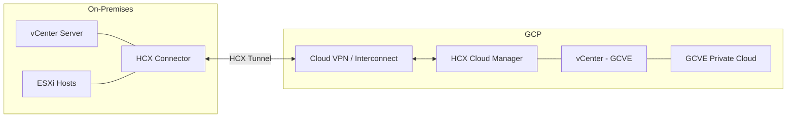

# How to Migrate Virtual Machines from On-Premises vSphere to Google Cloud VMware Engine Using HCX

Author: [nawazdhandala](https://www.github.com/nawazdhandala)

Tags: GCP, VMware Engine, HCX, VM Migration, vSphere

Description: Migrate virtual machines from on-premises VMware vSphere environments to Google Cloud VMware Engine using VMware HCX for seamless workload mobility.

---

Migrating virtual machines from an on-premises vSphere environment to Google Cloud VMware Engine (GCVE) is one of the fastest paths to cloud for organizations running VMware workloads. VMware HCX (Hybrid Cloud Extension) makes this migration possible with minimal downtime - in many cases, you can move VMs without shutting them down at all.

This guide walks through the complete HCX setup, network configuration, and migration process from an on-premises vSphere 7.x environment to a GCVE private cloud.

## Prerequisites

Before starting, ensure you have the following in place:

- A Google Cloud VMware Engine private cloud deployed and running
- An on-premises vSphere environment running version 6.5 or later
- Network connectivity between on-premises and GCP (Cloud VPN or Cloud Interconnect)
- Sufficient bandwidth for the migration (HCX compresses data, but large VMs still need bandwidth)
- VMware HCX license (included with GCVE)



## Step 1: Set Up Network Connectivity

Establish network connectivity between your on-premises datacenter and GCP. Cloud Interconnect provides the best performance for large migrations.

```bash
# Option A: Set up a Cloud VPN tunnel (for smaller migrations)
gcloud compute vpn-tunnels create onprem-to-gcve \
  --region=us-central1 \
  --peer-address=YOUR_ONPREM_VPN_IP \
  --shared-secret=YOUR_SHARED_SECRET \
  --ike-version=2 \
  --target-vpn-gateway=gcve-vpn-gateway

# Option B: Create a VLAN attachment for Cloud Interconnect (recommended for production)
gcloud compute interconnects attachments create gcve-attachment \
  --router=gcve-router \
  --region=us-central1 \
  --interconnect=your-interconnect-name \
  --vlan-tag=1001
```

Configure the peering between your VPC and the GCVE private cloud.

```bash
# Create a VPC peering connection to the GCVE service network
gcloud vmware private-clouds vcenter credentials describe \
  --private-cloud=my-gcve-cloud \
  --location=us-central1
```

## Step 2: Deploy HCX on the Cloud Side

HCX Cloud Manager is automatically available in your GCVE private cloud. Access it through the GCVE console.

```bash
# Get the HCX Cloud Manager URL from your GCVE private cloud
gcloud vmware private-clouds describe my-gcve-cloud \
  --location=us-central1 \
  --format="yaml(hcx)"
```

Log into the HCX Cloud Manager and create a site pairing. You will need:
- The on-premises vCenter URL
- Administrative credentials for the on-premises vCenter

## Step 3: Deploy HCX Connector On-Premises

Download the HCX Connector OVA from the HCX Cloud Manager interface and deploy it in your on-premises vSphere environment.

The deployment process involves:

1. Download the HCX Connector OVA from the cloud-side HCX Manager
2. Deploy the OVA to your on-premises vCenter
3. Configure the network settings for the HCX Connector appliance
4. Activate the connector with your HCX license key

After deploying the OVA, configure the connector through its management interface.

```
# HCX Connector configuration (done through the web UI)
# Management Network: Your management VLAN
# vMotion Network: Your vMotion network
# Uplink Network: Network with access to the internet or GCP
# HCX Activation URL: https://connect.hcx.vmware.com
# Activation Key: Obtained from HCX Cloud Manager
```

## Step 4: Create the Site Pairing

Once both sides are deployed, create a site pairing that links your on-premises HCX Connector to the GCVE HCX Cloud Manager.

In the HCX Connector UI:
1. Navigate to Infrastructure > Interconnect > Site Pairing
2. Enter the HCX Cloud Manager URL from your GCVE deployment
3. Provide the cloud-side credentials
4. Accept the certificate and complete the pairing

## Step 5: Configure Network Profiles and Service Mesh

Network profiles define which networks HCX uses for management, vMotion, and replication traffic.

Create network profiles for:

- **Management Profile**: Uses your management network for HCX appliance communication
- **vMotion Profile**: Uses your vMotion network for live migration traffic
- **Uplink Profile**: Uses your WAN-facing network to reach GCP
- **Replication Profile**: Optionally separate network for bulk replication traffic

After creating network profiles, deploy a Service Mesh, which creates the HCX appliances (Interconnect, WAN Optimizer, Network Extension) that handle the actual migration.

```
# Service Mesh Configuration
Source Site: on-premises
Destination Site: GCVE Private Cloud
Source Compute Profile: On-Prem Compute
Destination Compute Profile: GCVE Compute
Services:
  - Interconnect (IX)
  - WAN Optimization
  - Network Extension (optional)
  - Bulk Migration
  - vMotion
```

The service mesh deployment takes 15-30 minutes as it creates multiple appliance VMs on both sides.

## Step 6: Extend Networks (Optional)

If your VMs need to keep their IP addresses during migration, use HCX Network Extension to stretch Layer 2 networks between on-premises and GCVE.

```
# Network Extension Configuration
Source Network: VM-Network-192.168.10.0
Destination: GCVE-Extended-Network
Gateway: Use on-premises gateway (proximity routing disabled)
```

Network extension allows VMs to migrate without changing IPs, DNS entries, or firewall rules. After migration is complete and all VMs are moved, you can cut over the network gateway to GCVE.

## Step 7: Migrate Virtual Machines

HCX supports several migration types depending on your downtime tolerance.

### vMotion Migration (Zero Downtime)

Live migration with no downtime. The VM continues running during the move. Best for production workloads that cannot tolerate any interruption.

```
# vMotion migration steps (through HCX UI)
1. Navigate to Services > Migration
2. Select VMs to migrate
3. Choose migration type: vMotion
4. Select destination: GCVE cluster
5. Choose destination datastore and folder
6. Map networks (source to destination)
7. Validate and start migration
```

### Bulk Migration (Brief Downtime)

Replicates the VM to GCVE and then performs a quick switchover. Downtime is typically under a few minutes. Better for VMs where brief downtime is acceptable and you need to move many VMs efficiently.

### Replication Assisted vMotion (RAV)

Combines the benefits of both - replicates data first, then performs a live cutover with zero downtime. Best for large VMs where vMotion alone would take too long over a WAN link.

## Step 8: Validate the Migration

After migration, verify that the VMs are running correctly in GCVE.

```bash
# Check the VM status in GCVE vCenter
# Connect to the GCVE vCenter and verify:
# 1. VM is powered on and responding
# 2. Network connectivity is working
# 3. Applications are functioning
# 4. Storage is properly attached

# From GCP, verify the private cloud status
gcloud vmware private-clouds describe my-gcve-cloud \
  --location=us-central1 \
  --format="yaml(state, managementCluster)"
```

Run validation checks on the migrated VMs.

```python
# validate_migration.py - Post-migration validation script
import subprocess
import json

def validate_migrated_vm(vm_ip, expected_services):
    """Run basic validation against a migrated VM."""
    results = {}

    # Check if the VM is reachable
    ping_result = subprocess.run(
        ["ping", "-c", "3", "-W", "5", vm_ip],
        capture_output=True, text=True
    )
    results["ping"] = ping_result.returncode == 0

    # Check if expected services are responding
    for service_name, port in expected_services.items():
        nc_result = subprocess.run(
            ["nc", "-z", "-w", "5", vm_ip, str(port)],
            capture_output=True, text=True
        )
        results[f"service_{service_name}"] = nc_result.returncode == 0

    return results


# Example validation
vms_to_validate = [
    {"ip": "192.168.10.50", "services": {"http": 80, "ssh": 22}},
    {"ip": "192.168.10.51", "services": {"mysql": 3306, "ssh": 22}},
    {"ip": "192.168.10.52", "services": {"app": 8080, "ssh": 22}},
]

for vm in vms_to_validate:
    results = validate_migrated_vm(vm["ip"], vm["services"])
    status = "PASS" if all(results.values()) else "FAIL"
    print(f"VM {vm['ip']}: {status} - {json.dumps(results)}")
```

## Migration Best Practices

Plan your migration in waves. Start with lower-risk workloads (dev, test, staging) to build confidence, then move to production.

Migrate during off-peak hours for workloads using bulk migration to minimize the impact of the brief switchover downtime.

Monitor the HCX tunnel bandwidth during migration. If you saturate the link, other migrations and even the live VMs on extended networks will be affected.

Keep HCX Network Extensions in place only as long as needed. Extended networks add latency because traffic hairpins through the on-premises gateway. Once all VMs for a network segment are migrated, cut over the gateway.

Test DNS and firewall rules after migration. Even with network extension preserving IP addresses, some configurations may reference on-premises infrastructure that needs updating.

## Wrapping Up

Migrating VMs from on-premises vSphere to Google Cloud VMware Engine using HCX provides a smooth path to cloud with minimal disruption. The combination of vMotion for zero-downtime migration, network extension for IP preservation, and bulk migration for efficient large-scale moves gives you the flexibility to handle different workload requirements. The key to success is proper network connectivity planning, thorough testing in waves, and validating each migrated workload before moving on to the next batch.
