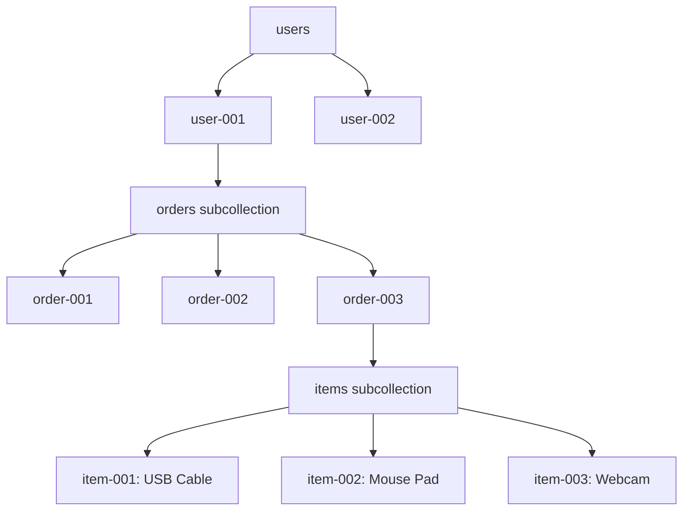

# How to Model One-to-Many Relationships Using Subcollections in Firestore

Author: [nawazdhandala](https://www.github.com/nawazdhandala)

Tags: GCP, Firestore, Data Modeling, Subcollections, NoSQL

Description: Learn how to model one-to-many relationships in Firestore using subcollections with practical examples and performance considerations.

---

One of the trickiest parts of working with Firestore is modeling relationships. Coming from a relational database background, you are used to foreign keys and joins. Firestore does not have joins, so you need different strategies. Subcollections are one of the most natural and powerful ways to handle one-to-many relationships. In this post, I will walk through when and how to use subcollections, with real-world examples.

## What is a Subcollection?

In Firestore, every document can contain subcollections. A subcollection is a collection that lives inside a document. For example, a user document can have an "orders" subcollection containing all of that user's orders.

The path to a document in a subcollection looks like:

```
users/user-001/orders/order-001
```

This natural hierarchy makes it easy to organize data that belongs to a parent entity.

## When to Use Subcollections

Subcollections are ideal when:

- You have a clear parent-child ownership relationship
- You frequently query children within the context of a parent
- The number of children per parent can grow large (thousands or more)
- You rarely need to query all children across all parents

## Example: Users and Orders

Let's model a users-and-orders relationship using subcollections.

### Creating the Data Structure

```javascript
const admin = require('firebase-admin');
const db = admin.firestore();

async function createUserWithOrders() {
    // Create the parent user document
    const userRef = db.collection('users').doc('user-001');
    await userRef.set({
        name: 'Alice Johnson',
        email: 'alice@example.com',
        createdAt: admin.firestore.FieldValue.serverTimestamp()
    });

    // Create orders as a subcollection under the user
    const ordersRef = userRef.collection('orders');

    await ordersRef.doc('order-001').set({
        product: 'Laptop',
        amount: 1299.99,
        status: 'delivered',
        orderedAt: admin.firestore.FieldValue.serverTimestamp()
    });

    await ordersRef.doc('order-002').set({
        product: 'Keyboard',
        amount: 79.99,
        status: 'shipped',
        orderedAt: admin.firestore.FieldValue.serverTimestamp()
    });

    console.log('User and orders created');
}
```

### Reading a User's Orders

```javascript
async function getUserOrders(userId) {
    // Query the orders subcollection for a specific user
    const ordersSnapshot = await db
        .collection('users')
        .doc(userId)
        .collection('orders')
        .orderBy('orderedAt', 'desc')
        .get();

    const orders = [];
    ordersSnapshot.forEach(doc => {
        orders.push({ id: doc.id, ...doc.data() });
    });

    return orders;
}

// Get all orders for user-001
const orders = await getUserOrders('user-001');
console.log('Orders:', orders);
```

### Python Implementation

```python
from google.cloud import firestore

db = firestore.Client()

def create_user_with_orders(user_id, user_data, orders):
    """Create a user and their orders using subcollections."""

    # Create the user document
    user_ref = db.collection('users').document(user_id)
    user_ref.set(user_data)

    # Add orders as subcollection documents
    for order_id, order_data in orders.items():
        user_ref.collection('orders').document(order_id).set(order_data)

def get_user_orders(user_id, status_filter=None):
    """Get all orders for a user, optionally filtered by status."""
    orders_ref = db.collection('users').document(user_id).collection('orders')

    if status_filter:
        # Query with a filter on the subcollection
        query = orders_ref.where('status', '==', status_filter)
    else:
        query = orders_ref.order_by('orderedAt', direction=firestore.Query.DESCENDING)

    return [{'id': doc.id, **doc.to_dict()} for doc in query.stream()]

# Create a user with orders
create_user_with_orders('user-001', {
    'name': 'Alice Johnson',
    'email': 'alice@example.com'
}, {
    'order-001': {'product': 'Laptop', 'amount': 1299.99, 'status': 'delivered'},
    'order-002': {'product': 'Keyboard', 'amount': 79.99, 'status': 'shipped'}
})

# Get pending orders for this user
pending = get_user_orders('user-001', status_filter='shipped')
```

## Deeper Nesting: Multi-Level Subcollections

Subcollections can contain documents with their own subcollections. Consider an e-commerce platform with users, orders, and order items:

```javascript
async function createOrderWithItems(userId, orderId, orderData, items) {
    // Create the order document in the user's orders subcollection
    const orderRef = db
        .collection('users')
        .doc(userId)
        .collection('orders')
        .doc(orderId);

    await orderRef.set(orderData);

    // Create items as a subcollection under the order
    for (const item of items) {
        await orderRef.collection('items').doc(item.itemId).set({
            productName: item.productName,
            quantity: item.quantity,
            unitPrice: item.unitPrice,
            totalPrice: item.quantity * item.unitPrice
        });
    }
}

// Usage
await createOrderWithItems('user-001', 'order-003', {
    totalAmount: 149.97,
    status: 'pending',
    orderedAt: admin.firestore.FieldValue.serverTimestamp()
}, [
    { itemId: 'item-001', productName: 'USB Cable', quantity: 3, unitPrice: 9.99 },
    { itemId: 'item-002', productName: 'Mouse Pad', quantity: 1, unitPrice: 19.99 },
    { itemId: 'item-003', productName: 'Webcam', quantity: 1, unitPrice: 99.99 }
]);
```

The data hierarchy looks like this:



## Collection Group Queries

One challenge with subcollections is querying across all parents. What if you want to find all orders across all users with a "pending" status? Collection group queries solve this:

```javascript
// Query ALL orders across ALL users with status 'pending'
// This requires a collection group query
const pendingOrders = await db
    .collectionGroup('orders')
    .where('status', '==', 'pending')
    .orderBy('orderedAt', 'desc')
    .get();

pendingOrders.forEach(doc => {
    // doc.ref.path gives you the full path including the parent user
    console.log(`Order ${doc.id} at path ${doc.ref.path}:`, doc.data());
});
```

For collection group queries to work, you need a collection group index. Firestore will prompt you to create one when you first run the query, or you can create it manually:

```bash
# Create a collection group index for orders
gcloud firestore indexes composite create \
    --collection-group=orders \
    --query-scope=COLLECTION_GROUP \
    --field-config=field-path=status,order=ASCENDING \
    --field-config=field-path=orderedAt,order=DESCENDING
```

## Subcollections vs Embedded Arrays

An alternative to subcollections is embedding related data as an array within the parent document:

```javascript
// Alternative: orders as an embedded array (not recommended for many orders)
const userWithEmbeddedOrders = {
    name: 'Alice Johnson',
    email: 'alice@example.com',
    orders: [
        { orderId: 'order-001', product: 'Laptop', amount: 1299.99, status: 'delivered' },
        { orderId: 'order-002', product: 'Keyboard', amount: 79.99, status: 'shipped' }
    ]
};
```

Here is when to use each approach:

| Factor | Subcollection | Embedded Array |
|--------|--------------|---------------|
| Number of children | Unlimited | Limited to document size (1 MB) |
| Query individual children | Yes, with indexes | Only by reading the whole document |
| Real-time listeners | Can listen to individual children | Must listen to the whole document |
| Write frequency | Each child writes independently | Every child write updates the whole document |
| Read parent without children | Naturally separate | Must read all children with parent |

Use subcollections when the number of children can grow large or when you need to query or update individual children independently. Use embedded arrays for small, bounded lists (up to a few dozen items) that are always read and written together.

## Deleting Subcollections

Firestore does not automatically delete subcollections when you delete a parent document. You need to delete them explicitly:

```javascript
async function deleteUserAndOrders(userId) {
    const userRef = db.collection('users').doc(userId);

    // First, delete all documents in the orders subcollection
    const ordersSnapshot = await userRef.collection('orders').get();
    const batch = db.batch();

    ordersSnapshot.forEach(doc => {
        batch.delete(doc.ref);
    });

    // Delete the parent user document
    batch.delete(userRef);

    // Commit all deletes in a single batch
    await batch.commit();
    console.log(`Deleted user ${userId} and ${ordersSnapshot.size} orders`);
}
```

For deep hierarchies, you need to recursively delete subcollections at each level. The Firebase CLI has a helper for this:

```bash
# Recursively delete a document and all its subcollections
firebase firestore:delete users/user-001 --recursive --project my-project
```

## Pagination with Subcollections

For subcollections with many documents, use cursor-based pagination:

```javascript
async function getOrdersPage(userId, pageSize, lastOrderDoc) {
    let query = db
        .collection('users')
        .doc(userId)
        .collection('orders')
        .orderBy('orderedAt', 'desc')
        .limit(pageSize);

    // Start after the last document from the previous page
    if (lastOrderDoc) {
        query = query.startAfter(lastOrderDoc);
    }

    const snapshot = await query.get();
    const orders = snapshot.docs.map(doc => ({ id: doc.id, ...doc.data() }));

    // Return the orders and the last document for the next page
    return {
        orders,
        lastDoc: snapshot.docs[snapshot.docs.length - 1] || null,
        hasMore: snapshot.docs.length === pageSize
    };
}

// Get the first page
const page1 = await getOrdersPage('user-001', 10, null);

// Get the next page
const page2 = await getOrdersPage('user-001', 10, page1.lastDoc);
```

## Wrapping Up

Subcollections are the most natural way to model one-to-many relationships in Firestore. They keep related data organized, scale to millions of child documents per parent, and support independent queries and real-time listeners on individual children. The main thing to remember is that subcollections are not automatically included when you read a parent document, and they are not automatically deleted when you delete the parent. Plan for both of these in your application code. For small, bounded lists, embedded arrays might be simpler, but for anything that can grow, subcollections are the way to go.
