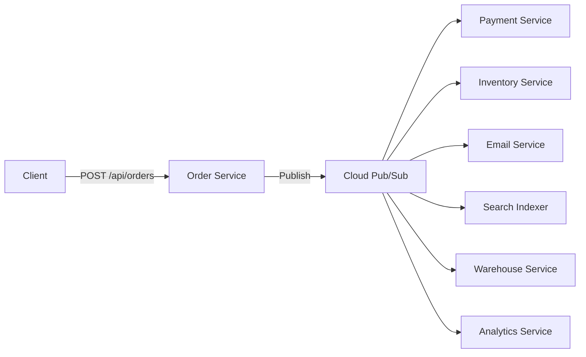

# How to Modernize a Legacy REST API to Event-Driven Architecture Using Cloud Pub/Sub

Author: [nawazdhandala](https://www.github.com/nawazdhandala)

Tags: GCP, Pub/Sub, Event-Driven Architecture, REST API, Modernization

Description: Learn how to transition a synchronous REST API to an event-driven architecture using Google Cloud Pub/Sub for better scalability and decoupling.

---

Traditional REST APIs work in a request-response pattern: a client sends a request, the server processes it synchronously, and returns a response. This works fine until you need to trigger multiple downstream actions from a single request - send an email, update a search index, notify a warehouse, generate an invoice. Suddenly your API endpoint is doing ten things, and if any one of them is slow or fails, the whole request suffers. Event-driven architecture using Cloud Pub/Sub solves this by decoupling the request handling from the downstream processing.

## The Problem with Synchronous APIs

Consider a typical e-commerce order API:

```python
# The synchronous monolithic approach - everything in one request handler
@app.route("/api/orders", methods=["POST"])
def create_order(request):
    order_data = request.json

    # Step 1: Validate the order
    validate_order(order_data)

    # Step 2: Process payment (calls external payment API)
    payment_result = process_payment(order_data)  # 2-3 seconds

    # Step 3: Update inventory
    update_inventory(order_data["items"])  # 500ms

    # Step 4: Send confirmation email
    send_confirmation_email(order_data)  # 1-2 seconds

    # Step 5: Update search index
    update_search_index(order_data)  # 300ms

    # Step 6: Notify warehouse for fulfillment
    notify_warehouse(order_data)  # 500ms

    # Step 7: Update analytics
    record_analytics_event(order_data)  # 200ms

    # Total response time: 5-7 seconds
    # If any step fails, the entire request fails
    return jsonify({"order_id": order_data["id"], "status": "confirmed"})
```

Problems with this approach:

- **Slow response times** - the user waits for all steps to complete
- **Tight coupling** - the order service knows about email, search, warehouse, and analytics
- **Cascading failures** - if the email service is down, orders fail
- **Scaling difficulty** - you cannot scale the email sending independently from order processing

## The Event-Driven Alternative

With event-driven architecture, the order API does only two things: validate the order and publish an event. Everything else happens asynchronously.



## Step 1 - Set Up Pub/Sub Topics and Subscriptions

Create the messaging infrastructure:

```bash
# Create a topic for order events
gcloud pubsub topics create order-events

# Create subscriptions - one for each downstream service
# Each subscription gets its own copy of every message

# Payment processing subscription
gcloud pubsub subscriptions create payment-processing \
  --topic order-events \
  --ack-deadline 60 \
  --dead-letter-topic order-events-dlq \
  --max-delivery-attempts 5

# Inventory update subscription
gcloud pubsub subscriptions create inventory-update \
  --topic order-events \
  --ack-deadline 30

# Email notification subscription
gcloud pubsub subscriptions create email-notification \
  --topic order-events \
  --ack-deadline 30

# Search index subscription
gcloud pubsub subscriptions create search-index-update \
  --topic order-events \
  --ack-deadline 30

# Warehouse notification subscription
gcloud pubsub subscriptions create warehouse-notification \
  --topic order-events \
  --ack-deadline 30

# Analytics subscription
gcloud pubsub subscriptions create analytics-recording \
  --topic order-events \
  --ack-deadline 30

# Create a dead letter topic for failed messages
gcloud pubsub topics create order-events-dlq
gcloud pubsub subscriptions create order-events-dlq-monitor \
  --topic order-events-dlq
```

## Step 2 - Refactor the Order API

The order API now validates the request and publishes an event:

```python
# Refactored order API - fast and focused
from google.cloud import pubsub_v1
import json
import uuid
from datetime import datetime

publisher = pubsub_v1.PublisherClient()
topic_path = publisher.topic_path('my-project', 'order-events')

@app.route("/api/orders", methods=["POST"])
def create_order(request):
    order_data = request.json

    # Step 1: Validate the order (still synchronous - this is fast)
    errors = validate_order(order_data)
    if errors:
        return jsonify({"errors": errors}), 400

    # Step 2: Save the order to the database with "pending" status
    order_id = str(uuid.uuid4())
    order = {
        "order_id": order_id,
        "customer_id": order_data["customer_id"],
        "items": order_data["items"],
        "total": calculate_total(order_data["items"]),
        "status": "pending",
        "created_at": datetime.utcnow().isoformat()
    }
    save_order_to_db(order)

    # Step 3: Publish the event (async - returns immediately)
    event = {
        "event_type": "order.created",
        "event_id": str(uuid.uuid4()),
        "timestamp": datetime.utcnow().isoformat(),
        "data": order
    }
    publisher.publish(
        topic_path,
        json.dumps(event).encode('utf-8'),
        event_type="order.created",
        order_id=order_id
    )

    # Response time: <100ms instead of 5-7 seconds
    return jsonify({
        "order_id": order_id,
        "status": "pending",
        "message": "Order received and being processed"
    }), 202  # 202 Accepted - processing will happen asynchronously
```

Notice the 202 status code. This tells the client that the request was accepted but processing has not completed. The client can poll for status or receive a webhook callback when processing finishes.

## Step 3 - Build Event Subscribers

Each downstream service subscribes to the events it cares about:

### Payment Service

```python
# Payment service - subscribes to order.created events
from google.cloud import pubsub_v1
import json

subscriber = pubsub_v1.SubscriberClient()
subscription_path = subscriber.subscription_path('my-project', 'payment-processing')

def process_payment(message):
    try:
        event = json.loads(message.data.decode('utf-8'))

        # Only process order.created events
        if event["event_type"] != "order.created":
            message.ack()
            return

        order = event["data"]
        print(f"Processing payment for order {order['order_id']}")

        # Call the payment provider
        payment_result = charge_credit_card(
            customer_id=order["customer_id"],
            amount=order["total"]
        )

        # Publish a payment result event
        publish_event("payment-events", {
            "event_type": "payment.completed" if payment_result.success else "payment.failed",
            "order_id": order["order_id"],
            "payment_id": payment_result.id,
            "amount": order["total"]
        })

        message.ack()

    except Exception as e:
        print(f"Payment processing failed: {e}")
        message.nack()  # Will be retried

# Start listening for messages
streaming_pull = subscriber.subscribe(subscription_path, callback=process_payment)
```

### Email Notification Service

```python
# Email service - sends confirmation emails
def send_order_email(message):
    try:
        event = json.loads(message.data.decode('utf-8'))

        if event["event_type"] != "order.created":
            message.ack()
            return

        order = event["data"]
        customer = get_customer(order["customer_id"])

        # Send the confirmation email
        send_email(
            to=customer["email"],
            subject=f"Order {order['order_id']} Confirmed",
            template="order_confirmation",
            context={"order": order, "customer": customer}
        )

        message.ack()

    except Exception as e:
        print(f"Email sending failed: {e}")
        message.nack()
```

### Search Index Service

```python
# Search indexer - updates the search index when orders are created
def update_search(message):
    try:
        event = json.loads(message.data.decode('utf-8'))

        if event["event_type"] != "order.created":
            message.ack()
            return

        order = event["data"]

        # Index the order in Elasticsearch or similar
        index_order(order)

        message.ack()

    except Exception as e:
        print(f"Search indexing failed: {e}")
        message.nack()
```

## Step 4 - Add Pub/Sub Push Subscribers for Cloud Run

Instead of long-running pull subscribers, use Pub/Sub push subscriptions with Cloud Run services:

```bash
# Create a push subscription that sends messages to a Cloud Run service
gcloud pubsub subscriptions create email-push \
  --topic order-events \
  --push-endpoint https://email-service-abc123-uc.a.run.app/handle-event \
  --push-auth-service-account pubsub-invoker@my-project.iam.gserviceaccount.com
```

The Cloud Run service receives events as HTTP POST requests:

```python
# Cloud Run email service - receives push notifications from Pub/Sub
import base64
import json
from flask import Flask, request

app = Flask(__name__)

@app.route("/handle-event", methods=["POST"])
def handle_event():
    envelope = request.get_json()

    if not envelope or "message" not in envelope:
        return "Bad Request", 400

    # Decode the Pub/Sub message
    message_data = base64.b64decode(envelope["message"]["data"]).decode("utf-8")
    event = json.loads(message_data)

    if event["event_type"] == "order.created":
        order = event["data"]
        customer = get_customer(order["customer_id"])
        send_email(
            to=customer["email"],
            subject=f"Order {order['order_id']} Confirmed",
            template="order_confirmation",
            context={"order": order, "customer": customer}
        )

    # Return 200 to acknowledge the message
    return "OK", 200
```

## Step 5 - Handle Event Ordering and Idempotency

Events can arrive out of order or be delivered more than once. Design your subscribers to handle both:

```python
# Idempotent event processing
def process_event(message):
    event = json.loads(message.data.decode('utf-8'))
    event_id = event["event_id"]

    # Check if this event was already processed (deduplication)
    if is_event_processed(event_id):
        message.ack()
        return

    try:
        # Process the event
        handle_order_created(event["data"])

        # Record that this event was processed
        mark_event_processed(event_id)
        message.ack()

    except Exception as e:
        message.nack()
```

## Step 6 - Provide Status Updates to Clients

Since processing is asynchronous, give clients a way to check order status:

```python
# Status endpoint for clients to check order progress
@app.route("/api/orders/<order_id>/status", methods=["GET"])
def get_order_status(order_id):
    order = get_order_from_db(order_id)
    if not order:
        return jsonify({"error": "Order not found"}), 404

    return jsonify({
        "order_id": order_id,
        "status": order["status"],
        "events": [
            {"type": "order.created", "timestamp": order["created_at"]},
            {"type": "payment.completed", "timestamp": order.get("payment_at")},
            {"type": "shipment.created", "timestamp": order.get("shipped_at")}
        ]
    })
```

## Benefits of This Approach

1. **Response time drops from seconds to milliseconds** - users get an immediate response
2. **Services are decoupled** - the email service can be down without affecting orders
3. **Independent scaling** - scale the payment service differently from the email service
4. **Easy to add new functionality** - adding a new subscriber does not change existing code
5. **Better fault tolerance** - failed messages are retried automatically

## Gradual Migration

You do not have to convert your entire API to event-driven at once. Start with one endpoint, validate the pattern, and expand to others. Keep the synchronous versions running during the transition.

The shift from synchronous REST to event-driven is a mindset change as much as a technical one. Instead of asking "what should this API call do?", you ask "what event just happened, and who needs to know about it?" That shift in thinking is what makes event-driven architecture work.
