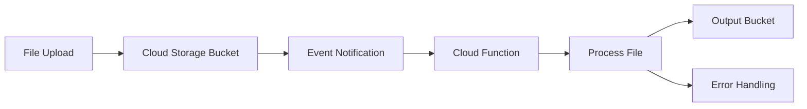

# How to Modernize Legacy File Processing Pipelines to Event-Driven Workflows with Cloud Functions and Cloud Storage

Author: [nawazdhandala](https://www.github.com/nawazdhandala)

Tags: GCP, Cloud Functions, Cloud Storage, Event-Driven Architecture, Serverless, File Processing

Description: Replace legacy batch file processing with event-driven workflows using Google Cloud Functions and Cloud Storage triggers for real-time, scalable file handling on GCP.

---

Legacy file processing pipelines are everywhere. You have a cron job that checks a directory every five minutes, picks up new files, runs some transformation logic, and drops the output somewhere else. It works, but it is wasteful, slow, and fragile. If the cron job dies, files pile up. If traffic spikes, you are stuck waiting for the next interval.

I have rebuilt several of these pipelines using Cloud Functions triggered by Cloud Storage events on GCP, and the improvement is dramatic. Files get processed within seconds of upload, the system scales automatically, and you stop paying for idle compute. Here is how to do it.

## The Problem with Legacy File Processing

Traditional file processing usually looks something like this:

```
Cron job (every 5 min) -> Check input directory -> Process files -> Write output -> Move originals to archive
```

The issues are predictable:

- **Latency**: Files sit unprocessed until the next cron interval.
- **Resource waste**: The job runs even when there are no files to process.
- **Scaling ceiling**: A single processing job can only handle so many files per cycle.
- **Failure recovery**: If the job crashes mid-batch, you need custom logic to handle partially processed files.
- **Monitoring gaps**: It is hard to track individual file processing status.

## The Event-Driven Alternative

With Cloud Storage and Cloud Functions, the architecture flips to push-based:



Every file upload triggers a function invocation. No polling, no wasted compute, no delays.

## Setting Up the Cloud Storage Bucket

Start by creating the input and output buckets:

```bash
# Create the input bucket where files will be uploaded
gsutil mb -l us-central1 gs://my-project-file-input

# Create the output bucket for processed files
gsutil mb -l us-central1 gs://my-project-file-output

# Create a dead-letter bucket for files that fail processing
gsutil mb -l us-central1 gs://my-project-file-errors
```

## Writing the Cloud Function

Here is a Cloud Function that processes CSV files - it reads them from the input bucket, transforms the data, and writes the result to the output bucket. This example uses Python, but you can use Node.js, Go, or Java.

```python
# main.py - Cloud Function triggered by Cloud Storage events
import csv
import io
import json
import logging
from datetime import datetime
from google.cloud import storage

# Initialize the storage client once outside the function for reuse
storage_client = storage.Client()

OUTPUT_BUCKET = 'my-project-file-output'
ERROR_BUCKET = 'my-project-file-errors'

def process_file(event, context):
    """Triggered by a Cloud Storage finalize event when a file is uploaded."""

    bucket_name = event['bucket']
    file_name = event['name']

    # Skip non-CSV files and temporary uploads
    if not file_name.endswith('.csv') or file_name.startswith('temp/'):
        logging.info(f'Skipping non-target file: {file_name}')
        return

    logging.info(f'Processing file: {file_name} from bucket: {bucket_name}')

    try:
        # Download the source file
        source_bucket = storage_client.bucket(bucket_name)
        source_blob = source_bucket.blob(file_name)
        content = source_blob.download_as_text()

        # Parse and transform the CSV data
        reader = csv.DictReader(io.StringIO(content))
        transformed_rows = []

        for row in reader:
            # Apply your transformation logic here
            transformed_row = transform_row(row)
            if transformed_row:
                transformed_rows.append(transformed_row)

        # Write the processed output
        output_bucket = storage_client.bucket(OUTPUT_BUCKET)
        timestamp = datetime.utcnow().strftime('%Y%m%d_%H%M%S')
        output_name = f'processed/{timestamp}_{file_name}'
        output_blob = output_bucket.blob(output_name)

        # Convert transformed rows back to CSV
        output = io.StringIO()
        if transformed_rows:
            writer = csv.DictWriter(output, fieldnames=transformed_rows[0].keys())
            writer.writeheader()
            writer.writerows(transformed_rows)

        output_blob.upload_from_string(output.getvalue(), content_type='text/csv')
        logging.info(f'Wrote {len(transformed_rows)} rows to {output_name}')

    except Exception as e:
        logging.error(f'Error processing {file_name}: {str(e)}')
        # Move the failed file to the error bucket for investigation
        move_to_error_bucket(bucket_name, file_name, str(e))
        raise  # Re-raise so Cloud Functions marks this as a failed invocation


def transform_row(row):
    """Apply business logic transformations to a single row."""
    # Example: normalize fields, calculate derived values, filter bad data
    if not row.get('email'):
        return None  # Skip rows without email

    return {
        'email': row['email'].lower().strip(),
        'name': row.get('name', '').title(),
        'signup_date': row.get('date', ''),
        'processed_at': datetime.utcnow().isoformat(),
    }


def move_to_error_bucket(source_bucket_name, file_name, error_message):
    """Copy failed files to an error bucket with metadata about the failure."""
    source_bucket = storage_client.bucket(source_bucket_name)
    error_bucket = storage_client.bucket(ERROR_BUCKET)

    source_blob = source_bucket.blob(file_name)
    source_bucket.copy_blob(source_blob, error_bucket, file_name)

    # Write error metadata alongside the file
    error_blob = error_bucket.blob(f'{file_name}.error.json')
    error_blob.upload_from_string(json.dumps({
        'file': file_name,
        'error': error_message,
        'timestamp': datetime.utcnow().isoformat(),
    }))
```

## Deploying the Function

Deploy the function with a Cloud Storage trigger:

```bash
# Deploy the function triggered by file uploads to the input bucket
gcloud functions deploy process-file \
  --runtime=python311 \
  --trigger-resource=my-project-file-input \
  --trigger-event=google.storage.object.finalize \
  --entry-point=process_file \
  --memory=512MB \
  --timeout=540s \
  --region=us-central1 \
  --set-env-vars="OUTPUT_BUCKET=my-project-file-output,ERROR_BUCKET=my-project-file-errors"
```

The `google.storage.object.finalize` event fires when a new object is created or an existing object is overwritten. This covers both fresh uploads and re-uploads.

## Handling Large Files

Cloud Functions have a timeout limit (9 minutes for 1st gen, 60 minutes for 2nd gen). For large files, you have a few options.

For files that take longer than the timeout, split the work using Pub/Sub:

```python
# For large files, publish a message with the file location
# and let a longer-running service (Cloud Run or GKE) handle it
from google.cloud import pubsub_v1

publisher = pubsub_v1.PublisherClient()
TOPIC = 'projects/my-project/topics/large-file-processing'

def process_file(event, context):
    """Route large files to a different processing pipeline."""
    file_name = event['name']
    file_size = int(event.get('size', 0))

    # Files over 100MB go to the heavy processing pipeline
    if file_size > 100 * 1024 * 1024:
        publisher.publish(TOPIC, data=json.dumps(event).encode('utf-8'))
        logging.info(f'Routed large file {file_name} to heavy processing pipeline')
        return

    # Smaller files processed inline
    process_small_file(event)
```

## Adding Retry Logic and Idempotency

Cloud Functions can retry on failure. You need to make sure your function is idempotent - processing the same file twice should not produce duplicate output.

```python
from google.cloud import firestore

# Use Firestore to track which files have been processed
db = firestore.Client()

def process_file(event, context):
    """Idempotent file processor using event ID for deduplication."""
    event_id = context.event_id
    file_name = event['name']

    # Check if we already processed this event
    doc_ref = db.collection('processed_events').document(event_id)
    if doc_ref.get().exists:
        logging.info(f'Event {event_id} already processed, skipping')
        return

    # Process the file
    result = do_processing(event)

    # Mark as processed
    doc_ref.set({
        'file': file_name,
        'processed_at': datetime.utcnow(),
        'result': result,
    })
```

## Monitoring the Pipeline

Set up Cloud Monitoring to keep tabs on the pipeline:

```bash
# Create an alert policy for function errors
gcloud alpha monitoring policies create \
  --display-name="File Processing Errors" \
  --condition-display-name="Function error rate > 5%" \
  --condition-filter='resource.type="cloud_function" AND resource.labels.function_name="process-file" AND metric.type="cloudfunctions.googleapis.com/function/execution_count" AND metric.labels.status!="ok"'
```

You should also set up log-based metrics to track processing volume and latency:

```bash
# Create a log-based metric for tracking file processing count
gcloud logging metrics create file-processing-count \
  --description="Count of files processed by the pipeline" \
  --log-filter='resource.type="cloud_function" AND resource.labels.function_name="process-file" AND textPayload=~"Wrote .* rows"'
```

## Migration Approach

When migrating from a cron-based pipeline, run both systems in parallel:

1. Deploy the new event-driven pipeline alongside the existing cron job.
2. Upload a batch of test files and verify the output matches what the cron job would produce.
3. Once validated, route new files to the Cloud Storage bucket instead of the legacy directory.
4. Keep the cron job running for a week as a safety net, processing anything the new pipeline might miss.
5. Decommission the cron job.

## Cost Comparison

The cost savings are often significant. A cron job running on a Compute Engine VM costs money 24/7 whether it is processing files or not. Cloud Functions charge per invocation and per GB-second of compute. If you process 10,000 files per day with each taking 2 seconds on 512 MB of memory, you are looking at roughly 10,000 seconds of compute per day versus paying for an always-on VM.

## Wrapping Up

Event-driven file processing with Cloud Functions and Cloud Storage is a reliable pattern that eliminates the waste and latency of traditional cron-based pipelines. Files get processed immediately on upload, the system scales to handle bursts automatically, and you only pay for actual processing time. The key is to build in idempotency and error handling from the start, and to use a phased migration approach so you can validate the new pipeline before cutting over completely.
