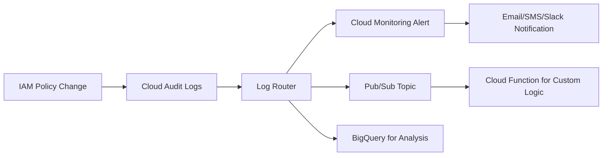

# How to Monitor and Alert on IAM Policy Changes in Real Time with Google Cloud

Author: [nawazdhandala](https://www.github.com/nawazdhandala)

Tags: GCP, Google Cloud, IAM, Monitoring, Cloud Logging, Alerting, Security Operations

Description: Learn how to set up real-time monitoring and alerting for IAM policy changes in Google Cloud to detect unauthorized access modifications immediately.

---

IAM policy changes are some of the most security-sensitive events in your Google Cloud environment. When someone adds a new role binding, they are potentially opening access to sensitive resources. When someone removes a binding, they might be covering their tracks. When someone grants the Owner role to an external email address, you want to know about it immediately, not during next week's security review.

Setting up real-time monitoring for IAM changes is straightforward using Cloud Audit Logs, Cloud Monitoring, and alerting. Let me walk through the full setup.

## What IAM Changes Look Like in Audit Logs

Every IAM policy change in Google Cloud is recorded in Cloud Audit Logs under the Admin Activity log stream. These logs are always enabled and cannot be turned off. The key method names to watch for are:

- `SetIamPolicy` - Changes to any resource's IAM policy
- `CreateServiceAccount` - New service account creation
- `CreateServiceAccountKey` - New service account key creation
- `CreateRole` - Custom role creation
- `UpdateRole` - Custom role modification



## Step 1: Verify Audit Logging Is Active

Admin Activity logs are on by default, but verify:

```bash
# Check audit log configuration
gcloud projects get-iam-policy my-project \
    --format="json" | jq '.auditConfigs'

# List recent IAM policy changes to confirm logging works
gcloud logging read \
    'protoPayload.methodName="SetIamPolicy"' \
    --project=my-project \
    --freshness=7d \
    --limit=5 \
    --format="table(timestamp,protoPayload.authenticationInfo.principalEmail,protoPayload.resourceName)"
```

## Step 2: Create Log-Based Alerts for Critical IAM Changes

Set up alerts for the most dangerous IAM changes:

### Alert: Owner or Editor Role Granted

```bash
# Create a log-based metric for Owner/Editor role grants
gcloud logging metrics create iam-high-priv-grant \
    --project=my-project \
    --description="Tracks when Owner or Editor roles are granted" \
    --log-filter='
        protoPayload.methodName="SetIamPolicy"
        AND (
            protoPayload.serviceData.policyDelta.bindingDeltas.role="roles/owner"
            OR protoPayload.serviceData.policyDelta.bindingDeltas.role="roles/editor"
        )
        AND protoPayload.serviceData.policyDelta.bindingDeltas.action="ADD"
    '
```

Now create an alert policy based on this metric:

```bash
# Create an alert that fires immediately when the metric is non-zero
gcloud monitoring policies create \
    --project=my-project \
    --display-name="High-Privilege IAM Role Granted" \
    --condition-display-name="Owner or Editor role granted" \
    --condition-filter='metric.type="logging.googleapis.com/user/iam-high-priv-grant"' \
    --condition-threshold-value=0 \
    --condition-threshold-comparison=COMPARISON_GT \
    --notification-channels=CHANNEL_ID \
    --combiner=OR \
    --duration=0s \
    --condition-threshold-aggregation-alignment-period=60s
```

### Alert: External Member Added to IAM Policy

```bash
# Metric for external members being added
gcloud logging metrics create iam-external-member-added \
    --project=my-project \
    --description="Tracks when external members are added to IAM policies" \
    --log-filter='
        protoPayload.methodName="SetIamPolicy"
        AND protoPayload.serviceData.policyDelta.bindingDeltas.action="ADD"
        AND NOT protoPayload.serviceData.policyDelta.bindingDeltas.member:"@example.com"
        AND protoPayload.serviceData.policyDelta.bindingDeltas.member:"user:"
    '
```

### Alert: Service Account Key Created

```bash
# Metric for service account key creation
gcloud logging metrics create sa-key-created \
    --project=my-project \
    --description="Tracks service account key creation events" \
    --log-filter='
        protoPayload.methodName="google.iam.admin.v1.CreateServiceAccountKey"
        AND protoPayload.request.privateKeyType!="TYPE_GOOGLE_CREDENTIALS_FILE"
    '
```

## Step 3: Create a Real-Time Processing Pipeline

For more sophisticated analysis, route IAM change logs to Pub/Sub and process them with a Cloud Function:

```bash
# Create a Pub/Sub topic for IAM change events
gcloud pubsub topics create iam-changes \
    --project=my-project

# Create a log sink that routes IAM change events to the topic
gcloud logging sinks create iam-change-sink \
    "pubsub.googleapis.com/projects/my-project/topics/iam-changes" \
    --project=my-project \
    --log-filter='
        protoPayload.methodName="SetIamPolicy"
        OR protoPayload.methodName="google.iam.admin.v1.CreateServiceAccount"
        OR protoPayload.methodName="google.iam.admin.v1.CreateServiceAccountKey"
        OR protoPayload.methodName="google.iam.admin.v1.CreateRole"
    '

# Grant the log sink's service account permission to publish
SINK_SA=$(gcloud logging sinks describe iam-change-sink \
    --project=my-project \
    --format="value(writerIdentity)")

gcloud pubsub topics add-iam-policy-binding iam-changes \
    --project=my-project \
    --member="${SINK_SA}" \
    --role="roles/pubsub.publisher"
```

Now create a Cloud Function that processes these events:

```python
# main.py
# Cloud Function that processes IAM change events and sends alerts

import base64
import json
import os
from google.cloud import pubsub_v1
import requests

# Slack webhook URL for notifications (set as environment variable)
SLACK_WEBHOOK = os.environ.get("SLACK_WEBHOOK_URL")

# Your organization's domain
ORG_DOMAIN = "example.com"

# High-risk roles that trigger immediate alerts
HIGH_RISK_ROLES = [
    "roles/owner",
    "roles/editor",
    "roles/iam.serviceAccountAdmin",
    "roles/iam.serviceAccountKeyAdmin",
    "roles/resourcemanager.organizationAdmin",
    "roles/resourcemanager.projectIamAdmin",
]

def process_iam_change(event, context):
    """Process an IAM change event from Cloud Audit Logs."""
    # Decode the Pub/Sub message
    pubsub_message = base64.b64decode(event["data"]).decode("utf-8")
    log_entry = json.loads(pubsub_message)

    payload = log_entry.get("protoPayload", {})
    method = payload.get("methodName", "")
    actor = payload.get("authenticationInfo", {}).get("principalEmail", "unknown")
    resource = payload.get("resourceName", "unknown")
    timestamp = log_entry.get("timestamp", "unknown")

    # Analyze the change
    alerts = []

    if method == "SetIamPolicy":
        policy_delta = payload.get("serviceData", {}).get("policyDelta", {})
        binding_deltas = policy_delta.get("bindingDeltas", [])

        for delta in binding_deltas:
            action = delta.get("action", "")
            role = delta.get("role", "")
            member = delta.get("member", "")

            # Check for high-risk role grants
            if action == "ADD" and role in HIGH_RISK_ROLES:
                alerts.append({
                    "severity": "CRITICAL",
                    "message": f"High-risk role granted: {role} to {member}",
                    "actor": actor,
                    "resource": resource
                })

            # Check for external member additions
            if action == "ADD" and "user:" in member and \
               f"@{ORG_DOMAIN}" not in member:
                alerts.append({
                    "severity": "HIGH",
                    "message": f"External member added: {member} with role {role}",
                    "actor": actor,
                    "resource": resource
                })

            # Check for public access
            if action == "ADD" and member in ["allUsers", "allAuthenticatedUsers"]:
                alerts.append({
                    "severity": "CRITICAL",
                    "message": f"Public access granted: {member} with role {role}",
                    "actor": actor,
                    "resource": resource
                })

    elif "CreateServiceAccountKey" in method:
        alerts.append({
            "severity": "MEDIUM",
            "message": f"Service account key created for {resource}",
            "actor": actor,
            "resource": resource
        })

    # Send alerts
    for alert in alerts:
        send_slack_alert(alert, timestamp)

def send_slack_alert(alert, timestamp):
    """Send an alert to Slack."""
    severity_colors = {
        "CRITICAL": "#FF0000",
        "HIGH": "#FF8C00",
        "MEDIUM": "#FFD700",
        "LOW": "#00FF00"
    }

    payload = {
        "attachments": [{
            "color": severity_colors.get(alert["severity"], "#808080"),
            "title": f"IAM Security Alert - {alert['severity']}",
            "text": alert["message"],
            "fields": [
                {"title": "Actor", "value": alert["actor"], "short": True},
                {"title": "Resource", "value": alert["resource"], "short": True},
                {"title": "Time", "value": timestamp, "short": True}
            ]
        }]
    }

    if SLACK_WEBHOOK:
        requests.post(SLACK_WEBHOOK, json=payload)
```

Deploy the function:

```bash
# Deploy the Cloud Function
gcloud functions deploy process-iam-changes \
    --project=my-project \
    --runtime=python311 \
    --trigger-topic=iam-changes \
    --entry-point=process_iam_change \
    --set-env-vars="SLACK_WEBHOOK_URL=https://hooks.slack.com/services/YOUR/WEBHOOK/URL" \
    --service-account=iam-monitor@my-project.iam.gserviceaccount.com \
    --timeout=120s
```

## Step 4: Store IAM Changes in BigQuery for Analysis

For long-term analysis and compliance reporting, export IAM changes to BigQuery:

```bash
# Create a BigQuery dataset for audit logs
bq mk --dataset my-project:iam_audit

# Create a log sink to BigQuery
gcloud logging sinks create iam-changes-bigquery \
    "bigquery.googleapis.com/projects/my-project/datasets/iam_audit" \
    --project=my-project \
    --log-filter='
        protoPayload.methodName="SetIamPolicy"
        OR protoPayload.methodName:"CreateServiceAccount"
        OR protoPayload.methodName:"CreateServiceAccountKey"
    '

# Grant BigQuery write access to the sink
SINK_SA=$(gcloud logging sinks describe iam-changes-bigquery \
    --project=my-project \
    --format="value(writerIdentity)")

bq add-iam-policy-binding \
    --project=my-project \
    --dataset=iam_audit \
    --member="${SINK_SA}" \
    --role="roles/bigquery.dataEditor"
```

Query IAM changes in BigQuery:

```sql
-- Find the top 10 accounts making IAM changes this month
SELECT
  protopayload_auditlog.authenticationInfo.principalEmail AS actor,
  COUNT(*) AS change_count,
  ARRAY_AGG(DISTINCT protopayload_auditlog.methodName) AS methods
FROM
  `my-project.iam_audit.cloudaudit_googleapis_com_activity`
WHERE
  timestamp >= TIMESTAMP_SUB(CURRENT_TIMESTAMP(), INTERVAL 30 DAY)
  AND protopayload_auditlog.methodName = 'SetIamPolicy'
GROUP BY actor
ORDER BY change_count DESC
LIMIT 10;
```

## Step 5: Create a Summary Dashboard

Build a Cloud Monitoring dashboard that shows IAM change activity at a glance:

```bash
# Create a dashboard with IAM change widgets
gcloud monitoring dashboards create \
    --config-from-file=iam-dashboard.json
```

The dashboard should include:

- Total IAM changes per day (trend chart)
- High-risk role grants (counter)
- External member additions (counter)
- Service account key creations (counter)
- Top actors making IAM changes (table)

## Summary

Monitoring IAM policy changes in real time catches security issues while they are happening rather than after the damage is done. The setup involves creating log-based metrics for specific IAM events, alerting on the most dangerous patterns (high-privilege role grants, external member additions, public access), and building a processing pipeline for more nuanced analysis. Export to BigQuery for long-term analysis and compliance reporting. The initial setup takes an hour or two, but the ongoing value of knowing exactly who changed what access and when is enormous for security operations.
