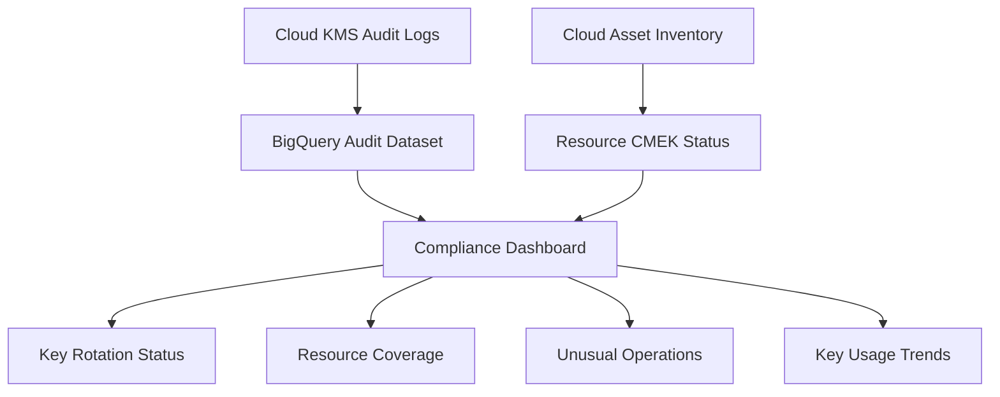

# How to Monitor and Audit CMEK Usage Across a Google Cloud Organization

Author: [nawazdhandala](https://www.github.com/nawazdhandala)

Tags: GCP, CMEK, Cloud KMS, Audit Logging, Cloud Monitoring, Compliance

Description: Learn how to monitor, audit, and report on Customer-Managed Encryption Key usage across your entire Google Cloud organization for compliance and operational visibility.

---

Deploying CMEK across your Google Cloud organization is only half the job. The other half is knowing what is happening with those keys - who is using them, which resources are encrypted with which keys, whether keys are being rotated on schedule, and whether any resources slipped through without CMEK. Without this visibility, CMEK becomes a checkbox exercise rather than an actual security control.

This guide covers how to build comprehensive monitoring and auditing for CMEK across an entire Google Cloud organization.

## What Needs Monitoring

CMEK monitoring breaks down into several areas:

1. **Key operations** - encrypt, decrypt, create, destroy, disable, rotate
2. **Key access** - which service accounts and users are using each key
3. **Resource coverage** - which resources have CMEK and which do not
4. **Key health** - rotation status, enabled/disabled state, pending destruction
5. **Policy compliance** - whether organization policies requiring CMEK are being followed

## Enabling Cloud KMS Audit Logs

Cloud KMS generates audit logs for all key operations. Data Access logs are not enabled by default for KMS - you need to explicitly turn them on.

This command enables all audit log types for Cloud KMS at the organization level.

```bash
# Enable comprehensive audit logging for Cloud KMS
gcloud organizations set-iam-policy 123456789 --format=json | \
  python3 -c "
import json, sys
policy = json.load(sys.stdin)
# Add KMS audit log config
kms_config = {
    'service': 'cloudkms.googleapis.com',
    'auditLogConfigs': [
        {'logType': 'ADMIN_READ'},
        {'logType': 'ADMIN_WRITE'},
        {'logType': 'DATA_READ'},
        {'logType': 'DATA_WRITE'}
    ]
}
if 'auditConfigs' not in policy:
    policy['auditConfigs'] = []
# Remove existing KMS config if present
policy['auditConfigs'] = [c for c in policy['auditConfigs'] if c.get('service') != 'cloudkms.googleapis.com']
policy['auditConfigs'].append(kms_config)
json.dump(policy, sys.stdout, indent=2)
" > /tmp/org-policy.json

gcloud organizations set-iam-policy 123456789 /tmp/org-policy.json
```

Alternatively, use Terraform for cleaner management.

```hcl
# Enable comprehensive KMS audit logging at the organization level
resource "google_organization_iam_audit_config" "kms" {
  org_id  = "123456789"
  service = "cloudkms.googleapis.com"

  audit_log_config {
    log_type = "ADMIN_READ"
  }

  audit_log_config {
    log_type = "DATA_READ"
  }

  audit_log_config {
    log_type = "DATA_WRITE"
  }
}
```

## Creating a Centralized Audit Log Sink

Route all KMS audit logs to a centralized BigQuery dataset for analysis.

```bash
# Create an organization-level log sink for KMS operations
gcloud logging sinks create kms-audit-sink \
  bigquery.googleapis.com/projects/audit-project/datasets/kms_audit_logs \
  --organization=123456789 \
  --include-children \
  --log-filter='resource.type="cloudkms_cryptokey" OR resource.type="cloudkms_keyring" OR resource.type="cloudkms_cryptokeyversion"'
```

Make sure the BigQuery dataset exists and the sink's service account has write permissions.

```bash
# Create the BigQuery dataset for KMS audit logs
bq mk --dataset \
  --location=US \
  --description="Centralized KMS audit logs" \
  audit-project:kms_audit_logs

# Grant the log sink writer access
SINK_SA=$(gcloud logging sinks describe kms-audit-sink \
  --organization=123456789 \
  --format='value(writerIdentity)')

bq add-iam-policy-binding \
  --member="${SINK_SA}" \
  --role="roles/bigquery.dataEditor" \
  audit-project:kms_audit_logs
```

## Querying Key Usage Patterns

Once audit logs flow into BigQuery, you can run analytics on key usage. Here are the most useful queries.

This query shows which service accounts are performing the most encrypt/decrypt operations.

```sql
-- Top service accounts by KMS operation volume in the last 7 days
SELECT
  protopayload_auditlog.authenticationInfo.principalEmail AS caller,
  protopayload_auditlog.methodName AS operation,
  resource.labels.key_ring_id AS key_ring,
  resource.labels.crypto_key_id AS key_name,
  COUNT(*) AS operation_count
FROM `audit-project.kms_audit_logs.cloudaudit_googleapis_com_data_access`
WHERE timestamp >= TIMESTAMP_SUB(CURRENT_TIMESTAMP(), INTERVAL 7 DAY)
  AND protopayload_auditlog.methodName IN (
    'Encrypt', 'Decrypt', 'AsymmetricSign', 'AsymmetricDecrypt'
  )
GROUP BY caller, operation, key_ring, key_name
ORDER BY operation_count DESC
LIMIT 20;
```

This query detects unusual key management operations like disable or destroy.

```sql
-- Key management operations that need attention (last 24 hours)
SELECT
  timestamp,
  protopayload_auditlog.authenticationInfo.principalEmail AS who,
  protopayload_auditlog.methodName AS what,
  resource.labels.key_ring_id AS key_ring,
  resource.labels.crypto_key_id AS key_name,
  protopayload_auditlog.status.code AS status_code,
  protopayload_auditlog.status.message AS status_message
FROM `audit-project.kms_audit_logs.cloudaudit_googleapis_com_activity`
WHERE timestamp >= TIMESTAMP_SUB(CURRENT_TIMESTAMP(), INTERVAL 1 DAY)
  AND protopayload_auditlog.methodName IN (
    'DestroyCryptoKeyVersion',
    'DisableCryptoKeyVersion',
    'UpdateCryptoKey',
    'CreateCryptoKeyVersion'
  )
ORDER BY timestamp DESC;
```

## Monitoring Key Rotation Compliance

Key rotation is a common compliance requirement. This script checks all keys in your organization and reports those that have not been rotated within the required period.

```python
# Check key rotation compliance across the organization
from google.cloud import kms
from google.cloud import resourcemanager_v3
from datetime import datetime, timedelta

# Maximum allowed age for the primary key version
MAX_KEY_AGE_DAYS = 90

def check_rotation_compliance(org_id):
    """Scan all KMS keys in the organization for rotation compliance."""
    kms_client = kms.KeyManagementServiceClient()
    rm_client = resourcemanager_v3.ProjectsClient()

    # List all projects in the organization
    projects = rm_client.search_projects(
        query=f"parent.type:organization parent.id:{org_id}"
    )

    non_compliant_keys = []

    for project in projects:
        project_id = project.project_id

        # List all locations with key rings
        try:
            locations = ["us-central1", "us-east1", "europe-west1", "global"]
            for location in locations:
                parent = f"projects/{project_id}/locations/{location}"

                try:
                    key_rings = kms_client.list_key_rings(
                        request={"parent": parent}
                    )
                except Exception:
                    continue

                for ring in key_rings:
                    keys = kms_client.list_crypto_keys(
                        request={"parent": ring.name}
                    )

                    for key in keys:
                        if key.purpose != kms.CryptoKey.CryptoKeyPurpose.ENCRYPT_DECRYPT:
                            continue

                        # Get the primary version
                        if key.primary and key.primary.create_time:
                            age = datetime.utcnow() - key.primary.create_time.replace(tzinfo=None)
                            if age > timedelta(days=MAX_KEY_AGE_DAYS):
                                non_compliant_keys.append({
                                    "key": key.name,
                                    "age_days": age.days,
                                    "last_rotated": key.primary.create_time.isoformat(),
                                    "rotation_period": str(key.rotation_period) if key.rotation_period else "Not set"
                                })
        except Exception as e:
            print(f"Error scanning project {project_id}: {e}")

    # Report results
    print(f"\nKeys exceeding {MAX_KEY_AGE_DAYS}-day rotation requirement:")
    for k in non_compliant_keys:
        print(f"  {k['key']}")
        print(f"    Age: {k['age_days']} days")
        print(f"    Last rotated: {k['last_rotated']}")
        print(f"    Rotation period: {k['rotation_period']}")

    return non_compliant_keys

check_rotation_compliance("123456789")
```

## Identifying Resources Without CMEK

One of the biggest audit needs is finding resources that should have CMEK but do not. This Cloud Asset Inventory query helps identify unencrypted resources.

```bash
# Search for Cloud Storage buckets without CMEK encryption
gcloud asset search-all-resources \
  --scope=organizations/123456789 \
  --asset-types=storage.googleapis.com/Bucket \
  --query="NOT kmsKeyName:*" \
  --format="table(name, project, location)"

# Search for BigQuery datasets without default CMEK
gcloud asset search-all-resources \
  --scope=organizations/123456789 \
  --asset-types=bigquery.googleapis.com/Dataset \
  --format=json | python3 -c "
import json, sys
datasets = json.load(sys.stdin)
for ds in datasets:
    config = ds.get('additionalAttributes', {})
    if not config.get('defaultEncryptionConfiguration'):
        print(f'No CMEK: {ds[\"name\"]} in {ds.get(\"project\", \"unknown\")}')"
```

## Setting Up Alerts for Critical Key Events

Create Cloud Monitoring alerts for key events that require immediate attention.

```bash
# Alert when a key version is destroyed
gcloud monitoring policies create \
  --display-name="KMS Key Destruction Alert" \
  --condition-display-name="Key version destroyed" \
  --condition-filter='resource.type="cloudkms_cryptokeyversion" AND protoPayload.methodName="DestroyCryptoKeyVersion"' \
  --condition-threshold-value=0 \
  --condition-threshold-comparison=COMPARISON_GT \
  --notification-channels=projects/audit-project/notificationChannels/CHANNEL_ID

# Alert when a key is disabled
gcloud monitoring policies create \
  --display-name="KMS Key Disabled Alert" \
  --condition-display-name="Key version disabled" \
  --condition-filter='resource.type="cloudkms_cryptokeyversion" AND protoPayload.methodName="DisableCryptoKeyVersion"' \
  --condition-threshold-value=0 \
  --condition-threshold-comparison=COMPARISON_GT \
  --notification-channels=projects/audit-project/notificationChannels/CHANNEL_ID
```

## Building a CMEK Compliance Dashboard

Bring everything together in a dashboard that gives your security team a single view of CMEK compliance.



The combination of audit logs in BigQuery, Cloud Asset Inventory for resource scanning, and Cloud Monitoring for real-time alerts gives you complete visibility into CMEK across your organization. Review the dashboard weekly, investigate anomalies promptly, and use the compliance reports to satisfy auditor requirements.
