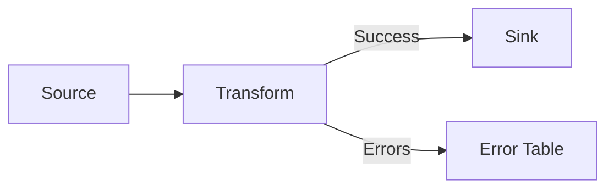

# How to Monitor Cloud Data Fusion Pipeline Runs and Debug Failed Stages

Author: [nawazdhandala](https://www.github.com/nawazdhandala)

Tags: GCP, Cloud Data Fusion, Monitoring, Debugging, Pipeline Troubleshooting, ETL

Description: Practical strategies for monitoring Cloud Data Fusion pipeline runs, interpreting error logs, and debugging failed stages in your data pipelines.

---

A data pipeline that runs successfully on day one will eventually fail. Data sources change, schemas drift, volumes grow, and permissions expire. The difference between a frustrating debugging session and a quick fix often comes down to how well you have set up monitoring and how familiar you are with the debugging tools. In this post, I will cover how to monitor Cloud Data Fusion pipeline runs effectively and debug the most common failure scenarios.

## Monitoring Pipeline Runs

### The Pipeline Runs Dashboard

After deploying a pipeline, the primary monitoring view is the "Runs" tab on the pipeline detail page. Each run shows:

- **Status** - Running, Succeeded, Failed, or Killed
- **Start time and duration** - When it started and how long it took
- **Trigger** - Whether it was started manually, by schedule, or by a pipeline trigger
- **Runtime arguments** - The parameters passed to this specific run

Click on any run to see detailed metrics for each stage of the pipeline. This is where you get record counts, processing times, and error details for individual nodes.

### Record Counts at Each Stage

One of the most useful monitoring metrics is the record count at each stage. In a healthy pipeline, you should see:


If the source reads 10,000 records but only 500 make it to the sink, something is filtering or erroring out records in between. The per-stage counts help you pinpoint exactly where the drop-off happens.

### Setting Up Cloud Monitoring Alerts

Cloud Data Fusion publishes metrics to Cloud Monitoring that you can use for alerting. Navigate to Cloud Monitoring in the GCP Console and create alert policies for:

**Pipeline failure alerts:**

```yaml
# Alert policy for any pipeline failure in the namespace
Resource type: Cloud Data Fusion Pipeline
Metric: pipeline/run_count
Filter: status = "FAILED"
Condition: Any time series violates threshold of 0
```

**Pipeline duration alerts:**

```yaml
# Alert when a pipeline takes longer than expected
Resource type: Cloud Data Fusion Pipeline
Metric: pipeline/run_duration
Condition: Above threshold of 3600 seconds (adjust based on your baseline)
```

**Record processing alerts:**

```yaml
# Alert when error records exceed a threshold
Resource type: Cloud Data Fusion Pipeline
Metric: pipeline/error_count
Condition: Above threshold of 100
```

Configure notification channels to send alerts to your preferred destination - email, Slack, PagerDuty, or a custom webhook.

### Using Cloud Logging

All pipeline logs are sent to Cloud Logging. You can access them from the pipeline UI (click "Logs" on a specific run) or from the Cloud Logging console.

To find logs for a specific pipeline run in Cloud Logging:

```
# Cloud Logging query for a specific pipeline's logs
resource.type="cloud_data_fusion_pipeline"
resource.labels.pipeline_name="my_etl_pipeline"
severity>=WARNING
```

For more targeted searches, filter by the run ID:

```
# Filter logs for a specific pipeline run
resource.type="cloud_data_fusion_pipeline"
labels.run_id="abc123-def456"
```

## Debugging Failed Stages

### Reading Error Messages

When a pipeline fails, the first thing to check is the error message on the failed stage. Click on the failed run, and you will see a red indicator on the stage that caused the failure. Click on that stage to see the error details.

Common error patterns and what they mean:

**Connection timeout errors:**
```
java.net.ConnectException: Connection timed out
```
This means Data Fusion cannot reach the source or sink system. Check network connectivity, firewall rules, and VPC peering settings.

**Authentication errors:**
```
java.sql.SQLException: Access denied for user 'cdf_user'@'10.x.x.x'
```
The credentials stored in Data Fusion are wrong or the user permissions have been revoked. Update the connection credentials and test the connection.

**Schema mismatch errors:**
```
io.cdap.cdap.api.data.schema.SchemaException: Field 'amount' is of type 'string' but expected 'double'
```
The source data type does not match what the pipeline expects. Either update the pipeline schema or add a transform to cast the field.

### Debugging Source Stage Failures

If the source stage fails, the problem is almost always with connectivity or the source query.

For database sources, try running the source query directly against the database to see if it works:

```sql
-- Test the source query outside of Data Fusion
SELECT * FROM orders WHERE created_date > '2024-01-01' LIMIT 10;
```

For GCS sources, verify the file exists and the Data Fusion service account has read access:

```bash
# Check if the Data Fusion service account can access the source file
gsutil ls gs://my-bucket/my-data/
gsutil cat gs://my-bucket/my-data/sample.csv | head -5
```

### Debugging Transform Stage Failures

Transform failures usually come from unexpected data values. The Wrangler transform is common source of issues because its directives can fail on edge cases.

To debug, add a Error Handler node after the transform. This captures records that fail transformation and routes them to a separate output instead of failing the entire pipeline:



Configure the error handler to write failed records to a BigQuery table or GCS file. After the pipeline runs, examine the error records to understand what values caused the failure.

### Debugging Sink Stage Failures

Sink failures are often permission-related. For BigQuery sinks, the most common issues are:

- The Data Fusion service account lacks the BigQuery Data Editor role
- The temporary staging bucket is not accessible
- The target dataset does not exist
- The table schema conflicts with incoming data

Check the service account permissions:

```bash
# List the IAM policy for your BigQuery dataset
bq show --format=prettyjson my-project:my_dataset | jq '.access'
```

### Out of Memory Errors

If your pipeline fails with `java.lang.OutOfMemoryError`, you have a few options:

1. Increase the executor memory in the pipeline runtime arguments:
```
system.resources.memory=4096
```

2. Reduce the number of records processed per batch by adjusting the source fetch size

3. If using the Spark execution engine, adjust the Spark executor memory:
```
system.spark.executor.memory=8g
```

### Slow Pipeline Performance

If a pipeline is not failing but running much slower than expected, check the following:

**Data skew** - One executor might be processing far more data than others. Look at per-executor metrics in the Spark UI (accessible through the pipeline run's "Logs" tab).

**Network bottlenecks** - If your Data Fusion instance is in a different region than your data sources, cross-region data transfer adds latency. Move your Data Fusion instance closer to the data.

**Insufficient resources** - A Developer-edition instance has limited compute resources. For large pipelines, upgrade to an Enterprise instance or increase the Dataproc cluster configuration.

## Building a Monitoring Dashboard

For production pipelines, create a custom dashboard in Cloud Monitoring that shows all your critical metrics in one place:

```yaml
# Key metrics to include in your Data Fusion monitoring dashboard
Pipeline Run Status:
  - Total runs per day (succeeded vs failed)
  - Current running pipelines

Performance Metrics:
  - Average run duration by pipeline
  - Record throughput (records per second)
  - Error rate per pipeline

Resource Utilization:
  - CPU utilization of the Data Fusion instance
  - Memory usage
  - Dataproc cluster utilization
```

Group pipelines by criticality. Your business-critical daily ETL pipeline deserves tighter monitoring than an experimental pipeline someone is testing.

## Implementing Retry Logic

For transient failures (network blips, temporary resource unavailability), configure automatic retries in your pipeline's schedule settings. Set the maximum number of retries and the delay between attempts.

For more sophisticated retry logic, use Cloud Composer (Apache Airflow) as an orchestration layer on top of Data Fusion. Airflow provides built-in retry mechanisms, SLA monitoring, and complex dependency management.

## Log Retention and Audit

Cloud Data Fusion retains pipeline run logs for a limited period. If you need longer retention for audit or compliance purposes, configure a log sink in Cloud Logging to export logs to BigQuery or GCS:

```bash
# Create a log sink to export Data Fusion logs to BigQuery
gcloud logging sinks create cdf-log-export \
  bigquery.googleapis.com/projects/my-project/datasets/cdf_logs \
  --log-filter='resource.type="cloud_data_fusion_pipeline"'
```

This gives you a queryable archive of all pipeline executions, which is invaluable for debugging intermittent issues and tracking performance trends over time.

## Wrapping Up

Effective monitoring is not something you bolt on after problems start. Set up your alerting, dashboards, and log retention before your first production pipeline goes live. When a pipeline does fail - and it will - having the right monitoring in place turns a potential outage into a quick fix. Start with basic failure alerts, add duration monitoring as you establish baselines, and build out a full dashboard as your pipeline portfolio grows. The time you invest in monitoring infrastructure pays back many times over in reduced debugging time and faster incident resolution.
