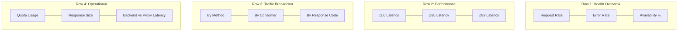

# How to Monitor Cloud Endpoints API Usage with Cloud Monitoring Dashboards

Author: [nawazdhandala](https://www.github.com/nawazdhandala)

Tags: GCP, Cloud Endpoints, Cloud Monitoring, Dashboards, API Monitoring

Description: Learn how to build Cloud Monitoring dashboards to track Cloud Endpoints API usage, including request rates, latency, error rates, and per-consumer metrics.

---

Cloud Endpoints automatically collects metrics for every API call that passes through ESPv2. Request counts, latency distributions, error rates, response sizes - it is all tracked. But raw metrics are not useful on their own. You need dashboards that surface the right data at the right time, and alerts that notify you when something goes wrong.

This guide covers building effective Cloud Monitoring dashboards for Cloud Endpoints APIs, setting up alerts for common failure modes, and integrating with Cloud Logging for deeper investigation.

## What Metrics Cloud Endpoints Collects

ESPv2 reports these metrics to Cloud Monitoring automatically:

- **Request count**: Total requests, broken down by response code, method, and consumer
- **Request latency**: End-to-end latency including proxy overhead
- **Backend latency**: Time spent in your backend (excluding proxy overhead)
- **Request size**: Size of incoming requests
- **Response size**: Size of outgoing responses
- **Error count**: Requests that resulted in 4xx or 5xx responses
- **Quota usage**: Per-consumer quota consumption

These metrics use the `serviceruntime.googleapis.com` prefix and are associated with the `consumed_api` resource type.

## Step 1: Build an Overview Dashboard

Start with a dashboard that gives you a high-level view of your API health.

```bash
# Create the API overview dashboard
gcloud monitoring dashboards create --config='
{
  "displayName": "Cloud Endpoints - API Overview",
  "mosaicLayout": {
    "tiles": [
      {
        "width": 6,
        "height": 4,
        "widget": {
          "title": "Request Rate (requests/sec)",
          "xyChart": {
            "dataSets": [
              {
                "timeSeriesQuery": {
                  "timeSeriesFilter": {
                    "filter": "metric.type=\"serviceruntime.googleapis.com/api/producer/request_count\" AND resource.type=\"api\" AND resource.labels.service=\"my-api.endpoints.my-project-id.cloud.goog\"",
                    "aggregation": {
                      "alignmentPeriod": "60s",
                      "perSeriesAligner": "ALIGN_RATE"
                    }
                  }
                },
                "plotType": "LINE",
                "legendTemplate": "Request Rate"
              }
            ]
          }
        }
      },
      {
        "xPos": 6,
        "width": 6,
        "height": 4,
        "widget": {
          "title": "Error Rate (4xx + 5xx)",
          "xyChart": {
            "dataSets": [
              {
                "timeSeriesQuery": {
                  "timeSeriesFilter": {
                    "filter": "metric.type=\"serviceruntime.googleapis.com/api/producer/request_count\" AND resource.type=\"api\" AND resource.labels.service=\"my-api.endpoints.my-project-id.cloud.goog\" AND metric.labels.response_code_class=\"4xx\"",
                    "aggregation": {
                      "alignmentPeriod": "60s",
                      "perSeriesAligner": "ALIGN_RATE"
                    }
                  }
                },
                "plotType": "LINE",
                "legendTemplate": "4xx Errors"
              },
              {
                "timeSeriesQuery": {
                  "timeSeriesFilter": {
                    "filter": "metric.type=\"serviceruntime.googleapis.com/api/producer/request_count\" AND resource.type=\"api\" AND resource.labels.service=\"my-api.endpoints.my-project-id.cloud.goog\" AND metric.labels.response_code_class=\"5xx\"",
                    "aggregation": {
                      "alignmentPeriod": "60s",
                      "perSeriesAligner": "ALIGN_RATE"
                    }
                  }
                },
                "plotType": "LINE",
                "legendTemplate": "5xx Errors"
              }
            ]
          }
        }
      },
      {
        "yPos": 4,
        "width": 6,
        "height": 4,
        "widget": {
          "title": "Request Latency (p50, p95, p99)",
          "xyChart": {
            "dataSets": [
              {
                "timeSeriesQuery": {
                  "timeSeriesFilter": {
                    "filter": "metric.type=\"serviceruntime.googleapis.com/api/producer/total_latencies\" AND resource.type=\"api\" AND resource.labels.service=\"my-api.endpoints.my-project-id.cloud.goog\"",
                    "aggregation": {
                      "alignmentPeriod": "60s",
                      "perSeriesAligner": "ALIGN_PERCENTILE_50"
                    }
                  }
                },
                "plotType": "LINE",
                "legendTemplate": "p50"
              },
              {
                "timeSeriesQuery": {
                  "timeSeriesFilter": {
                    "filter": "metric.type=\"serviceruntime.googleapis.com/api/producer/total_latencies\" AND resource.type=\"api\" AND resource.labels.service=\"my-api.endpoints.my-project-id.cloud.goog\"",
                    "aggregation": {
                      "alignmentPeriod": "60s",
                      "perSeriesAligner": "ALIGN_PERCENTILE_95"
                    }
                  }
                },
                "plotType": "LINE",
                "legendTemplate": "p95"
              },
              {
                "timeSeriesQuery": {
                  "timeSeriesFilter": {
                    "filter": "metric.type=\"serviceruntime.googleapis.com/api/producer/total_latencies\" AND resource.type=\"api\" AND resource.labels.service=\"my-api.endpoints.my-project-id.cloud.goog\"",
                    "aggregation": {
                      "alignmentPeriod": "60s",
                      "perSeriesAligner": "ALIGN_PERCENTILE_99"
                    }
                  }
                },
                "plotType": "LINE",
                "legendTemplate": "p99"
              }
            ]
          }
        }
      },
      {
        "xPos": 6,
        "yPos": 4,
        "width": 6,
        "height": 4,
        "widget": {
          "title": "Request Count by Method",
          "xyChart": {
            "dataSets": [
              {
                "timeSeriesQuery": {
                  "timeSeriesFilter": {
                    "filter": "metric.type=\"serviceruntime.googleapis.com/api/producer/request_count\" AND resource.type=\"api\" AND resource.labels.service=\"my-api.endpoints.my-project-id.cloud.goog\"",
                    "aggregation": {
                      "alignmentPeriod": "300s",
                      "perSeriesAligner": "ALIGN_RATE",
                      "groupByFields": ["metric.labels.method"]
                    }
                  }
                },
                "plotType": "STACKED_BAR",
                "legendTemplate": "${metric.labels.method}"
              }
            ]
          }
        }
      }
    ]
  }
}' --project=my-project-id
```

## Step 2: Build a Per-Consumer Dashboard

Track individual consumer usage patterns.

```bash
# Create a consumer-focused dashboard
gcloud monitoring dashboards create --config='
{
  "displayName": "Cloud Endpoints - Consumer Usage",
  "mosaicLayout": {
    "tiles": [
      {
        "width": 12,
        "height": 4,
        "widget": {
          "title": "Requests by Consumer",
          "xyChart": {
            "dataSets": [
              {
                "timeSeriesQuery": {
                  "timeSeriesFilter": {
                    "filter": "metric.type=\"serviceruntime.googleapis.com/api/producer/request_count\" AND resource.type=\"api\" AND resource.labels.service=\"my-api.endpoints.my-project-id.cloud.goog\"",
                    "aggregation": {
                      "alignmentPeriod": "300s",
                      "perSeriesAligner": "ALIGN_RATE",
                      "groupByFields": ["metric.labels.credential_id"]
                    }
                  }
                },
                "plotType": "STACKED_AREA",
                "legendTemplate": "${metric.labels.credential_id}"
              }
            ]
          }
        }
      },
      {
        "yPos": 4,
        "width": 12,
        "height": 4,
        "widget": {
          "title": "Error Rate by Consumer",
          "xyChart": {
            "dataSets": [
              {
                "timeSeriesQuery": {
                  "timeSeriesFilter": {
                    "filter": "metric.type=\"serviceruntime.googleapis.com/api/producer/request_count\" AND resource.type=\"api\" AND resource.labels.service=\"my-api.endpoints.my-project-id.cloud.goog\" AND metric.labels.response_code_class!=\"2xx\"",
                    "aggregation": {
                      "alignmentPeriod": "300s",
                      "perSeriesAligner": "ALIGN_RATE",
                      "groupByFields": ["metric.labels.credential_id"]
                    }
                  }
                },
                "plotType": "LINE",
                "legendTemplate": "${metric.labels.credential_id}"
              }
            ]
          }
        }
      }
    ]
  }
}' --project=my-project-id
```

## Step 3: Set Up Alerts

Create alerts for the most important failure modes.

### Alert: High Error Rate

```bash
# Alert when 5xx error rate exceeds 5% of total requests
gcloud monitoring alerting policies create \
  --display-name="API High Error Rate" \
  --condition-display-name="5xx error rate above 5%" \
  --condition-filter='metric.type="serviceruntime.googleapis.com/api/producer/request_count" AND resource.type="api" AND resource.labels.service="my-api.endpoints.my-project-id.cloud.goog" AND metric.labels.response_code_class="5xx"' \
  --condition-threshold-value=5 \
  --condition-threshold-duration=300s \
  --condition-threshold-comparison=COMPARISON_GT \
  --notification-channels=CHANNEL_ID \
  --project=my-project-id
```

### Alert: High Latency

```bash
# Alert when p95 latency exceeds 2 seconds
gcloud monitoring alerting policies create \
  --display-name="API High Latency" \
  --condition-display-name="p95 latency above 2s" \
  --condition-filter='metric.type="serviceruntime.googleapis.com/api/producer/total_latencies" AND resource.type="api" AND resource.labels.service="my-api.endpoints.my-project-id.cloud.goog"' \
  --condition-threshold-value=2000 \
  --condition-threshold-duration=300s \
  --notification-channels=CHANNEL_ID \
  --project=my-project-id
```

### Alert: Sudden Traffic Drop

A sudden drop in traffic can indicate that something is broken and clients cannot reach your API.

```bash
# Alert when request rate drops below 50% of its normal level
gcloud monitoring alerting policies create \
  --display-name="API Traffic Drop" \
  --condition-display-name="Request rate dropped significantly" \
  --condition-filter='metric.type="serviceruntime.googleapis.com/api/producer/request_count" AND resource.type="api" AND resource.labels.service="my-api.endpoints.my-project-id.cloud.goog"' \
  --condition-threshold-value=10 \
  --condition-threshold-duration=600s \
  --condition-threshold-comparison=COMPARISON_LT \
  --notification-channels=CHANNEL_ID \
  --project=my-project-id
```

## Step 4: Integrate with Cloud Logging

Combine metrics with logs for deeper investigation. When an alert fires, you want to quickly find the relevant logs.

```bash
# View recent API request logs
gcloud logging read '
  resource.type="api" AND
  resource.labels.service="my-api.endpoints.my-project-id.cloud.goog"
' --project=my-project-id \
  --limit=20 \
  --format="table(timestamp,httpRequest.requestMethod,httpRequest.requestUrl,httpRequest.status,httpRequest.latency)"
```

For investigating specific errors:

```bash
# Find all 500 errors in the last hour
gcloud logging read '
  resource.type="api" AND
  resource.labels.service="my-api.endpoints.my-project-id.cloud.goog" AND
  httpRequest.status>=500
  timestamp>="2026-02-17T00:00:00Z"
' --project=my-project-id \
  --limit=50 \
  --format="table(timestamp,httpRequest.requestUrl,httpRequest.status,jsonPayload.error_message)"
```

## Step 5: Create SLOs

Define Service Level Objectives based on your API metrics.

```bash
# Create an SLO for API availability (99.9% of requests return non-5xx)
gcloud monitoring slos create \
  --service=my-api-service \
  --display-name="API Availability SLO" \
  --goal=0.999 \
  --rolling-period=30d \
  --request-based-sli=good-total-ratio \
  --good-service-filter='metric.type="serviceruntime.googleapis.com/api/producer/request_count" AND resource.type="api" AND metric.labels.response_code_class!="5xx"' \
  --total-service-filter='metric.type="serviceruntime.googleapis.com/api/producer/request_count" AND resource.type="api"' \
  --project=my-project-id
```

## Using the Endpoints Console

Besides custom dashboards, Cloud Endpoints provides a built-in console view.

1. Go to the GCP Console
2. Navigate to APIs & Services, then Endpoints
3. Select your service
4. The Overview tab shows request count, latency, and errors
5. The Deployment History tab shows configuration changes
6. The Quotas tab shows per-consumer usage

This built-in view is a good starting point, but custom dashboards give you more control over what data is shown and how.

## Exporting Metrics for External Tools

If you use external monitoring tools like Grafana or Datadog, export the metrics.

```bash
# Create a monitoring export sink for Pub/Sub
gcloud monitoring channels create \
  --type=pubsub \
  --display-name="API Metrics Export" \
  --channel-labels=topic=projects/my-project-id/topics/api-metrics \
  --project=my-project-id
```

For Grafana, use the Google Cloud Monitoring data source plugin to query metrics directly.

## Dashboard Layout Best Practices

A well-organized dashboard tells a story at a glance. Here is a recommended layout:



Each row serves a different audience:
- Row 1 is for quick health assessment (on-call engineer)
- Row 2 is for performance investigation (SRE)
- Row 3 is for traffic analysis (product manager)
- Row 4 is for operational details (infrastructure engineer)

## Summary

Monitoring Cloud Endpoints APIs effectively means building dashboards that answer the right questions at the right time. Start with an overview dashboard showing request rate, error rate, and latency. Add per-consumer views for tracking individual usage. Set up alerts for high error rates, latency spikes, and traffic drops. Integrate with Cloud Logging for root cause investigation, and define SLOs to measure your API's reliability over time. The combination of Cloud Monitoring dashboards, alerts, and logging gives you full visibility into your API's behavior.
