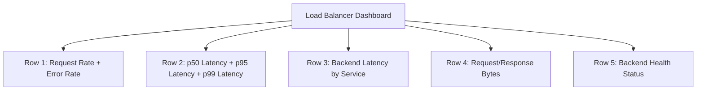

# How to Monitor Cloud Load Balancer Metrics and Set Up Latency Alerts

Author: [nawazdhandala](https://www.github.com/nawazdhandala)

Tags: GCP, Cloud Load Balancing, Cloud Monitoring, Latency, Alerting

Description: A practical guide to monitoring Google Cloud Load Balancer metrics and configuring latency alerts to catch performance degradation early.

---

Your load balancer sits between your users and your application. It sees every request, every error, and every slow response. That makes it one of the best places to detect performance issues. Google Cloud Load Balancing reports detailed metrics to Cloud Monitoring, and in this post I will show you how to use those metrics to build dashboards and alerts that keep you informed about your application's health.

## Available Load Balancer Metrics

Cloud Load Balancing provides different metrics depending on the type of load balancer you are using. Here are the most important ones for HTTP(S) load balancers:

| Metric | Description |
|--------|-------------|
| `loadbalancing.googleapis.com/https/request_count` | Number of requests handled |
| `loadbalancing.googleapis.com/https/total_latencies` | Total request latency (client to LB and back) |
| `loadbalancing.googleapis.com/https/backend_latencies` | Backend response time only |
| `loadbalancing.googleapis.com/https/request_bytes_count` | Bytes received from clients |
| `loadbalancing.googleapis.com/https/response_bytes_count` | Bytes sent to clients |
| `loadbalancing.googleapis.com/https/backend_request_count` | Requests sent to backends |

The distinction between `total_latencies` and `backend_latencies` is important. Total latency includes network time between the client and the load balancer, while backend latency isolates just the time your backend takes to respond.

## Building a Load Balancer Dashboard

### Request Rate Panel

Start with a chart showing requests per second. This gives you a baseline for what normal traffic looks like:

```
# Total request rate across all URL map rules
fetch https_lb_rule
| metric 'loadbalancing.googleapis.com/https/request_count'
| group_by [matched_url_path_rule], [val: rate(value.request_count)]
| every 1m
```

### Error Rate Panel

Track 4xx and 5xx responses separately. A spike in 4xx might indicate a bad deployment with broken URLs, while 5xx means your backends are failing:

```
# 5xx error rate by URL path
fetch https_lb_rule
| metric 'loadbalancing.googleapis.com/https/request_count'
| filter response_code_class = 500
| group_by [matched_url_path_rule], [val: rate(value.request_count)]
| every 1m
```

### Latency Panels

Create separate panels for total latency and backend latency. This helps you distinguish between network slowness and application slowness.

For p50 backend latency:

```
# P50 backend latency per URL path
fetch https_lb_rule
| metric 'loadbalancing.googleapis.com/https/backend_latencies'
| group_by [matched_url_path_rule],
    [val: percentile(value.backend_latencies, 50)]
| every 1m
```

For p95 total latency:

```
# P95 total latency including network time
fetch https_lb_rule
| metric 'loadbalancing.googleapis.com/https/total_latencies'
| group_by [matched_url_path_rule],
    [val: percentile(value.total_latencies, 95)]
| every 1m
```

## Setting Up Latency Alerts

### P95 Total Latency Alert

This alert fires when the 95th percentile of total request latency exceeds 2 seconds for more than 5 minutes:

```json
{
  "displayName": "Load Balancer High Latency - p95",
  "combiner": "OR",
  "conditions": [
    {
      "displayName": "p95 total latency above 2000ms",
      "conditionThreshold": {
        "filter": "resource.type=\"https_lb_rule\" AND metric.type=\"loadbalancing.googleapis.com/https/total_latencies\"",
        "comparison": "COMPARISON_GT",
        "thresholdValue": 2000,
        "duration": "300s",
        "aggregations": [
          {
            "alignmentPeriod": "60s",
            "perSeriesAligner": "ALIGN_PERCENTILE_95",
            "crossSeriesReducer": "REDUCE_SUM",
            "groupByFields": ["resource.labels.url_map_name"]
          }
        ]
      }
    }
  ]
}
```

Create it with:

```bash
# Create the load balancer latency alert
gcloud alpha monitoring policies create --policy-from-file=lb-latency-alert.json
```

### Backend Latency Alert

If you want to isolate backend performance issues specifically:

```json
{
  "displayName": "Load Balancer High Backend Latency",
  "combiner": "OR",
  "conditions": [
    {
      "displayName": "p95 backend latency above 1500ms",
      "conditionThreshold": {
        "filter": "resource.type=\"https_lb_rule\" AND metric.type=\"loadbalancing.googleapis.com/https/backend_latencies\"",
        "comparison": "COMPARISON_GT",
        "thresholdValue": 1500,
        "duration": "300s",
        "aggregations": [
          {
            "alignmentPeriod": "60s",
            "perSeriesAligner": "ALIGN_PERCENTILE_95",
            "crossSeriesReducer": "REDUCE_SUM",
            "groupByFields": ["resource.labels.url_map_name"]
          }
        ]
      }
    }
  ]
}
```

### Error Rate Alert

Set up an alert for when 5xx errors exceed a threshold:

```json
{
  "displayName": "Load Balancer High Error Rate",
  "combiner": "OR",
  "conditions": [
    {
      "displayName": "5xx error rate above 1%",
      "conditionThreshold": {
        "filter": "resource.type=\"https_lb_rule\" AND metric.type=\"loadbalancing.googleapis.com/https/request_count\" AND metric.labels.response_code_class=500",
        "comparison": "COMPARISON_GT",
        "thresholdValue": 0.01,
        "duration": "300s",
        "aggregations": [
          {
            "alignmentPeriod": "60s",
            "perSeriesAligner": "ALIGN_RATE",
            "groupByFields": ["resource.labels.url_map_name"]
          }
        ],
        "denominatorFilter": "resource.type=\"https_lb_rule\" AND metric.type=\"loadbalancing.googleapis.com/https/request_count\"",
        "denominatorAggregations": [
          {
            "alignmentPeriod": "60s",
            "perSeriesAligner": "ALIGN_RATE",
            "groupByFields": ["resource.labels.url_map_name"]
          }
        ]
      }
    }
  ]
}
```

## Monitoring by Backend Service

Load balancer metrics can be broken down by backend service, which is useful when you have multiple services behind a single load balancer. Use the `backend_target_name` label:

```
# Backend latency broken down by backend service
fetch https_lb_rule
| metric 'loadbalancing.googleapis.com/https/backend_latencies'
| group_by [backend_target_name],
    [val: percentile(value.backend_latencies, 95)]
| every 1m
```

This helps you pinpoint which specific backend service is causing latency issues.

## Terraform Configuration

Here is a complete Terraform setup for load balancer monitoring:

```hcl
# Load balancer latency alert
resource "google_monitoring_alert_policy" "lb_latency" {
  display_name = "LB High Latency"
  combiner     = "OR"

  conditions {
    display_name = "p95 latency above 2s"

    condition_threshold {
      filter          = "resource.type=\"https_lb_rule\" AND metric.type=\"loadbalancing.googleapis.com/https/total_latencies\""
      comparison      = "COMPARISON_GT"
      threshold_value = 2000
      duration        = "300s"

      aggregations {
        alignment_period     = "60s"
        per_series_aligner   = "ALIGN_PERCENTILE_95"
        cross_series_reducer = "REDUCE_SUM"
        group_by_fields      = ["resource.labels.url_map_name"]
      }
    }
  }

  notification_channels = var.notification_channels

  documentation {
    content   = "P95 latency on the load balancer has exceeded 2 seconds. Check backend health and resource utilization."
    mime_type = "text/markdown"
  }
}

# Load balancer error rate alert
resource "google_monitoring_alert_policy" "lb_errors" {
  display_name = "LB High Error Rate"
  combiner     = "OR"

  conditions {
    display_name = "5xx rate above 1%"

    condition_threshold {
      filter          = "resource.type=\"https_lb_rule\" AND metric.type=\"loadbalancing.googleapis.com/https/request_count\" AND metric.labels.response_code_class=500"
      comparison      = "COMPARISON_GT"
      threshold_value = 0.01
      duration        = "300s"

      aggregations {
        alignment_period   = "60s"
        per_series_aligner = "ALIGN_RATE"
        group_by_fields    = ["resource.labels.url_map_name"]
      }

      denominator_filter = "resource.type=\"https_lb_rule\" AND metric.type=\"loadbalancing.googleapis.com/https/request_count\""

      denominator_aggregations {
        alignment_period   = "60s"
        per_series_aligner = "ALIGN_RATE"
        group_by_fields    = ["resource.labels.url_map_name"]
      }
    }
  }

  notification_channels = var.notification_channels
}
```

## Dashboard Layout Recommendation

Here is how I typically lay out a load balancer dashboard:



The first two rows give you the "at a glance" view. Rows 3-5 help with deeper investigation when something looks wrong.

## Wrapping Up

Load balancer metrics are some of the most valuable signals you have for monitoring application health. They cover every request without requiring any instrumentation in your application code. Set up latency alerts using p95 or p99 percentiles rather than averages, track error rates as ratios, and build dashboards that separate total latency from backend latency. This distinction is what helps you quickly determine whether a performance issue is in your application or in the network.
