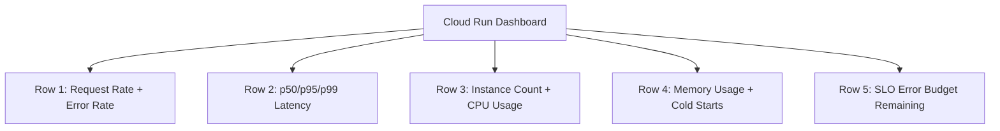

# How to Monitor Cloud Run Service Latency and Error Rates with Cloud Monitoring

Author: [nawazdhandala](https://www.github.com/nawazdhandala)

Tags: GCP, Cloud Run, Cloud Monitoring, Latency, Observability

Description: Learn how to monitor Cloud Run service latency and error rates using Cloud Monitoring dashboards, alerts, and SLOs for production reliability.

---

Cloud Run is one of the easiest ways to deploy containers on GCP, but "easy to deploy" does not mean "easy to keep running well." Once your service is handling real traffic, you need visibility into two things above all else: how fast are responses (latency) and how many requests are failing (error rate). In this post, I will show you how to set up comprehensive monitoring for both.

## What Metrics Does Cloud Run Expose?

Cloud Run automatically sends metrics to Cloud Monitoring without any additional configuration. The key request-related metrics are:

- `run.googleapis.com/request_count` - Total number of requests, labeled by response code
- `run.googleapis.com/request_latencies` - Request latency distribution in milliseconds
- `run.googleapis.com/container/instance_count` - Number of running container instances
- `run.googleapis.com/container/cpu/utilization` - CPU utilization of container instances
- `run.googleapis.com/container/memory/utilization` - Memory utilization

For latency and error rate monitoring, the first two metrics are what we care about most.

## Monitoring Latency

### Setting Up a Latency Dashboard

Navigate to **Monitoring** > **Dashboards** > **Create Dashboard** and add a new chart. Use this MQL query to visualize p50, p95, and p99 latency:

```
# P50 latency for Cloud Run service
fetch cloud_run_revision
| metric 'run.googleapis.com/request_latencies'
| group_by [service_name],
    [val: percentile(value.request_latencies, 50)]
| every 1m
```

Create separate charts or use multiple datasets for different percentiles. The p95 version:

```
# P95 latency for Cloud Run service
fetch cloud_run_revision
| metric 'run.googleapis.com/request_latencies'
| group_by [service_name],
    [val: percentile(value.request_latencies, 95)]
| every 1m
```

And p99:

```
# P99 latency - catches the tail latency outliers
fetch cloud_run_revision
| metric 'run.googleapis.com/request_latencies'
| group_by [service_name],
    [val: percentile(value.request_latencies, 99)]
| every 1m
```

### Creating a Latency Alert

You typically want to alert on p95 or p99 latency rather than average latency. Average latency hides problems - a service could have 90 percent of requests completing in 50ms and 10 percent taking 10 seconds, and the average would look fine.

Here is an alerting policy that fires when p95 latency exceeds 2 seconds:

```json
{
  "displayName": "Cloud Run High Latency - p95",
  "combiner": "OR",
  "conditions": [
    {
      "displayName": "p95 latency above 2000ms",
      "conditionThreshold": {
        "filter": "resource.type=\"cloud_run_revision\" AND metric.type=\"run.googleapis.com/request_latencies\"",
        "comparison": "COMPARISON_GT",
        "thresholdValue": 2000,
        "duration": "300s",
        "aggregations": [
          {
            "alignmentPeriod": "60s",
            "perSeriesAligner": "ALIGN_PERCENTILE_95",
            "groupByFields": ["resource.labels.service_name"]
          }
        ]
      }
    }
  ]
}
```

Apply with:

```bash
# Create the latency alert for Cloud Run
gcloud alpha monitoring policies create --policy-from-file=cloudrun-latency-alert.json
```

## Monitoring Error Rates

### Understanding Error Rate Calculation

Error rate is the ratio of failed requests (5xx responses) to total requests. You can calculate this in Cloud Monitoring using ratio-based alerting or MQL.

Here is an MQL query that calculates the error rate:

```
# Error rate calculation: 5xx responses divided by total requests
fetch cloud_run_revision
| metric 'run.googleapis.com/request_count'
| group_by [service_name, response_code_class],
    [val: sum(value.request_count)]
| every 1m
| {
    filter response_code_class = '5xx'
  ;
    ident
  }
| group_by [service_name], [num: sum(val), den: sum(val)]
| ratio
```

### Creating an Error Rate Alert

For the alerting policy, you can use a metric ratio condition. Here is the JSON:

```json
{
  "displayName": "Cloud Run High Error Rate",
  "combiner": "OR",
  "conditions": [
    {
      "displayName": "Error rate above 5%",
      "conditionThreshold": {
        "filter": "resource.type=\"cloud_run_revision\" AND metric.type=\"run.googleapis.com/request_count\" AND metric.labels.response_code_class=\"5xx\"",
        "comparison": "COMPARISON_GT",
        "thresholdValue": 0.05,
        "duration": "300s",
        "aggregations": [
          {
            "alignmentPeriod": "60s",
            "perSeriesAligner": "ALIGN_RATE",
            "groupByFields": ["resource.labels.service_name"]
          }
        ],
        "denominatorFilter": "resource.type=\"cloud_run_revision\" AND metric.type=\"run.googleapis.com/request_count\"",
        "denominatorAggregations": [
          {
            "alignmentPeriod": "60s",
            "perSeriesAligner": "ALIGN_RATE",
            "groupByFields": ["resource.labels.service_name"]
          }
        ]
      }
    }
  ]
}
```

This creates a ratio-based alert where the numerator is 5xx requests and the denominator is all requests. When the ratio exceeds 5 percent for 5 minutes, the alert fires.

## Setting Up SLOs

Cloud Monitoring supports Service Level Objectives (SLOs) for Cloud Run. SLOs let you define reliability targets and get alerts when your error budget is being burned too fast.

### Creating a Latency SLO

Here is how to create an SLO that targets 99 percent of requests completing within 1 second:

```bash
# Create a latency SLO for a Cloud Run service
gcloud monitoring slos create \
  --project=my-project \
  --service=my-cloud-run-service \
  --display-name="Latency SLO - 99% under 1s" \
  --goal=0.99 \
  --rolling-period-days=28
```

You can also define this via the API with more control over the SLI definition:

```json
{
  "displayName": "Request Latency SLO",
  "goal": 0.99,
  "rollingPeriod": "2419200s",
  "serviceLevelIndicator": {
    "requestBased": {
      "distributionCut": {
        "distributionFilter": "resource.type=\"cloud_run_revision\" AND metric.type=\"run.googleapis.com/request_latencies\"",
        "range": {
          "min": 0,
          "max": 1000
        }
      }
    }
  }
}
```

### Creating an Availability SLO

An availability SLO based on error rate:

```json
{
  "displayName": "Availability SLO - 99.9%",
  "goal": 0.999,
  "rollingPeriod": "2419200s",
  "serviceLevelIndicator": {
    "requestBased": {
      "goodTotalRatio": {
        "goodServiceFilter": "resource.type=\"cloud_run_revision\" AND metric.type=\"run.googleapis.com/request_count\" AND metric.labels.response_code_class!=\"5xx\"",
        "totalServiceFilter": "resource.type=\"cloud_run_revision\" AND metric.type=\"run.googleapis.com/request_count\""
      }
    }
  }
}
```

### Burn Rate Alerts

Once you have SLOs, set up burn rate alerts. These fire when your error budget is being consumed faster than expected. Cloud Monitoring can automatically create burn rate alerts when you set up an SLO through the console. The typical thresholds are:

- **Fast burn**: 14.4x consumption rate over 1 hour (you will exhaust your budget in about 2 days)
- **Slow burn**: 6x consumption rate over 6 hours (you will exhaust your budget in about 5 days)

## Building a Cloud Run Monitoring Dashboard

Here is a practical dashboard layout that covers all the essentials:



For the cold start metric, use this query:

```
# Count of container startup events (cold starts)
fetch cloud_run_revision
| metric 'run.googleapis.com/container/startup_latencies'
| group_by [service_name],
    [val: count(value.startup_latencies)]
| every 5m
```

## Terraform Example

Here is a Terraform configuration for a Cloud Run monitoring alert:

```hcl
# Cloud Run latency alert using Terraform
resource "google_monitoring_alert_policy" "cloudrun_latency" {
  display_name = "Cloud Run Latency - ${var.service_name}"
  combiner     = "OR"

  conditions {
    display_name = "p95 latency above threshold"

    condition_threshold {
      filter          = "resource.type=\"cloud_run_revision\" AND metric.type=\"run.googleapis.com/request_latencies\" AND resource.labels.service_name=\"${var.service_name}\""
      comparison      = "COMPARISON_GT"
      threshold_value = var.latency_threshold_ms
      duration        = "300s"

      aggregations {
        alignment_period     = "60s"
        per_series_aligner   = "ALIGN_PERCENTILE_95"
      }
    }
  }

  notification_channels = var.notification_channels
}
```

## Wrapping Up

Cloud Run monitoring boils down to two primary concerns: latency and errors. Get dashboards set up for both, create alerts at reasonable thresholds, and consider implementing SLOs with burn rate alerts for a more sophisticated approach to reliability management. The metrics are already there - Cloud Run sends them automatically. All you need to do is build the visibility layer on top.

Start with a simple p95 latency alert and a 5xx error rate alert. Those two alone will catch the majority of production issues before your users notice them.
