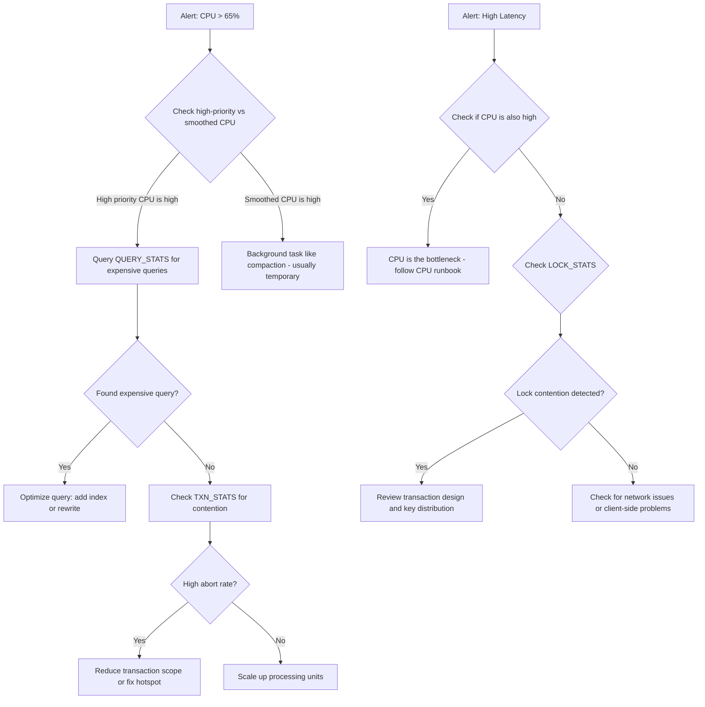

# How to Monitor Cloud Spanner CPU Utilization and Latency with Cloud Monitoring

Author: [nawazdhandala](https://www.github.com/nawazdhandala)

Tags: GCP, Cloud Spanner, Monitoring, Cloud Monitoring, Performance

Description: Set up comprehensive monitoring for Cloud Spanner CPU utilization and operation latency using Cloud Monitoring dashboards and alerts.

---

Running Cloud Spanner in production without proper monitoring is like driving with your eyes closed. CPU utilization and operation latency are the two most important metrics for understanding your Spanner instance's health and performance. In this post, I will show you how to set up monitoring dashboards and alerts so you always know how your Spanner instance is doing.

## Key Metrics to Track

Before setting up dashboards, let's understand which metrics matter most:

**CPU Utilization** - The most critical metric. Spanner recommends keeping CPU below 65% for regional instances and below 45% for multi-region instances. Going above these thresholds leads to increased latency and potential transaction aborts.

**Operation Latency** - How long read and write operations take. Track both p50 (median) and p99 (worst case) latencies. A spike in p99 often indicates contention or hotspots.

**Storage Utilization** - How much data your database holds. Important for capacity planning.

**Transaction Statistics** - Commit counts, abort rates, and lock wait times.

## Viewing Metrics in Cloud Console

The quickest way to see Spanner metrics is through the Cloud Console. Navigate to your Spanner instance and click the "Monitoring" tab. You will see built-in charts for CPU utilization, request latency, and other metrics.

But the console's built-in view is limited. For production monitoring, you want custom dashboards and alerts.

## Setting Up a Custom Dashboard

Create a comprehensive Spanner monitoring dashboard using gcloud:

```bash
# Create a monitoring dashboard for Spanner metrics
gcloud monitoring dashboards create --config-from-file=spanner-dashboard.json
```

Here is the dashboard configuration JSON:

```json
{
  "displayName": "Cloud Spanner Monitoring",
  "mosaicLayout": {
    "tiles": [
      {
        "width": 6,
        "height": 4,
        "widget": {
          "title": "CPU Utilization",
          "xyChart": {
            "dataSets": [
              {
                "timeSeriesQuery": {
                  "timeSeriesFilter": {
                    "filter": "resource.type=\"spanner_instance\" AND metric.type=\"spanner.googleapis.com/instance/cpu/utilization\"",
                    "aggregation": {
                      "alignmentPeriod": "60s",
                      "perSeriesAligner": "ALIGN_MEAN"
                    }
                  }
                }
              }
            ],
            "yAxis": {
              "label": "CPU %",
              "scale": "LINEAR"
            }
          }
        }
      },
      {
        "xPos": 6,
        "width": 6,
        "height": 4,
        "widget": {
          "title": "Request Latency (p99)",
          "xyChart": {
            "dataSets": [
              {
                "timeSeriesQuery": {
                  "timeSeriesFilter": {
                    "filter": "resource.type=\"spanner_instance\" AND metric.type=\"spanner.googleapis.com/api/request_latencies\"",
                    "aggregation": {
                      "alignmentPeriod": "60s",
                      "perSeriesAligner": "ALIGN_PERCENTILE_99"
                    }
                  }
                }
              }
            ]
          }
        }
      }
    ]
  }
}
```

## Using the Metrics Explorer

For ad-hoc investigation, use the Metrics Explorer in Cloud Monitoring. Here are the most useful queries:

### CPU Utilization by Priority

Spanner splits CPU usage into "high priority" (user-facing queries) and "smoothed" (background tasks like compaction). High-priority CPU is the one to watch:

```
Resource type: spanner_instance
Metric: instance/cpu/utilization_by_priority
Filter: priority = "high"
```

### Operation Latency by Operation Type

Break down latency by read vs write operations:

```
Resource type: spanner_instance
Metric: api/request_latencies
Group by: method
Aligner: 99th percentile
```

### Transaction Commit Attempts vs Aborts

A high abort rate signals contention problems:

```
Resource type: spanner_instance
Metric: api/request_count
Filter: status != "OK"
Group by: method, status
```

## Setting Up Alerts

Alerts notify you before problems become outages. Here are the essential alerts for any Spanner deployment:

### High CPU Alert

```bash
# Create an alert for CPU utilization exceeding 65%
gcloud alpha monitoring policies create \
    --display-name="Spanner High CPU" \
    --condition-display-name="CPU > 65%" \
    --condition-filter='resource.type="spanner_instance" AND metric.type="spanner.googleapis.com/instance/cpu/utilization"' \
    --condition-threshold-value=0.65 \
    --condition-threshold-comparison=COMPARISON_GT \
    --condition-threshold-duration=300s \
    --notification-channels="projects/my-project/notificationChannels/CHANNEL_ID"
```

### High Latency Alert

```bash
# Alert when p99 read latency exceeds 100ms for 5 minutes
gcloud alpha monitoring policies create \
    --display-name="Spanner High Latency" \
    --condition-display-name="Read latency p99 > 100ms" \
    --condition-filter='resource.type="spanner_instance" AND metric.type="spanner.googleapis.com/api/request_latencies" AND metric.labels.method="Read"' \
    --condition-threshold-value=100 \
    --condition-threshold-comparison=COMPARISON_GT \
    --condition-threshold-duration=300s \
    --notification-channels="projects/my-project/notificationChannels/CHANNEL_ID"
```

### Storage Growth Alert

```bash
# Alert when storage exceeds 80% of recommended capacity
gcloud alpha monitoring policies create \
    --display-name="Spanner Storage Warning" \
    --condition-display-name="Storage nearing recommended limit" \
    --condition-filter='resource.type="spanner_instance" AND metric.type="spanner.googleapis.com/instance/storage/utilization"' \
    --condition-threshold-value=0.8 \
    --condition-threshold-comparison=COMPARISON_GT \
    --condition-threshold-duration=3600s \
    --notification-channels="projects/my-project/notificationChannels/CHANNEL_ID"
```

## Using System Insight Tables

Spanner provides built-in system tables that give you detailed performance data. These are invaluable for debugging:

### Top Queries by CPU

```sql
-- Find the most CPU-intensive queries in the last 10 minutes
SELECT text,
       execution_count,
       avg_cpu_seconds,
       avg_latency_seconds,
       avg_rows_scanned
FROM SPANNER_SYS.QUERY_STATS_TOP_10MINUTE
ORDER BY avg_cpu_seconds DESC
LIMIT 10;
```

### Transaction Statistics

```sql
-- Find transactions with the highest abort rate
SELECT fprint,
       read_columns,
       write_constructive_columns,
       commit_attempt_count,
       commit_abort_count,
       SAFE_DIVIDE(commit_abort_count, commit_attempt_count) AS abort_rate,
       avg_commit_latency_seconds
FROM SPANNER_SYS.TXN_STATS_TOP_10MINUTE
ORDER BY commit_abort_count DESC
LIMIT 10;
```

### Lock Statistics

```sql
-- Find tables and rows involved in lock contention
SELECT row_range_start_key,
       lock_wait_seconds,
       sample_lock_requests
FROM SPANNER_SYS.LOCK_STATS_TOP_10MINUTE
ORDER BY lock_wait_seconds DESC
LIMIT 10;
```

## Building a Monitoring Runbook

When an alert fires, you need a clear investigation path. Here is a runbook flow:



## Programmatic Metric Access

If you want to pull metrics into your own monitoring system:

```python
from google.cloud import monitoring_v3
from google.protobuf import timestamp_pb2
import time

def get_cpu_utilization(project_id, instance_id):
    """Fetch recent CPU utilization for a Spanner instance."""

    client = monitoring_v3.MetricServiceClient()
    project_name = f"projects/{project_id}"

    # Define the time range - last 30 minutes
    now = time.time()
    interval = monitoring_v3.TimeInterval({
        "end_time": {"seconds": int(now)},
        "start_time": {"seconds": int(now - 1800)},
    })

    # Query for CPU utilization
    results = client.list_time_series(
        request={
            "name": project_name,
            "filter": (
                'resource.type="spanner_instance" '
                f'AND resource.labels.instance_id="{instance_id}" '
                'AND metric.type="spanner.googleapis.com/instance/cpu/utilization"'
            ),
            "interval": interval,
            "view": monitoring_v3.ListTimeSeriesRequest.TimeSeriesView.FULL,
        }
    )

    # Print the data points
    for series in results:
        for point in series.points:
            cpu_percent = point.value.double_value * 100
            timestamp = point.interval.end_time.seconds
            print(f"CPU: {cpu_percent:.1f}% at {timestamp}")

get_cpu_utilization("my-project", "my-spanner-instance")
```

## Integration with OneUptime

For comprehensive monitoring that includes Cloud Spanner alongside your other infrastructure, you can forward Spanner metrics to OneUptime. This gives you a unified view of your entire stack - application performance, infrastructure health, and database metrics all in one place. Set up a Cloud Monitoring export to push metrics to your monitoring platform of choice.

## Wrapping Up

Monitoring Cloud Spanner effectively comes down to watching CPU utilization and operation latency, with deeper investigation using the system insight tables when something goes wrong. Set up dashboards for day-to-day visibility, alerts for the metrics that matter most (CPU above 65%, latency spikes, high abort rates), and keep the SPANNER_SYS tables in your troubleshooting toolkit. The few hours you invest in setting up proper monitoring will save you many painful hours of debugging performance issues in production.
