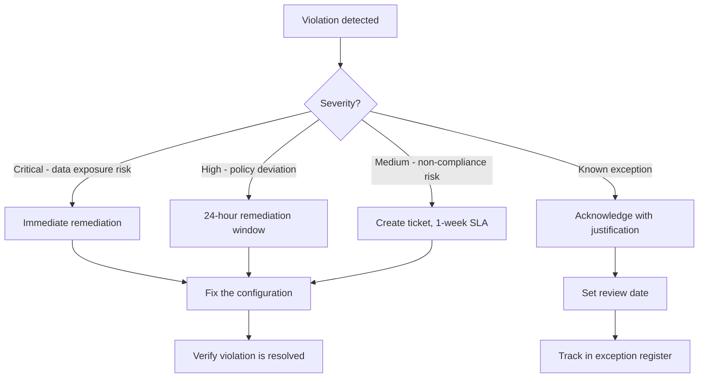

# How to Monitor Compliance Violations in GCP Assured Workloads

Author: [nawazdhandala](https://www.github.com/nawazdhandala)

Tags: GCP, Assured Workloads, Compliance Monitoring, Security, Google Cloud

Description: Learn how to monitor, detect, and remediate compliance violations in GCP Assured Workloads environments to maintain continuous compliance with regulatory frameworks.

---

Setting up an Assured Workloads environment is just the beginning. The real challenge is maintaining compliance over time as teams deploy new resources, modify configurations, and respond to production incidents. A single misconfiguration can create a compliance violation that goes unnoticed until an auditor finds it - or worse, until a breach occurs.

In this post, I will cover how to monitor compliance violations in Assured Workloads, set up automated alerting, and establish a remediation workflow that keeps your environment clean.

## How Assured Workloads Tracks Violations

Assured Workloads continuously monitors your environment against the compliance regime you selected (FedRAMP, HIPAA, IL4, etc.). When it detects a configuration that violates the compliance requirements, it creates a violation record.

Violations can be triggered by things like:

- Resources created in non-compliant regions
- Services used that are not authorized for your compliance regime
- Missing Customer-Managed Encryption Keys (CMEK) where required
- Organization policy changes that weaken compliance controls
- IAM permissions granted that violate the principle of least privilege

## Viewing Current Violations

Start by checking the current state of your Assured Workloads environment:

```bash
# List all Assured Workloads in your organization
gcloud assured workloads list \
  --organization=ORG_ID \
  --location=us \
  --format="table(name,displayName,complianceRegime)"
```

Then check for violations:

```bash
# List all compliance violations for a specific workload
gcloud assured workloads violations list \
  --workload=WORKLOAD_ID \
  --organization=ORG_ID \
  --location=us \
  --format="table(name,state,category,description)"
```

To get details on a specific violation:

```bash
# Describe a specific violation to understand what needs to be fixed
gcloud assured workloads violations describe VIOLATION_ID \
  --workload=WORKLOAD_ID \
  --organization=ORG_ID \
  --location=us \
  --format=yaml
```

The output includes the violation category, the specific resource that caused it, a description of what is wrong, and in many cases, remediation steps.

## Types of Violations

### Resource Location Violations

These occur when someone creates a resource outside the allowed regions. For FedRAMP Moderate, only US regions are permitted.

```bash
# Find resources that might be in non-compliant locations
gcloud asset search-all-resources \
  --scope="folders/FOLDER_ID" \
  --query="location:europe* OR location:asia*" \
  --format="table(name,assetType,location)"
```

Remediation usually means deleting the non-compliant resource and recreating it in an allowed region.

### Encryption Violations

These happen when a resource that requires CMEK is created with default Google-managed encryption:

```bash
# Find Cloud Storage buckets without CMEK
gcloud storage buckets list \
  --project=fedramp-project \
  --format="table(name,default_encryption_key)" \
  --filter="NOT default_encryption_key:*"
```

Fix by updating the bucket's encryption:

```bash
# Apply CMEK to an existing bucket
gcloud storage buckets update gs://my-bucket \
  --default-encryption-key=projects/fedramp-project/locations/us/keyRings/my-keyring/cryptoKeys/my-key
```

### Organization Policy Violations

These occur when someone modifies or overrides the organization policies that Assured Workloads set up:

```bash
# Check if organization policies have been modified at the project level
gcloud resource-manager org-policies list \
  --project=fedramp-project \
  --format="table(constraint,listPolicy,booleanPolicy)"
```

If a policy has been overridden at the project level, remove the override to restore the inherited policy:

```bash
# Remove a project-level policy override to restore the folder-level policy
gcloud resource-manager org-policies delete \
  constraints/gcp.resourceLocations \
  --project=fedramp-project
```

### Service Usage Violations

Using a service that is not authorized for your compliance regime creates a violation:

```bash
# List services enabled in the project
gcloud services list \
  --project=fedramp-project \
  --format="table(config.name,state)"
```

Compare this list against the authorized services for your compliance regime. Disable any unauthorized services:

```bash
# Disable a non-compliant service
gcloud services disable dataflow.googleapis.com \
  --project=fedramp-project
```

## Setting Up Automated Monitoring

### Log-Based Alerts for Policy Changes

Create alerts that fire when organization policies are modified:

```bash
# Create a log-based metric for org policy changes
gcloud logging metrics create org-policy-changes \
  --description="Organization policy modifications" \
  --log-filter='protoPayload.methodName="SetOrgPolicy" OR
                protoPayload.methodName="google.cloud.orgpolicy.v2.OrgPolicy.CreatePolicy" OR
                protoPayload.methodName="google.cloud.orgpolicy.v2.OrgPolicy.UpdatePolicy"' \
  --project=my-admin-project
```

Then create an alerting policy:

```bash
# Create an alert for org policy changes
gcloud monitoring policies create \
  --display-name="Organization Policy Change Alert" \
  --condition-display-name="Org policy was modified" \
  --condition-filter='metric.type="logging.googleapis.com/user/org-policy-changes"' \
  --condition-threshold-value=0 \
  --condition-threshold-comparison=COMPARISON_GT \
  --condition-threshold-duration=0s \
  --notification-channels="projects/my-admin-project/notificationChannels/CHANNEL_ID" \
  --combiner=OR \
  --project=my-admin-project
```

### Periodic Compliance Scans

Create a Cloud Function that runs periodic compliance checks:

```python
# compliance_check/main.py - Periodic compliance scanning function
import functions_framework
from google.cloud import assuredworkloads_v1
import json

@functions_framework.http
def check_compliance(request):
    """Check for compliance violations and report findings."""
    client = assuredworkloads_v1.AssuredWorkloadsServiceClient()

    org_id = "ORG_ID"
    location = "us"

    # List all workloads
    parent = f"organizations/{org_id}/locations/{location}"
    workloads = client.list_workloads(parent=parent)

    all_violations = []
    for workload in workloads:
        # List violations for each workload
        violations = client.list_violations(parent=workload.name)
        for violation in violations:
            all_violations.append({
                "workload": workload.display_name,
                "violation": violation.description,
                "state": str(violation.state),
                "category": violation.category,
            })

    if all_violations:
        # Log violations for alerting
        for v in all_violations:
            print(f"COMPLIANCE_VIOLATION: {json.dumps(v)}")

    return {
        "total_violations": len(all_violations),
        "violations": all_violations
    }
```

Schedule it to run daily:

```bash
# Schedule daily compliance checks
gcloud scheduler jobs create http daily-compliance-check \
  --schedule="0 8 * * *" \
  --uri="https://us-central1-my-project.cloudfunctions.net/check-compliance" \
  --http-method=POST \
  --oidc-service-account-email=compliance-checker@my-project.iam.gserviceaccount.com \
  --project=my-admin-project
```

## Acknowledging and Resolving Violations

When you find a violation, you have two options: fix it or acknowledge it.

### Fixing the Violation

Most violations should be fixed by remediating the underlying issue. After you fix it, Assured Workloads automatically resolves the violation on its next scan.

### Acknowledging a Violation

In some cases, a violation might be a known exception (for example, during a planned migration). You can acknowledge it:

```bash
# Acknowledge a violation with a comment explaining the exception
gcloud assured workloads violations acknowledge VIOLATION_ID \
  --workload=WORKLOAD_ID \
  --organization=ORG_ID \
  --location=us \
  --comment="Known exception during migration. Tracked in JIRA-1234. Expected resolution by 2026-03-15."
```

Acknowledged violations are still tracked but are marked as acknowledged. Auditors will want to see justification for each acknowledged violation.

## Building a Remediation Workflow

A solid remediation workflow looks like this:



## Reporting for Auditors

Generate compliance reports that auditors will need:

```bash
# Export a summary of all violations and their current state
gcloud assured workloads violations list \
  --workload=WORKLOAD_ID \
  --organization=ORG_ID \
  --location=us \
  --format="csv(name,state,category,description,beginTime,resolveTime)" \
  > compliance-violations-report.csv
```

Include the following in your regular compliance reports:

- Total violations detected in the reporting period
- Average time to remediation
- Number of open violations
- Number of acknowledged exceptions and their justifications
- Trend analysis showing whether violations are increasing or decreasing

## Summary

Monitoring compliance violations in Assured Workloads requires a combination of the built-in violation tracking, custom alerting for configuration changes, and periodic compliance scans. Set up automated alerts for policy changes and new violations, establish clear remediation SLAs based on severity, and maintain an exception register for acknowledged violations. Continuous monitoring is what turns a one-time compliance setup into an ongoing compliance program that auditors will trust.
