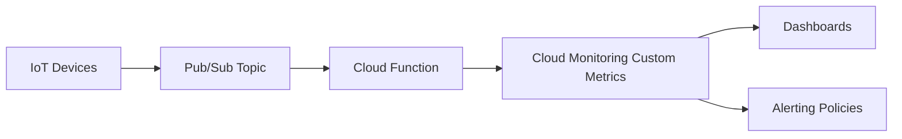

# How to Monitor IoT Fleet Health Using Cloud Monitoring Custom Metrics and Pub/Sub Message Attributes

Author: [nawazdhandala](https://www.github.com/nawazdhandala)

Tags: GCP, Cloud Monitoring, IoT, Pub/Sub, Custom Metrics

Description: Monitor your IoT device fleet health using Google Cloud Monitoring custom metrics derived from Pub/Sub message attributes and telemetry data.

---

When you manage hundreds or thousands of IoT devices, you need visibility into fleet-wide health - not just individual device telemetry. Things like "how many devices reported in the last 5 minutes," "which devices have low battery," and "what is the average message latency across the fleet" are questions that Cloud Monitoring can answer if you feed it the right custom metrics.

In this guide, I will show you how to extract health signals from Pub/Sub messages and push them as custom metrics to Cloud Monitoring, giving you dashboards and alerts across your entire IoT fleet.

## The Approach

The idea is straightforward. Your IoT devices publish telemetry to Pub/Sub with message attributes containing metadata like device ID, firmware version, and battery level. A Cloud Function triggers on each message (or batch of messages), extracts the health metrics, and writes them to Cloud Monitoring as custom metrics.



## Prerequisites

- GCP project with Cloud Monitoring, Pub/Sub, and Cloud Functions APIs enabled
- IoT devices publishing to a Pub/Sub topic
- Python 3.8+

## Step 1: Structure Your Pub/Sub Messages

The key is putting device health metadata in Pub/Sub message attributes, not just in the payload. Attributes are key-value pairs that travel with the message and are accessible without parsing the payload body.

Here is what a device should publish:

```python
from google.cloud import pubsub_v1
import json
import time
import psutil

publisher = pubsub_v1.PublisherClient()
topic_path = publisher.topic_path("your-project", "device-telemetry")

def publish_telemetry(device_id, sensor_data):
    """Publishes telemetry with health metadata as message attributes.
    Attributes are indexed by Pub/Sub and do not require payload parsing."""

    payload = json.dumps(sensor_data)

    # Message attributes carry fleet health metadata
    # These are separate from the payload and can be used for filtering
    future = publisher.publish(
        topic_path,
        data=payload.encode("utf-8"),
        # Device identification
        device_id=device_id,
        firmware_version="2.1.0",
        device_model="sensor-v3",
        # Health metrics as attributes
        battery_level=str(get_battery_level()),
        signal_strength=str(get_signal_strength()),
        uptime_seconds=str(get_uptime()),
        # Timestamp for latency calculation
        publish_timestamp=str(int(time.time() * 1000)),
    )
    return future.result()
```

## Step 2: Create a Custom Metric Descriptor

Before writing custom metrics, you need to define the metric descriptors. You can do this programmatically or let the first write create them automatically. I prefer defining them explicitly:

```python
from google.cloud import monitoring_v3

client = monitoring_v3.MetricServiceClient()
project_name = f"projects/your-project"

def create_metric_descriptors():
    """Creates custom metric descriptors for IoT fleet health monitoring.
    These define the structure of the metrics we will write."""

    descriptors = [
        {
            "type": "custom.googleapis.com/iot/device/battery_level",
            "metric_kind": "GAUGE",
            "value_type": "DOUBLE",
            "description": "Battery level percentage of IoT device",
            "labels": [
                {"key": "device_id", "value_type": "STRING"},
                {"key": "device_model", "value_type": "STRING"},
            ],
        },
        {
            "type": "custom.googleapis.com/iot/device/signal_strength",
            "metric_kind": "GAUGE",
            "value_type": "DOUBLE",
            "description": "Signal strength in dBm of IoT device",
            "labels": [
                {"key": "device_id", "value_type": "STRING"},
            ],
        },
        {
            "type": "custom.googleapis.com/iot/fleet/active_devices",
            "metric_kind": "GAUGE",
            "value_type": "INT64",
            "description": "Number of active devices in the fleet",
            "labels": [
                {"key": "device_model", "value_type": "STRING"},
            ],
        },
        {
            "type": "custom.googleapis.com/iot/device/message_latency_ms",
            "metric_kind": "GAUGE",
            "value_type": "DOUBLE",
            "description": "End-to-end message latency from device to cloud in ms",
            "labels": [
                {"key": "device_id", "value_type": "STRING"},
            ],
        },
    ]

    for desc in descriptors:
        descriptor = monitoring_v3.MetricDescriptor()
        descriptor.type = desc["type"]
        descriptor.metric_kind = getattr(
            monitoring_v3.MetricDescriptor.MetricKind, desc["metric_kind"]
        )
        descriptor.value_type = getattr(
            monitoring_v3.MetricDescriptor.ValueType, desc["value_type"]
        )
        descriptor.description = desc["description"]

        for label in desc.get("labels", []):
            label_desc = monitoring_v3.LabelDescriptor()
            label_desc.key = label["key"]
            label_desc.value_type = getattr(
                monitoring_v3.LabelDescriptor.ValueType,
                label.get("value_type", "STRING"),
            )
            descriptor.labels.append(label_desc)

        client.create_metric_descriptor(
            name=project_name, metric_descriptor=descriptor
        )
        print(f"Created metric: {desc['type']}")

create_metric_descriptors()
```

## Step 3: Build the Cloud Function to Write Metrics

This function triggers on Pub/Sub messages and writes health metrics to Cloud Monitoring:

```python
# main.py - Cloud Function triggered by Pub/Sub messages
import base64
import json
import time
from google.cloud import monitoring_v3
from google.protobuf import timestamp_pb2

client = monitoring_v3.MetricServiceClient()
PROJECT_NAME = "projects/your-project"

def write_metric(metric_type, value, labels, value_type="double"):
    """Writes a single data point to Cloud Monitoring.

    Args:
        metric_type: The custom metric type string
        value: The metric value
        labels: Dict of label key-value pairs
        value_type: Either 'double' or 'int64'
    """
    series = monitoring_v3.TimeSeries()
    series.metric.type = metric_type

    # Set metric labels for filtering and grouping
    for key, val in labels.items():
        series.metric.labels[key] = str(val)

    # Set the resource type to global since these are custom metrics
    series.resource.type = "global"
    series.resource.labels["project_id"] = "your-project"

    # Create the data point with the current timestamp
    now = time.time()
    seconds = int(now)
    nanos = int((now - seconds) * 10**9)

    interval = monitoring_v3.TimeInterval()
    interval.end_time = timestamp_pb2.Timestamp(seconds=seconds, nanos=nanos)

    point = monitoring_v3.Point()
    point.interval = interval

    if value_type == "int64":
        point.value.int64_value = int(value)
    else:
        point.value.double_value = float(value)

    series.points = [point]

    # Write the time series data point
    client.create_time_series(name=PROJECT_NAME, time_series=[series])

def process_device_message(event, context):
    """Cloud Function entry point. Triggered by Pub/Sub messages.
    Extracts health metrics from message attributes and writes them
    to Cloud Monitoring as custom metrics."""

    # Get message attributes (these contain the health metadata)
    attributes = event.get("attributes", {})
    device_id = attributes.get("device_id", "unknown")
    device_model = attributes.get("device_model", "unknown")

    # Write battery level metric
    battery = attributes.get("battery_level")
    if battery:
        write_metric(
            "custom.googleapis.com/iot/device/battery_level",
            float(battery),
            {"device_id": device_id, "device_model": device_model},
        )

    # Write signal strength metric
    signal = attributes.get("signal_strength")
    if signal:
        write_metric(
            "custom.googleapis.com/iot/device/signal_strength",
            float(signal),
            {"device_id": device_id},
        )

    # Calculate and write message latency
    publish_ts = attributes.get("publish_timestamp")
    if publish_ts:
        latency_ms = time.time() * 1000 - float(publish_ts)
        write_metric(
            "custom.googleapis.com/iot/device/message_latency_ms",
            latency_ms,
            {"device_id": device_id},
        )
```

Deploy the function:

```bash
# Deploy the Cloud Function with Pub/Sub trigger
gcloud functions deploy process-device-metrics \
  --runtime=python311 \
  --trigger-topic=device-telemetry \
  --region=us-central1 \
  --memory=256MB \
  --timeout=60s \
  --entry-point=process_device_message
```

## Step 4: Track Active Device Count

For fleet-level metrics like active device count, you need a separate process that runs periodically rather than per message. Use Cloud Scheduler with a Cloud Function:

```python
def count_active_devices(request):
    """Counts devices that sent messages in the last 5 minutes
    and writes the count as a custom metric.
    Triggered every 5 minutes by Cloud Scheduler."""

    from google.cloud import bigquery

    bq_client = bigquery.Client()

    # Query BigQuery for distinct devices in the last 5 minutes
    query = """
    SELECT device_model, COUNT(DISTINCT device_id) as device_count
    FROM `your-project.iot_data.raw_messages`
    WHERE timestamp > TIMESTAMP_SUB(CURRENT_TIMESTAMP(), INTERVAL 5 MINUTE)
    GROUP BY device_model
    """

    results = bq_client.query(query).result()

    for row in results:
        write_metric(
            "custom.googleapis.com/iot/fleet/active_devices",
            row.device_count,
            {"device_model": row.device_model},
            value_type="int64",
        )

    return "OK"
```

## Step 5: Create Dashboards and Alerts

Now create alerting policies for critical fleet health conditions:

```bash
# Alert when any device battery drops below 20%
gcloud alpha monitoring policies create \
  --display-name="Low Battery Alert" \
  --condition-display-name="Device battery below 20%" \
  --condition-filter='metric.type="custom.googleapis.com/iot/device/battery_level"' \
  --condition-threshold-value=20 \
  --condition-threshold-comparison=COMPARISON_LT \
  --condition-threshold-duration=300s \
  --notification-channels=YOUR_CHANNEL_ID

# Alert when active device count drops significantly
gcloud alpha monitoring policies create \
  --display-name="Fleet Size Drop Alert" \
  --condition-display-name="Active devices below expected threshold" \
  --condition-filter='metric.type="custom.googleapis.com/iot/fleet/active_devices"' \
  --condition-threshold-value=100 \
  --condition-threshold-comparison=COMPARISON_LT \
  --condition-threshold-duration=600s \
  --notification-channels=YOUR_CHANNEL_ID
```

## Cost Considerations

Cloud Monitoring custom metrics are not free. Each custom metric descriptor is free, but you pay per data point written. At scale, writing one metric per device per message can get expensive. Consider:

- Batching metrics and writing at intervals (every minute instead of every message)
- Aggregating metrics on the device side before publishing
- Using metric labels strategically - each unique label combination creates a separate time series

## Wrapping Up

Custom metrics in Cloud Monitoring bridge the gap between raw IoT telemetry and operational visibility. By extracting health signals from Pub/Sub message attributes and publishing them as custom metrics, you get the full power of Cloud Monitoring for dashboards, alerts, and SLO tracking across your device fleet. The trick is balancing granularity with cost - you do not need per-message metrics for everything, but fleet-wide aggregates and per-device health gauges are essential for keeping things running smoothly.
