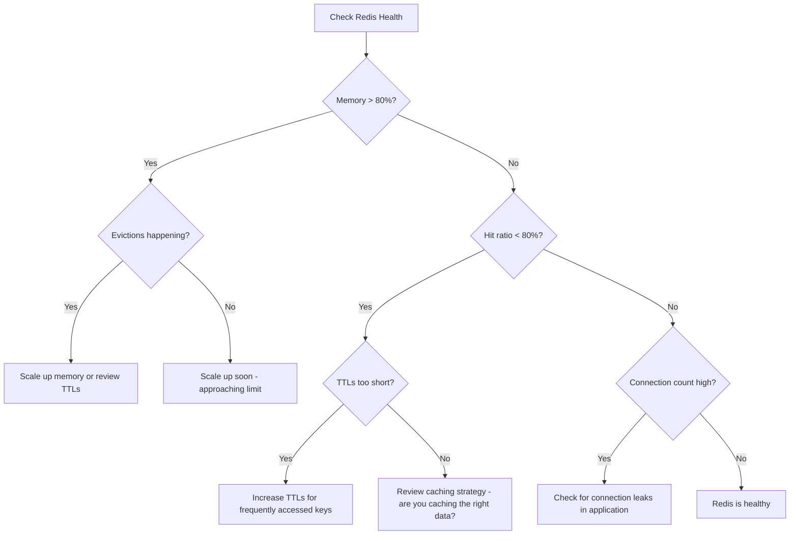

# How to Monitor Memorystore Redis Performance with Cloud Monitoring

Author: [nawazdhandala](https://www.github.com/nawazdhandala)

Tags: GCP, Memorystore, Redis, Cloud Monitoring, Observability

Description: Set up comprehensive monitoring for your Memorystore Redis instances using Google Cloud Monitoring with dashboards, alerts, and key metrics to track.

---

Running a Memorystore Redis instance without monitoring is like driving with your eyes closed. Everything seems fine until you hit something. Memory fills up silently, connections pile up, latency creeps higher, and by the time users complain, the damage is done.

Cloud Monitoring gives you deep visibility into Memorystore Redis performance. The metrics are collected automatically - you just need to know which ones to watch and how to set up alerts. In this post, I will walk through the essential Redis metrics, how to create dashboards, and what alert policies to configure.

## Metrics Available for Memorystore Redis

Memorystore exposes dozens of metrics through Cloud Monitoring. Here are the ones that matter most, organized by category.

### Memory Metrics

- `redis.googleapis.com/stats/memory/usage_ratio` - Memory usage as a ratio (0 to 1). The most important metric.
- `redis.googleapis.com/stats/memory/usage` - Absolute memory usage in bytes.
- `redis.googleapis.com/stats/memory/maxmemory` - Maximum memory configured.

### Connection Metrics

- `redis.googleapis.com/stats/connected_clients` - Current number of connected clients.
- `redis.googleapis.com/stats/rejected_connections` - Number of rejected connections (due to maxclients limit).

### Performance Metrics

- `redis.googleapis.com/stats/cache_hit_ratio` - Ratio of cache hits to total lookups.
- `redis.googleapis.com/stats/keyspace_hits` - Number of successful key lookups.
- `redis.googleapis.com/stats/keyspace_misses` - Number of failed key lookups.

### Operation Metrics

- `redis.googleapis.com/stats/calls` - Number of commands processed per second, broken down by command type.
- `redis.googleapis.com/stats/average_ttl` - Average TTL of keys in the database.
- `redis.googleapis.com/stats/evicted_keys` - Number of keys evicted due to memory pressure.
- `redis.googleapis.com/stats/expired_keys` - Number of keys expired by TTL.

### CPU and System Metrics

- `redis.googleapis.com/stats/cpu_utilization` - CPU utilization of the Redis instance.

## Creating a Monitoring Dashboard

You can create a dashboard using the Cloud Console or the gcloud CLI. Here is a dashboard configuration that covers the essential metrics:

```bash
# Create a monitoring dashboard for Memorystore Redis
gcloud monitoring dashboards create --config='
{
  "displayName": "Memorystore Redis Performance",
  "mosaicLayout": {
    "tiles": [
      {
        "width": 6,
        "height": 4,
        "widget": {
          "title": "Memory Usage Ratio",
          "xyChart": {
            "dataSets": [{
              "timeSeriesQuery": {
                "timeSeriesFilter": {
                  "filter": "metric.type=\"redis.googleapis.com/stats/memory/usage_ratio\" AND resource.type=\"redis_instance\"",
                  "aggregation": {
                    "alignmentPeriod": "60s",
                    "perSeriesAligner": "ALIGN_MEAN"
                  }
                }
              }
            }],
            "yAxis": {"scale": "LINEAR"}
          }
        }
      },
      {
        "xPos": 6,
        "width": 6,
        "height": 4,
        "widget": {
          "title": "Connected Clients",
          "xyChart": {
            "dataSets": [{
              "timeSeriesQuery": {
                "timeSeriesFilter": {
                  "filter": "metric.type=\"redis.googleapis.com/stats/connected_clients\" AND resource.type=\"redis_instance\"",
                  "aggregation": {
                    "alignmentPeriod": "60s",
                    "perSeriesAligner": "ALIGN_MEAN"
                  }
                }
              }
            }]
          }
        }
      },
      {
        "yPos": 4,
        "width": 6,
        "height": 4,
        "widget": {
          "title": "Cache Hit Ratio",
          "xyChart": {
            "dataSets": [{
              "timeSeriesQuery": {
                "timeSeriesFilter": {
                  "filter": "metric.type=\"redis.googleapis.com/stats/cache_hit_ratio\" AND resource.type=\"redis_instance\"",
                  "aggregation": {
                    "alignmentPeriod": "60s",
                    "perSeriesAligner": "ALIGN_MEAN"
                  }
                }
              }
            }]
          }
        }
      },
      {
        "xPos": 6,
        "yPos": 4,
        "width": 6,
        "height": 4,
        "widget": {
          "title": "Evicted Keys",
          "xyChart": {
            "dataSets": [{
              "timeSeriesQuery": {
                "timeSeriesFilter": {
                  "filter": "metric.type=\"redis.googleapis.com/stats/evicted_keys\" AND resource.type=\"redis_instance\"",
                  "aggregation": {
                    "alignmentPeriod": "60s",
                    "perSeriesAligner": "ALIGN_DELTA"
                  }
                }
              }
            }]
          }
        }
      }
    ]
  }
}'
```

## Setting Up Alert Policies

Alerts notify you when something needs attention. Here are the essential alerts for Memorystore Redis.

### High Memory Usage Alert

This is the most critical alert. When memory usage exceeds 80%, you need to either scale up or investigate what is filling the cache:

```bash
# Create an alert for high memory usage (above 80%)
gcloud alpha monitoring policies create \
  --display-name="Redis: High Memory Usage" \
  --condition-display-name="Memory usage above 80%" \
  --condition-filter='resource.type="redis_instance" AND metric.type="redis.googleapis.com/stats/memory/usage_ratio"' \
  --condition-threshold-value=0.8 \
  --condition-threshold-comparison=COMPARISON_GT \
  --condition-threshold-duration=300s \
  --notification-channels=YOUR_CHANNEL_ID \
  --documentation="Redis memory usage has exceeded 80%. Consider scaling up the instance or reviewing your caching strategy."
```

### Connection Count Alert

Alert when the number of connected clients approaches the limit:

```bash
# Alert when connections exceed a threshold
gcloud alpha monitoring policies create \
  --display-name="Redis: High Connection Count" \
  --condition-display-name="Connected clients above threshold" \
  --condition-filter='resource.type="redis_instance" AND metric.type="redis.googleapis.com/stats/connected_clients"' \
  --condition-threshold-value=5000 \
  --condition-threshold-comparison=COMPARISON_GT \
  --condition-threshold-duration=300s \
  --notification-channels=YOUR_CHANNEL_ID
```

### Low Cache Hit Ratio Alert

A dropping hit ratio means your cache is not effective:

```bash
# Alert when cache hit ratio drops below 80%
gcloud alpha monitoring policies create \
  --display-name="Redis: Low Cache Hit Ratio" \
  --condition-display-name="Hit ratio below 80%" \
  --condition-filter='resource.type="redis_instance" AND metric.type="redis.googleapis.com/stats/cache_hit_ratio"' \
  --condition-threshold-value=0.8 \
  --condition-threshold-comparison=COMPARISON_LT \
  --condition-threshold-duration=600s \
  --notification-channels=YOUR_CHANNEL_ID
```

### Key Eviction Alert

Evictions mean Redis is removing data to make room. This can cause cache misses and increased database load:

```bash
# Alert when key evictions spike
gcloud alpha monitoring policies create \
  --display-name="Redis: High Eviction Rate" \
  --condition-display-name="Key evictions detected" \
  --condition-filter='resource.type="redis_instance" AND metric.type="redis.googleapis.com/stats/evicted_keys"' \
  --condition-threshold-value=100 \
  --condition-threshold-comparison=COMPARISON_GT \
  --condition-threshold-duration=300s \
  --notification-channels=YOUR_CHANNEL_ID
```

## Monitoring with Redis INFO Command

In addition to Cloud Monitoring, you can get detailed information directly from Redis:

```python
# monitor_redis.py - Collect and report Redis metrics programmatically
import redis
import os
import json
from datetime import datetime

def collect_redis_metrics():
    """Collect comprehensive metrics from Redis INFO command."""

    r = redis.Redis(
        host=os.environ.get("REDIS_HOST", "10.0.0.3"),
        port=int(os.environ.get("REDIS_PORT", "6379")),
        password=os.environ.get("REDIS_AUTH"),
        decode_responses=True
    )

    # Collect metrics from different INFO sections
    memory_info = r.info("memory")
    clients_info = r.info("clients")
    stats_info = r.info("stats")
    keyspace_info = r.info("keyspace")

    metrics = {
        "timestamp": datetime.now().isoformat(),

        # Memory metrics
        "used_memory_mb": memory_info["used_memory"] / (1024 * 1024),
        "used_memory_peak_mb": memory_info["used_memory_peak"] / (1024 * 1024),
        "maxmemory_mb": memory_info["maxmemory"] / (1024 * 1024),
        "memory_fragmentation_ratio": memory_info.get("mem_fragmentation_ratio", 0),

        # Client metrics
        "connected_clients": clients_info["connected_clients"],
        "blocked_clients": clients_info.get("blocked_clients", 0),

        # Operation metrics
        "total_commands_processed": stats_info["total_commands_processed"],
        "keyspace_hits": stats_info["keyspace_hits"],
        "keyspace_misses": stats_info["keyspace_misses"],
        "evicted_keys": stats_info["evicted_keys"],
        "expired_keys": stats_info.get("expired_keys", 0),

        # Calculated metrics
        "hit_ratio": 0
    }

    # Calculate hit ratio
    total_lookups = metrics["keyspace_hits"] + metrics["keyspace_misses"]
    if total_lookups > 0:
        metrics["hit_ratio"] = metrics["keyspace_hits"] / total_lookups

    # Memory usage percentage
    if metrics["maxmemory_mb"] > 0:
        metrics["memory_usage_pct"] = (
            metrics["used_memory_mb"] / metrics["maxmemory_mb"]
        ) * 100

    return metrics

def print_metrics_report():
    """Print a formatted metrics report."""
    metrics = collect_redis_metrics()

    print("=" * 60)
    print(f"Redis Metrics Report - {metrics['timestamp']}")
    print("=" * 60)
    print(f"\nMemory:")
    print(f"  Used: {metrics['used_memory_mb']:.1f} MB / {metrics['maxmemory_mb']:.1f} MB "
          f"({metrics.get('memory_usage_pct', 0):.1f}%)")
    print(f"  Peak: {metrics['used_memory_peak_mb']:.1f} MB")
    print(f"  Fragmentation ratio: {metrics['memory_fragmentation_ratio']:.2f}")
    print(f"\nClients:")
    print(f"  Connected: {metrics['connected_clients']}")
    print(f"  Blocked: {metrics['blocked_clients']}")
    print(f"\nPerformance:")
    print(f"  Hit ratio: {metrics['hit_ratio']:.2%}")
    print(f"  Hits: {metrics['keyspace_hits']:,}")
    print(f"  Misses: {metrics['keyspace_misses']:,}")
    print(f"  Evictions: {metrics['evicted_keys']:,}")
    print(f"  Expirations: {metrics['expired_keys']:,}")

if __name__ == "__main__":
    print_metrics_report()
```

## Understanding Key Metrics

Here is a decision tree for interpreting your monitoring data:



## Monitoring Best Practices

**Set baselines first.** Before creating alerts, observe your metrics for a week to understand normal patterns. Your Monday morning traffic spike is not an alert - it is expected behavior.

**Alert on symptoms, not causes.** Alert on high memory usage and low hit ratio (symptoms). Investigate connection count and eviction rate as part of the diagnosis.

**Use appropriate durations.** A brief spike in memory during a batch job is not worth waking someone up. Use 5-10 minute durations on alert conditions to filter out transient spikes.

**Create a runbook.** For each alert, document what to check and what actions to take. Link the runbook in the alert's documentation field.

**Monitor your application, not just Redis.** Track cache hit/miss rates in your application code too. A Redis hit does not help if your application is not checking the cache before hitting the database.

## Custom Metrics with Redis Slow Log

Redis's slow log captures commands that exceed a time threshold. Monitor it to find performance bottlenecks:

```python
# Check Redis slow log for commands taking too long
def check_slow_log(r, threshold_ms=10):
    """Review Redis slow log for slow commands."""
    # Get the last 20 slow log entries
    slow_entries = r.slowlog_get(20)

    if not slow_entries:
        print("No slow commands found")
        return

    print(f"Found {len(slow_entries)} slow commands:")
    for entry in slow_entries:
        duration_ms = entry["duration"] / 1000  # microseconds to milliseconds
        command = " ".join(str(arg) for arg in entry["command"][:5])
        print(f"  [{duration_ms:.1f}ms] {command}")
```

## Setting Up Notification Channels

Configure where alerts are sent:

```bash
# Create an email notification channel
gcloud alpha monitoring channels create \
  --display-name="Redis Alerts - Email" \
  --type=email \
  --channel-labels=email_address=ops-team@company.com

# Create a Slack notification channel
gcloud alpha monitoring channels create \
  --display-name="Redis Alerts - Slack" \
  --type=slack \
  --channel-labels=channel_name="#redis-alerts"
```

## Wrapping Up

Monitoring Memorystore Redis is about tracking four things: memory usage, cache effectiveness (hit ratio), connection health, and operational metrics (evictions and latency). Set up a dashboard that shows these at a glance, create alerts for the critical thresholds, and check the slow log periodically for performance issues. With proper monitoring in place, you will catch problems early and keep your caching layer running smoothly.
