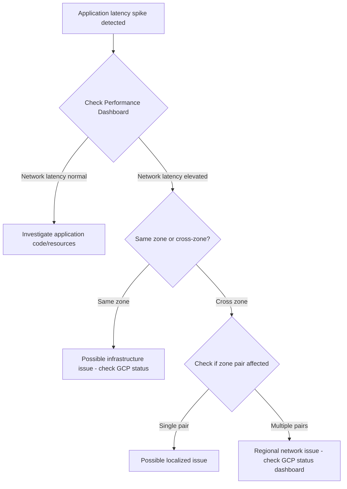

# How to Monitor Network Performance Between GCP Zones Using Performance Dashboard

Author: [nawazdhandala](https://www.github.com/nawazdhandala)

Tags: GCP, Network Performance, Performance Dashboard, Network Intelligence Center, Google Cloud Monitoring

Description: Learn how to use GCP Performance Dashboard to monitor latency and packet loss between zones and regions, helping you catch network degradation before users notice.

---

When you deploy services across multiple GCP zones or regions, the network performance between those zones directly impacts your application's response times. A spike in inter-zone latency can cascade through your microservices, turning a 50ms API call into a 500ms one. The Performance Dashboard in Network Intelligence Center gives you visibility into this without deploying any agents or probes.

This post covers how to use the Performance Dashboard to monitor network performance between zones, set up alerts for degradation, and interpret the data you see.

## What the Performance Dashboard Shows

The Performance Dashboard provides two key metrics for network paths between GCP zones:

- **Latency** - Round-trip time between zones, measured at the network layer.
- **Packet loss** - Percentage of packets dropped between zones.

These metrics are collected by Google's infrastructure, not by agents running on your VMs. This means the data reflects the underlying network performance, not application-level issues. It also means you do not need to set anything up on your instances.

## Accessing the Performance Dashboard

You can find the Performance Dashboard in the GCP Console under Network Intelligence Center. But you can also query the data programmatically.

First, make sure the API is enabled:

```bash
# Enable the Network Management API (required for Performance Dashboard data)
gcloud services enable networkmanagement.googleapis.com --project=my-project
```

## Viewing Performance Data in the Console

Navigate to Network Intelligence Center in the GCP Console, then click Performance Dashboard. You will see a matrix view showing latency and packet loss between all zone pairs where you have resources.

The dashboard lets you:
- Filter by specific regions or zones
- Adjust the time range (last hour, day, week, etc.)
- Switch between latency and packet loss views
- Click on a specific zone pair to see historical trends

## Querying Performance Metrics with Monitoring API

For automation and custom dashboards, you can query the performance metrics through Cloud Monitoring. The relevant metric types are under the `networking.googleapis.com` namespace.

Here is how to query inter-zone latency using gcloud:

```bash
# Query the median latency between two specific zones over the last hour
gcloud monitoring time-series list \
  --project=my-project \
  --filter='metric.type="networking.googleapis.com/vm_flow/rtt" AND
            metric.labels.source_zone="us-central1-a" AND
            metric.labels.destination_zone="us-east1-b"' \
  --interval-start-time=$(date -u -v-1H +%Y-%m-%dT%H:%M:%SZ) \
  --interval-end-time=$(date -u +%Y-%m-%dT%H:%M:%SZ) \
  --format="table(points.interval.endTime,points.value.doubleValue)"
```

For packet loss:

```bash
# Query packet loss between zones over the last 24 hours
gcloud monitoring time-series list \
  --project=my-project \
  --filter='metric.type="networking.googleapis.com/vm_flow/packet_loss" AND
            metric.labels.source_zone="us-central1-a" AND
            metric.labels.destination_zone="us-east1-b"' \
  --interval-start-time=$(date -u -v-24H +%Y-%m-%dT%H:%M:%SZ) \
  --interval-end-time=$(date -u +%Y-%m-%dT%H:%M:%SZ) \
  --format="table(points.interval.endTime,points.value.doubleValue)"
```

## Setting Up Alerts for Network Degradation

You do not want to be staring at dashboards all day. Set up alerting policies that notify you when latency or packet loss exceeds thresholds.

Here is how to create a latency alert using gcloud:

```bash
# Create an alerting policy for high inter-zone latency
gcloud monitoring policies create \
  --notification-channels="projects/my-project/notificationChannels/CHANNEL_ID" \
  --display-name="High Inter-Zone Latency Alert" \
  --condition-display-name="Latency exceeds 5ms between zones" \
  --condition-filter='metric.type="networking.googleapis.com/vm_flow/rtt" AND
                      metric.labels.source_zone="us-central1-a" AND
                      metric.labels.destination_zone="us-central1-b"' \
  --condition-threshold-value=0.005 \
  --condition-threshold-duration=300s \
  --condition-threshold-comparison=COMPARISON_GT \
  --combiner=OR \
  --project=my-project
```

For same-region zones, latency is typically under 1ms. If you see it jump above 5ms, something is likely wrong. For cross-region pairs (like us-central1 to europe-west1), normal latency is 90-120ms, so you would set a higher threshold.

## Understanding Normal Baselines

To set meaningful alert thresholds, you first need to understand what normal looks like for your zone pairs. Here are typical latency ranges:

- **Same zone**: Sub-millisecond (0.1-0.3ms)
- **Same region, different zone**: 0.3-1ms
- **Same continent, different region**: 10-30ms (e.g., us-central1 to us-east1)
- **Cross continent**: 80-200ms (e.g., us-central1 to europe-west1)

Packet loss in normal conditions should be effectively zero. Any sustained packet loss above 0.01% warrants investigation.

## Building a Custom Dashboard

You can build a custom Cloud Monitoring dashboard that shows the zone pairs relevant to your architecture:

```bash
# Create a custom monitoring dashboard for network performance
gcloud monitoring dashboards create --config='{
  "displayName": "Network Performance - Zone Pairs",
  "mosaicLayout": {
    "tiles": [
      {
        "width": 6,
        "height": 4,
        "widget": {
          "title": "Inter-Zone Latency (us-central1-a to us-east1-b)",
          "xyChart": {
            "dataSets": [{
              "timeSeriesQuery": {
                "timeSeriesFilter": {
                  "filter": "metric.type=\"networking.googleapis.com/vm_flow/rtt\" AND metric.labels.source_zone=\"us-central1-a\" AND metric.labels.destination_zone=\"us-east1-b\""
                }
              }
            }]
          }
        }
      },
      {
        "xPos": 6,
        "width": 6,
        "height": 4,
        "widget": {
          "title": "Packet Loss (us-central1-a to us-east1-b)",
          "xyChart": {
            "dataSets": [{
              "timeSeriesQuery": {
                "timeSeriesFilter": {
                  "filter": "metric.type=\"networking.googleapis.com/vm_flow/packet_loss\" AND metric.labels.source_zone=\"us-central1-a\" AND metric.labels.destination_zone=\"us-east1-b\""
                }
              }
            }]
          }
        }
      }
    ]
  }
}'
```

## Correlating with Application Performance

The real power of network performance data comes when you correlate it with application metrics. If your service latency spikes and you see a corresponding spike in inter-zone network latency, you know the root cause is the network, not your application code.

Here is a flow for investigating latency issues:



## Optimizing Based on Performance Data

If you consistently see higher latency on certain zone pairs, consider adjusting your deployment:

1. Co-locate tightly coupled services in the same zone when possible
2. Use regional instance groups that can shift traffic away from degraded zones
3. Deploy read replicas in the same zone as the services that query them
4. Use connection pooling to reduce the impact of per-request latency

## Limitations

The Performance Dashboard shows aggregate network-level metrics. It does not show per-VM or per-flow data. For that level of detail, you need VPC Flow Logs.

The data has some granularity limitations - it is aggregated over 1-minute intervals and there can be a few minutes of delay before data appears.

Performance data is only available for zone pairs where you have active VMs exchanging traffic. You will not see data for zones where you have no resources.

## Summary

The Performance Dashboard gives you free, always-on visibility into the network performance between your GCP zones. Use it to establish baselines, set up alerts for degradation, and quickly diagnose whether application latency issues are caused by the network. Combine it with Cloud Monitoring dashboards and alerting policies to get notified before your users start complaining.
