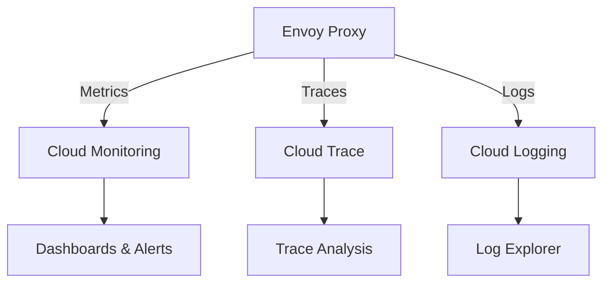

# How to Monitor Service Mesh Metrics and Traces in Google Cloud Observability

Author: [nawazdhandala](https://www.github.com/nawazdhandala)

Tags: GCP, Cloud Service Mesh, Observability, Cloud Monitoring, Cloud Trace

Description: Learn how to monitor service mesh metrics, distributed traces, and logs using Google Cloud Observability tools for complete visibility into your mesh traffic.

---

One of the biggest benefits of running a service mesh is the observability you get for free. Every request that flows through the Envoy sidecar proxies generates metrics, traces, and logs without you adding any instrumentation to your application code. Cloud Service Mesh on GKE automatically sends this telemetry to Google Cloud's observability suite - Cloud Monitoring, Cloud Trace, and Cloud Logging. The challenge is not generating the data but knowing how to use it effectively.

This guide covers how to access, query, and build dashboards around your mesh telemetry.

## What Telemetry Does the Mesh Generate

Every Envoy proxy in the mesh produces three types of telemetry:

**Metrics** - Request counts, latencies, response sizes, connection counts, and more. These are emitted as Prometheus-compatible metrics and also sent to Cloud Monitoring.

**Traces** - Distributed traces that follow a request through multiple services. Each hop through an Envoy proxy adds a span to the trace.

**Logs** - Access logs for every request, including source, destination, response code, latency, and other details.



## Viewing the Service Mesh Dashboard

Google Cloud provides a built-in Service Mesh dashboard. Navigate to it in the Cloud Console.

1. Go to the Google Cloud Console
2. Navigate to Anthos, then Service Mesh (or search for "Service Mesh")
3. Select your mesh cluster

The dashboard shows:

- **Topology view** - A visual map of all services and the traffic flowing between them
- **Service list** - All services in the mesh with key metrics
- **SLO monitoring** - Service-level objectives if configured

The topology view is particularly useful for understanding your service dependencies at a glance.

## Working with Mesh Metrics in Cloud Monitoring

Cloud Service Mesh exports metrics to Cloud Monitoring under the `istio.io/service` metric prefix. Here are the most important ones.

### Key Metrics

**Request count** - `istio.io/service/server/request_count`
Tracks the total number of requests received by a service. Use this to understand traffic volume and identify unusual spikes or drops.

**Request latency** - `istio.io/service/server/response_latencies`
Measures response latency in milliseconds. Available as a distribution, so you can look at p50, p95, and p99 latencies.

**Request size** - `istio.io/service/server/request_bytes`
Tracks the size of incoming requests.

**Response size** - `istio.io/service/server/response_bytes`
Tracks the size of outgoing responses.

**TCP connections** - `istio.io/service/server/connection_open_count`
Tracks the number of open TCP connections.

### Building Custom Dashboards

Create a Cloud Monitoring dashboard for your mesh.

Here is an example dashboard configuration using the Monitoring API.

```json
{
  "displayName": "Service Mesh Overview",
  "mosaicLayout": {
    "tiles": [
      {
        "width": 6,
        "height": 4,
        "widget": {
          "title": "Request Rate by Service",
          "xyChart": {
            "dataSets": [
              {
                "timeSeriesQuery": {
                  "timeSeriesFilter": {
                    "filter": "metric.type=\"istio.io/service/server/request_count\" resource.type=\"k8s_container\"",
                    "aggregation": {
                      "alignmentPeriod": "60s",
                      "perSeriesAligner": "ALIGN_RATE",
                      "crossSeriesReducer": "REDUCE_SUM",
                      "groupByFields": ["metric.label.destination_service_name"]
                    }
                  }
                }
              }
            ]
          }
        }
      },
      {
        "width": 6,
        "height": 4,
        "widget": {
          "title": "P99 Latency by Service",
          "xyChart": {
            "dataSets": [
              {
                "timeSeriesQuery": {
                  "timeSeriesFilter": {
                    "filter": "metric.type=\"istio.io/service/server/response_latencies\" resource.type=\"k8s_container\"",
                    "aggregation": {
                      "alignmentPeriod": "60s",
                      "perSeriesAligner": "ALIGN_PERCENTILE_99",
                      "crossSeriesReducer": "REDUCE_MEAN",
                      "groupByFields": ["metric.label.destination_service_name"]
                    }
                  }
                }
              }
            ]
          }
        }
      },
      {
        "width": 6,
        "height": 4,
        "widget": {
          "title": "Error Rate by Service",
          "xyChart": {
            "dataSets": [
              {
                "timeSeriesQuery": {
                  "timeSeriesFilter": {
                    "filter": "metric.type=\"istio.io/service/server/request_count\" resource.type=\"k8s_container\" metric.label.response_code>=\"500\"",
                    "aggregation": {
                      "alignmentPeriod": "60s",
                      "perSeriesAligner": "ALIGN_RATE",
                      "crossSeriesReducer": "REDUCE_SUM",
                      "groupByFields": ["metric.label.destination_service_name"]
                    }
                  }
                }
              }
            ]
          }
        }
      }
    ]
  }
}
```

### Setting Up Alerts

Create alerts for critical mesh health signals.

```bash
# Create an alert policy for high error rates
gcloud alpha monitoring policies create \
    --display-name="Mesh Service High Error Rate" \
    --condition-display-name="5xx error rate above 5%" \
    --condition-filter='metric.type="istio.io/service/server/request_count" AND metric.label.response_code >= 500' \
    --condition-threshold-value=0.05 \
    --condition-threshold-duration=300s \
    --condition-threshold-comparison=COMPARISON_GT \
    --notification-channels=YOUR_CHANNEL_ID \
    --project=YOUR_PROJECT_ID
```

Key alerts to set up:

- **Error rate above threshold** - Catch services returning too many 5xx responses
- **Latency above threshold** - Catch services that are slower than their SLO
- **Traffic drop** - Catch services that suddenly stop receiving traffic (possible routing issue)
- **Connection failures** - Catch services that cannot connect to their dependencies

## Working with Distributed Traces in Cloud Trace

Cloud Service Mesh automatically propagates trace headers (via the B3 or W3C Trace Context formats) through Envoy proxies. This gives you end-to-end traces across all services in the mesh.

### Viewing Traces

1. Open Cloud Trace in the Google Cloud Console
2. You will see a trace list showing recent traces
3. Click on a trace to see the waterfall view

The waterfall view shows each service hop as a span, with timing information for each. This is invaluable for identifying which service in a call chain is causing latency.

### Analyzing Trace Data

Use trace analysis to find patterns.

```
# In the Cloud Trace search, filter for slow traces
latency > 1s AND /api/checkout
```

Common patterns to look for:

- **Serial vs parallel calls** - If your service makes multiple downstream calls, are they happening sequentially (bad) or in parallel (good)?
- **Long database queries** - If your application propagates trace context to database queries, you can see exactly which queries are slow
- **Retry overhead** - Istio's retry policy can add significant latency if a service is flaky. Traces show this clearly

### Configuring Trace Sampling

By default, Cloud Service Mesh samples a percentage of traces. For production, you generally want 1-5% sampling to balance visibility with cost.

```yaml
# mesh-config.yaml
# Configure trace sampling rate
apiVersion: v1
kind: ConfigMap
metadata:
  name: istio
  namespace: istio-system
data:
  mesh: |-
    defaultConfig:
      tracing:
        sampling: 1.0
```

For the managed control plane, configure sampling through the fleet settings.

```bash
# Update trace sampling rate
gcloud container fleet mesh update \
    --memberships=mesh-cluster \
    --config='{"tracing": {"sampling": 1.0}}' \
    --project=YOUR_PROJECT_ID
```

## Working with Access Logs in Cloud Logging

Envoy access logs capture detailed information about every request. In Cloud Logging, these logs are associated with the `k8s_container` resource type for the istio-proxy container.

### Querying Mesh Access Logs

In the Cloud Logging log explorer, use this filter to find mesh access logs.

```
resource.type="k8s_container"
resource.labels.container_name="istio-proxy"
```

To find specific patterns.

```
# Find all 5xx responses
resource.type="k8s_container"
resource.labels.container_name="istio-proxy"
jsonPayload.response_code >= 500

# Find slow requests (over 5 seconds)
resource.type="k8s_container"
resource.labels.container_name="istio-proxy"
jsonPayload.duration > 5000

# Find requests from a specific source service
resource.type="k8s_container"
resource.labels.container_name="istio-proxy"
jsonPayload.source_name="frontend"
```

### Enabling Detailed Access Logs

By default, access logging may only capture errors. Enable full access logging for debugging.

```yaml
# telemetry.yaml
# Enables detailed access logging for all mesh traffic
apiVersion: telemetry.istio.io/v1alpha1
kind: Telemetry
metadata:
  name: mesh-default
  namespace: istio-system
spec:
  accessLogging:
  - providers:
    - name: stackdriver
    filter:
      expression: "true"
```

Be careful with full access logging in production - it can generate a lot of log data and increase your Cloud Logging costs significantly. Consider enabling it only for specific namespaces or services that you are troubleshooting.

```yaml
# telemetry-specific.yaml
# Enables access logging only for a specific namespace
apiVersion: telemetry.istio.io/v1alpha1
kind: Telemetry
metadata:
  name: debug-logging
  namespace: my-app
spec:
  accessLogging:
  - providers:
    - name: stackdriver
    filter:
      expression: "response.code >= 400"
```

## Building a Comprehensive Monitoring Strategy

Metrics, traces, and logs serve different purposes. Use them together.

**Metrics for alerting and trending.** Metrics tell you that something is wrong and how the pattern has changed over time. Use them for dashboards and alerts.

**Traces for diagnosing latency.** When metrics tell you a service is slow, traces show you exactly where in the call chain the latency is occurring.

**Logs for debugging specific requests.** When you need to understand what happened with a specific request, access logs give you the full details including headers, response codes, and timing.

The three together give you complete observability without modifying a single line of application code. That is the promise of a service mesh, and Cloud Service Mesh on GKE delivers it with tight integration into Google Cloud's observability tools.
