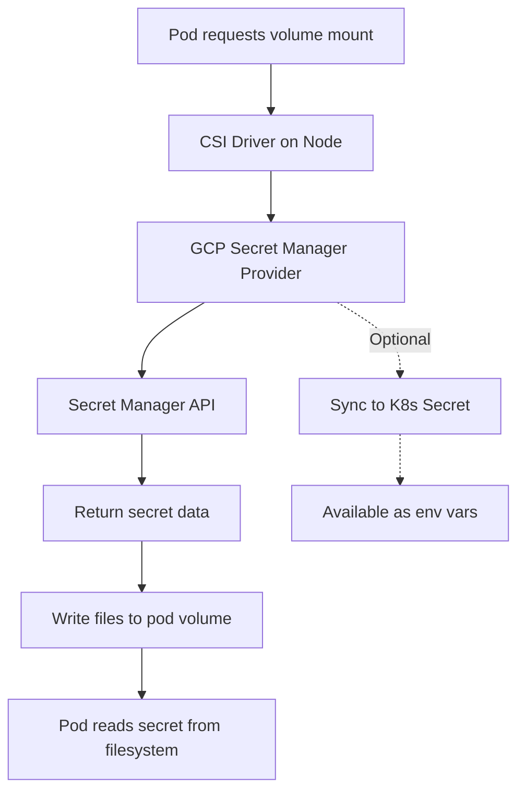

# How to Mount Secret Manager Secrets as Volumes in GKE Using the CSI Driver

Author: [nawazdhandala](https://www.github.com/nawazdhandala)

Tags: GCP, GKE, Secret Manager, CSI Driver, Kubernetes

Description: Step-by-step guide to installing and configuring the Secret Manager CSI driver in GKE, enabling pods to mount secrets as files without modifying application code.

---

Kubernetes has its own Secret resource, but it has well-known limitations. Secrets are stored in etcd with base64 encoding (not encryption by default), they are accessible to anyone with RBAC permissions on the namespace, and managing them across environments is painful. Teams often end up with secrets scattered across kubectl commands, Helm values files, and CI/CD variable stores.

The Secrets Store CSI Driver bridges Kubernetes and external secret managers. For GKE, Google provides a provider plugin that connects the CSI driver to Secret Manager. This lets your pods mount secrets from Secret Manager as files in the container filesystem, using the same Secret Manager access controls and audit logging you use for everything else.

## How It Works

The CSI driver runs as a DaemonSet on your GKE nodes. When a pod references a `SecretProviderClass`, the driver intercepts the volume mount request and fetches the specified secrets from Secret Manager. The secrets are written as files in the pod's filesystem. If configured, the driver can also sync the secrets into native Kubernetes Secrets for use as environment variables.



## Prerequisites

- A GKE cluster (Standard or Autopilot) running version 1.25 or later
- Workload Identity enabled on the cluster
- Secret Manager API enabled
- Secrets stored in Secret Manager

## Step 1 - Enable the CSI Driver on Your Cluster

For GKE Standard clusters, enable the Secret Manager add-on:

```bash
# Enable the Secret Manager CSI driver add-on on an existing cluster
gcloud container clusters update my-cluster \
  --region=us-central1 \
  --enable-secret-manager \
  --project=my-project-id
```

For new clusters, include it at creation time:

```bash
# Create a new cluster with the CSI driver enabled
gcloud container clusters create my-cluster \
  --region=us-central1 \
  --workload-pool=my-project-id.svc.id.goog \
  --enable-secret-manager \
  --project=my-project-id
```

For GKE Autopilot clusters, the CSI driver is available automatically starting from version 1.25.

## Step 2 - Set Up Workload Identity

The CSI driver uses Workload Identity to authenticate with Secret Manager. You need a Kubernetes service account linked to a GCP service account that has access to your secrets.

Create the GCP service account:

```bash
# Create a GCP service account for the workload
gcloud iam service-accounts create app-secrets-reader \
  --display-name="App Secrets Reader" \
  --project=my-project-id

# Grant it access to the secrets
gcloud secrets add-iam-policy-binding db-password \
  --member="serviceAccount:app-secrets-reader@my-project-id.iam.gserviceaccount.com" \
  --role="roles/secretmanager.secretAccessor" \
  --project=my-project-id

gcloud secrets add-iam-policy-binding api-key \
  --member="serviceAccount:app-secrets-reader@my-project-id.iam.gserviceaccount.com" \
  --role="roles/secretmanager.secretAccessor" \
  --project=my-project-id
```

Create the Kubernetes service account and bind it:

```bash
# Create the Kubernetes service account
kubectl create serviceaccount app-sa --namespace=my-namespace

# Bind it to the GCP service account
gcloud iam service-accounts add-iam-policy-binding \
  app-secrets-reader@my-project-id.iam.gserviceaccount.com \
  --member="serviceAccount:my-project-id.svc.id.goog[my-namespace/app-sa]" \
  --role="roles/iam.workloadIdentityUser"

# Annotate the Kubernetes SA with the GCP SA email
kubectl annotate serviceaccount app-sa \
  --namespace=my-namespace \
  iam.gke.io/gcp-service-account=app-secrets-reader@my-project-id.iam.gserviceaccount.com
```

## Step 3 - Create a SecretProviderClass

The `SecretProviderClass` is a custom resource that tells the CSI driver which secrets to fetch and how to present them:

```yaml
# secret-provider-class.yaml
# Defines which secrets to fetch from Secret Manager
apiVersion: secrets-store.csi.x-k8s.io/v1
kind: SecretProviderClass
metadata:
  name: app-secrets
  namespace: my-namespace
spec:
  provider: gcp
  parameters:
    secrets: |
      - resourceName: "projects/my-project-id/secrets/db-password/versions/latest"
        path: "db-password"
      - resourceName: "projects/my-project-id/secrets/api-key/versions/latest"
        path: "api-key"
      - resourceName: "projects/my-project-id/secrets/tls-cert/versions/latest"
        path: "tls/server.crt"
```

Apply it:

```bash
# Apply the SecretProviderClass
kubectl apply -f secret-provider-class.yaml
```

Each entry in the `secrets` array specifies:
- `resourceName`: The full path to the secret version in Secret Manager
- `path`: The filename (or path) where the secret will be mounted in the pod

## Step 4 - Mount Secrets in Your Pod

Reference the `SecretProviderClass` in your pod's volume definition:

```yaml
# deployment.yaml
# Pod spec that mounts secrets from Secret Manager as files
apiVersion: apps/v1
kind: Deployment
metadata:
  name: my-app
  namespace: my-namespace
spec:
  replicas: 2
  selector:
    matchLabels:
      app: my-app
  template:
    metadata:
      labels:
        app: my-app
    spec:
      serviceAccountName: app-sa  # The SA with Workload Identity binding
      containers:
        - name: app
          image: us-docker.pkg.dev/my-project-id/my-repo/my-app:latest
          volumeMounts:
            - name: secrets-volume
              mountPath: /secrets
              readOnly: true
      volumes:
        - name: secrets-volume
          csi:
            driver: secrets-store.csi.k8s.io
            readOnly: true
            volumeAttributes:
              secretProviderClass: app-secrets
```

After deployment, the secrets are available as files inside the container:

```
/secrets/db-password      - contains the database password
/secrets/api-key          - contains the API key
/secrets/tls/server.crt   - contains the TLS certificate
```

## Step 5 - Optional: Sync to Kubernetes Secrets

If your application reads secrets from environment variables rather than files, you can configure the CSI driver to sync the fetched secrets into native Kubernetes Secrets. Then reference those in your pod's env spec:

```yaml
# secret-provider-class-with-sync.yaml
# Syncs Secret Manager secrets to native Kubernetes Secrets
apiVersion: secrets-store.csi.x-k8s.io/v1
kind: SecretProviderClass
metadata:
  name: app-secrets-with-sync
  namespace: my-namespace
spec:
  provider: gcp
  parameters:
    secrets: |
      - resourceName: "projects/my-project-id/secrets/db-password/versions/latest"
        path: "db-password"
      - resourceName: "projects/my-project-id/secrets/api-key/versions/latest"
        path: "api-key"
  secretObjects:
    - secretName: app-k8s-secrets
      type: Opaque
      data:
        - objectName: db-password
          key: DB_PASSWORD
        - objectName: api-key
          key: API_KEY
```

Then reference the synced Kubernetes Secret in your deployment:

```yaml
# deployment-with-env.yaml
# Uses synced Kubernetes Secrets as environment variables
apiVersion: apps/v1
kind: Deployment
metadata:
  name: my-app
  namespace: my-namespace
spec:
  replicas: 2
  selector:
    matchLabels:
      app: my-app
  template:
    metadata:
      labels:
        app: my-app
    spec:
      serviceAccountName: app-sa
      containers:
        - name: app
          image: us-docker.pkg.dev/my-project-id/my-repo/my-app:latest
          env:
            - name: DB_PASSWORD
              valueFrom:
                secretKeyRef:
                  name: app-k8s-secrets
                  key: DB_PASSWORD
            - name: API_KEY
              valueFrom:
                secretKeyRef:
                  name: app-k8s-secrets
                  key: API_KEY
          volumeMounts:
            - name: secrets-volume
              mountPath: /secrets
              readOnly: true
      volumes:
        - name: secrets-volume
          csi:
            driver: secrets-store.csi.k8s.io
            readOnly: true
            volumeAttributes:
              secretProviderClass: app-secrets-with-sync
```

Note that the volume mount is still required even when using `secretObjects` sync. The CSI driver only fetches secrets when the volume is mounted.

## Secret Rotation

The CSI driver supports auto-rotation. When enabled, it periodically checks for new secret versions and updates the mounted files:

```bash
# Enable rotation on the cluster (check interval in seconds)
gcloud container clusters update my-cluster \
  --region=us-central1 \
  --secret-manager-rotation-interval=60s \
  --project=my-project-id
```

After enabling rotation, when a new version is added to a secret in Secret Manager, the mounted file is updated within the rotation interval. Your application needs to handle re-reading the file, as the environment variable (if synced) is not updated dynamically - only the file mount is.

## Troubleshooting

If secrets are not mounting, check the following:

```bash
# Verify the CSI driver pods are running
kubectl get pods -n kube-system -l app=secrets-store-csi-driver

# Check the provider pods
kubectl get pods -n kube-system -l app=secrets-store-provider-gcp

# Look at events on the pod for mount errors
kubectl describe pod my-app-pod -n my-namespace

# Verify Workload Identity is working
kubectl run test-wi --image=google/cloud-sdk:slim --serviceaccount=app-sa -n my-namespace -- gcloud auth list
```

Common issues include missing IAM bindings on the GCP service account, incorrect Workload Identity annotation on the Kubernetes service account, and typos in the secret resource names.

The CSI driver approach is the cleanest way to integrate Secret Manager with GKE workloads. It keeps your pod specs free of sensitive values, leverages Workload Identity for authentication, and provides a clear audit trail through Secret Manager. Once you have the driver set up, adding new secrets to a deployment is just a matter of updating the SecretProviderClass and the volume mount.
