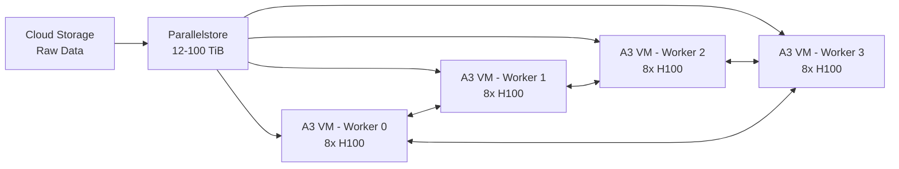

# How to Optimize AI Training Pipeline Performance with Parallelstore and A3 GPU VMs

Author: [nawazdhandala](https://www.github.com/nawazdhandala)

Tags: GCP, Parallelstore, A3 GPU, AI Training, Machine Learning, High Performance Computing

Description: Learn how to maximize AI model training throughput by pairing Google Cloud Parallelstore with A3 GPU VMs for high-bandwidth data access during distributed training.

---

Training large AI models is fundamentally a data movement problem. Your GPUs can crunch numbers at incredible speeds, but they spend a surprising amount of time waiting for data to arrive. When you are training across multiple A3 GPU VMs - each packed with NVIDIA H100 GPUs - the storage layer becomes the critical path. If the file system cannot feed data fast enough, those expensive GPUs sit idle.

Google Cloud Parallelstore combined with A3 GPU VMs is designed to solve exactly this problem. In this guide, I will cover how to architect and tune this combination for maximum training throughput.

## Why A3 VMs and Parallelstore Together

A3 GPU VMs are Google Cloud's flagship GPU instances. Each A3-highgpu-8g machine comes with 8 NVIDIA H100 80GB GPUs, 208 vCPUs, and 1.9 TB of RAM. The network bandwidth on these machines is massive - up to 200 Gbps per VM.

Parallelstore is a managed parallel file system that can deliver hundreds of GB/s of aggregate throughput. It stripes data across multiple storage servers, so bandwidth scales with capacity. This is the key differentiator compared to Filestore or Cloud Storage FUSE, which top out at much lower throughput levels.

The pairing works because A3 VMs have the network bandwidth to actually use Parallelstore's throughput, and Parallelstore has the throughput to keep A3 VMs fed with training data.

## Architecture Overview

Here is what a typical training setup looks like:



The data flow is: raw data lives in Cloud Storage, gets staged into Parallelstore before training begins, and then the A3 VMs read from Parallelstore during training. Checkpoints also get written back to Parallelstore and periodically synced to Cloud Storage for durability.

## Step 1: Size Your Parallelstore Instance

Parallelstore throughput scales linearly with capacity. A rough guideline:

| Instance Size | Read Throughput | Write Throughput |
|---|---|---|
| 12 TiB | ~12 GB/s | ~6 GB/s |
| 27 TiB | ~27 GB/s | ~13 GB/s |
| 100 TiB | ~100 GB/s | ~50 GB/s |

For a 4-node A3 cluster, each VM can consume up to 25 GB/s from the network. That means you want at least 100 GB/s of read throughput from Parallelstore, which means a 100 TiB instance.

```bash
# Create a Parallelstore instance sized for the training cluster
gcloud parallelstore instances create training-pfs \
  --location=us-central1-a \
  --capacity-gib=102400 \
  --network=default \
  --description="AI training data store for A3 cluster"
```

## Step 2: Provision A3 GPU VMs

Create your A3 VMs in the same zone as the Parallelstore instance. Use a reservation if possible, since A3 VMs have limited availability.

```bash
# Create an A3 GPU VM for training
gcloud compute instances create training-worker-0 \
  --zone=us-central1-a \
  --machine-type=a3-highgpu-8g \
  --accelerator=type=nvidia-h100-80gb,count=8 \
  --image-family=common-cu123-debian-12 \
  --image-project=deeplearning-platform-release \
  --maintenance-policy=TERMINATE \
  --network=default \
  --scopes=cloud-platform \
  --metadata=install-nvidia-driver=True
```

Repeat for each worker node, incrementing the name (`training-worker-1`, `training-worker-2`, etc.).

## Step 3: Install and Configure the DAOS Client

On each A3 VM, install the DAOS client and configure it to connect to your Parallelstore instance.

```bash
# Install DAOS client packages
sudo apt-get update
sudo apt-get install -y daos-client daos-agent

# Configure the DAOS agent with Parallelstore access points
INSTANCE_INFO=$(gcloud parallelstore instances describe training-pfs \
  --location=us-central1-a \
  --format=json)

ACCESS_POINTS=$(echo $INSTANCE_INFO | jq -r '.accessPoints | join(",")')

sudo tee /etc/daos/daos_agent.yml > /dev/null <<EOF
access_points: [$ACCESS_POINTS]
port: 10001
transport_config:
  allow_insecure: true
EOF

# Start the agent
sudo systemctl enable daos_agent
sudo systemctl start daos_agent

# Mount the file system
sudo mkdir -p /mnt/pfs
dfuse -m /mnt/pfs --pool default-pool --container default-container
```

## Step 4: Stage Training Data from Cloud Storage

Before training begins, copy your dataset from Cloud Storage into Parallelstore. The import command handles this efficiently using server-side data transfer.

```bash
# Import data from GCS into Parallelstore
gcloud parallelstore instances import training-pfs \
  --location=us-central1-a \
  --source-gcs-uri=gs://my-training-bucket/imagenet/ \
  --destination-path=/datasets/imagenet/
```

For very large datasets, this can take a while, but it uses high-bandwidth internal paths that are much faster than copying through a VM.

## Step 5: Tune the Data Loading Pipeline

The biggest performance gains come from tuning how your training framework reads data from Parallelstore. Here are the key optimizations.

### Use the DAOS Interception Library

The DAOS interception library (libioil) bypasses the FUSE layer and routes I/O calls directly to the DAOS client library. This reduces latency and increases throughput significantly.

```bash
# Launch training with the interception library enabled
export LD_PRELOAD=/usr/lib64/libioil.so
export D_IL_REPORT=0

# Now PyTorch DataLoader will use direct DAOS access
torchrun --nproc_per_node=8 --nnodes=4 --node_rank=0 \
  --master_addr=training-worker-0 --master_port=29500 \
  train.py --data-dir /mnt/pfs/datasets/imagenet/
```

### Increase DataLoader Workers

With Parallelstore's parallel access, you can use more DataLoader workers than you would with a traditional file system. A good starting point is 4 workers per GPU.

```python
# PyTorch DataLoader tuned for Parallelstore
from torch.utils.data import DataLoader, DistributedSampler

train_loader = DataLoader(
    dataset,
    batch_size=256,
    # Use 4 workers per GPU - Parallelstore handles parallel reads well
    num_workers=32,  # 4 workers x 8 GPUs
    pin_memory=True,
    # Prefetch multiple batches to overlap I/O with compute
    prefetch_factor=4,
    # Keep workers alive between epochs to avoid re-initialization
    persistent_workers=True,
    sampler=DistributedSampler(dataset),
)
```

### Pre-process Data into Optimized Formats

Reading millions of small files (like individual JPEG images) creates metadata overhead. Convert your dataset into a format that uses larger sequential reads.

```python
# Convert dataset to WebDataset format for sequential reads
import webdataset as wds

# WebDataset stores samples as tar archives - much better for sequential I/O
dataset = (
    wds.WebDataset("/mnt/pfs/datasets/imagenet/shards/shard-{000000..001023}.tar")
    .shuffle(5000)
    .decode("pil")
    .to_tuple("jpg", "cls")
    .map_tuple(transform, lambda x: x)
)
```

## Step 6: Optimize Checkpoint Writing

Checkpoints are the other major I/O operation during training. Parallelstore's high write throughput helps, but you should still be strategic about checkpoint frequency and size.

```python
import torch
import os
import time

def save_checkpoint(model, optimizer, epoch, step, path="/mnt/pfs/checkpoints"):
    """Save checkpoint to Parallelstore, then async copy to GCS."""
    checkpoint = {
        "model_state_dict": model.state_dict(),
        "optimizer_state_dict": optimizer.state_dict(),
        "epoch": epoch,
        "step": step,
    }

    # Write to Parallelstore for speed
    local_path = os.path.join(path, f"checkpoint-{epoch}-{step}.pt")
    torch.save(checkpoint, local_path)

    # Periodically export checkpoints to GCS for durability
    if step % 1000 == 0:
        os.system(
            f"gcloud parallelstore instances export training-pfs "
            f"--location=us-central1-a "
            f"--source-path=/checkpoints/ "
            f"--destination-gcs-uri=gs://my-training-bucket/checkpoints/ &"
        )
```

## Step 7: Monitor I/O Performance

Keep an eye on whether storage is your bottleneck. Use a combination of GPU utilization and I/O metrics.

```bash
# Check GPU utilization - if it drops below 90%, storage may be the bottleneck
nvidia-smi --query-gpu=utilization.gpu --format=csv -l 5

# Monitor I/O throughput on the mount point
iostat -m 5

# Check DAOS client statistics
daos_agent dump-topology
```

If GPU utilization is consistently high (above 90%), your storage pipeline is keeping up. If it dips during data loading phases, consider increasing Parallelstore capacity, adding more DataLoader workers, or switching to a more sequential data format.

## Performance Tuning Checklist

Before starting a long training run, go through this checklist:

1. Parallelstore capacity is sized to deliver enough read throughput for all VMs combined
2. DAOS interception library is enabled via LD_PRELOAD
3. DataLoader workers are set to at least 4 per GPU
4. Prefetch factor is set to 2 or higher
5. Dataset is in a format optimized for sequential reads (WebDataset, TFRecord, etc.)
6. Checkpoint frequency is tuned to avoid excessive write pauses
7. VMs are in the same zone as the Parallelstore instance

## Wrapping Up

The combination of Parallelstore and A3 GPU VMs removes storage as the bottleneck in distributed AI training on GCP. The key is to size the Parallelstore instance for your aggregate read bandwidth needs, use the interception library to bypass FUSE overhead, and tune your data loading pipeline to take advantage of parallel access. With these optimizations in place, your H100 GPUs will spend their time computing rather than waiting.
