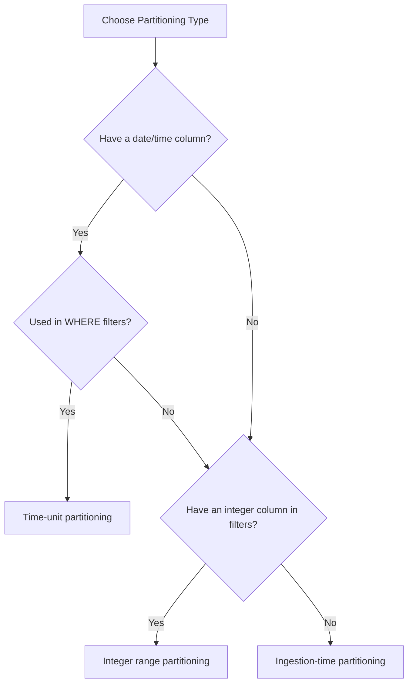

# How to Optimize BigQuery Query Performance by Eliminating Full Table Scans with Partitioning

Author: [nawazdhandala](https://www.github.com/nawazdhandala)

Tags: GCP, BigQuery, Partitioning, Query Optimization, Performance, Cost Optimization

Description: Learn how to use BigQuery table partitioning to eliminate costly full table scans, reduce query costs, and dramatically improve query performance.

---

Every time your BigQuery query scans an entire table when it only needs a slice of the data, you are wasting money and time. Full table scans are the number one performance and cost problem in BigQuery, and partitioning is the most effective way to fix it. In this post, I will show you how to identify full table scans, implement partitioning, and verify the improvements.

## Identifying Full Table Scans

Before fixing anything, let us find which queries are doing full table scans. Use the INFORMATION_SCHEMA to identify expensive queries.

```sql
-- Find queries that scan the most data in the last 7 days
SELECT
  job_id,
  user_email,
  query,
  total_bytes_processed,
  ROUND(total_bytes_processed / (1024 * 1024 * 1024), 2) AS gb_processed,
  total_slot_ms,
  creation_time
FROM
  `region-us`.INFORMATION_SCHEMA.JOBS
WHERE
  creation_time > TIMESTAMP_SUB(CURRENT_TIMESTAMP(), INTERVAL 7 DAY)
  AND job_type = 'QUERY'
  AND state = 'DONE'
  AND total_bytes_processed > 10737418240  -- More than 10 GB
ORDER BY total_bytes_processed DESC
LIMIT 20;
```

Look for queries that scan far more data than they return. A query returning 1000 rows but scanning 500 GB is almost certainly doing a full table scan.

## Understanding Partitioning Types

BigQuery supports several partitioning strategies:

**Time-unit partitioning** - partition by a DATE, TIMESTAMP, or DATETIME column. This is the most common approach.

**Ingestion-time partitioning** - partition by the time data was loaded into BigQuery.

**Integer range partitioning** - partition by an integer column with defined ranges.

Here is when to use each:



## Creating a Partitioned Table

Let us say you have an events table that is currently not partitioned and costs a fortune to query.

```sql
-- Create a new partitioned table from an existing unpartitioned one
CREATE TABLE `my-project.my_dataset.events_partitioned`
PARTITION BY DATE(event_timestamp)
CLUSTER BY user_id, event_type
AS
SELECT * FROM `my-project.my_dataset.events`;
```

The `PARTITION BY DATE(event_timestamp)` clause creates daily partitions based on the event_timestamp column. The `CLUSTER BY` clause further organizes data within each partition for even better performance on filtered queries.

For integer range partitioning:

```sql
-- Partition by customer_id ranges (e.g., groups of 10000)
CREATE TABLE `my-project.my_dataset.orders_partitioned`
PARTITION BY RANGE_BUCKET(customer_id, GENERATE_ARRAY(0, 1000000, 10000))
AS
SELECT * FROM `my-project.my_dataset.orders`;
```

## Configuring Partition Expiration

You can automatically delete old partitions to control storage costs:

```sql
-- Set partition expiration when creating the table
CREATE TABLE `my-project.my_dataset.logs_partitioned`
(
  log_timestamp TIMESTAMP,
  severity STRING,
  message STRING
)
PARTITION BY DATE(log_timestamp)
OPTIONS(
  -- Partitions older than 90 days will be automatically deleted
  partition_expiration_days=90,
  require_partition_filter=true
);
```

The `require_partition_filter=true` option is extremely valuable - it prevents anyone from accidentally running a full table scan by requiring all queries to include a partition filter.

## Writing Queries That Use Partition Pruning

Having a partitioned table is useless if your queries do not take advantage of it. BigQuery needs to be able to identify which partitions to read at query planning time.

Good - the partition filter is a direct comparison:

```sql
-- This query only scans the February 2026 partition
SELECT user_id, event_type, COUNT(*) as cnt
FROM `my-project.my_dataset.events_partitioned`
WHERE DATE(event_timestamp) = '2026-02-17'
GROUP BY user_id, event_type;
```

Good - range filter also enables partition pruning:

```sql
-- Scans only partitions in the date range
SELECT *
FROM `my-project.my_dataset.events_partitioned`
WHERE event_timestamp BETWEEN '2026-02-01' AND '2026-02-17';
```

Bad - wrapping the partition column in a function prevents pruning:

```sql
-- This scans ALL partitions because BigQuery cannot prune
-- when the partition column is inside a function
SELECT *
FROM `my-project.my_dataset.events_partitioned`
WHERE EXTRACT(MONTH FROM event_timestamp) = 2;
```

Fix the bad query by rewriting it:

```sql
-- Rewritten to use direct date comparison - enables pruning
SELECT *
FROM `my-project.my_dataset.events_partitioned`
WHERE event_timestamp >= '2026-02-01'
  AND event_timestamp < '2026-03-01';
```

## Verifying Partition Pruning is Working

After running a query, check how much data was actually scanned vs. the full table size.

```bash
# Run a query with --dry_run to see bytes scanned without running it
bq query --use_legacy_sql=false --dry_run \
    'SELECT * FROM `my-project.my_dataset.events_partitioned`
     WHERE DATE(event_timestamp) = "2026-02-17"'
```

Compare this to a full table scan:

```bash
# Check total table size
bq show --format=prettyjson my-project:my_dataset.events_partitioned | grep numBytes
```

If the dry run shows significantly less bytes than the total table size, partition pruning is working.

You can also check in SQL:

```sql
-- Compare bytes scanned for partitioned vs. unpartitioned queries
-- Check the query execution details
SELECT
  job_id,
  total_bytes_processed,
  total_bytes_billed,
  ROUND(total_bytes_processed / (1024*1024*1024), 2) as gb_scanned
FROM
  `region-us`.INFORMATION_SCHEMA.JOBS
WHERE
  job_id = 'your-job-id';
```

## Migrating Existing Tables to Partitioned Tables

For large existing tables, migrating to a partitioned version requires careful planning.

```sql
-- Step 1: Create the partitioned table schema
CREATE TABLE `my-project.my_dataset.events_v2`
(
  event_id STRING,
  user_id STRING,
  event_type STRING,
  event_timestamp TIMESTAMP,
  properties JSON
)
PARTITION BY DATE(event_timestamp)
CLUSTER BY user_id, event_type;

-- Step 2: Copy data in batches to avoid long-running jobs
-- Copy one month at a time
INSERT INTO `my-project.my_dataset.events_v2`
SELECT * FROM `my-project.my_dataset.events`
WHERE event_timestamp >= '2026-01-01' AND event_timestamp < '2026-02-01';

INSERT INTO `my-project.my_dataset.events_v2`
SELECT * FROM `my-project.my_dataset.events`
WHERE event_timestamp >= '2026-02-01' AND event_timestamp < '2026-03-01';
```

## Adding Clustering on Top of Partitioning

Partitioning gets you 80% of the way there. Adding clustering handles the remaining 20% by sorting data within each partition.

```sql
-- Clustered columns should match your most common WHERE and JOIN columns
CREATE TABLE `my-project.my_dataset.events_optimized`
PARTITION BY DATE(event_timestamp)
CLUSTER BY user_id, event_type, country_code
AS
SELECT * FROM `my-project.my_dataset.events`;
```

Clustering works best when you filter on the clustered columns in the same order they are defined. A query filtering on `user_id` and `event_type` will benefit the most.

## Measuring the Cost Savings

After migrating, track the cost improvement:

```sql
-- Compare average bytes scanned before and after partitioning
SELECT
  DATE(creation_time) as query_date,
  AVG(total_bytes_processed) as avg_bytes_scanned,
  SUM(total_bytes_billed) as total_bytes_billed,
  ROUND(SUM(total_bytes_billed) / (1024*1024*1024*1024) * 6.25, 2) as estimated_cost_usd
FROM
  `region-us`.INFORMATION_SCHEMA.JOBS
WHERE
  creation_time > TIMESTAMP_SUB(CURRENT_TIMESTAMP(), INTERVAL 14 DAY)
  AND job_type = 'QUERY'
  AND referenced_tables IS NOT NULL
GROUP BY query_date
ORDER BY query_date;
```

In my experience, adding proper partitioning typically reduces bytes scanned by 90% or more for time-range filtered queries. That translates directly to 90% lower query costs and much faster execution times. The effort to migrate is well worth it.
