# How to Optimize Cloud Run Cold Start Latency for Java and Spring Boot Applications

Author: [nawazdhandala](https://www.github.com/nawazdhandala)

Tags: GCP, Cloud Run, Java, Spring Boot, Cold Start, Performance Optimization

Description: Practical techniques to reduce Cloud Run cold start latency for Java and Spring Boot applications, from JVM tuning to GraalVM native images.

---

Java on Cloud Run has a reputation problem, and it is not entirely undeserved. Cold starts for a typical Spring Boot application can take 5-15 seconds, compared to sub-second cold starts for Go or Node.js services. When Cloud Run scales up a new instance to handle traffic, that 10-second cold start translates directly into a 10-second wait for your users.

But here is the thing - with the right optimizations, you can get Java cold starts down to 1-2 seconds, and with GraalVM native images, under 500 milliseconds. I have spent a lot of time tuning Java applications on Cloud Run, and this post covers every technique I have found effective.

## Why Java Cold Starts Are Slow

Before jumping into fixes, it helps to understand what happens during a Java cold start. The JVM goes through several phases: loading the JVM itself, loading and verifying classes, initializing the Spring application context (dependency injection, component scanning, auto-configuration), establishing database connection pools, and finally signaling readiness. Most of the time is spent in class loading and Spring context initialization.

## Measuring Your Baseline

Before optimizing, measure your current cold start time. Deploy your service and force a cold start.

```bash
# Deploy your service with min-instances set to 0
gcloud run deploy my-java-service \
    --image=gcr.io/my-project/my-java-service:latest \
    --region=us-central1 \
    --min-instances=0 \
    --memory=1Gi

# Wait for the instance to scale down (about 15 minutes of no traffic)
# Then hit the endpoint and measure the response time
time curl -o /dev/null -s -w "%{time_total}\n" https://my-java-service-xxxxx.run.app/health
```

Also add startup timing to your application.

```java
import org.springframework.boot.SpringApplication;
import org.springframework.boot.autoconfigure.SpringBootApplication;
import org.springframework.boot.context.event.ApplicationReadyEvent;
import org.springframework.context.event.EventListener;

@SpringBootApplication
public class MyApplication {

    private static long startTime;

    public static void main(String[] args) {
        // Record the time before Spring starts initializing
        startTime = System.currentTimeMillis();
        SpringApplication.run(MyApplication.class, args);
    }

    @EventListener(ApplicationReadyEvent.class)
    public void onReady() {
        long elapsed = System.currentTimeMillis() - startTime;
        // Log the actual startup time for monitoring
        System.out.println("Application started in " + elapsed + "ms");
    }
}
```

## Technique 1 - JVM Tuning

The default JVM settings are designed for long-running server workloads, not fast startup. Tuning a few flags makes a significant difference.

```dockerfile
FROM eclipse-temurin:17-jre-alpine
COPY target/app.jar /app.jar

# JVM flags optimized for Cloud Run cold starts
ENV JAVA_OPTS="\
    -XX:+UseSerialGC \
    -XX:MaxRAMPercentage=70.0 \
    -Xss256k \
    -XX:+TieredCompilation \
    -XX:TieredStopAtLevel=1 \
    -Djava.security.egd=file:/dev/./urandom \
    -Dspring.backgroundpreinitializer.ignore=true"

CMD ["sh", "-c", "java $JAVA_OPTS -jar /app.jar"]
```

Here is what each flag does:
- `UseSerialGC` - uses the simplest garbage collector, which has the lowest startup overhead
- `MaxRAMPercentage=70.0` - limits heap to 70% of container memory
- `Xss256k` - reduces thread stack size from default 1MB to 256KB
- `TieredStopAtLevel=1` - skips the C2 compiler tier, which speeds up startup at the cost of peak throughput
- `java.security.egd` - avoids blocking on entropy during startup
- `spring.backgroundpreinitializer.ignore` - avoids extra initialization threads

This alone can shave 30-40% off your startup time.

## Technique 2 - Spring Boot Lazy Initialization

Spring Boot initializes all beans eagerly by default. Switching to lazy initialization means beans are only created when first needed, dramatically reducing startup time.

```properties
# application.properties - enable lazy initialization globally
spring.main.lazy-initialization=true

# If specific beans must be eager, annotate them with @Lazy(false)
```

Or if you want more control, use the programmatic approach.

```java
import org.springframework.boot.SpringApplication;
import org.springframework.boot.autoconfigure.SpringBootApplication;

@SpringBootApplication
public class MyApplication {
    public static void main(String[] args) {
        SpringApplication app = new SpringApplication(MyApplication.class);
        // Enable lazy init to defer bean creation until first access
        app.setLazyInitialization(true);
        app.run(args);
    }
}
```

The trade-off is that the first request to use a particular bean will be slower, since the bean gets initialized at that point. But for Cloud Run, this is usually a good trade - fast startup matters more than first-request latency for individual beans.

## Technique 3 - Use Spring Boot AOT (Ahead of Time) Processing

Spring Boot 3.x includes AOT processing that generates optimized code at build time instead of using reflection at runtime.

```xml
<!-- pom.xml - enable AOT processing in the Spring Boot Maven plugin -->
<plugin>
    <groupId>org.springframework.boot</groupId>
    <artifactId>spring-boot-maven-plugin</artifactId>
    <executions>
        <execution>
            <id>process-aot</id>
            <goals>
                <goal>process-aot</goal>
            </goals>
        </execution>
    </executions>
</plugin>
```

## Technique 4 - GraalVM Native Images

This is the most impactful optimization. GraalVM compiles your Java application ahead of time into a native binary, eliminating JVM startup entirely.

```dockerfile
# Multi-stage build for GraalVM native image
FROM ghcr.io/graalvm/graalvm-community:17 AS builder
WORKDIR /app
COPY . .

# Build the native image (this takes several minutes)
RUN ./mvnw -Pnative native:compile -DskipTests

# Use a minimal base image for the final container
FROM debian:bookworm-slim
WORKDIR /app

# Copy the native binary from the builder stage
COPY --from=builder /app/target/my-service /app/my-service

# Native images start in milliseconds, no JVM flags needed
CMD ["/app/my-service"]
```

With Spring Boot 3.x and GraalVM, you can get startup times under 200ms. The trade-off is a much longer build time (5-15 minutes) and some limitations around reflection and dynamic proxies, though Spring Boot handles most of these automatically.

## Technique 5 - Minimize Dependencies

Every dependency adds classes that need to be loaded. Audit your dependencies and remove anything unnecessary.

```bash
# Use the Maven dependency analyzer to find unused dependencies
mvn dependency:analyze
```

Replace heavy dependencies with lighter alternatives where possible. For example, if you only need JSON serialization, consider using just Jackson core instead of pulling in the full Spring Web MVC stack.

## Technique 6 - Use Cloud Run Min Instances

If cold starts are truly unacceptable for your use case, you can keep warm instances available.

```bash
# Keep 1 instance always warm to avoid cold starts for baseline traffic
gcloud run services update my-java-service \
    --min-instances=1 \
    --region=us-central1
```

This costs money since you are paying for an always-running instance, but it guarantees zero cold starts for at least the first burst of traffic. Combine this with the JVM optimizations above so that additional scale-up instances start faster.

## Technique 7 - Cloud Run Startup CPU Boost

Cloud Run offers a startup CPU boost feature that temporarily allocates more CPU during container startup.

```bash
# Enable startup CPU boost for faster cold starts
gcloud run services update my-java-service \
    --cpu-boost \
    --region=us-central1
```

This is free - you do not pay extra for the boosted CPU during startup. It can reduce cold start time by 30-50% for CPU-bound startup operations like class loading and Spring context initialization.

## Putting It All Together

Here is a comparison of cold start times I have seen with these techniques applied incrementally.

```mermaid
gantt
    title Cold Start Optimization Progress
    dateFormat X
    axisFormat %s sec

    section Baseline
    Default Spring Boot :0, 12000
    section JVM Tuning
    With JVM flags :0, 7000
    section Lazy Init
    Plus lazy init :0, 4500
    section AOT
    Plus Spring AOT :0, 3000
    section CPU Boost
    Plus CPU boost :0, 2000
    section Native Image
    GraalVM native :0, 300
```



## Recommended Dockerfile

Here is the Dockerfile I use for production Spring Boot services on Cloud Run when not using GraalVM.

```dockerfile
# Build stage
FROM eclipse-temurin:17-jdk-alpine AS builder
WORKDIR /app
COPY pom.xml .
COPY src ./src

# Build with dependency caching for faster rebuilds
RUN --mount=type=cache,target=/root/.m2 \
    ./mvnw package -DskipTests

# Runtime stage with minimal image
FROM eclipse-temurin:17-jre-alpine
WORKDIR /app

# Copy the built JAR from the builder stage
COPY --from=builder /app/target/*.jar app.jar

# Optimized JVM settings for Cloud Run
ENV JAVA_OPTS="-XX:+UseSerialGC -XX:MaxRAMPercentage=70.0 -Xss256k \
    -XX:+TieredCompilation -XX:TieredStopAtLevel=1 \
    -Djava.security.egd=file:/dev/./urandom"
ENV SPRING_OPTS="-Dspring.main.lazy-initialization=true"

EXPOSE 8080
CMD ["sh", "-c", "java $JAVA_OPTS $SPRING_OPTS -jar app.jar"]
```

## Summary

Java cold starts on Cloud Run are a real problem, but they are a solvable one. Start with JVM flag tuning and lazy initialization for quick wins, then consider GraalVM native images if you need sub-second startup. The startup CPU boost feature is free and should always be enabled. And if your SLA cannot tolerate any cold starts, use min-instances as a safety net while continuing to optimize.
