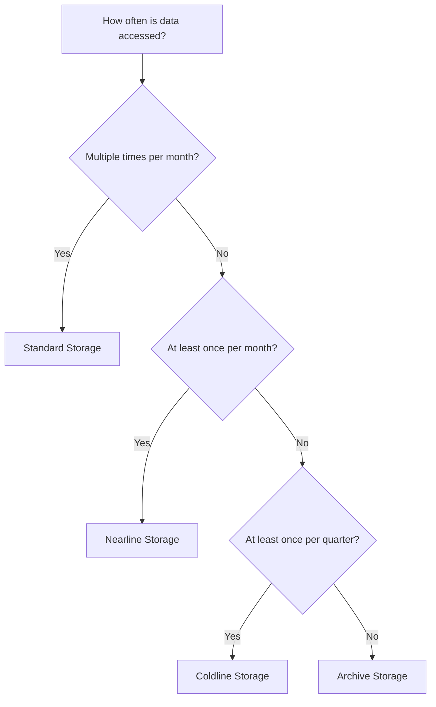

# How to Optimize Cloud Storage Costs by Using the Right Storage Class

Author: [nawazdhandala](https://www.github.com/nawazdhandala)

Tags: GCP, Cloud Storage, Cost Optimization, Storage Classes, Google Cloud

Description: A practical guide to choosing the right Google Cloud Storage class for your data to minimize storage costs without sacrificing accessibility.

---

Google Cloud Storage is deceptively simple. You upload files, you download them, done. But beneath that simplicity is a pricing model that can either save you a lot of money or quietly drain your budget, depending on which storage class you pick. Most teams default to Standard storage for everything, which is like putting all your clothes in a carry-on suitcase when you have a whole closet available.

This guide breaks down the storage classes, when to use each one, and how to automate transitions so your data is always in the cheapest tier that still meets your access requirements.

## The Four Storage Classes

Google Cloud Storage offers four storage classes, each optimized for different access patterns:

### Standard Storage
- **Best for**: Frequently accessed data, hot data
- **Minimum storage duration**: None
- **Storage cost**: ~$0.020 per GB/month (us-central1)
- **Retrieval cost**: Free
- **Use cases**: Active application data, websites, streaming media, data being actively processed

### Nearline Storage
- **Best for**: Data accessed less than once a month
- **Minimum storage duration**: 30 days
- **Storage cost**: ~$0.010 per GB/month
- **Retrieval cost**: $0.01 per GB
- **Use cases**: Monthly backups, infrequently accessed data, disaster recovery data

### Coldline Storage
- **Best for**: Data accessed less than once a quarter
- **Minimum storage duration**: 90 days
- **Storage cost**: ~$0.004 per GB/month
- **Retrieval cost**: $0.02 per GB
- **Use cases**: Quarterly reports, regulatory archives, older backups

### Archive Storage
- **Best for**: Data accessed less than once a year
- **Minimum storage duration**: 365 days
- **Storage cost**: ~$0.0012 per GB/month
- **Retrieval cost**: $0.05 per GB
- **Use cases**: Long-term archives, compliance data, legal holds

## The Cost Difference Is Dramatic

Let us look at what 10 TB of data costs per month in each class:

| Storage Class | Monthly Cost | Annual Cost |
|--------------|-------------|-------------|
| Standard | $200 | $2,400 |
| Nearline | $100 | $1,200 |
| Coldline | $40 | $480 |
| Archive | $12 | $144 |

That is a 16x difference between Standard and Archive. If you have 10 TB of logs or backups sitting in Standard storage that nobody accesses, you are overpaying by nearly $2,256 per year.

## How to Choose the Right Storage Class

The decision comes down to two factors: how often you access the data and how quickly you need it.

Here is a decision flow:



Important caveat: each class has a minimum storage duration. If you store data in Coldline and delete it after 30 days, you still pay for the remaining 60 days. So do not use Coldline for temporary data.

## Setting Storage Class on Buckets and Objects

When creating a bucket, you set the default storage class:

```bash
# Create a bucket with Nearline as the default storage class
gcloud storage buckets create gs://my-nearline-bucket \
  --location=us-central1 \
  --default-storage-class=NEARLINE
```

You can also set the class on individual objects, overriding the bucket default:

```bash
# Upload a file with a specific storage class
gcloud storage cp my-archive.tar.gz gs://my-bucket/archives/ \
  --storage-class=COLDLINE
```

To change the storage class of existing objects:

```bash
# Rewrite an object to change its storage class
gcloud storage objects update gs://my-bucket/old-logs/ \
  --storage-class=ARCHIVE \
  --recursive
```

## Automating with Object Lifecycle Management

Manually moving objects between storage classes does not scale. Object Lifecycle Management lets you define rules that automatically transition or delete objects based on age, storage class, or other conditions.

Create a lifecycle configuration file:

```json
{
  "rule": [
    {
      "action": {
        "type": "SetStorageClass",
        "storageClass": "NEARLINE"
      },
      "condition": {
        "age": 30,
        "matchesStorageClass": ["STANDARD"]
      }
    },
    {
      "action": {
        "type": "SetStorageClass",
        "storageClass": "COLDLINE"
      },
      "condition": {
        "age": 90,
        "matchesStorageClass": ["NEARLINE"]
      }
    },
    {
      "action": {
        "type": "SetStorageClass",
        "storageClass": "ARCHIVE"
      },
      "condition": {
        "age": 365,
        "matchesStorageClass": ["COLDLINE"]
      }
    },
    {
      "action": {
        "type": "Delete"
      },
      "condition": {
        "age": 2555
      }
    }
  ]
}
```

Apply it to your bucket:

```bash
# Apply lifecycle rules to a bucket
gcloud storage buckets update gs://my-bucket \
  --lifecycle-file=lifecycle.json
```

This configuration moves objects through the storage tiers as they age: Standard for the first 30 days, Nearline from 30-90 days, Coldline from 90-365 days, Archive after a year, and deletion after 7 years.

## Analyzing Your Current Storage Usage

Before optimizing, you need to understand what you have. Use the Storage Insights feature or query your billing export:

```sql
-- Analyze Cloud Storage costs by storage class
SELECT
  sku.description,
  SUM(cost) AS total_cost,
  SUM(usage.amount_in_pricing_units) AS total_usage_gb
FROM
  `my-project.billing_export.gcp_billing_export_v1_*`
WHERE
  service.description = 'Cloud Storage'
  AND usage_start_time >= TIMESTAMP_SUB(CURRENT_TIMESTAMP(), INTERVAL 30 DAY)
GROUP BY
  sku.description
ORDER BY
  total_cost DESC
```

You can also check bucket sizes and storage classes:

```bash
# List bucket sizes with storage class breakdown
gcloud storage ls --long --readable-sizes gs://my-bucket/

# Get detailed bucket metadata including storage class
gcloud storage buckets describe gs://my-bucket \
  --format="table(name, default_storage_class, location)"
```

## Multi-Region vs. Regional vs. Dual-Region

Storage class is not the only cost lever. Location type also affects pricing:

- **Regional**: Cheapest. Data in a single region. Good for most workloads.
- **Dual-region**: Data replicated across two specific regions. Better availability.
- **Multi-region**: Data replicated across multiple regions in a continent. Highest availability.

Multi-region storage costs about 20% more than regional. If your data does not need geo-redundancy, stick with regional to save money.

```bash
# Create a regional bucket (cheaper)
gcloud storage buckets create gs://my-regional-bucket \
  --location=us-central1

# Create a dual-region bucket (for specific geo-redundancy)
gcloud storage buckets create gs://my-dual-region-bucket \
  --location=us-central1+us-east1

# Create a multi-region bucket (most expensive, highest availability)
gcloud storage buckets create gs://my-multi-region-bucket \
  --location=us
```

## Autoclass: Let Google Manage It

If you do not want to manage lifecycle rules yourself, GCP offers Autoclass. It automatically moves objects to the most cost-effective storage class based on access patterns:

```bash
# Enable Autoclass on a new bucket
gcloud storage buckets create gs://my-autoclass-bucket \
  --location=us-central1 \
  --enable-autoclass
```

Autoclass starts objects in Standard and moves them to Nearline, Coldline, or Archive as access frequency decreases. When an object is accessed again, it moves back to Standard. There is no retrieval fee when Autoclass transitions an object back to a hotter tier.

The trade-off is that Autoclass charges a small management fee and may not be as cost-effective as well-tuned manual lifecycle rules. But for teams that do not want to manage this, it is a solid option.

## Best Practices

1. **Audit your buckets quarterly** - Data patterns change. A bucket that was hot six months ago might be cold now.

2. **Use lifecycle rules aggressively** - Set them up on every bucket, even if you think the data will always be accessed. Plans change.

3. **Do not store temporary data in cold tiers** - The minimum storage duration charges will cost you more than Standard.

4. **Enable versioning judiciously** - Object versioning multiplies your storage costs. If you enable it, add lifecycle rules to delete old versions.

5. **Compress before storing** - GCP charges by the byte. Compressing logs and archives before uploading saves storage costs across all tiers.

## Wrapping Up

Choosing the right storage class is one of the easiest ways to cut your GCP bill. The vast majority of stored data is cold - it was written once and rarely or never read again. Moving that data from Standard to Nearline, Coldline, or Archive can reduce storage costs by 50-95%. Set up lifecycle rules, consider Autoclass for low-maintenance management, and audit your buckets regularly to keep costs in check.
