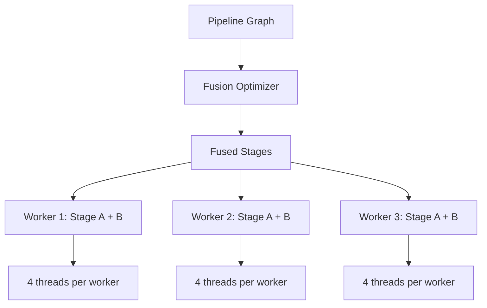

# How to Optimize Dataflow Pipeline Throughput by Tuning Parallelism

Author: [nawazdhandala](https://www.github.com/nawazdhandala)

Tags: GCP, Google Cloud Dataflow, Performance, Optimization, Apache Beam

Description: Optimize Google Cloud Dataflow pipeline throughput by tuning parallelism settings, choosing the right fusion strategy, and configuring worker resources for maximum performance.

---

Your Dataflow pipeline works, but it is slow. Elements are processing at a fraction of the rate you expected. Before throwing more workers at the problem, it is worth understanding how parallelism works in Dataflow and what knobs you can turn to improve throughput.

I have optimized dozens of Dataflow pipelines over the years, and the biggest gains almost never come from adding workers. They come from understanding how Dataflow distributes work and removing the bottlenecks that prevent full utilization of the resources you already have.

## How Dataflow Parallelism Works

Dataflow distributes work by splitting your pipeline into stages and assigning those stages to workers. Within each stage, elements are processed in parallel across worker threads. The degree of parallelism depends on several factors:

- Number of workers and their vCPU count
- Number of pipeline stages after fusion
- Data distribution across keys
- I/O parallelism of sources and sinks



## Understanding Fusion

Dataflow's fusion optimizer combines adjacent pipeline steps into single stages to avoid unnecessary serialization between steps. This is usually beneficial because it reduces overhead. But sometimes fusion prevents parallelism.

Consider this pipeline.

```java
// Pipeline where fusion might hurt performance
PCollection<String> lines = pipeline
    .apply("Read", TextIO.read().from("gs://bucket/large-file.csv"));

PCollection<TableRow> parsed = lines
    .apply("Parse", ParDo.of(new ParseCsvFn()));  // CPU-light

PCollection<TableRow> enriched = parsed
    .apply("Enrich", ParDo.of(new EnrichFn()));  // CPU-heavy: calls external API

PCollection<TableRow> formatted = enriched
    .apply("Format", ParDo.of(new FormatFn()));  // CPU-light
```

Dataflow might fuse Parse, Enrich, and Format into a single stage. If Enrich is slow (because it calls an external API), it bottlenecks the entire fused stage. Parse and Format are fast but cannot run ahead because they are fused with Enrich.

## Breaking Fusion

You can break fusion by inserting a Reshuffle transform. This forces a shuffle boundary that prevents fusion across the barrier.

```java
// Break fusion to allow parallel processing of stages
PCollection<TableRow> parsed = lines
    .apply("Parse", ParDo.of(new ParseCsvFn()));

// Reshuffle breaks the fusion boundary
PCollection<TableRow> reshuffled = parsed
    .apply("BreakFusion", Reshuffle.viaRandomKey());

PCollection<TableRow> enriched = reshuffled
    .apply("Enrich", ParDo.of(new EnrichFn()));
```

After this change, Parse and Enrich run as separate stages. Dataflow can assign different parallelism to each, and the fast Parse stage does not get throttled by the slow Enrich stage.

Use Reshuffle strategically - do not add it everywhere. Each shuffle boundary adds overhead for serialization and data transfer. Only break fusion when you have identified a specific bottleneck.

## Tuning Number of Workers

The number of workers directly affects parallelism. Each worker runs multiple threads, and each thread processes elements independently.

```bash
# Launch with specific worker configuration
gcloud dataflow jobs run optimized-pipeline \
  --gcs-location=gs://my-bucket/templates/my-template \
  --region=us-central1 \
  --num-workers=5 \
  --max-num-workers=20 \
  --worker-machine-type=n1-standard-8
```

A `n1-standard-8` worker has 8 vCPUs. Dataflow typically runs 1 thread per vCPU for CPU-bound work. So 5 workers with 8 vCPUs each gives you about 40 parallel processing threads.

For I/O-bound work (like calling external APIs), you might benefit from more workers with fewer CPUs. For CPU-bound work (like complex transformations or compression), fewer workers with more CPUs is more efficient.

## Optimizing Source Parallelism

If your source does not split into enough parallel reads, you limit your pipeline's parallelism from the start.

For file-based sources, Dataflow automatically splits large files into ranges. But if you have many small files, the overhead of opening each file can be a bottleneck.

```java
// For many small files, use filepattern and let Beam handle splitting
PCollection<String> lines = pipeline
    .apply("ReadFiles", TextIO.read()
        .from("gs://bucket/data/2026/02/17/*.json")
        .withHintMatchesManyFiles());  // Hint that there are many files
```

For Pub/Sub sources, parallelism is handled automatically based on the number of unacknowledged messages. More workers means more parallel reads from the subscription.

## Optimizing GroupByKey Operations

GroupByKey (and operations that use it internally, like Count, Sum, and CoGroupByKey) is often the biggest throughput bottleneck. All elements with the same key must be processed by the same worker.

```java
// Before: potential hot key problem
PCollection<KV<String, Long>> counts = events
    .apply("CountByCountry", Count.perKey());
// If 80% of events are from "US", one worker handles 80% of the work

// After: two-stage aggregation with combiner
PCollection<KV<String, Long>> counts = events
    .apply("CountByCountry", Count.<String>perKey());
// Beam's Count uses a CombineFn, which allows partial aggregation on each worker
```

If you are using GroupByKey directly instead of a CombineFn, consider switching. CombineFn-based operations (Sum, Count, Mean, Top) can do partial aggregation on each worker before shuffling, dramatically reducing the amount of data that needs to move between workers.

## Configuring Sink Parallelism

Your pipeline is only as fast as its slowest stage. If your sink cannot keep up, the entire pipeline backs up.

For BigQuery writes, use the Storage Write API with multiple streams.

```java
// Increase BigQuery write parallelism
.apply("WriteBQ", BigQueryIO.writeTableRows()
    .to("project:dataset.table")
    .withMethod(BigQueryIO.Write.Method.STORAGE_WRITE_API)
    .withNumStorageWriteApiStreams(10)  // More parallel write streams
    .withTriggeringFrequency(Duration.standardSeconds(5)));
```

For file writes, increase the number of output shards.

```java
// Write to multiple output files in parallel
.apply("WriteFiles", TextIO.write()
    .to("gs://bucket/output/results")
    .withNumShards(20)  // Write 20 files in parallel
    .withSuffix(".json"));
```

## Batching External API Calls

If your pipeline calls an external service, batching requests dramatically improves throughput.

```java
// Batch API calls for better throughput
public class BatchEnrichFn extends DoFn<Event, EnrichedEvent> {

    private static final int BATCH_SIZE = 100;
    private transient List<Event> batch;

    @Setup
    public void setup() {
        batch = new ArrayList<>();
    }

    @ProcessElement
    public void processElement(ProcessContext c) {
        batch.add(c.element());

        if (batch.size() >= BATCH_SIZE) {
            // Send batch request to external API
            List<EnrichedEvent> results = callApiInBatch(batch);
            for (EnrichedEvent result : results) {
                c.output(result);
            }
            batch.clear();
        }
    }

    @FinishBundle
    public void finishBundle(FinishBundleContext c) {
        // Process remaining elements in the batch
        if (!batch.isEmpty()) {
            List<EnrichedEvent> results = callApiInBatch(batch);
            for (EnrichedEvent result : results) {
                c.output(result, Instant.now(), GlobalWindow.INSTANCE);
            }
            batch.clear();
        }
    }
}
```

The `@FinishBundle` method ensures that any remaining elements at the end of a bundle are processed.

## Measuring Improvement

Before and after any optimization, measure throughput at each step.

```bash
# Compare throughput metrics between two job runs
gcloud dataflow metrics list JOB_ID_BEFORE \
  --region=us-central1 \
  --filter="name.name=ElementCount" \
  --format="table(name.context.step, scalar.integer_value)"

gcloud dataflow metrics list JOB_ID_AFTER \
  --region=us-central1 \
  --filter="name.name=ElementCount" \
  --format="table(name.context.step, scalar.integer_value)"
```

Compare the elements-per-second rate at each step. Focus your optimization efforts on the step with the lowest throughput relative to its upstream steps.

## Practical Optimization Checklist

When optimizing a Dataflow pipeline, work through these items in order.

1. Identify the bottleneck step using per-step throughput metrics
2. Check for hot keys in GroupByKey operations
3. Look for unnecessary fusion that bundles fast and slow steps
4. Ensure your source has enough parallelism
5. Batch external I/O operations
6. Use CombineFn instead of GroupByKey where possible
7. Right-size worker machine types for your workload pattern
8. Configure sink parallelism to match upstream throughput

Do not guess. Measure, change one thing, measure again. Pipeline optimization is an iterative process, and making multiple changes at once makes it impossible to know what helped.
