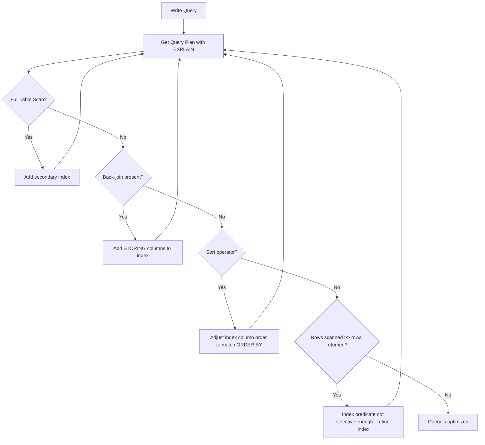

# How to Optimize Query Performance in Cloud Spanner Using Query Plans

Author: [nawazdhandala](https://www.github.com/nawazdhandala)

Tags: GCP, Cloud Spanner, Query Optimization, Performance, Database

Description: Learn how to read and use Cloud Spanner query execution plans to identify bottlenecks and optimize your database queries.

---

Writing a query that returns correct results is one thing. Writing a query that returns results quickly at scale is another challenge entirely. Cloud Spanner provides query execution plans that show you exactly how your queries are being executed, where time is being spent, and what you can do to speed things up. In this post, I will walk through how to read query plans and use them to optimize your Spanner queries.

## Getting a Query Plan

There are several ways to see a query plan in Spanner. The simplest is through the Google Cloud Console. Navigate to your Spanner database, go to the Query tab, type your query, and click "Explain" instead of "Run."

From the command line, you can also see the plan:

```bash
# Get the query execution plan for a query
gcloud spanner databases execute-sql my-database \
    --instance=my-spanner-instance \
    --sql='SELECT * FROM Users WHERE Email = "alice@example.com"' \
    --query-mode=PLAN
```

For programmatic access, you can request the query plan through the client libraries by setting the query mode to PLAN or PROFILE. PLAN gives you the plan without executing the query. PROFILE executes the query and includes runtime statistics.

## Understanding the Plan Structure

A Spanner query plan is a tree of operators. The root operator is at the top, and data flows upward from the leaf operators. Here are the most common operators you will see:

**Distributed Union** - This is Spanner's way of executing a query across multiple splits in parallel. Almost every query in Spanner starts with a distributed union.

**Table Scan** - A full scan of the table. If you see this on a large table, it is usually a sign you need an index.

**Index Scan** - A scan using a secondary index. Much faster than a table scan when the index matches your query.

**Filter** - Applies a WHERE clause predicate to filter rows. If this appears after a table scan, it means Spanner is scanning first and filtering second, which is less efficient.

**Sort** - Sorts the results. An ORDER BY clause that does not match an index or primary key order will produce this operator.

**Hash Join / Apply Join / Cross Apply** - Different join strategies for combining data from multiple tables.

## A Practical Example

Let's work through a concrete example. Suppose you have this table and query:

```sql
-- Table definition
CREATE TABLE Orders (
    OrderId STRING(36) NOT NULL,
    CustomerId STRING(36) NOT NULL,
    Status STRING(20) NOT NULL,
    TotalAmount FLOAT64 NOT NULL,
    CreatedAt TIMESTAMP NOT NULL
) PRIMARY KEY (OrderId);

-- Query to find all pending orders for a customer
SELECT OrderId, TotalAmount, CreatedAt
FROM Orders
WHERE CustomerId = 'customer-123'
AND Status = 'PENDING'
ORDER BY CreatedAt DESC;
```

Without any secondary indexes, the query plan will look something like:

```
Distributed Union
  Serialize Result
    Sort (CreatedAt DESC)
      Filter (CustomerId = 'customer-123' AND Status = 'PENDING')
        Table Scan (Orders - full scan)
```

This is bad. Spanner is scanning the entire Orders table, filtering for matching rows, and then sorting the results. Every row in the table gets read from disk.

## Adding an Index to Improve the Plan

Let's create an index that matches this query pattern:

```sql
-- Index designed to serve the specific query pattern above
CREATE INDEX OrdersByCustomerAndStatus
    ON Orders(CustomerId, Status, CreatedAt DESC)
    STORING (TotalAmount);
```

Now the query plan changes dramatically:

```
Distributed Union
  Serialize Result
    Index Scan (OrdersByCustomerAndStatus)
      Key Range: CustomerId = 'customer-123' AND Status = 'PENDING'
```

The table scan, filter, and sort operators are all gone. The index is sorted in exactly the order we need, so Spanner can read the matching range directly and return results in the correct order without any post-processing.

## Reading Runtime Statistics

When you use PROFILE mode instead of PLAN, you get actual execution statistics. The key metrics to look at are:

- **Rows scanned vs rows returned** - If you scan 100,000 rows but only return 10, your query is doing way too much work. You need a better index.
- **Execution time by operator** - Shows which operator is consuming the most time.
- **CPU time** - The actual processing time, excluding network waits.
- **Latency** - End-to-end time including network communication between splits.

Here is how to get runtime stats using gcloud:

```bash
# Execute with profiling to see runtime statistics
gcloud spanner databases execute-sql my-database \
    --instance=my-spanner-instance \
    --sql='SELECT OrderId, TotalAmount FROM Orders WHERE CustomerId = "customer-123"' \
    --query-mode=PROFILE
```

## Common Anti-Patterns to Watch For

### Full Table Scans on Large Tables

If you see a `Table Scan` operator on a table with more than a few thousand rows, add an appropriate index. This is the single most common performance issue.

### Back-Joins

When Spanner uses a secondary index but needs columns not in the index, it performs a back-join to the base table. The plan will show a join between the index scan and a table scan. Fix this by adding the missing columns to the index with STORING.

### Unnecessary Sorting

If you see a Sort operator and your query has an ORDER BY clause, check whether an index can provide the data in the desired order. An index on `(CustomerId, CreatedAt DESC)` eliminates the need for a sort when querying by customer and ordering by creation date.

### Cross-Apply Joins

A Cross Apply join processes rows one at a time from the left side and looks up matching rows on the right side. This is fine for small result sets but can be slow for large ones. If you see a Cross Apply with many rows on the left side, consider restructuring your query or adding indexes.

## Query Plan Visualization

Here is the general flow of query optimization:



## Parameterized Queries and Plan Caching

Spanner caches query plans for parameterized queries. Using parameters instead of literal values means the plan is compiled once and reused:

```sql
-- Parameterized query - plan is cached and reused
SELECT OrderId, TotalAmount
FROM Orders
WHERE CustomerId = @customerId
AND Status = @status;
```

Avoid string concatenation to build queries with literal values, as each unique query string requires a new plan compilation.

## Wrapping Up

Query plans are your window into how Spanner actually executes your queries. The pattern is simple: explain your query, look for expensive operators like full table scans and sorts, add or adjust indexes to eliminate them, and then explain again to verify the improvement. Making this a regular part of your development workflow will prevent performance issues before they reach production. Treat every slow query as an opportunity to learn more about how Spanner distributes and retrieves your data.
