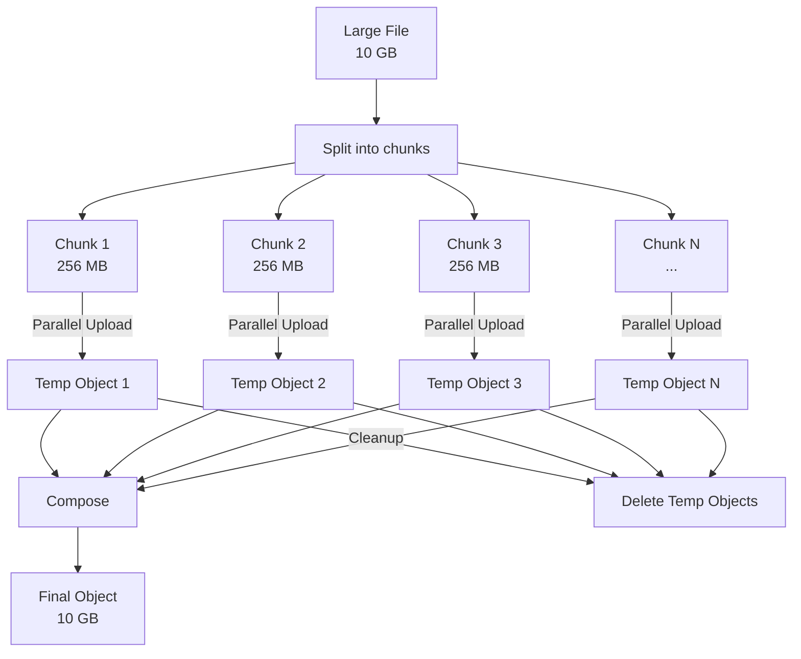

# How to Optimize Upload Performance with Parallel Composite Uploads in Google Cloud Storage

Author: [nawazdhandala](https://www.github.com/nawazdhandala)

Tags: GCP, Google Cloud Storage, Upload Performance, Parallel Uploads, Optimization

Description: Learn how to use parallel composite uploads in Google Cloud Storage to dramatically speed up large file uploads by splitting files and uploading chunks simultaneously.

---

Uploading a 10 GB file to Cloud Storage over a single connection can take a long time, even with a fast network. The bottleneck is usually not bandwidth but rather single-connection throughput limits and TCP congestion control. Parallel composite uploads solve this by splitting a large file into chunks, uploading them simultaneously over multiple connections, and then composing them into a single object on the server side.

This guide covers how parallel composite uploads work, how to configure them, and when they make a real difference.

## How Parallel Composite Uploads Work

The process has three steps:

1. **Split** - the file is divided into chunks (typically 32 MB to 256 MB each)
2. **Upload** - each chunk is uploaded in parallel as a temporary object
3. **Compose** - the temporary objects are combined into the final object using the GCS compose operation



The compose operation is a server-side operation - no data is downloaded and re-uploaded. GCS simply concatenates the objects, making it very fast.

## Enabling Parallel Composite Uploads in gsutil

gsutil supports parallel composite uploads through configuration. Edit your `.boto` file or create one:

```bash
# Find your boto config location
gsutil version -l | grep config
```

Add or update these settings in `~/.boto`:

```ini
[GSUtil]
# Enable parallel composite uploads for files larger than this threshold
parallel_composite_upload_threshold = 150M

# Number of components to split the file into
parallel_composite_upload_component_size = 50M
```

Now large file uploads automatically use parallel composite:

```bash
# This will use parallel composite upload for files over 150 MB
gsutil cp large-file.tar.gz gs://my-bucket/backups/

# Combine with -m for parallel operations on multiple files
gsutil -m cp *.tar.gz gs://my-bucket/backups/
```

## Using gcloud storage with Parallelism

The newer `gcloud storage` command handles parallelism automatically:

```bash
# gcloud storage uses optimized parallel uploads by default
gcloud storage cp large-database-dump.sql.gz gs://my-bucket/backups/

# Explicit parallel thread configuration
gcloud storage cp large-file.zip gs://my-bucket/uploads/ \
  --process-count=8 \
  --thread-count=4
```

## Implementing Parallel Uploads in Python

For programmatic uploads, you can implement parallel composite uploads using the Python client library:

```python
from google.cloud import storage
from concurrent.futures import ThreadPoolExecutor, as_completed
import os
import math

def parallel_composite_upload(
    bucket_name,
    source_file_path,
    destination_blob_name,
    chunk_size_mb=50,
    max_workers=8
):
    """
    Upload a large file using parallel composite upload.

    Splits the file into chunks, uploads them in parallel,
    then composes them into a single object.
    """
    client = storage.Client()
    bucket = client.bucket(bucket_name)

    file_size = os.path.getsize(source_file_path)
    chunk_size = chunk_size_mb * 1024 * 1024
    num_chunks = math.ceil(file_size / chunk_size)

    print(f"File size: {file_size / 1024 / 1024:.1f} MB")
    print(f"Splitting into {num_chunks} chunks of {chunk_size_mb} MB")

    # Step 1: Upload chunks in parallel
    temp_blob_names = []

    def upload_chunk(chunk_index):
        """Upload a single chunk of the file."""
        offset = chunk_index * chunk_size
        length = min(chunk_size, file_size - offset)

        # Name for the temporary object
        temp_name = f"{destination_blob_name}_temp_chunk_{chunk_index:04d}"
        temp_blob_names.append((chunk_index, temp_name))

        blob = bucket.blob(temp_name)

        # Read and upload just this chunk
        with open(source_file_path, 'rb') as f:
            f.seek(offset)
            data = f.read(length)

        blob.upload_from_string(data, content_type='application/octet-stream')

        return chunk_index, temp_name

    uploaded_chunks = []

    with ThreadPoolExecutor(max_workers=max_workers) as executor:
        futures = {
            executor.submit(upload_chunk, i): i
            for i in range(num_chunks)
        }

        for future in as_completed(futures):
            chunk_idx, temp_name = future.result()
            uploaded_chunks.append((chunk_idx, temp_name))
            print(f"Uploaded chunk {chunk_idx + 1}/{num_chunks}")

    # Sort chunks by index to ensure correct order
    uploaded_chunks.sort(key=lambda x: x[0])

    # Step 2: Compose the chunks into the final object
    # GCS compose supports up to 32 objects per call
    temp_blobs = [bucket.blob(name) for _, name in uploaded_chunks]

    # Handle more than 32 chunks by composing in stages
    final_blob = bucket.blob(destination_blob_name)

    if len(temp_blobs) <= 32:
        # Single compose operation
        final_blob.compose(temp_blobs)
    else:
        # Multi-stage compose for more than 32 chunks
        stage_blobs = compose_in_stages(bucket, temp_blobs, destination_blob_name)
        final_blob = stage_blobs

    print(f"Composed {len(temp_blobs)} chunks into {destination_blob_name}")

    # Step 3: Clean up temporary objects
    for _, temp_name in uploaded_chunks:
        bucket.blob(temp_name).delete()

    print(f"Cleaned up {len(uploaded_chunks)} temporary objects")
    print(f"Upload complete: gs://{bucket_name}/{destination_blob_name}")

def compose_in_stages(bucket, blobs, final_name):
    """Compose more than 32 blobs by doing it in stages."""
    stage = 0
    current_blobs = blobs

    while len(current_blobs) > 32:
        next_stage_blobs = []
        # Compose in groups of 32
        for i in range(0, len(current_blobs), 32):
            group = current_blobs[i:i + 32]
            stage_name = f"{final_name}_compose_stage_{stage}_{i}"
            stage_blob = bucket.blob(stage_name)
            stage_blob.compose(group)
            next_stage_blobs.append(stage_blob)

        # Clean up previous stage temporary blobs
        for blob in current_blobs:
            if '_compose_stage_' in blob.name or '_temp_chunk_' in blob.name:
                blob.delete()

        current_blobs = next_stage_blobs
        stage += 1

    # Final compose
    final_blob = bucket.blob(final_name)
    final_blob.compose(current_blobs)

    # Clean up last stage temporary blobs
    for blob in current_blobs:
        if '_compose_stage_' in blob.name:
            blob.delete()

    return final_blob

# Upload a large file
parallel_composite_upload(
    bucket_name="my-bucket",
    source_file_path="/data/large-dataset.tar.gz",
    destination_blob_name="datasets/large-dataset.tar.gz",
    chunk_size_mb=100,
    max_workers=10
)
```

## Node.js Implementation

```javascript
const { Storage } = require('@google-cloud/storage');
const fs = require('fs');
const path = require('path');
const pLimit = require('p-limit');

const storage = new Storage();

async function parallelCompositeUpload(
  bucketName,
  filePath,
  destName,
  chunkSizeMB = 50,
  concurrency = 8
) {
  const bucket = storage.bucket(bucketName);
  const fileSize = fs.statSync(filePath).size;
  const chunkSize = chunkSizeMB * 1024 * 1024;
  const numChunks = Math.ceil(fileSize / chunkSize);

  console.log(`File: ${filePath} (${(fileSize / 1024 / 1024).toFixed(1)} MB)`);
  console.log(`Chunks: ${numChunks} x ${chunkSizeMB} MB`);

  // Step 1: Upload chunks in parallel with concurrency limit
  const limit = pLimit(concurrency);
  const tempNames = [];

  const uploadPromises = Array.from({ length: numChunks }, (_, i) => {
    return limit(async () => {
      const start = i * chunkSize;
      const end = Math.min(start + chunkSize, fileSize);
      const tempName = `${destName}_temp_${String(i).padStart(4, '0')}`;

      // Create a read stream for just this chunk
      const readStream = fs.createReadStream(filePath, { start, end: end - 1 });

      // Upload the chunk
      await new Promise((resolve, reject) => {
        const writeStream = bucket.file(tempName).createWriteStream({
          resumable: false,
        });

        readStream
          .pipe(writeStream)
          .on('error', reject)
          .on('finish', resolve);
      });

      tempNames[i] = tempName;
      console.log(`Uploaded chunk ${i + 1}/${numChunks}`);
    });
  });

  await Promise.all(uploadPromises);

  // Step 2: Compose chunks into the final object
  const tempFiles = tempNames.map(name => bucket.file(name));
  const destFile = bucket.file(destName);

  // Compose in groups of 32 (API limit)
  if (tempFiles.length <= 32) {
    await destFile.compose(tempFiles);
  } else {
    // Multi-stage compose needed
    await multiStageCompose(bucket, tempFiles, destName);
  }

  console.log(`Composed into ${destName}`);

  // Step 3: Clean up temp objects
  await Promise.all(
    tempNames.map(name => bucket.file(name).delete().catch(() => {}))
  );

  console.log('Cleanup complete');
  console.log(`Upload finished: gs://${bucketName}/${destName}`);
}

async function multiStageCompose(bucket, files, finalName) {
  let current = files;
  let stage = 0;

  while (current.length > 32) {
    const nextStage = [];

    for (let i = 0; i < current.length; i += 32) {
      const group = current.slice(i, i + 32);
      const stageName = `${finalName}_stage_${stage}_${i}`;
      const stageFile = bucket.file(stageName);

      await stageFile.compose(group);
      nextStage.push(stageFile);
    }

    // Delete previous stage files
    await Promise.all(
      current
        .filter(f => f.name.includes('_stage_') || f.name.includes('_temp_'))
        .map(f => f.delete().catch(() => {}))
    );

    current = nextStage;
    stage++;
  }

  const finalFile = bucket.file(finalName);
  await finalFile.compose(current);

  // Clean up last stage
  await Promise.all(
    current
      .filter(f => f.name.includes('_stage_'))
      .map(f => f.delete().catch(() => {}))
  );
}

// Usage
parallelCompositeUpload(
  'my-bucket',
  '/data/large-backup.tar.gz',
  'backups/large-backup.tar.gz',
  100, // 100 MB chunks
  10   // 10 concurrent uploads
);
```

## Performance Benchmarks

The speedup depends on your network conditions, but here are typical results:

| File Size | Single Upload | Parallel (8 workers) | Speedup |
|---|---|---|---|
| 1 GB | ~45 sec | ~12 sec | 3.7x |
| 5 GB | ~3.5 min | ~55 sec | 3.8x |
| 10 GB | ~7 min | ~1.8 min | 3.9x |
| 50 GB | ~35 min | ~9 min | 3.9x |

Results vary based on network bandwidth, latency, and the GCS region.

## Important Caveats

**Composed objects have a CRC32C checksum but no MD5 hash.** The compose operation generates a CRC32C for the final object, but it cannot generate an MD5 hash. If your workflow depends on MD5 verification, you need to handle this differently.

**Maximum 32 source objects per compose.** If you have more than 32 chunks, you need multi-stage composition (as shown in the code above).

**Maximum 10,240 components total.** An object can be the result of composing at most 10,240 components throughout its lifetime.

**Temporary objects incur charges.** During the upload, you are storing both the chunks and eventually the final object. Clean up temp objects promptly.

**Not beneficial for small files.** The overhead of splitting, parallel uploading, and composing only pays off for files over roughly 100 MB. For smaller files, a standard upload is faster.

**Content-Type must be set explicitly.** The compose operation does not automatically detect content types. Set it on the final object after composition.

Parallel composite uploads are one of the most effective ways to speed up large file uploads to Cloud Storage. The implementation is a bit more involved than a simple upload, but the 3-4x speedup is well worth it for regular large file operations.
