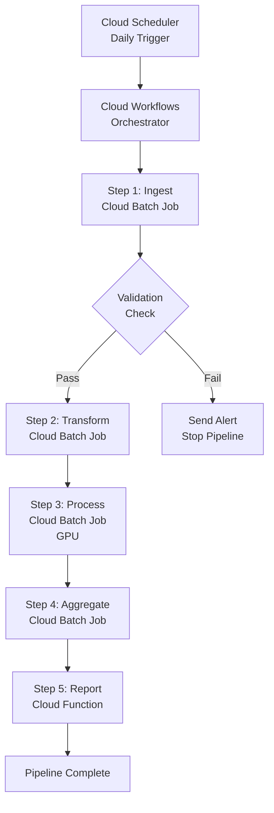

# How to Orchestrate Multi-Step Batch Workflows with Google Cloud Batch and Cloud Workflows

Author: [nawazdhandala](https://www.github.com/nawazdhandala)

Tags: GCP, Cloud Batch, Cloud Workflows, Orchestration, Batch Processing, Serverless, Google Cloud

Description: Orchestrate multi-step batch workflows using Google Cloud Batch and Cloud Workflows to chain dependent batch jobs with conditional logic and error handling.

---

Real batch processing pipelines are rarely just a single job. You typically have a sequence of dependent steps: ingest raw data, validate it, transform it, run the main processing, aggregate results, and generate reports. Each step might need different compute resources and different parallelism levels. Google Cloud Batch handles individual job execution well, but it does not natively orchestrate multi-job workflows. That is where Cloud Workflows comes in - it provides the control flow to chain batch jobs together, handle errors, implement conditional branching, and manage the overall pipeline.

In this post, I will build a complete multi-step batch pipeline using Cloud Workflows to orchestrate Google Cloud Batch jobs.

## Architecture



## Prerequisites

- Cloud Batch API and Cloud Workflows API enabled
- Cloud Scheduler for triggering workflows
- A service account with permissions for Batch, Workflows, and any other services used

## Step 1: Create a Helper Function for Batch Job Submission

Before building the workflow, create a reusable Cloud Function that simplifies submitting and monitoring batch jobs from Workflows.

This Cloud Function creates a batch job and returns the job name for status polling:

```python
import functions_framework
from google.cloud import batch_v1
import json

@functions_framework.http
def submit_batch_job(request):
    """Submits a batch job and returns the job name for monitoring."""
    req = request.get_json()

    project_id = req["project_id"]
    region = req["region"]
    job_id = req["job_id"]
    job_config = req["job_config"]

    client = batch_v1.BatchServiceClient()

    # Build the job from the provided configuration
    job = batch_v1.Job()

    # Configure task group
    runnable = batch_v1.Runnable()
    if "container" in job_config:
        runnable.container = batch_v1.Runnable.Container()
        runnable.container.image_uri = job_config["container"]["image"]
        runnable.container.commands = job_config["container"].get("commands", [])
    elif "script" in job_config:
        runnable.script = batch_v1.Runnable.Script()
        runnable.script.text = job_config["script"]

    # Set environment variables if provided
    if "env_vars" in job_config:
        runnable.environment = batch_v1.Environment(
            variables=job_config["env_vars"]
        )

    task = batch_v1.TaskSpec()
    task.runnables = [runnable]
    task.compute_resource = batch_v1.ComputeResource(
        cpu_milli=job_config.get("cpu_milli", 2000),
        memory_mib=job_config.get("memory_mib", 4096),
    )
    task.max_retry_count = job_config.get("max_retries", 3)
    task.max_run_duration = f"{job_config.get('timeout_seconds', 3600)}s"

    group = batch_v1.TaskGroup()
    group.task_spec = task
    group.task_count = job_config.get("task_count", 1)
    group.parallelism = job_config.get("parallelism", 1)

    job.task_groups = [group]

    # Allocation policy
    instance_policy = batch_v1.AllocationPolicy.InstancePolicy()
    instance_policy.machine_type = job_config.get("machine_type", "e2-standard-4")

    if "gpu_type" in job_config:
        accelerator = batch_v1.AllocationPolicy.Accelerator()
        accelerator.type_ = job_config["gpu_type"]
        accelerator.count = job_config.get("gpu_count", 1)
        instance_policy.accelerators = [accelerator]

    instance = batch_v1.AllocationPolicy.InstancePolicyOrTemplate()
    instance.policy = instance_policy
    if "gpu_type" in job_config:
        instance.install_gpu_drivers = True

    allocation = batch_v1.AllocationPolicy()
    allocation.instances = [instance]
    job.allocation_policy = allocation
    job.logs_policy = batch_v1.LogsPolicy(
        destination=batch_v1.LogsPolicy.Destination.CLOUD_LOGGING
    )

    # Submit the job
    request = batch_v1.CreateJobRequest(
        parent=f"projects/{project_id}/locations/{region}",
        job=job,
        job_id=job_id,
    )

    response = client.create_job(request=request)

    return json.dumps({
        "job_name": response.name,
        "status": str(response.status.state),
    })
```

## Step 2: Create the Workflow Definition

The Cloud Workflow orchestrates the entire pipeline, calling batch jobs in sequence and handling errors.

Save this as `batch-pipeline.yaml`:

```yaml
main:
  params: [args]
  steps:
    - init:
        assign:
          - project_id: ${sys.get_env("GOOGLE_CLOUD_PROJECT_ID")}
          - region: "us-central1"
          - processing_date: ${default(map.get(args, "date"), time.format(sys.now(), "2006-01-02"))}
          - pipeline_id: ${"pipeline-" + text.replace_all(processing_date, "-", "") + "-" + string(int(sys.now()))}

    - log_start:
        call: sys.log
        args:
          text: ${"Starting batch pipeline " + pipeline_id + " for date " + processing_date}
          severity: INFO

    # Step 1: Data Ingestion
    - submit_ingest_job:
        call: http.post
        args:
          url: ${"https://batch.googleapis.com/v1/projects/" + project_id + "/locations/" + region + "/jobs?job_id=" + pipeline_id + "-ingest"}
          auth:
            type: OAuth2
          body:
            taskGroups:
              - taskSpec:
                  runnables:
                    - container:
                        imageUri: ${"gcr.io/" + project_id + "/data-ingest:latest"}
                        commands: ["python", "ingest.py", "--date", "${processing_date}"]
                  computeResource:
                    cpuMilli: 4000
                    memoryMib: 8192
                  maxRetryCount: 3
                  maxRunDuration: "3600s"
                taskCount: 10
                parallelism: 10
            allocationPolicy:
              instances:
                - policy:
                    machineType: "e2-standard-4"
            logsPolicy:
              destination: "CLOUD_LOGGING"
        result: ingest_response

    # Wait for ingestion to complete
    - wait_for_ingest:
        call: poll_batch_job
        args:
          job_name: ${ingest_response.body.name}
        result: ingest_status

    - check_ingest_status:
        switch:
          - condition: ${ingest_status == "FAILED"}
            steps:
              - send_failure_alert:
                  call: http.post
                  args:
                    url: "https://hooks.slack.com/services/YOUR/SLACK/WEBHOOK"
                    body:
                      text: ${"Pipeline " + pipeline_id + " failed at ingestion step"}
              - fail_pipeline:
                  raise: ${"Ingestion job failed for " + processing_date}

    # Step 2: Data Validation
    - submit_validation_job:
        call: http.post
        args:
          url: ${"https://batch.googleapis.com/v1/projects/" + project_id + "/locations/" + region + "/jobs?job_id=" + pipeline_id + "-validate"}
          auth:
            type: OAuth2
          body:
            taskGroups:
              - taskSpec:
                  runnables:
                    - container:
                        imageUri: ${"gcr.io/" + project_id + "/data-validator:latest"}
                        commands: ["python", "validate.py", "--date", "${processing_date}"]
                  computeResource:
                    cpuMilli: 2000
                    memoryMib: 4096
                  maxRetryCount: 2
                  maxRunDuration: "1800s"
                taskCount: 1
                parallelism: 1
            allocationPolicy:
              instances:
                - policy:
                    machineType: "e2-standard-2"
            logsPolicy:
              destination: "CLOUD_LOGGING"
        result: validation_response

    - wait_for_validation:
        call: poll_batch_job
        args:
          job_name: ${validation_response.body.name}
        result: validation_status

    # Step 3: Main Processing (with GPU if needed)
    - submit_processing_job:
        call: http.post
        args:
          url: ${"https://batch.googleapis.com/v1/projects/" + project_id + "/locations/" + region + "/jobs?job_id=" + pipeline_id + "-process"}
          auth:
            type: OAuth2
          body:
            taskGroups:
              - taskSpec:
                  runnables:
                    - container:
                        imageUri: ${"gcr.io/" + project_id + "/data-processor:latest"}
                        commands: ["python", "process.py", "--date", "${processing_date}"]
                  computeResource:
                    cpuMilli: 8000
                    memoryMib: 32768
                  maxRetryCount: 3
                  maxRunDuration: "14400s"
                taskCount: 50
                parallelism: 10
            allocationPolicy:
              instances:
                - policy:
                    machineType: "e2-standard-8"
            logsPolicy:
              destination: "CLOUD_LOGGING"
        result: process_response

    - wait_for_processing:
        call: poll_batch_job
        args:
          job_name: ${process_response.body.name}
        result: process_status

    # Step 4: Aggregation
    - submit_aggregation_job:
        call: http.post
        args:
          url: ${"https://batch.googleapis.com/v1/projects/" + project_id + "/locations/" + region + "/jobs?job_id=" + pipeline_id + "-aggregate"}
          auth:
            type: OAuth2
          body:
            taskGroups:
              - taskSpec:
                  runnables:
                    - container:
                        imageUri: ${"gcr.io/" + project_id + "/data-aggregator:latest"}
                        commands: ["python", "aggregate.py", "--date", "${processing_date}"]
                  computeResource:
                    cpuMilli: 4000
                    memoryMib: 16384
                  maxRetryCount: 2
                  maxRunDuration: "3600s"
                taskCount: 1
                parallelism: 1
            allocationPolicy:
              instances:
                - policy:
                    machineType: "e2-highmem-4"
            logsPolicy:
              destination: "CLOUD_LOGGING"
        result: aggregate_response

    - wait_for_aggregation:
        call: poll_batch_job
        args:
          job_name: ${aggregate_response.body.name}
        result: aggregate_status

    - log_complete:
        call: sys.log
        args:
          text: ${"Pipeline " + pipeline_id + " completed successfully"}
          severity: INFO

    - return_result:
        return:
          pipeline_id: ${pipeline_id}
          status: "COMPLETED"
          processing_date: ${processing_date}

# Reusable subworkflow for polling batch job status
poll_batch_job:
  params: [job_name]
  steps:
    - poll_loop:
        call: http.get
        args:
          url: ${"https://batch.googleapis.com/v1/" + job_name}
          auth:
            type: OAuth2
        result: job_response
    - check_status:
        switch:
          - condition: ${job_response.body.status.state == "SUCCEEDED"}
            return: "SUCCEEDED"
          - condition: ${job_response.body.status.state == "FAILED"}
            return: "FAILED"
          - condition: true
            steps:
              - wait:
                  call: sys.sleep
                  args:
                    seconds: 30
              - continue_polling:
                  next: poll_loop
```

## Step 3: Deploy the Workflow

Deploy the workflow and set up the scheduler trigger.

```bash
# Deploy the workflow
gcloud workflows deploy batch-pipeline \
  --location=us-central1 \
  --source=batch-pipeline.yaml \
  --service-account=batch-pipeline@MY_PROJECT.iam.gserviceaccount.com

# Create a Cloud Scheduler job to trigger the pipeline daily at 2 AM
gcloud scheduler jobs create http daily-batch-pipeline \
  --location=us-central1 \
  --schedule="0 2 * * *" \
  --uri="https://workflowexecutions.googleapis.com/v1/projects/MY_PROJECT/locations/us-central1/workflows/batch-pipeline/executions" \
  --http-method=POST \
  --message-body='{"argument": "{\"date\": \"today\"}"}' \
  --oauth-service-account-email=scheduler@MY_PROJECT.iam.gserviceaccount.com

# Manually trigger the pipeline for testing
gcloud workflows run batch-pipeline \
  --location=us-central1 \
  --data='{"date": "2026-02-17"}'
```

## Step 4: Monitor Pipeline Execution

Check on the workflow execution and individual batch jobs:

```bash
# List workflow executions
gcloud workflows executions list batch-pipeline \
  --location=us-central1 \
  --limit=10

# Get details of a specific execution
gcloud workflows executions describe EXECUTION_ID \
  --workflow=batch-pipeline \
  --location=us-central1

# List all batch jobs from a specific pipeline run
gcloud batch jobs list \
  --location=us-central1 \
  --filter="name:pipeline-20260217*"
```

## Step 5: Add Error Recovery and Cleanup

Enhance the workflow with try/catch blocks for error handling and cleanup of failed batch jobs:

```yaml
# Error handling wrapper
- try_processing:
    try:
      steps:
        - run_main_pipeline:
            call: main_pipeline_steps
            args:
              pipeline_id: ${pipeline_id}
              processing_date: ${processing_date}
    except:
      as: e
      steps:
        - log_error:
            call: sys.log
            args:
              text: ${"Pipeline failed: " + e.message}
              severity: ERROR
        - cleanup_failed_jobs:
            call: http.delete
            args:
              url: ${"https://batch.googleapis.com/v1/" + e.failed_job_name}
              auth:
                type: OAuth2
        - notify_on_failure:
            call: http.post
            args:
              url: "https://hooks.slack.com/services/YOUR/SLACK/WEBHOOK"
              body:
                text: ${"Batch pipeline failed: " + e.message}
        - raise_error:
            raise: ${e}
```

## Summary

Orchestrating multi-step batch workflows with Cloud Workflows and Google Cloud Batch gives you a serverless pipeline that handles the control flow between dependent batch jobs. Cloud Workflows provides the sequencing, conditional logic, and error handling, while Cloud Batch handles the heavy compute for each step. The polling subworkflow pattern is the key integration point - submit a batch job, poll for completion, then decide whether to proceed or fail. Add Cloud Scheduler for automated daily runs, and you have a production batch pipeline that manages itself.
