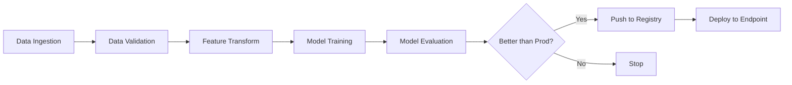

# How to Orchestrate Multi-Step ML Workflows with Vertex AI Pipelines and TFX

Author: [nawazdhandala](https://www.github.com/nawazdhandala)

Tags: GCP, Vertex AI, Pipelines, TFX, MLOps

Description: Step-by-step guide to building and orchestrating multi-step machine learning workflows using Vertex AI Pipelines with TensorFlow Extended components.

---

Training a machine learning model is just one step in a much larger process. You need to validate your data, transform features, train the model, evaluate it against the current production model, and then decide whether to deploy it. Doing all of this manually is slow and error-prone. That is where pipeline orchestration comes in.

Vertex AI Pipelines lets you define these multi-step workflows as code and run them in a managed environment. When combined with TFX (TensorFlow Extended), you get pre-built components for common ML tasks that plug together seamlessly.

## Understanding the Pipeline Architecture

A typical ML pipeline has several stages that must execute in order, with data flowing from one stage to the next.



TFX provides standard components for each of these stages. Vertex AI Pipelines handles the orchestration, scheduling, and infrastructure.

## Setting Up Your Environment

Before building a pipeline, install the required packages and configure your GCP project.

This sets up the required dependencies:

```bash
# Install TFX and the Vertex AI pipeline runner
pip install tfx[kfp] google-cloud-aiplatform kfp

# Set your GCP project
export PROJECT_ID="your-project-id"
export REGION="us-central1"
export PIPELINE_ROOT="gs://your-bucket/pipeline-root"
```

## Building a TFX Pipeline

A TFX pipeline is defined as a Python function that creates component instances and connects them through their inputs and outputs.

This code defines a complete TFX pipeline for a tabular classification task:

```python
import tfx
from tfx.components import (
    CsvExampleGen,
    StatisticsGen,
    SchemaGen,
    ExampleValidator,
    Transform,
    Trainer,
    Evaluator,
    Pusher
)
from tfx.proto import trainer_pb2, pusher_pb2, example_gen_pb2
from tfx.dsl.components.common import resolver
from tfx.dsl.experimental import latest_blessed_model_resolver
from tfx.types import Channel
from tfx.types.standard_artifacts import Model, ModelBlessing

def create_pipeline(
    pipeline_name: str,
    pipeline_root: str,
    data_root: str,
    module_file: str,
    serving_model_dir: str
) -> tfx.dsl.Pipeline:
    """Creates a TFX pipeline with all standard components."""

    # Step 1: Ingest CSV data and split into train/eval
    example_gen = CsvExampleGen(
        input_base=data_root,
        output_config=example_gen_pb2.Output(
            split_config=example_gen_pb2.SplitConfig(splits=[
                example_gen_pb2.SplitConfig.Split(name="train", hash_buckets=8),
                example_gen_pb2.SplitConfig.Split(name="eval", hash_buckets=2)
            ])
        )
    )

    # Step 2: Generate statistics on the training data
    statistics_gen = StatisticsGen(examples=example_gen.outputs["examples"])

    # Step 3: Infer the data schema from statistics
    schema_gen = SchemaGen(statistics=statistics_gen.outputs["statistics"])

    # Step 4: Validate data against the schema
    example_validator = ExampleValidator(
        statistics=statistics_gen.outputs["statistics"],
        schema=schema_gen.outputs["schema"]
    )

    # Step 5: Transform features using the module file
    transform = Transform(
        examples=example_gen.outputs["examples"],
        schema=schema_gen.outputs["schema"],
        module_file=module_file
    )

    # Step 6: Train the model
    trainer = Trainer(
        module_file=module_file,
        examples=transform.outputs["transformed_examples"],
        transform_graph=transform.outputs["transform_graph"],
        schema=schema_gen.outputs["schema"],
        train_args=trainer_pb2.TrainArgs(num_steps=10000),
        eval_args=trainer_pb2.EvalArgs(num_steps=1000)
    )

    # Step 7: Resolve the latest blessed model for comparison
    model_resolver = resolver.Resolver(
        strategy_class=latest_blessed_model_resolver.LatestBlessedModelResolver,
        model=Channel(type=Model),
        model_blessing=Channel(type=ModelBlessing)
    ).with_id("latest_blessed_model_resolver")

    # Step 8: Evaluate the model against the baseline
    evaluator = Evaluator(
        examples=example_gen.outputs["examples"],
        model=trainer.outputs["model"],
        baseline_model=model_resolver.outputs["model"],
    )

    # Step 9: Push the model if it passed evaluation
    pusher = Pusher(
        model=trainer.outputs["model"],
        model_blessing=evaluator.outputs["blessing"],
        push_destination=pusher_pb2.PushDestination(
            filesystem=pusher_pb2.PushDestination.Filesystem(
                base_directory=serving_model_dir
            )
        )
    )

    # Assemble the pipeline
    return tfx.dsl.Pipeline(
        pipeline_name=pipeline_name,
        pipeline_root=pipeline_root,
        components=[
            example_gen,
            statistics_gen,
            schema_gen,
            example_validator,
            transform,
            trainer,
            model_resolver,
            evaluator,
            pusher
        ]
    )
```

## Writing the Transform Module

The module file contains the preprocessing logic and the model definition. TFX uses this to create the transform graph and the training loop.

Here is a simplified module file:

```python
# module.py - Contains preprocessing and training logic

import tensorflow as tf
import tensorflow_transform as tft
from tfx.components.trainer.fn_args_utils import FnArgs

# Feature keys
NUMERICAL_FEATURES = ["age", "income", "credit_score"]
CATEGORICAL_FEATURES = ["occupation", "region"]
LABEL_KEY = "is_churned"

def preprocessing_fn(inputs):
    """Preprocessing function for TFX Transform component."""
    outputs = {}

    # Normalize numerical features to zero mean, unit variance
    for feature in NUMERICAL_FEATURES:
        outputs[feature] = tft.scale_to_z_score(inputs[feature])

    # Encode categorical features as integers
    for feature in CATEGORICAL_FEATURES:
        outputs[feature] = tft.compute_and_apply_vocabulary(
            inputs[feature],
            top_k=100,  # Keep top 100 categories
            num_oov_buckets=1  # One bucket for out-of-vocabulary values
        )

    # Pass through the label
    outputs[LABEL_KEY] = inputs[LABEL_KEY]

    return outputs

def run_fn(fn_args: FnArgs):
    """Training function called by the Trainer component."""

    # Load transformed data
    train_dataset = _input_fn(fn_args.train_files, fn_args.data_accessor, 64)
    eval_dataset = _input_fn(fn_args.eval_files, fn_args.data_accessor, 64)

    # Build the model
    model = _build_model()

    # Train
    model.fit(
        train_dataset,
        validation_data=eval_dataset,
        steps_per_epoch=fn_args.train_steps,
        validation_steps=fn_args.eval_steps
    )

    # Save the model with the transform graph signature
    model.save(fn_args.serving_model_dir)

def _build_model():
    """Build a simple Keras model for binary classification."""
    inputs = []
    encoded_features = []

    for feature in NUMERICAL_FEATURES:
        inp = tf.keras.layers.Input(shape=(1,), name=feature)
        inputs.append(inp)
        encoded_features.append(inp)

    for feature in CATEGORICAL_FEATURES:
        inp = tf.keras.layers.Input(shape=(1,), name=feature, dtype=tf.int64)
        inputs.append(inp)
        embedding = tf.keras.layers.Embedding(101, 16)(inp)
        embedding = tf.keras.layers.Flatten()(embedding)
        encoded_features.append(embedding)

    # Concatenate all features and add dense layers
    x = tf.keras.layers.Concatenate()(encoded_features)
    x = tf.keras.layers.Dense(128, activation="relu")(x)
    x = tf.keras.layers.Dropout(0.3)(x)
    x = tf.keras.layers.Dense(64, activation="relu")(x)
    output = tf.keras.layers.Dense(1, activation="sigmoid")(x)

    model = tf.keras.Model(inputs=inputs, outputs=output)
    model.compile(optimizer="adam", loss="binary_crossentropy", metrics=["accuracy"])

    return model
```

## Running on Vertex AI Pipelines

With the pipeline defined, you compile and submit it to Vertex AI Pipelines for execution.

This code compiles and runs the pipeline:

```python
from tfx.orchestration.kubeflow.v2 import kubeflow_v2_dag_runner

# Define the pipeline
pipeline = create_pipeline(
    pipeline_name="churn-prediction-pipeline",
    pipeline_root="gs://your-bucket/pipeline-root",
    data_root="gs://your-bucket/data/churn/",
    module_file="gs://your-bucket/pipeline-code/module.py",
    serving_model_dir="gs://your-bucket/serving-models/churn/"
)

# Compile the pipeline to a JSON spec
runner = kubeflow_v2_dag_runner.KubeflowV2DagRunner(
    config=kubeflow_v2_dag_runner.KubeflowV2DagRunnerConfig(),
    output_filename="churn_pipeline.json"
)
runner.run(pipeline)

# Submit to Vertex AI
from google.cloud import aiplatform

aiplatform.init(project="your-project-id", location="us-central1")

job = aiplatform.PipelineJob(
    display_name="churn-prediction-run",
    template_path="churn_pipeline.json",
    pipeline_root="gs://your-bucket/pipeline-root",
    enable_caching=True  # Skip steps with unchanged inputs
)

job.submit()
print(f"Pipeline job submitted: {job.resource_name}")
```

## Scheduling Recurring Pipeline Runs

For production ML systems, you want pipelines to run on a schedule so your models stay fresh.

This code creates a scheduled pipeline:

```python
from google.cloud import aiplatform

aiplatform.init(project="your-project-id", location="us-central1")

# Create a recurring schedule - runs every Monday at 2 AM UTC
schedule = aiplatform.PipelineJob(
    display_name="churn-prediction-weekly",
    template_path="churn_pipeline.json",
    pipeline_root="gs://your-bucket/pipeline-root",
    enable_caching=True
)

schedule.create_schedule(
    display_name="weekly-churn-retrain",
    cron="0 2 * * 1",  # Every Monday at 2:00 AM UTC
    max_concurrent_run_count=1,  # Don't overlap runs
    max_run_count=52  # Run for up to a year
)
```

## Monitoring Pipeline Runs

After submitting a pipeline, you can monitor its progress programmatically or through the Vertex AI console.

This code checks the status of pipeline runs:

```python
from google.cloud import aiplatform

aiplatform.init(project="your-project-id", location="us-central1")

# List recent pipeline runs
jobs = aiplatform.PipelineJob.list(
    filter='display_name="churn-prediction-run"',
    order_by="create_time desc"
)

for job in jobs[:5]:
    print(f"Run: {job.display_name}")
    print(f"  State: {job.state}")
    print(f"  Created: {job.create_time}")
    print(f"  Updated: {job.update_time}")
    print()
```

## Tips from Production Use

Pipeline caching is your friend. Vertex AI Pipelines can skip steps whose inputs have not changed since the last run. This saves significant time and money when you are iterating on later stages of the pipeline while the data ingestion and transformation steps remain the same.

Keep your module file in GCS rather than embedding code in the pipeline definition. This makes it easy to update the training logic without recompiling the entire pipeline.

Use pipeline parameters for values that change between runs, like data paths or hyperparameters. This lets you reuse the same compiled pipeline template for different configurations without recompilation.

Vertex AI Pipelines combined with TFX gives you a production-grade ML workflow system that handles the complexity of multi-step processes while keeping everything reproducible and auditable.
