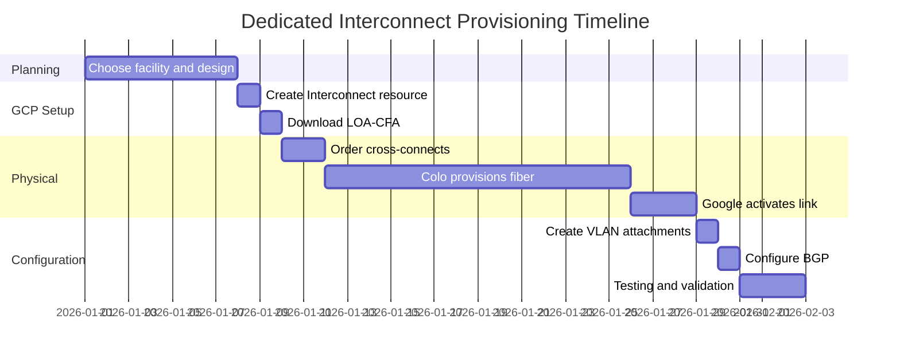

# How to Order and Provision a Dedicated Interconnect Connection in GCP

Author: [nawazdhandala](https://www.github.com/nawazdhandala)

Tags: GCP, Dedicated Interconnect, Cloud Interconnect, Networking, Hybrid Cloud

Description: A complete guide to ordering and provisioning a Dedicated Interconnect connection in Google Cloud, from choosing a colocation facility to testing the link.

---

When VPN bandwidth is no longer enough or you need guaranteed, low-latency connectivity between your on-premises data center and Google Cloud, Dedicated Interconnect is the way to go. It gives you a direct physical connection to Google's network with speeds of 10 Gbps or 100 Gbps per link.

But unlike spinning up a VPN in minutes, Dedicated Interconnect involves physical infrastructure and takes weeks to provision. In this post, I will walk you through the entire process from start to finish.

## Is Dedicated Interconnect Right for You?

Before you commit, consider whether Dedicated Interconnect is the right choice:

| Factor | Dedicated Interconnect | Partner Interconnect | HA VPN |
|--------|----------------------|---------------------|--------|
| Bandwidth | 10-200 Gbps | 50 Mbps-50 Gbps | Up to 3 Gbps per tunnel |
| Latency | Lowest (direct) | Low | Variable |
| Cost | Higher upfront | Medium | Lowest |
| Setup time | Weeks | Days | Minutes |
| Physical presence | Required at colo | Not required | Not required |

Dedicated Interconnect makes sense when you need consistent high bandwidth (10+ Gbps), very low latency, and you either already have equipment in a supported colocation facility or are willing to get it there.

## Step 1: Choose a Colocation Facility

Google has Dedicated Interconnect available at specific colocation facilities around the world. Your equipment (or your carrier's equipment) needs to be physically present at one of these facilities.

To find the list of supported facilities:

```bash
# List available Interconnect locations
gcloud compute interconnects locations list \
    --format="table(name, description, facilityProvider, city)"
```

Pick a facility that is geographically close to your existing infrastructure and in the same metro area as the GCP region you are targeting. For redundancy, choose two facilities in different metros if possible.

## Step 2: Verify Your Network Requirements

Before ordering, confirm these technical details:

- **Link speed**: 10 Gbps (10GBase-LR, single-mode fiber) or 100 Gbps (100GBASE-LR4)
- **Number of links**: You need at least two links in different Edge Availability Domains for the 99.99% SLA
- **Colocation cross-connect**: You will need to order a cross-connect from the colo provider to Google's demarcation point
- **Router capability**: Your on-premises router must support BGP and the required link speed
- **Optical specifications**: Single-mode fiber, 1310 nm wavelength for 10G, matching optics for 100G

## Step 3: Create the Interconnect in GCP Console

Start by creating the Interconnect resource in your GCP project:

```bash
# Create a Dedicated Interconnect connection
gcloud compute interconnects create my-interconnect-1 \
    --interconnect-type=DEDICATED \
    --link-type=LINK_TYPE_ETHERNET_10G_LR \
    --requested-link-count=1 \
    --location=iad-zone1-1 \
    --admin-enabled \
    --description="Primary interconnect in IAD facility"
```

For the 99.99% SLA, create a second interconnect in a different Edge Availability Domain:

```bash
# Create a second interconnect in a different availability domain
gcloud compute interconnects create my-interconnect-2 \
    --interconnect-type=DEDICATED \
    --link-type=LINK_TYPE_ETHERNET_10G_LR \
    --requested-link-count=1 \
    --location=iad-zone2-1 \
    --admin-enabled \
    --description="Redundant interconnect in IAD facility"
```

After creating these resources, GCP generates a Letter of Authorization and Connecting Facility Assignment (LOA-CFA). This document tells the colocation provider exactly where to run the fiber.

## Step 4: Download the LOA-CFA

```bash
# Check the status and get LOA-CFA details
gcloud compute interconnects describe my-interconnect-1 \
    --format="yaml(name, state, provisionedLinkCount, interconnectAttachments, googleReferenceId)"
```

Download the LOA-CFA from the GCP Console (Cloud Interconnect section). You will need this document for the next step.

## Step 5: Order Cross-Connects

Take the LOA-CFA to your colocation provider and order cross-connects. This is the physical fiber cable that runs from your cage/cabinet to Google's meet-me room in the facility.

The cross-connect order typically includes:

- Source: Your cabinet/cage number
- Destination: Google's demarcation point (specified in the LOA-CFA)
- Fiber type: Single-mode
- Connector type: LC (for 10G) or the appropriate type for your speed

This is usually the longest part of the process. Cross-connect provisioning can take anywhere from a few days to a few weeks depending on the colocation provider.

## Step 6: Wait for Physical Provisioning

Once the colocation provider completes the cross-connect, Google's automated systems detect the optical signal and begin provisioning the link.

Monitor the status:

```bash
# Check interconnect provisioning status
gcloud compute interconnects describe my-interconnect-1 \
    --format="table(name, state, operationalStatus, provisionedLinkCount)"
```

The states you will see:

1. **PENDING_CUSTOMER**: Waiting for you to order cross-connects
2. **PENDING_PROVIDER**: Cross-connect ordered, waiting for physical completion
3. **ACTIVE**: Physical link is up and ready for VLAN attachments

## Step 7: Verify the Physical Connection

Once the state is ACTIVE, verify the link health:

```bash
# Check the link details including light levels
gcloud compute interconnects describe my-interconnect-1 \
    --format="yaml(circuitInfos, operationalStatus, adminEnabled)"
```

The `circuitInfos` field shows details about each physical link including the Google circuit ID and customer device information.

## Step 8: Create VLAN Attachments

With the physical connection active, you need VLAN attachments to actually route traffic. I will cover this in detail in a separate post, but here is the basic setup:

```bash
# Create a Cloud Router first
gcloud compute routers create interconnect-router \
    --network=my-vpc \
    --region=us-east4 \
    --asn=65001

# Create a VLAN attachment on the first interconnect
gcloud compute interconnects attachments dedicated create attachment-1 \
    --interconnect=my-interconnect-1 \
    --router=interconnect-router \
    --region=us-east4 \
    --bandwidth=BPS_1G \
    --vlan=100
```

## Step 9: Configure BGP

After creating VLAN attachments, configure BGP sessions between your on-premises router and Cloud Router:

```bash
# Add BGP peer for the VLAN attachment
gcloud compute routers add-bgp-peer interconnect-router \
    --peer-name=onprem-peer-1 \
    --interface=if-attachment-1 \
    --peer-ip-address=169.254.0.2 \
    --peer-asn=65002 \
    --region=us-east4
```

## Timeline and Cost Expectations

Here is a realistic timeline for a Dedicated Interconnect deployment:



Cost-wise, expect to pay for:

- **GCP Interconnect port fee**: Varies by speed and commitment
- **Colocation cross-connect fees**: Monthly recurring, varies by provider
- **Egress traffic**: Standard GCP egress pricing applies (with interconnect discounts)
- **Your on-premises equipment**: Router, optics, rack space

## Troubleshooting Common Issues

**Link does not come up after cross-connect**:
- Verify the fiber is connected to the correct port on Google's demarcation point
- Check optical light levels - use an optical power meter
- Make sure you are using the correct optics (single-mode, correct wavelength)

**State stuck at PENDING_PROVIDER**:
- Contact Google Cloud support with your Interconnect's Google Reference ID
- Verify the LOA-CFA information matches what was given to the colo provider

**BGP session does not establish**:
- Verify VLAN IDs match on both sides
- Check that your router's interface is up and configured with the correct IP
- Verify ASN numbers are correct

## Wrapping Up

Provisioning a Dedicated Interconnect takes planning and patience, but the result is a high-bandwidth, low-latency direct connection to Google Cloud. Start the process early - the physical provisioning alone can take two to four weeks. Always order interconnects in pairs across different Edge Availability Domains for the 99.99% SLA, and test thoroughly before migrating production traffic.
