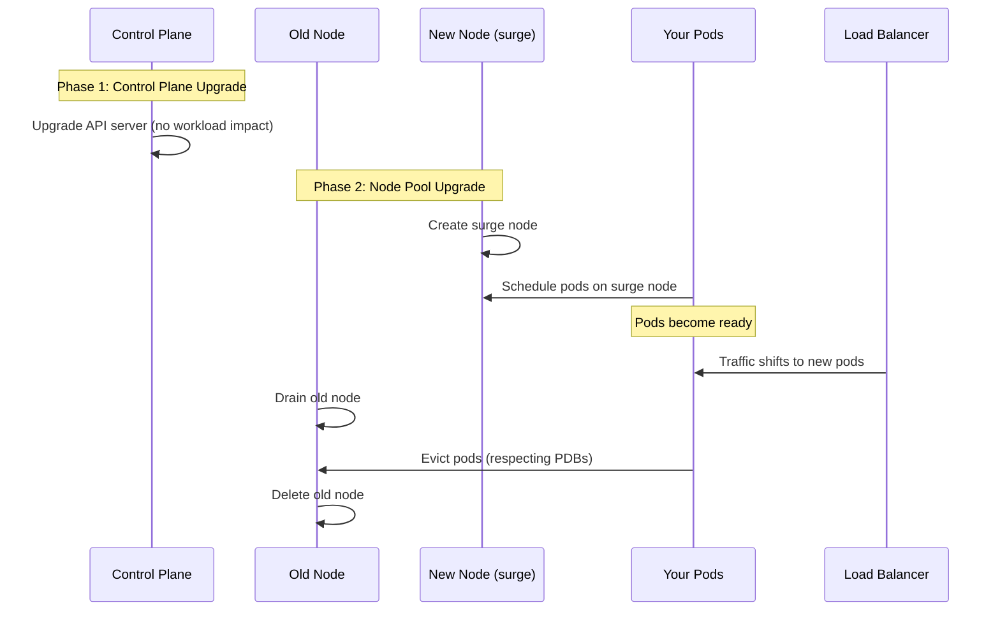

# How to Perform a Zero-Downtime GKE Cluster Upgrade Using Surge Upgrades and PDBs

Author: [nawazdhandala](https://www.github.com/nawazdhandala)

Tags: GCP, GKE, Kubernetes, Cluster Upgrades, Zero Downtime, PDB, Surge Upgrades

Description: A step-by-step guide to performing zero-downtime GKE cluster upgrades using surge upgrade strategies combined with Pod Disruption Budgets for uninterrupted service.

---

Cluster upgrades are unavoidable. Kubernetes releases new versions regularly, security patches need to be applied, and staying on a supported version is a requirement for production workloads. But upgrades do not have to mean downtime. With the right combination of surge upgrades, Pod Disruption Budgets, topology spread constraints, and readiness probes, you can upgrade a GKE cluster while your application continues serving traffic without a single dropped request.

I have performed this process on production clusters serving real traffic, and the key is preparation. The upgrade itself is mostly automated - it is the configuration leading up to it that determines whether users notice.

## The Upgrade Process

A GKE cluster upgrade happens in two phases:

1. **Control plane upgrade**: Google upgrades the Kubernetes API server, scheduler, and controller manager. This is automatic and causes no workload disruption.
2. **Node pool upgrade**: Nodes are drained and replaced with new nodes running the updated version. This is where workload disruption can happen.



## Step 1: Ensure Your Application Is Upgrade-Ready

Before touching the cluster, your workloads need to be configured properly.

### Readiness Probes

Readiness probes tell Kubernetes when a pod is ready to receive traffic. Without them, traffic gets sent to pods that are still starting up, causing errors.

```yaml
# deployment.yaml - Properly configured for zero-downtime upgrades
apiVersion: apps/v1
kind: Deployment
metadata:
  name: web-api
  namespace: production
spec:
  replicas: 4  # At least 3 replicas for safe upgrades
  selector:
    matchLabels:
      app: web-api
  template:
    metadata:
      labels:
        app: web-api
    spec:
      containers:
        - name: web-api
          image: my-api:v2.1.0
          ports:
            - containerPort: 8080
          # Readiness probe - CRITICAL for zero-downtime upgrades
          readinessProbe:
            httpGet:
              path: /healthz
              port: 8080
            initialDelaySeconds: 10
            periodSeconds: 5
            failureThreshold: 3
          # Liveness probe
          livenessProbe:
            httpGet:
              path: /livez
              port: 8080
            initialDelaySeconds: 15
            periodSeconds: 10
          resources:
            requests:
              cpu: "250m"
              memory: "512Mi"
      # Give pods time to finish in-flight requests during shutdown
      terminationGracePeriodSeconds: 60
```

### Topology Spread Constraints

Spread pods across nodes so they are not all on the same node being drained.

```yaml
# Add to your deployment spec
spec:
  template:
    spec:
      topologySpreadConstraints:
        # Spread across nodes
        - maxSkew: 1
          topologyKey: kubernetes.io/hostname
          whenUnsatisfiable: DoNotSchedule
          labelSelector:
            matchLabels:
              app: web-api
        # Also spread across zones for zone-level resilience
        - maxSkew: 1
          topologyKey: topology.kubernetes.io/zone
          whenUnsatisfiable: ScheduleAnyway
          labelSelector:
            matchLabels:
              app: web-api
```

### Graceful Shutdown Handling

Your application must handle SIGTERM properly. When a node is drained, pods receive SIGTERM and have `terminationGracePeriodSeconds` to finish in-flight requests.

```javascript
// server.js - Graceful shutdown for zero-downtime upgrades
const express = require("express");
const app = express();

let server;
let isShuttingDown = false;

// Application routes
app.get("/api/data", (req, res) => {
  // Simulate some processing
  res.json({ data: "response" });
});

// Health endpoints
app.get("/healthz", (req, res) => {
  if (isShuttingDown) {
    // Return 503 during shutdown so load balancer stops sending traffic
    res.status(503).json({ status: "shutting down" });
  } else {
    res.status(200).json({ status: "healthy" });
  }
});

app.get("/livez", (req, res) => {
  res.status(200).json({ status: "alive" });
});

// Start server
server = app.listen(8080, () => {
  console.log("Server started on port 8080");
});

// Handle SIGTERM gracefully
process.on("SIGTERM", () => {
  console.log("SIGTERM received, starting graceful shutdown");
  isShuttingDown = true;

  // Stop accepting new connections
  server.close(() => {
    console.log("All connections closed, exiting");
    process.exit(0);
  });

  // Force exit after 55 seconds (before the 60s termination grace period)
  setTimeout(() => {
    console.log("Forced exit after timeout");
    process.exit(1);
  }, 55000);
});
```

## Step 2: Configure Pod Disruption Budgets

PDBs ensure the upgrade process does not evict too many pods at once.

```yaml
# pdb.yaml - Protect application availability during upgrades
apiVersion: policy/v1
kind: PodDisruptionBudget
metadata:
  name: web-api-pdb
  namespace: production
spec:
  # Allow at most 1 pod to be unavailable at any time
  maxUnavailable: 1
  selector:
    matchLabels:
      app: web-api
```

Apply PDBs to every production deployment.

```bash
kubectl apply -f pdb.yaml

# Verify the PDB
kubectl get pdb web-api-pdb -n production
# Should show ALLOWED DISRUPTIONS > 0
```

## Step 3: Configure Surge Upgrades on the Node Pool

Surge upgrades create additional nodes before draining old ones. This ensures there is always capacity for your pods.

```bash
# Configure surge upgrades
gcloud container node-pools update default-pool \
  --cluster my-cluster \
  --region us-central1 \
  --max-surge-upgrade 2 \
  --max-unavailable-upgrade 0
```

The settings mean:
- `--max-surge-upgrade 2`: Create up to 2 extra nodes during the upgrade
- `--max-unavailable-upgrade 0`: Never have fewer nodes than the pool's target size

This is the most important setting for zero-downtime. With `max-unavailable-upgrade 0`, every old node is replaced by a new one before being drained. Your total capacity never drops.

## Step 4: Set a Maintenance Window

Schedule the upgrade during low-traffic periods.

```bash
# Set a maintenance window (e.g., 2 AM - 6 AM UTC on weekdays)
gcloud container clusters update my-cluster \
  --region us-central1 \
  --maintenance-window-start "2026-01-01T02:00:00Z" \
  --maintenance-window-end "2026-01-01T06:00:00Z" \
  --maintenance-window-recurrence "FREQ=WEEKLY;BYDAY=MO,TU,WE,TH,FR"
```

## Step 5: Pre-Upgrade Checklist

Before triggering the upgrade, verify everything is in order.

```bash
# 1. Check all deployments have readiness probes
kubectl get deployments -A -o json | \
  jq -r '.items[] | select(.spec.template.spec.containers[].readinessProbe == null) | .metadata.namespace + "/" + .metadata.name'

# 2. Check all production deployments have PDBs
kubectl get pdb -A

# 3. Verify surge upgrade settings
gcloud container node-pools describe default-pool \
  --cluster my-cluster \
  --region us-central1 \
  --format "yaml(upgradeSettings)"

# 4. Check current cluster version and available versions
gcloud container clusters describe my-cluster \
  --region us-central1 \
  --format "value(currentMasterVersion)"

gcloud container get-server-config --region us-central1 \
  --format "yaml(validMasterVersions)"

# 5. Ensure all pods are healthy
kubectl get pods -A --field-selector status.phase!=Running,status.phase!=Succeeded

# 6. Check PDB allowed disruptions (should all be > 0)
kubectl get pdb -A
```

## Step 6: Trigger the Upgrade

If you are on a release channel, upgrades happen automatically. For manual upgrades:

```bash
# Upgrade the control plane first
gcloud container clusters upgrade my-cluster \
  --region us-central1 \
  --master \
  --cluster-version 1.28.5-gke.1200

# Wait for control plane upgrade to complete
gcloud container operations list \
  --filter "targetLink:clusters/my-cluster AND operationType=UPGRADE_MASTER" \
  --format "table(name, status)"

# Then upgrade the node pool
gcloud container clusters upgrade my-cluster \
  --region us-central1 \
  --node-pool default-pool \
  --cluster-version 1.28.5-gke.1200
```

## Step 7: Monitor the Upgrade

Watch the upgrade progress in real-time.

```bash
# Watch node status during upgrade
kubectl get nodes --watch

# In another terminal, watch pod status
kubectl get pods -n production --watch

# Check the upgrade operation
gcloud container operations list \
  --filter "targetLink:clusters/my-cluster AND operationType=UPGRADE_NODES" \
  --format "table(name, status, startTime)"

# Monitor for any pod eviction failures
kubectl get events --field-selector reason=EvictionFailed --watch
```

During a properly configured upgrade, you should see:

1. New nodes appear (surge nodes)
2. Pods get scheduled on new nodes and become Ready
3. Old nodes get cordoned (marked unschedulable)
4. Pods on old nodes get evicted (one at a time, respecting PDBs)
5. Evicted pods reschedule on new/existing nodes
6. Old nodes get deleted

## Step 8: Validate After Upgrade

After the upgrade completes, verify everything is healthy.

```bash
# Check cluster version
gcloud container clusters describe my-cluster \
  --region us-central1 \
  --format "value(currentMasterVersion, currentNodeVersion)"

# Verify all nodes are running the new version
kubectl get nodes -o custom-columns="NAME:.metadata.name,VERSION:.status.nodeInfo.kubeletVersion"

# Check all pods are running
kubectl get pods -A --field-selector status.phase!=Running,status.phase!=Succeeded

# Verify PDBs are healthy
kubectl get pdb -A

# Run smoke tests
curl -s https://your-app.example.com/healthz
```

## Handling Upgrade Issues

If something goes wrong during the upgrade:

```bash
# If pods are stuck pending after node drain
kubectl describe pod STUCK_POD_NAME -n production
# Common cause: PDB cannot be satisfied because not enough replicas are ready

# If the upgrade is stuck
gcloud container operations describe OPERATION_ID --region us-central1

# Cancel a stuck node pool upgrade (careful - partial upgrades can be messy)
gcloud container operations cancel OPERATION_ID --region us-central1
```

## Rollback Plan

GKE does not support automatic version rollback, but you can mitigate issues.

```bash
# If the new version has problems, you can create a new node pool
# with the previous version and migrate workloads
gcloud container node-pools create rollback-pool \
  --cluster my-cluster \
  --region us-central1 \
  --node-version PREVIOUS_VERSION \
  --num-nodes 3

# Cordon the problematic nodes
kubectl cordon NODE_NAME

# Drain workloads to the rollback pool
kubectl drain NODE_NAME --ignore-daemonsets --delete-emptydir-data
```

## Complete Configuration Checklist

Here is everything you need for zero-downtime upgrades, all in one place.

```yaml
# 1. Deployment with all required fields
apiVersion: apps/v1
kind: Deployment
metadata:
  name: web-api
  namespace: production
spec:
  replicas: 4
  strategy:
    type: RollingUpdate
    rollingUpdate:
      maxSurge: 1
      maxUnavailable: 0
  selector:
    matchLabels:
      app: web-api
  template:
    metadata:
      labels:
        app: web-api
    spec:
      terminationGracePeriodSeconds: 60
      topologySpreadConstraints:
        - maxSkew: 1
          topologyKey: kubernetes.io/hostname
          whenUnsatisfiable: DoNotSchedule
          labelSelector:
            matchLabels:
              app: web-api
      containers:
        - name: web-api
          image: my-api:v2.1.0
          ports:
            - containerPort: 8080
          readinessProbe:
            httpGet:
              path: /healthz
              port: 8080
            initialDelaySeconds: 10
            periodSeconds: 5
          resources:
            requests:
              cpu: "250m"
              memory: "512Mi"
---
# 2. Pod Disruption Budget
apiVersion: policy/v1
kind: PodDisruptionBudget
metadata:
  name: web-api-pdb
  namespace: production
spec:
  maxUnavailable: 1
  selector:
    matchLabels:
      app: web-api
```

## Wrapping Up

Zero-downtime GKE cluster upgrades are achievable with proper preparation. The formula is: surge upgrades (so capacity never drops) plus PDBs (so not too many pods are evicted at once) plus topology spread (so pods are distributed across nodes) plus readiness probes (so traffic only goes to healthy pods) plus graceful shutdown (so in-flight requests complete). Each piece is simple on its own, and together they give you a cluster upgrade that your users will not even notice. Do the preparation work upfront, run through the checklist before each upgrade, and the process becomes routine rather than stressful.
