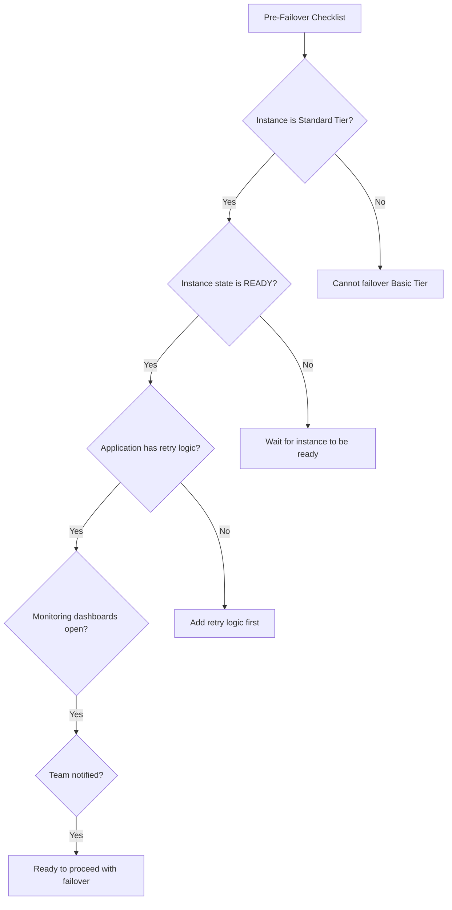

# How to Perform Manual Failover on a Memorystore Redis Instance

Author: [nawazdhandala](https://www.github.com/nawazdhandala)

Tags: GCP, Memorystore, Redis, Failover, Disaster Recovery

Description: Learn how to perform and prepare for manual failover on a Memorystore Redis Standard Tier instance, including pre-checks, execution, and post-failover validation.

---

Manual failover is something you should practice before you actually need it. When your primary Redis node has issues, or you need to move it to a different zone during maintenance, a manual failover lets you switch to the replica in a controlled way. It is also the best way to verify that your application handles failover correctly before a real outage forces the test on you.

In this post, I will cover the complete manual failover process for Memorystore Redis - from pre-flight checks through execution and post-failover validation.

## When to Use Manual Failover

There are several scenarios where you would trigger a manual failover:

- **Testing disaster recovery.** Verify your application reconnects properly after the primary switches.
- **Zone maintenance.** If Google Cloud is doing maintenance in your primary zone, proactively fail over to the alternative zone.
- **Performance issues.** If the primary node is experiencing degraded performance due to underlying hardware, failing over moves you to fresh infrastructure.
- **Compliance testing.** Some compliance frameworks require periodic failover testing to prove your recovery procedures work.

## Prerequisites

Manual failover is only available for Standard Tier instances. Basic Tier instances have a single node with no replica, so there is nothing to fail over to.

Verify your instance is Standard Tier:

```bash
# Check the instance tier and current zone placement
gcloud redis instances describe my-redis \
  --region=us-central1 \
  --format="table(name,tier,currentLocationId,locationId,alternativeLocationId,state)"
```

You should see `tier: STANDARD` and both `locationId` and `alternativeLocationId` populated.

## Pre-Failover Checklist

Before triggering a failover, go through this checklist:



### Check Replication Health

Make sure the replica is caught up with the primary before failing over:

```bash
# Check the instance status and replication info
gcloud redis instances describe my-redis \
  --region=us-central1

# Connect to Redis and check replication offset
redis-cli -h REDIS_IP -p 6379 -a AUTH_STRING INFO replication
```

Look for `master_repl_offset` and `slave_repl_offset` in the output. If the slave offset is significantly behind the master, wait for it to catch up before failing over.

### Verify Application Readiness

Make sure your application handles reconnection properly. The key behaviors to check:

1. The application retries on connection errors
2. Connection pools detect dead connections and create new ones
3. There is no hard-coded IP caching that would prevent reconnection to the new primary

### Set Up Monitoring

Open your monitoring dashboards before starting. You want to watch:

- Redis connection count (should drop and recover)
- Application error rates (should spike briefly then normalize)
- Redis operation latency (should return to baseline after failover)

## Performing the Failover

Memorystore supports two data protection modes for failover:

### Limited Data Loss Mode (Recommended)

This mode waits for the replica to catch up with the primary before switching. There may be a brief pause in writes while replication catches up, but you will not lose data.

```bash
# Perform failover with limited data loss - waits for replication sync
gcloud redis instances failover my-redis \
  --region=us-central1 \
  --data-protection-mode=limited-data-loss
```

### Force Data Loss Mode

This mode immediately promotes the replica without waiting for replication to sync. Use this only when the primary is already unavailable and you need to recover as fast as possible.

```bash
# Perform immediate failover - may lose recent writes that were not replicated
gcloud redis instances failover my-redis \
  --region=us-central1 \
  --data-protection-mode=force-data-loss
```

The difference matters: if your primary received writes that had not yet been replicated, `force-data-loss` mode will lose those writes. For routine testing, always use `limited-data-loss`.

## What Happens During Failover

Here is the timeline of events:

1. **Failover initiated** - You run the gcloud command
2. **Write pause** (limited-data-loss mode only) - The primary stops accepting writes while replication catches up
3. **Replica promotion** - The replica becomes the new primary
4. **IP remapping** - The instance's IP address now points to the new primary
5. **Old primary becomes replica** - The former primary is reconfigured as the new replica
6. **Normal operations resume** - Applications reconnect to the new primary

The entire process typically takes 30-60 seconds. During this time, your applications will experience connection errors.

```bash
# Monitor the failover progress by checking instance state
watch -n 5 "gcloud redis instances describe my-redis \
  --region=us-central1 \
  --format='value(state,currentLocationId)'"
```

The state will transition through:
- `READY` - normal state
- `FAILING_OVER` - failover in progress
- `READY` - failover complete

## Post-Failover Validation

After the failover completes, verify everything is working:

### Check Instance State

```bash
# Verify the instance is back to READY state and the zone changed
gcloud redis instances describe my-redis \
  --region=us-central1 \
  --format="table(state,currentLocationId,locationId,alternativeLocationId)"
```

The `currentLocationId` should now show the alternative zone.

### Test Connectivity

```bash
# Verify you can connect and execute commands
redis-cli -h REDIS_IP -p 6379 -a AUTH_STRING PING

# Check the server role - should be "master"
redis-cli -h REDIS_IP -p 6379 -a AUTH_STRING INFO replication | grep role

# Verify replication is set up (new replica should be syncing)
redis-cli -h REDIS_IP -p 6379 -a AUTH_STRING INFO replication | grep connected_slaves
```

### Verify Data Integrity

If you had test data written before the failover, verify it is still there:

```bash
# Check that data written before failover is present
redis-cli -h REDIS_IP -p 6379 -a AUTH_STRING GET pre-failover-test-key
```

### Check Application Health

```bash
# For GKE deployments, check pod status
kubectl get pods -l app=my-app

# Check application logs for reconnection messages
kubectl logs -l app=my-app --tail=50 | grep -i redis

# For Cloud Run, check recent logs
gcloud logging read 'resource.type="cloud_run_revision" AND "redis"' \
  --limit=20 --format="table(timestamp, textPayload)"
```

## Automating Failover Tests

Schedule regular failover tests to keep your team sharp and catch regressions in reconnection logic. Here is a script that runs a full test cycle:

```bash
#!/bin/bash
# test-redis-failover.sh - Automated failover test with validation

INSTANCE="my-redis"
REGION="us-central1"
REDIS_HOST="10.0.0.3"
REDIS_AUTH="your-auth-string"

echo "=== Redis Failover Test ==="
echo "Started at: $(date)"

# Record the current zone
CURRENT_ZONE=$(gcloud redis instances describe "${INSTANCE}" \
  --region="${REGION}" \
  --format="value(currentLocationId)")
echo "Current primary zone: ${CURRENT_ZONE}"

# Write a test key before failover
redis-cli -h "${REDIS_HOST}" -a "${REDIS_AUTH}" \
  SET failover-test-$(date +%s) "pre-failover" EX 300
echo "Test key written"

# Trigger the failover
echo "Initiating failover..."
gcloud redis instances failover "${INSTANCE}" \
  --region="${REGION}" \
  --data-protection-mode=limited-data-loss

# Wait for the instance to return to READY state
echo "Waiting for failover to complete..."
while true; do
    STATE=$(gcloud redis instances describe "${INSTANCE}" \
      --region="${REGION}" \
      --format="value(state)")
    if [ "${STATE}" = "READY" ]; then
        break
    fi
    echo "  State: ${STATE}"
    sleep 5
done

# Verify the zone changed
NEW_ZONE=$(gcloud redis instances describe "${INSTANCE}" \
  --region="${REGION}" \
  --format="value(currentLocationId)")
echo "New primary zone: ${NEW_ZONE}"

if [ "${CURRENT_ZONE}" = "${NEW_ZONE}" ]; then
    echo "WARNING: Zone did not change"
else
    echo "SUCCESS: Zone changed from ${CURRENT_ZONE} to ${NEW_ZONE}"
fi

# Verify connectivity
PING_RESULT=$(redis-cli -h "${REDIS_HOST}" -a "${REDIS_AUTH}" PING)
if [ "${PING_RESULT}" = "PONG" ]; then
    echo "SUCCESS: Redis is responding after failover"
else
    echo "FAILURE: Redis is not responding"
fi

echo "Completed at: $(date)"
```

## Failing Back

After a failover, your primary is in the alternative zone. To move it back to the original zone, simply perform another failover:

```bash
# Fail back to the original zone
gcloud redis instances failover my-redis \
  --region=us-central1 \
  --data-protection-mode=limited-data-loss
```

Each failover swaps the primary and replica zones.

## Common Issues During Failover

**Application does not reconnect.** Usually caused by connection pooling that does not detect dead connections. Enable keepalive and health checks on your Redis connection pool.

**Data appears missing after failover.** In `force-data-loss` mode, writes that were not replicated are lost. Use `limited-data-loss` mode unless the primary is actually down.

**Failover takes longer than expected.** If the replica is far behind on replication, `limited-data-loss` mode waits for it to catch up. Monitor replication lag before triggering failover.

**Instance stuck in FAILING_OVER state.** This is rare but can happen. Contact Google Cloud Support if the instance does not return to READY within 10 minutes.

## Wrapping Up

Manual failover is your safety valve for Memorystore Redis. Practice it regularly so that when a real failure happens, your team and your applications handle it smoothly. Use `limited-data-loss` mode for planned tests, automate the test process, and always verify connectivity and data integrity after the failover completes. The time you invest in failover testing pays off when the unexpected happens.
