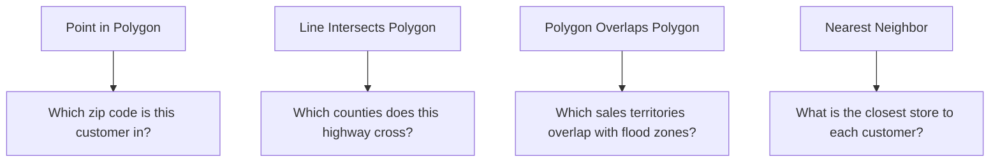

# How to Perform Spatial Joins in BigQuery GIS to Analyze Location Data with Geographic Boundaries

Author: [nawazdhandala](https://www.github.com/nawazdhandala)

Tags: GCP, BigQuery, GIS, Spatial Joins, Geospatial, Geography, Google Cloud

Description: Perform spatial joins in BigQuery GIS to analyze location data against geographic boundaries like zip codes, counties, and custom regions for location intelligence.

---

Spatial joins are the bread and butter of location analytics. You have a set of points (customer locations, store positions, event coordinates) and you want to know which geographic boundaries they fall into (zip codes, sales territories, delivery zones, census tracts). In traditional GIS software this requires specialized tools and processing, but BigQuery GIS handles spatial joins using standard SQL with geospatial functions.

In this post, I will walk through different types of spatial joins in BigQuery, from basic point-in-polygon containment to more advanced patterns like nearest-neighbor joins and intersection analysis.

## What is a Spatial Join

A spatial join connects two datasets based on their geographic relationship rather than a shared key. Instead of `ON a.id = b.id`, you use `ON ST_CONTAINS(b.boundary, a.location)` or `ON ST_INTERSECTS(a.region, b.region)`.

Common spatial join types:



## Prerequisites

- BigQuery with GIS functions available
- Location data with coordinates or geography objects
- Boundary data (zip codes, counties, custom polygons)

## Step 1: Load Boundary Data

You need polygon data representing geographic boundaries. BigQuery public datasets include several useful boundary datasets.

This query shows what boundary datasets are available publicly:

```sql
-- Explore available public geo datasets
SELECT table_name
FROM `bigquery-public-data.geo_us_boundaries.INFORMATION_SCHEMA.TABLES`
ORDER BY table_name;
```

For custom boundaries like sales territories or delivery zones, load them from GeoJSON:

```python
from google.cloud import bigquery
import json

def load_geojson_boundaries(project_id, dataset, table, geojson_file):
    """Loads GeoJSON boundary data into BigQuery."""
    client = bigquery.Client()

    # Read the GeoJSON file
    with open(geojson_file) as f:
        geojson = json.load(f)

    # Convert GeoJSON features to BigQuery rows
    rows = []
    for feature in geojson["features"]:
        props = feature["properties"]
        geometry = json.dumps(feature["geometry"])
        rows.append({
            "zone_id": props.get("id", ""),
            "zone_name": props.get("name", ""),
            "boundary": geometry,  # Store as string, convert to GEOGRAPHY in SQL
        })

    # Write to BigQuery
    table_ref = f"{project_id}.{dataset}.{table}"
    errors = client.insert_rows_json(table_ref, rows)
    if errors:
        print(f"Errors: {errors}")
    else:
        print(f"Loaded {len(rows)} boundaries")

load_geojson_boundaries(
    "my-project", "geo_analytics", "delivery_zones", "delivery_zones.geojson"
)
```

Then convert the string geometry to proper GEOGRAPHY:

```sql
-- Convert the GeoJSON strings to GEOGRAPHY type
CREATE OR REPLACE TABLE `MY_PROJECT.geo_analytics.delivery_zones` AS
SELECT
  zone_id,
  zone_name,
  ST_GEOGFROMGEOJSON(boundary) as boundary
FROM `MY_PROJECT.geo_analytics.delivery_zones_raw`;
```

## Step 2: Point-in-Polygon Spatial Join

The most common spatial join. Find which boundary contains each point.

This query assigns each customer to their zip code:

```sql
-- Assign each customer location to a zip code using a spatial join
SELECT
  c.customer_id,
  c.customer_name,
  c.location,
  z.zip_code,
  z.city,
  z.state_code
FROM `MY_PROJECT.geo_analytics.customers` c
JOIN `bigquery-public-data.geo_us_boundaries.zip_codes` z
  ON ST_CONTAINS(z.zip_code_geom, c.location)
```

This is an inner join, so customers outside any zip code boundary will be dropped. Use LEFT JOIN if you want to keep all customers:

```sql
-- LEFT JOIN to keep customers even if they don't fall in a zip code
SELECT
  c.customer_id,
  c.customer_name,
  z.zip_code,
  COALESCE(z.state_code, 'Unknown') as state
FROM `MY_PROJECT.geo_analytics.customers` c
LEFT JOIN `bigquery-public-data.geo_us_boundaries.zip_codes` z
  ON ST_CONTAINS(z.zip_code_geom, c.location)
```

## Step 3: Aggregate Data by Geographic Boundary

Once you have the spatial join, you can aggregate metrics by geography.

This query counts customers and calculates revenue per county:

```sql
-- Customer count and revenue by county
SELECT
  county.county_name,
  county.state_name,
  COUNT(DISTINCT c.customer_id) as customer_count,
  SUM(o.total_amount) as total_revenue,
  ROUND(SUM(o.total_amount) / COUNT(DISTINCT c.customer_id), 2) as revenue_per_customer
FROM `MY_PROJECT.geo_analytics.customers` c
JOIN `bigquery-public-data.geo_us_boundaries.counties` county
  ON ST_CONTAINS(county.county_geom, c.location)
LEFT JOIN `MY_PROJECT.sales.orders` o
  ON c.customer_id = o.customer_id
GROUP BY county.county_name, county.state_name
ORDER BY total_revenue DESC
LIMIT 50;
```

## Step 4: Nearest-Neighbor Spatial Join

Find the closest point in one dataset to each point in another. This is useful for finding the nearest store, nearest warehouse, or nearest service center.

This query finds the nearest store for each customer:

```sql
-- Find the nearest store for each customer using CROSS JOIN and ranking
WITH distances AS (
  SELECT
    c.customer_id,
    c.customer_name,
    s.store_id,
    s.store_name,
    ST_DISTANCE(c.location, s.location) as distance_meters,
    -- Rank stores by distance for each customer
    ROW_NUMBER() OVER (
      PARTITION BY c.customer_id
      ORDER BY ST_DISTANCE(c.location, s.location)
    ) as rank
  FROM `MY_PROJECT.geo_analytics.customers` c
  CROSS JOIN `MY_PROJECT.geo_analytics.store_locations` s
)
SELECT
  customer_id,
  customer_name,
  store_id as nearest_store_id,
  store_name as nearest_store,
  ROUND(distance_meters / 1609.34, 2) as distance_miles
FROM distances
WHERE rank = 1
ORDER BY distance_miles DESC;
```

For better performance on large datasets, use ST_DWITHIN to pre-filter:

```sql
-- Optimized nearest-neighbor with distance pre-filtering
-- Only consider stores within 50 miles
WITH nearby_stores AS (
  SELECT
    c.customer_id,
    s.store_id,
    s.store_name,
    ST_DISTANCE(c.location, s.location) as distance_meters,
    ROW_NUMBER() OVER (
      PARTITION BY c.customer_id
      ORDER BY ST_DISTANCE(c.location, s.location)
    ) as rank
  FROM `MY_PROJECT.geo_analytics.customers` c
  CROSS JOIN `MY_PROJECT.geo_analytics.store_locations` s
  -- Pre-filter to only consider stores within 50 miles (~80km)
  WHERE ST_DWITHIN(c.location, s.location, 80467)
)
SELECT *
FROM nearby_stores
WHERE rank = 1;
```

## Step 5: Polygon-to-Polygon Intersection Analysis

Find where two sets of boundaries overlap, and calculate the overlap area.

This query finds which delivery zones overlap with flood risk areas:

```sql
-- Find delivery zones that overlap with flood risk areas
SELECT
  dz.zone_name as delivery_zone,
  fr.risk_level as flood_risk,
  -- Calculate the overlapping area
  ROUND(ST_AREA(ST_INTERSECTION(dz.boundary, fr.boundary)) / 2589988.11, 2) as overlap_sq_miles,
  -- Calculate what percentage of the delivery zone is in the flood area
  ROUND(
    ST_AREA(ST_INTERSECTION(dz.boundary, fr.boundary)) /
    ST_AREA(dz.boundary) * 100, 1
  ) as pct_zone_affected
FROM `MY_PROJECT.geo_analytics.delivery_zones` dz
JOIN `MY_PROJECT.geo_analytics.flood_risk_areas` fr
  ON ST_INTERSECTS(dz.boundary, fr.boundary)
WHERE ST_AREA(ST_INTERSECTION(dz.boundary, fr.boundary)) > 0
ORDER BY pct_zone_affected DESC;
```

## Step 6: Coverage Gap Analysis

Identify areas not covered by any boundary, such as finding locations outside your delivery zones.

```sql
-- Find customers outside all delivery zones
SELECT
  c.customer_id,
  c.customer_name,
  c.location,
  -- Find the nearest delivery zone boundary for unserved customers
  MIN(ST_DISTANCE(c.location, dz.boundary)) as meters_to_nearest_zone
FROM `MY_PROJECT.geo_analytics.customers` c
LEFT JOIN `MY_PROJECT.geo_analytics.delivery_zones` dz
  ON ST_CONTAINS(dz.boundary, c.location)
WHERE dz.zone_id IS NULL  -- No zone contains this customer
GROUP BY c.customer_id, c.customer_name, c.location
ORDER BY meters_to_nearest_zone ASC;
```

## Step 7: Performance Tips for Spatial Joins

Spatial joins can be computationally expensive. Here are key optimization strategies:

```sql
-- Tip 1: Filter by bounding box before exact spatial join
-- ST_BOUNDINGBOX is faster than ST_CONTAINS for initial filtering
SELECT c.*, z.zip_code
FROM customers c
JOIN zip_codes z
  ON ST_INTERSECTSBOX(z.zip_code_geom, c.lng - 0.1, c.lat - 0.1, c.lng + 0.1, c.lat + 0.1)
  AND ST_CONTAINS(z.zip_code_geom, c.location);

-- Tip 2: Cluster tables on geography columns
CREATE TABLE `MY_PROJECT.geo_analytics.customers_clustered`
CLUSTER BY location AS
SELECT * FROM `MY_PROJECT.geo_analytics.customers`;

-- Tip 3: Simplify complex polygons if high precision isn't needed
-- Reduce vertex count for faster containment checks
SELECT
  zone_id,
  ST_SIMPLIFY(boundary, 100) as simplified_boundary  -- 100 meter tolerance
FROM delivery_zones;

-- Tip 4: For very large datasets, partition by region first
CREATE TABLE `MY_PROJECT.geo_analytics.customers_partitioned`
PARTITION BY state
CLUSTER BY location AS
SELECT * FROM `MY_PROJECT.geo_analytics.customers`;
```

## Summary

Spatial joins in BigQuery GIS let you connect location data to geographic boundaries using SQL that feels familiar. The key functions are ST_CONTAINS for point-in-polygon, ST_INTERSECTS for polygon overlap, and ST_DISTANCE combined with ROW_NUMBER for nearest-neighbor analysis. For large datasets, always pre-filter with ST_DWITHIN where possible, cluster your tables on geography columns, and simplify complex polygons when exact boundary precision is not critical. These techniques scale to billions of points and thousands of polygons without requiring any specialized GIS infrastructure.
