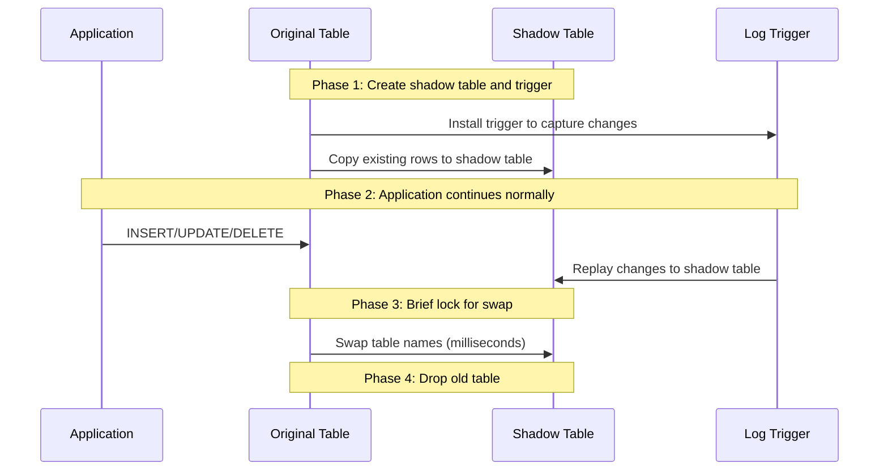

# How to Perform Zero-Downtime Schema Migrations in Cloud SQL PostgreSQL Using pg_repack

Author: [nawazdhandala](https://www.github.com/nawazdhandala)

Tags: GCP, Cloud SQL, PostgreSQL, pg_repack, Schema Migration, Zero Downtime, Database

Description: Learn how to use pg_repack on Cloud SQL PostgreSQL to perform table reorganization and schema changes without locking tables or causing application downtime.

---

Schema migrations on production databases are stressful. Adding a column with a default value, reorganizing a table to remove bloat, or changing a primary key - these operations can lock tables for minutes or hours on large datasets. During that lock, your application cannot read or write to the affected table. Users see errors or timeouts.

pg_repack is a PostgreSQL extension that reorganizes tables online, without holding exclusive locks for extended periods. It works by creating a shadow copy of the table, replaying changes, and swapping the tables in a brief lock at the end. Cloud SQL for PostgreSQL supports pg_repack, making zero-downtime table maintenance practical.

## What pg_repack Does

pg_repack can:
- Remove table bloat without VACUUM FULL's table-level lock
- Rebuild tables to reclaim disk space
- Reorganize table data according to a clustered index
- Change the table's storage parameters

Here is how it works under the hood:



The critical point is that the table-level exclusive lock only happens during the swap, which takes milliseconds.

## Prerequisites

Before using pg_repack on Cloud SQL, you need:

- Cloud SQL for PostgreSQL (version 10 or later)
- The `pg_repack` extension installed
- Superuser-equivalent permissions (Cloud SQL admin)
- The `pg_repack` client installed on a machine that can connect to the instance

## Step 1: Install the Extension

Connect to your database and create the extension.

```sql
-- Install pg_repack extension
CREATE EXTENSION IF NOT EXISTS pg_repack;

-- Verify it is installed
SELECT * FROM pg_available_extensions WHERE name = 'pg_repack';
```

## Step 2: Install the pg_repack Client

The pg_repack client runs on your local machine or a Compute Engine VM and connects to Cloud SQL remotely.

```bash
# On Debian/Ubuntu
sudo apt-get update
sudo apt-get install -y postgresql-client pg-repack

# On macOS with Homebrew
brew install pg_repack

# Verify installation
pg_repack --version
```

## Step 3: Identify Tables That Need Repacking

Check for table bloat - the primary reason to use pg_repack.

```sql
-- Estimate table bloat using pgstattuple
CREATE EXTENSION IF NOT EXISTS pgstattuple;

SELECT
  schemaname || '.' || tablename AS table_name,
  pg_size_pretty(pg_total_relation_size(quote_ident(tablename)::regclass)) AS total_size,
  (pgstattuple(quote_ident(tablename)::regclass)).dead_tuple_percent AS dead_pct,
  (pgstattuple(quote_ident(tablename)::regclass)).free_percent AS free_pct
FROM pg_tables
WHERE schemaname = 'public'
ORDER BY pg_total_relation_size(quote_ident(tablename)::regclass) DESC
LIMIT 10;
```

Tables with a dead_pct above 20% or free_pct above 30% are good candidates for repacking.

A simpler but less accurate check:

```sql
-- Quick bloat estimate using pg_stat_user_tables
SELECT
  schemaname || '.' || relname AS table_name,
  pg_size_pretty(pg_total_relation_size(relid)) AS total_size,
  n_live_tup,
  n_dead_tup,
  ROUND(n_dead_tup::numeric / NULLIF(n_live_tup + n_dead_tup, 0) * 100, 2) AS dead_pct,
  last_autovacuum
FROM pg_stat_user_tables
WHERE n_dead_tup > 100000
ORDER BY n_dead_tup DESC;
```

## Step 4: Repack a Bloated Table

Run pg_repack from the command line, targeting your Cloud SQL instance.

```bash
# Repack a single table to remove bloat
pg_repack -h CLOUD_SQL_IP -U postgres -d mydb --table public.events --no-superuser-check

# Repack with verbose output to see progress
pg_repack -h CLOUD_SQL_IP -U postgres -d mydb --table public.events --no-superuser-check -v

# Repack all bloated tables in the database
pg_repack -h CLOUD_SQL_IP -U postgres -d mydb --all-tables --no-superuser-check
```

The `--no-superuser-check` flag is needed on Cloud SQL because the `postgres` user is not a true superuser.

## Step 5: Repack with Index Reorganization

If you want to physically reorder the table data according to an index (similar to CLUSTER), use the `--order-by` flag.

```bash
# Repack and physically order by the created_at column
pg_repack -h CLOUD_SQL_IP -U postgres -d mydb \
  --table public.events \
  --order-by="created_at DESC" \
  --no-superuser-check
```

This improves range scan performance on the specified column because the data is stored in physical order.

## Step 6: Repack Just the Indexes

If only the indexes are bloated (common after heavy UPDATE workloads), you can repack just the indexes without touching the table data.

```bash
# Repack only the indexes of a table
pg_repack -h CLOUD_SQL_IP -U postgres -d mydb \
  --table public.events \
  --only-indexes \
  --no-superuser-check
```

This is faster than repacking the entire table and still reduces index bloat significantly.

## Using pg_repack for Schema Changes

Beyond bloat removal, pg_repack helps with schema changes that would normally require long-running locks.

### Changing a Primary Key

```sql
-- Traditional approach: locks the table for the duration
ALTER TABLE events DROP CONSTRAINT events_pkey;
ALTER TABLE events ADD PRIMARY KEY (new_id_column);
-- Table is locked throughout - could be minutes on a large table
```

With pg_repack, the table remains accessible:

```bash
# Rebuild the table with a new clustering key
pg_repack -h CLOUD_SQL_IP -U postgres -d mydb \
  --table public.events \
  --order-by="new_id_column" \
  --no-superuser-check
```

### Adding a Column with Default (PostgreSQL 11+)

PostgreSQL 11 made `ALTER TABLE ADD COLUMN ... DEFAULT` fast by not rewriting the table. But if you are on an older version or need to backfill existing rows, pg_repack helps:

```sql
-- Step 1: Add the column without a default (instant on any version)
ALTER TABLE events ADD COLUMN processed_at TIMESTAMP;

-- Step 2: Backfill in batches to avoid long locks
UPDATE events SET processed_at = created_at WHERE processed_at IS NULL AND id BETWEEN 1 AND 100000;
UPDATE events SET processed_at = created_at WHERE processed_at IS NULL AND id BETWEEN 100001 AND 200000;
-- Continue in batches...

-- Step 3: Repack to clean up dead tuples from the updates
pg_repack -h CLOUD_SQL_IP -U postgres -d mydb --table public.events --no-superuser-check
```

## Monitoring pg_repack Progress

While pg_repack is running, you can monitor its progress.

```sql
-- Check pg_repack activity in pg_stat_activity
SELECT
  pid,
  state,
  query,
  wait_event_type,
  wait_event,
  backend_start,
  query_start,
  now() - query_start AS duration
FROM pg_stat_activity
WHERE application_name LIKE '%pg_repack%'
  OR query LIKE '%repack%';
```

```sql
-- Monitor lock status during the swap phase
SELECT
  l.locktype,
  l.relation::regclass,
  l.mode,
  l.granted,
  a.query,
  a.pid
FROM pg_locks l
JOIN pg_stat_activity a ON l.pid = a.pid
WHERE l.relation::regclass::text LIKE '%events%'
ORDER BY l.granted;
```

## Safety Considerations

### Disk Space

pg_repack needs enough free disk space to hold a complete copy of the table. Check available space before running:

```sql
-- Check table size to estimate space needed
SELECT
  pg_size_pretty(pg_total_relation_size('events')) AS total_size,
  pg_size_pretty(pg_relation_size('events')) AS data_size,
  pg_size_pretty(pg_indexes_size('events')) AS index_size;
```

On Cloud SQL, if your disk is set to auto-resize, this is less of a concern. But if you have a fixed disk size, make sure you have at least 2x the table size in free space.

### Long-Running Transactions

pg_repack cannot complete the swap while long-running transactions hold locks on the table. Check for and terminate blocking transactions:

```sql
-- Check for long-running transactions that might block pg_repack
SELECT
  pid,
  now() - xact_start AS transaction_duration,
  state,
  query
FROM pg_stat_activity
WHERE xact_start < now() - interval '1 hour'
  AND state != 'idle';
```

### Replication Lag

If you have read replicas, the repack operation generates significant WAL. Monitor replica lag during the operation:

```bash
# Check replica lag on Cloud SQL
gcloud sql instances describe MY_REPLICA --format="value(replicaConfiguration.mysqlReplicaConfiguration)"
```

## Automating Regular Repacks

For tables that accumulate bloat regularly, schedule periodic repacks:

```bash
# Cron job to repack bloated tables weekly
# Run from a Compute Engine VM with access to Cloud SQL
0 2 * * 0 pg_repack -h CLOUD_SQL_IP -U postgres -d mydb --all-tables --no-superuser-check >> /var/log/pg_repack.log 2>&1
```

## Wrapping Up

pg_repack is an essential tool for maintaining Cloud SQL PostgreSQL databases that handle significant write traffic. It does what VACUUM FULL does - removes bloat and reclaims space - but without the table-level exclusive lock that makes VACUUM FULL unusable on production databases. The trade-off is temporary disk space usage and increased I/O during the operation, but those are much more acceptable than locking a table for minutes. Make pg_repack part of your regular database maintenance routine, and table bloat stops being a problem you worry about.
