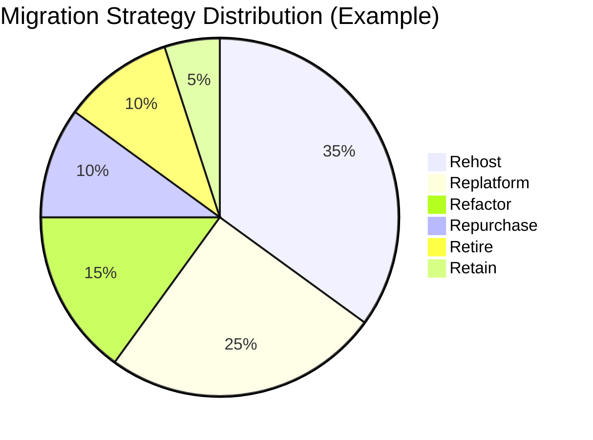

# How to Plan a Phased On-Premises to GCP Migration Using Google Cloud Adoption Framework

Author: [nawazdhandala](https://www.github.com/nawazdhandala)

Tags: GCP, Cloud Migration, Cloud Adoption Framework, Strategy, Planning

Description: Learn how to use Google Cloud Adoption Framework to plan and execute a phased migration from on-premises infrastructure to GCP.

---

Moving from on-premises to GCP is not a weekend project. It is a multi-month (sometimes multi-year) effort that touches every part of your technology organization. Google's Cloud Adoption Framework provides a structured approach to planning and executing this migration. Having been through several of these migrations, I want to share what actually matters in each phase and where teams commonly stumble.

## The Cloud Adoption Framework Overview

Google's Cloud Adoption Framework organizes the migration into four themes that run in parallel:

1. **Learn** - build cloud skills across the organization
2. **Lead** - get executive sponsorship and establish governance
3. **Scale** - build the cloud foundation (networking, security, identity)
4. **Secure** - implement security controls and compliance

And three migration phases:

1. **Assess** - understand what you have and plan the migration
2. **Plan** - design the target architecture and migration approach
3. **Deploy** - execute the migration in waves

Let me walk through the practical implementation of each phase.

## Phase 1 - Assess (Weeks 1-8)

The assessment phase is about understanding your current environment and building a business case.

### Application Discovery and Inventory

You need a complete inventory of every application, service, and dependency in your data center:

```bash
# Use Google's StratoZone or Migration Center for automated discovery
# Migration Center agent collects data from your servers

# Install the Migration Center discovery agent on Linux servers
curl -O https://storage.googleapis.com/migrate/mc-discovery-agent.sh
chmod +x mc-discovery-agent.sh
sudo ./mc-discovery-agent.sh --project-id my-project

# For Windows servers, download and run the Windows agent
# The agent collects:
# - Hardware specs (CPU, RAM, disk)
# - Running processes and services
# - Network connections and dependencies
# - Resource utilization over time
```

Build your application inventory with key metadata:

```yaml
# Application inventory template
applications:
  - name: "Customer Portal"
    id: APP-001
    owner: "Web Team"
    criticality: HIGH
    current_infrastructure:
      servers: 4
      os: "Ubuntu 20.04"
      cpu: 8
      ram_gb: 32
      storage_gb: 500
    dependencies:
      - "PostgreSQL database (DB-001)"
      - "Redis cache (CACHE-001)"
      - "Shared NFS storage"
    peak_traffic: "Monday 9am-11am"
    rpo: "1 hour"
    rto: "15 minutes"
    migration_strategy: "rehost"  # lift-and-shift initially
    migration_wave: 2

  - name: "Payment Processing"
    id: APP-002
    owner: "Payments Team"
    criticality: CRITICAL
    current_infrastructure:
      servers: 6
      os: "RHEL 8"
      cpu: 16
      ram_gb: 64
      storage_gb: 1000
    dependencies:
      - "Oracle Database (DB-002)"
      - "Message Queue (MQ-001)"
      - "HSM for encryption"
    compliance: ["PCI-DSS"]
    migration_strategy: "replatform"  # move to managed services
    migration_wave: 4  # migrate later due to complexity
```

### The 6 Rs Classification

Categorize each application into one of the migration strategies:

1. **Rehost (Lift and Shift)** - move the VM as-is to Compute Engine
2. **Replatform** - make minimal changes to use managed services (e.g., move to Cloud SQL)
3. **Refactor** - rewrite for cloud-native (e.g., break into microservices on GKE)
4. **Repurchase** - replace with a SaaS product
5. **Retire** - decommission applications that are no longer needed
6. **Retain** - keep on-premises (for now)



## Phase 2 - Plan (Weeks 4-12)

### Build the Landing Zone

The landing zone is your foundational GCP environment. Get this right before migrating any workloads:

```bash
# Create the organization structure
# Organization > Folders > Projects

# Create environment folders
gcloud resource-manager folders create \
  --display-name "Production" \
  --organization $ORG_ID

gcloud resource-manager folders create \
  --display-name "Non-Production" \
  --organization $ORG_ID

gcloud resource-manager folders create \
  --display-name "Shared Services" \
  --organization $ORG_ID

# Create the Shared VPC host project
gcloud projects create shared-vpc-host --folder $SHARED_FOLDER_ID

# Enable Shared VPC
gcloud compute shared-vpc enable shared-vpc-host

# Create the network foundation
gcloud compute networks create production-vpc \
  --project shared-vpc-host \
  --subnet-mode custom

# Create subnets for each region and environment
gcloud compute networks subnets create prod-us-central1 \
  --project shared-vpc-host \
  --network production-vpc \
  --region us-central1 \
  --range 10.0.0.0/20 \
  --secondary-range pods=10.4.0.0/14,services=10.8.0.0/20
```

### Network Connectivity

Establish connectivity between on-premises and GCP:

```bash
# For the migration phase, Cloud VPN is usually sufficient
# For production, plan for Dedicated or Partner Interconnect

# Set up HA VPN for initial connectivity
gcloud compute vpn-gateways create migration-vpn \
  --network production-vpc \
  --region us-central1

# Plan the IP address space to avoid conflicts
# On-premises: 192.168.0.0/16
# GCP Production: 10.0.0.0/16
# GCP Non-Production: 10.1.0.0/16
# GCP Shared Services: 10.2.0.0/16
```

### Identity and Access Management

Set up identity federation before migrating workloads:

```bash
# Sync on-premises Active Directory to Cloud Identity
# using Google Cloud Directory Sync (GCDS)

# Configure Workforce Identity Federation for SSO
gcloud iam workforce-pools create my-pool \
  --organization $ORG_ID \
  --location global \
  --display-name "Corporate Identity Pool"

# Set up Organization Policies for security guardrails
gcloud resource-manager org-policies set-policy \
  --organization $ORG_ID policy.yaml
```

### Design Migration Waves

Group applications into migration waves based on dependencies, criticality, and complexity:

```yaml
# Migration wave plan
waves:
  - wave: 1
    name: "Quick Wins"
    timeline: "Month 3-4"
    applications:
      - "Internal wiki (simple web app, no dependencies)"
      - "Dev/test environments (low risk)"
      - "Static websites"
    strategy: "Rehost"
    risk: LOW

  - wave: 2
    name: "Standard Applications"
    timeline: "Month 4-6"
    applications:
      - "Customer Portal (web + database)"
      - "API Gateway"
      - "Monitoring dashboards"
    strategy: "Rehost/Replatform"
    risk: MEDIUM

  - wave: 3
    name: "Data Platform"
    timeline: "Month 6-8"
    applications:
      - "Data warehouse (migrate to BigQuery)"
      - "ETL pipelines (migrate to Dataproc/Dataflow)"
      - "Reporting (migrate to Looker)"
    strategy: "Replatform"
    risk: MEDIUM

  - wave: 4
    name: "Critical Systems"
    timeline: "Month 8-12"
    applications:
      - "Payment Processing"
      - "Core Database"
      - "Customer-facing APIs"
    strategy: "Replatform/Refactor"
    risk: HIGH
```

## Phase 3 - Deploy (Months 3-12+)

### Wave 1 - Quick Wins

Start with low-risk applications to build confidence and establish patterns:

```bash
# Migrate a simple VM using Migrate to Virtual Machines
gcloud migration vms create my-vm-migration \
  --source-vm-id vm-wiki-server \
  --target-project my-project \
  --target-zone us-central1-a

# Or use Migrate to Containers for containerized workloads
migctl migration create wiki-migration \
  --source my-vsphere-source \
  --vm-id vm-wiki-server \
  --intent Image
```

### Establish Monitoring from Day 1

Set up monitoring before migrating production workloads:

```bash
# Set up Cloud Monitoring workspace
gcloud monitoring workspaces create --project my-project

# Create uptime checks for migrated applications
gcloud monitoring uptime-check-configs create \
  --display-name "Customer Portal" \
  --monitored-resource-type uptime-url \
  --resource-labels host=portal.mycompany.com,project_id=my-project \
  --http-check-path /health \
  --period 60s

# Set up alerting policies
gcloud monitoring policies create \
  --display-name "High Error Rate" \
  --condition-display-name "Error rate > 5%" \
  --notification-channels $NOTIFICATION_CHANNEL_ID
```

### Cutover Pattern

For each application migration, follow this cutover pattern:

1. **Pre-migration testing** - deploy the application on GCP alongside the on-premises version
2. **Smoke testing** - verify functionality on GCP with synthetic traffic
3. **Canary traffic** - send a small percentage of real traffic to GCP
4. **Gradual cutover** - increase GCP traffic while monitoring for issues
5. **Full cutover** - all traffic goes to GCP
6. **Decommission** - shut down on-premises instances (after a bake period)

## Common Mistakes to Avoid

**Skipping the assessment phase.** Teams that jump straight to migrating end up discovering dependencies mid-migration, causing delays and outages.

**Not building the landing zone first.** Migrating workloads before networking, identity, and security foundations are in place creates technical debt that is expensive to fix later.

**Trying to refactor during migration.** The fastest path is usually to rehost first and refactor later. Combining migration with modernization doubles the risk.

**Underestimating data migration time.** Large databases and file shares take longer to migrate than people expect. Start data migration early.

**Not training the team.** Engineers who do not understand GCP will make mistakes that cause outages. Invest in training before the migration, not during.

## Timeline Expectations

For a mid-sized organization (50-200 servers, 20-50 applications):

- Assessment: 4-8 weeks
- Landing zone setup: 4-6 weeks
- Wave 1 (quick wins): 4 weeks
- Wave 2-3 (standard apps): 8-12 weeks
- Wave 4 (critical systems): 8-16 weeks
- Decommission on-premises: 4-8 weeks after final wave

Total: 6-12 months for the core migration, with optimization continuing afterward.

The Cloud Adoption Framework gives you a roadmap, but every migration is different. Use the framework as a guide, not a rigid plan. Adapt it to your organization's specific constraints, priorities, and risk tolerance.
